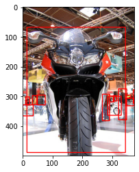

# Point-to-box
> A set of models, tools, and tutorials for the automation of annotating individual objects in images.


This file will become your README and also the index of your documentation.

## Install

`pip install point_to_box`

## How to use

**WORK IN PROGRESS**

### The data module:

The data module can transform COCO object-detection style data and annotations into point-to-box style data and annotations using the `point_to_box.data` module.

```python
SRC = Path('../../data/val2017/')
DST = Path('../../converted_data')
ANNOS = 'instances_val2017.json'
```

```python
dataset = data.ConversionDataset(data_path = SRC,
                                 anno_fname = ANNOS,
                                 dst_path = DST,
                                 img_size = 224
                                )
```

    loading annotations into memory...
    Done (t=0.79s)
    creating index...
    index created!


```python
img, bboxs, cntrs, cats = dataset.load_img(480985)
img_w_boxes=utils.draw_rect(np.array(img), np.reshape(np.array(bboxs), (-1, 4)))
```

```python
plt.imshow(img_w_boxes)
plt.show()
```





```python
imgs_crop, boxs_crop, cntrs_crop = dataset.crop_objs(img, bboxs, cntrs, resize = True, img_size=224)
```

    Box width: 329.21  Box height: 421.35
    New corp size: 583.9363580991524
    Box width: 45.29000000000002  Box height: 63.81
    Box width: 28.299999999999997  Box height: 33.170000000000016
    Box width: 16.519999999999996  Box height: 29.21999999999997
    Box width: 27.060000000000002  Box height: 104.53000000000003
    Box width: 13.7  Box height: 25.689999999999998
    Box width: 23.970000000000027  Box height: 88.95999999999998
    Box width: 5.5  Box height: 45.64999999999998
    Box width: 27.160000000000025  Box height: 25.920000000000016
    Box width: 17.74000000000001  Box height: 10.649999999999977
    Box width: 35.78  Box height: 37.18000000000001
    Box width: 15.240000000000009  Box height: 19.870000000000005
    Box width: 12.730000000000018  Box height: 18.730000000000018


```python
idx = 10
crop_img_w_box = utils.draw_rect(imgs_crop[idx], boxs_crop[idx])
plt.imshow(crop_img_w_box)
plt.plot(cntrs_crop[idx][0],
         cntrs_crop[idx][1],
        'ro')
plt.show()
```


