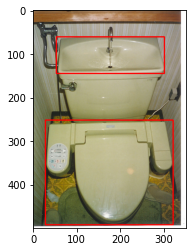
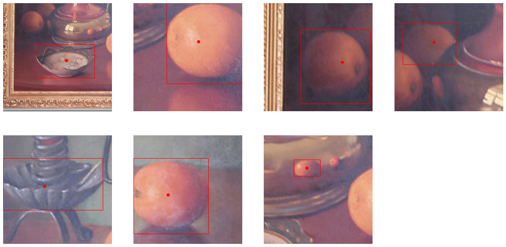
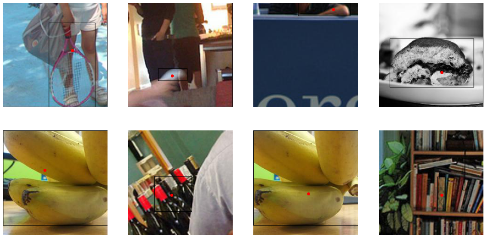

# Point-to-box
> A set of models, tools, and tutorials for the automation of annotating individual objects in images.


This file will become your README and also the index of your documentation.

## Install

`pip install point_to_box`

## How to use

**WORK IN PROGRESS**

The library performs three major functions:

- converting COCO-style object detection images and annotations into point-to-box style images and annotations
- training prompted class-agnostic, single-object localization models
- providing access to models pretrained on COCO data

### Manipulating data

#### Converting data

The `point_to_box.data` module can transform COCO object-detection style images and annotations into point-to-box style images and annotations using a `ConversionDataset`

```python
#hide_output
dataset = data.ConversionDataset(data_path = SRC, anno_fname = ANNOS,
                                 dst_path = DST, img_size = 224, n = 3)
```

A ConversionDataset can turn images with box annotations like this:





Into individual images with point-to-box style annotations like this:





The ConversionDataset class has a `convert` method to convert individual images one at a time as well as a `convert_all` method to process all (or a percentage) of the images.

```python
#hide_output
# dataset.convert(184791)
dataset.convert_all(cord_format = 'corner_ofst_frac', pct = 0.01)
```

The `to_json()` method writes the new annotations to file and can split the data into training and validation partitions using the `pct` argument. If no percentage is specified the dataset remains unparitioned and is written to a single directory.

```python
#hide_output
dataset.to_json(pct = 0.15)
```

#### Using data

The `point_to_box.data` module contains a `PTBDataset` class designed in the PyTorch style so it can be used with a PyTorch `DataLoader`.

```python
#hide_output
ptbdata = data.PTBDataset(
    root = DST/'train',
    annos = DST/('train/train_individual_'+ANNOS))

ptbloader = torch.utils.data.DataLoader(dataset = ptbdata, batch_size = 8, shuffle = True)
```

```python
# temp_json = json.load(open(DST/('temp/train/train_individual_'+ANNOS)))
# temp_json
```

Plotting a batch of images from our converted data let's us confirm that the cropping and box coordinate conversion works as we expect it to.





### Training models

```python
effloc = model.EfficientLoc(version='efficientnet-b4')
```

    Downloading: "https://github.com/lukemelas/EfficientNet-PyTorch/releases/download/1.0/efficientnet-b4-6ed6700e.pth" to /Users/constantinbaumgartner/.cache/torch/hub/checkpoints/efficientnet-b4-6ed6700e.pth


    Loaded pretrained weights for efficientnet-b4


```python
# b1 liner 100
# Training complete in 49m 22s
# Best val Loss: 0.0359
# EfficientLoc-b1-coco2017val_40e_imgnetnorm4ch_100L.pth
# effloc.save(DST/'EfficientLoc-b1-coco2017val_40e_imgnetnorm4ch_100L.pth')
```

```python
# b2 liner 100
# Training complete in 51m 0s
# Best val Loss: 0.0357
# EfficientLoc-b2-coco2017val_40e_imgnetnorm4ch_100L.pth
# effloc.save(DST/'EfficientLoc-b2-coco2017val_40e_imgnetnorm4ch_100L.pth')
```

```python
# b3 liner 100
# Training complete in 61m 44s
# Best val Loss: 0.0353

# EfficientLoc-b3-coco2017val_40e_imgnetnorm4ch_100L.pth
# effloc.save(DST/'EfficientLoc-b3-coco2017val_40e_imgnetnorm4ch_100L.pth')
```

```python
# b3 linear out_features 
# Training complete in 61m 47s
# Best val Loss: 0.0347

# EfficientLoc-b3-coco2017val_40e_imgnetnorm4ch_4L.pth
# effloc.save(DST/'EfficientLoc-b3-coco2017val_40e_imgnetnorm4ch_4L.pth')
```
