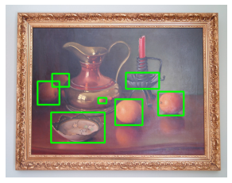

# Point-to-box
> A set of models, tools, and tutorials for the automation of annotating individual objects in images.


This file will become your README and also the index of your documentation.

## Install

`pip install point_to_box`

## How to use

**WORK IN PROGRESS**

### The data module:

The data module can transform COCO object-detection style data and annotations into point-to-box style data and annotations using the `point_to_box.data` module.

```python
dataset = data.ConversionDataset(data_path = SRC, 
                                 anno_fname = ANNOS,
                                 dst_path = DST,
                                 img_size = 224)
```

    loading annotations into memory...
    Done (t=0.58s)
    creating index...
    index created!


```python
img, bboxs, cntrs, cats = dataset.load_img(331352)
img_w_boxes=utils.draw_rect(np.array(img), np.reshape(np.array(bboxs), (-1, 4)))
```

```python
plt.imshow(img_w_boxes)
plt.show()
```





```python
imgs_crop, boxs_crop, cntrs_crop = dataset.crop_objs(img, bboxs, cntrs, resize = True, img_size=224)
```

```python
idx = 0
crop_img_w_box = utils.draw_rect(imgs_crop[idx], boxs_crop[idx])
plt.imshow(crop_img_w_box)
plt.plot(cntrs_crop[idx][0],
         cntrs_crop[idx][1],
        'ro')
plt.show()
```


