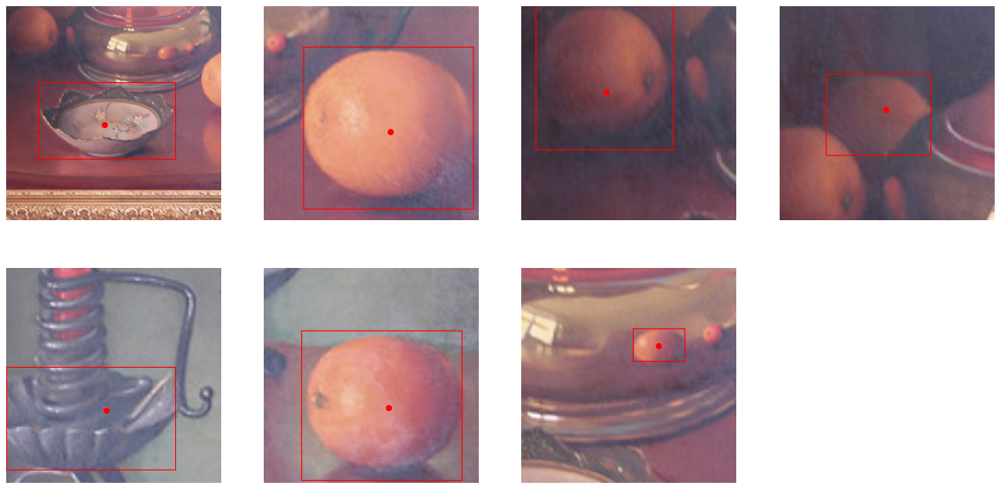
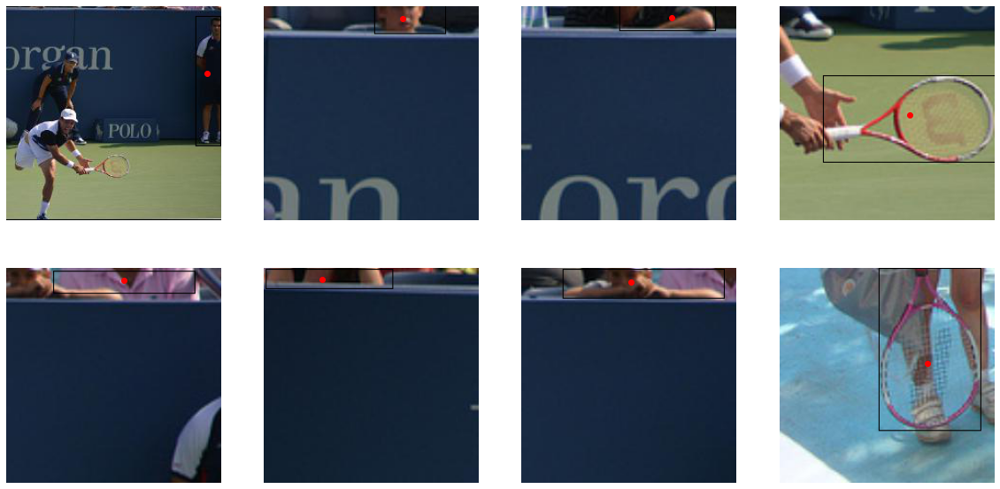

# Point-to-box
> A set of models, tools, and tutorials for the automation of annotating individual objects in images.


This file will become your README and also the index of your documentation.

## Install

`pip install point_to_box`

## How to use

**WORK IN PROGRESS**

The library performs three major functions:

- converting COCO-style object detection images and annotations into point-to-box style images and annotations
- training prompted class-agnostic, single-object localization models
- providing access to models pretrained on COCO data

### Manipulating data

#### Converting data

The `point_to_box.data` module can transform COCO object-detection style images and annotations into point-to-box style images and annotations using a `ConversionDataset`

```python
#hide_output
dataset = data.ConversionDataset(data_path = SRC, anno_fname = ANNOS,
                                 dst_path = DST, img_size = 224)
```

A ConversionDataset can turn images with box annotations like this:


Into individual images with point-to-box style annotations like this:





The ConversionDataset class has a `convert` method to convert individual images one at a time as well as a `convert_all` method to process all the images in an annotation file.

The `to_json()` method writes the new annotations to file.

```python
dataset.to_json()
```

    <class 'int'>
    <class 'int'>
    <class 'int'>
    <class 'int'>
    <class 'int'>
    <class 'int'>
    <class 'int'>
    <class 'int'>
    <class 'int'>
    <class 'int'>
    <class 'int'>
    <class 'int'>
    <class 'int'>
    <class 'int'>
    <class 'int'>
    <class 'int'>
    <class 'int'>
    <class 'int'>
    <class 'int'>
    <class 'int'>
    <class 'int'>
    <class 'int'>
    <class 'int'>
    <class 'int'>
    <class 'int'>
    <class 'int'>
    <class 'int'>
    <class 'int'>
    <class 'int'>
    <class 'int'>
    <class 'int'>
    <class 'int'>
    <class 'int'>
    <class 'int'>
    <class 'int'>
    <class 'int'>
    <class 'int'>
    <class 'int'>
    <class 'int'>
    <class 'int'>
    <class 'int'>
    <class 'int'>
    <class 'int'>
    <class 'int'>
    <class 'int'>
    <class 'int'>
    <class 'int'>
    <class 'int'>
    <class 'int'>
    <class 'int'>
    <class 'int'>
    <class 'int'>
    <class 'int'>
    <class 'int'>
    <class 'int'>
    <class 'int'>
    <class 'int'>
    <class 'int'>
    <class 'int'>
    <class 'int'>
    <class 'int'>
    <class 'int'>
    <class 'int'>
    <class 'int'>
    <class 'int'>
    <class 'int'>
    <class 'int'>
    <class 'int'>
    <class 'int'>
    <class 'int'>
    <class 'int'>
    <class 'int'>
    <class 'int'>
    <class 'int'>
    <class 'int'>
    <class 'int'>
    <class 'int'>
    <class 'int'>
    <class 'int'>
    <class 'int'>
    <class 'int'>
    <class 'int'>
    <class 'int'>
    <class 'int'>
    <class 'int'>
    <class 'int'>
    <class 'int'>
    <class 'int'>
    <class 'int'>
    <class 'int'>
    <class 'int'>
    <class 'int'>
    <class 'int'>
    <class 'int'>
    <class 'int'>
    <class 'int'>
    <class 'int'>
    <class 'int'>
    <class 'int'>
    <class 'int'>
    <class 'int'>
    <class 'int'>
    <class 'int'>
    <class 'int'>
    <class 'int'>
    <class 'int'>
    <class 'int'>
    <class 'int'>
    <class 'int'>
    <class 'int'>
    <class 'int'>
    <class 'int'>
    <class 'int'>
    <class 'int'>
    <class 'int'>
    <class 'int'>
    <class 'int'>
    <class 'int'>
    <class 'int'>
    <class 'int'>
    <class 'int'>
    <class 'int'>
    <class 'int'>
    <class 'int'>
    <class 'int'>
    <class 'int'>
    <class 'int'>
    <class 'int'>
    <class 'int'>
    <class 'int'>
    <class 'int'>
    <class 'int'>
    <class 'int'>
    <class 'int'>
    <class 'int'>
    <class 'int'>
    <class 'int'>
    <class 'int'>
    <class 'int'>
    <class 'int'>
    <class 'int'>
    <class 'int'>
    <class 'int'>
    <class 'int'>
    <class 'int'>
    <class 'int'>
    <class 'int'>
    <class 'int'>
    <class 'int'>
    <class 'int'>
    <class 'int'>
    <class 'int'>
    <class 'int'>
    <class 'int'>
    <class 'int'>
    <class 'int'>
    <class 'int'>
    <class 'int'>
    <class 'int'>
    <class 'int'>
    <class 'int'>
    <class 'int'>
    <class 'int'>
    <class 'int'>
    <class 'int'>
    <class 'int'>
    <class 'int'>
    <class 'int'>
    <class 'int'>
    <class 'int'>
    <class 'int'>
    <class 'int'>
    <class 'int'>
    <class 'int'>
    <class 'int'>
    <class 'int'>
    <class 'int'>
    <class 'int'>
    <class 'int'>
    <class 'int'>
    <class 'int'>
    <class 'int'>
    <class 'int'>
    <class 'int'>
    <class 'int'>
    <class 'int'>
    <class 'int'>
    <class 'int'>
    <class 'int'>
    <class 'int'>
    <class 'int'>
    <class 'int'>
    <class 'int'>
    <class 'int'>
    <class 'int'>
    <class 'int'>
    <class 'int'>
    <class 'int'>
    <class 'int'>
    <class 'int'>
    <class 'int'>
    <class 'int'>
    <class 'int'>
    <class 'int'>
    <class 'int'>
    <class 'int'>
    <class 'int'>
    <class 'int'>
    <class 'int'>
    <class 'int'>
    <class 'int'>
    <class 'int'>
    <class 'int'>
    <class 'int'>
    <class 'int'>
    <class 'int'>
    <class 'int'>
    <class 'int'>
    <class 'int'>
    <class 'int'>
    <class 'int'>
    <class 'int'>
    <class 'int'>
    <class 'int'>
    <class 'int'>
    <class 'int'>
    <class 'int'>
    <class 'int'>
    <class 'int'>
    <class 'int'>
    <class 'int'>
    <class 'int'>
    <class 'int'>
    <class 'int'>
    <class 'int'>
    <class 'int'>
    <class 'int'>
    <class 'int'>
    <class 'int'>
    <class 'int'>
    <class 'int'>
    <class 'int'>
    <class 'int'>
    <class 'int'>
    <class 'int'>
    <class 'int'>
    <class 'int'>
    <class 'int'>
    <class 'int'>
    <class 'int'>
    <class 'int'>
    <class 'int'>
    <class 'int'>
    <class 'int'>
    <class 'int'>
    <class 'int'>
    <class 'int'>
    <class 'int'>
    <class 'int'>
    <class 'int'>
    <class 'int'>
    <class 'int'>
    <class 'int'>
    <class 'int'>
    <class 'int'>
    <class 'int'>
    <class 'int'>
    <class 'int'>
    <class 'int'>
    <class 'int'>
    <class 'int'>
    <class 'int'>
    <class 'int'>
    <class 'int'>
    <class 'int'>
    <class 'int'>
    <class 'int'>
    <class 'int'>
    <class 'int'>
    <class 'int'>
    <class 'int'>
    <class 'int'>
    <class 'int'>
    <class 'int'>
    <class 'int'>
    <class 'int'>
    <class 'int'>
    <class 'int'>
    <class 'int'>
    <class 'int'>
    <class 'int'>
    <class 'int'>
    <class 'int'>
    <class 'int'>
    <class 'int'>
    <class 'int'>
    <class 'int'>
    <class 'int'>
    <class 'int'>
    <class 'int'>
    <class 'int'>
    <class 'int'>
    <class 'int'>
    <class 'int'>
    <class 'int'>
    <class 'int'>
    <class 'int'>
    <class 'int'>
    <class 'int'>
    <class 'int'>
    <class 'int'>
    <class 'int'>
    <class 'int'>
    <class 'int'>
    <class 'int'>
    <class 'int'>
    <class 'int'>
    <class 'int'>
    <class 'int'>
    <class 'int'>
    <class 'int'>
    <class 'int'>
    <class 'int'>
    <class 'int'>
    <class 'int'>
    <class 'int'>
    <class 'int'>
    <class 'int'>
    <class 'int'>
    <class 'int'>
    <class 'int'>
    <class 'int'>
    <class 'int'>
    <class 'int'>
    <class 'int'>
    <class 'int'>
    <class 'int'>
    <class 'int'>
    <class 'int'>
    <class 'int'>
    <class 'int'>
    <class 'int'>
    <class 'int'>
    <class 'int'>
    <class 'int'>
    <class 'int'>
    <class 'int'>
    <class 'int'>
    <class 'int'>
    <class 'int'>
    <class 'int'>
    <class 'int'>
    <class 'int'>
    <class 'int'>
    <class 'int'>
    <class 'int'>
    <class 'int'>
    <class 'int'>
    <class 'int'>
    <class 'int'>
    <class 'int'>
    <class 'int'>
    <class 'int'>
    <class 'int'>
    <class 'int'>
    <class 'int'>
    <class 'int'>
    <class 'int'>
    <class 'int'>
    <class 'int'>
    <class 'int'>
    <class 'int'>
    <class 'int'>
    <class 'int'>
    <class 'int'>
    <class 'int'>
    <class 'int'>
    <class 'int'>
    <class 'int'>
    <class 'int'>
    <class 'int'>
    <class 'int'>
    <class 'int'>
    <class 'int'>
    <class 'int'>
    <class 'int'>
    <class 'int'>
    <class 'int'>
    <class 'int'>
    <class 'int'>
    <class 'int'>
    <class 'int'>
    <class 'int'>
    <class 'int'>
    <class 'int'>
    <class 'int'>
    <class 'int'>
    <class 'int'>
    <class 'int'>
    <class 'int'>
    <class 'int'>
    <class 'int'>
    <class 'int'>
    <class 'int'>
    <class 'int'>
    <class 'int'>
    <class 'int'>
    <class 'int'>
    <class 'int'>
    <class 'int'>
    <class 'int'>
    <class 'int'>
    <class 'int'>
    <class 'int'>
    <class 'int'>
    <class 'int'>
    <class 'int'>
    <class 'int'>
    <class 'int'>
    <class 'int'>
    <class 'int'>
    <class 'int'>
    <class 'int'>
    <class 'int'>
    <class 'int'>
    <class 'int'>
    <class 'int'>
    <class 'int'>
    <class 'int'>
    <class 'int'>
    <class 'int'>
    <class 'int'>
    <class 'int'>
    <class 'int'>
    <class 'int'>
    <class 'int'>
    <class 'int'>
    <class 'int'>
    <class 'int'>
    <class 'int'>
    <class 'int'>
    <class 'int'>
    <class 'int'>
    <class 'int'>
    <class 'int'>
    <class 'int'>
    <class 'int'>
    <class 'int'>
    <class 'int'>
    <class 'int'>
    <class 'int'>
    <class 'int'>
    <class 'int'>
    <class 'int'>
    <class 'int'>
    <class 'int'>
    <class 'int'>
    <class 'int'>
    <class 'int'>
    <class 'int'>
    <class 'int'>
    <class 'int'>
    <class 'int'>
    <class 'int'>
    <class 'int'>
    <class 'int'>
    <class 'int'>
    <class 'int'>
    <class 'int'>
    <class 'int'>
    <class 'int'>
    <class 'int'>
    <class 'int'>
    <class 'int'>
    <class 'int'>
    <class 'int'>
    <class 'int'>
    <class 'int'>
    <class 'int'>
    <class 'int'>
    <class 'int'>
    <class 'int'>
    <class 'int'>
    <class 'int'>
    <class 'int'>
    <class 'int'>
    <class 'int'>
    <class 'int'>
    <class 'int'>
    <class 'int'>
    <class 'int'>
    <class 'int'>
    <class 'int'>
    <class 'int'>
    <class 'int'>
    <class 'int'>
    <class 'int'>
    <class 'int'>
    <class 'int'>
    <class 'int'>
    <class 'int'>
    <class 'int'>
    <class 'int'>
    <class 'int'>
    <class 'int'>
    <class 'int'>
    <class 'int'>
    <class 'int'>
    <class 'int'>
    <class 'int'>
    <class 'int'>
    <class 'int'>
    <class 'int'>
    <class 'int'>
    <class 'int'>
    <class 'int'>
    <class 'int'>
    <class 'int'>
    <class 'int'>
    <class 'int'>
    <class 'int'>
    <class 'int'>
    <class 'int'>
    <class 'int'>
    <class 'int'>
    <class 'int'>
    <class 'int'>
    <class 'int'>
    <class 'int'>
    <class 'int'>
    <class 'int'>
    <class 'int'>
    <class 'int'>
    <class 'int'>
    <class 'int'>
    <class 'int'>
    <class 'int'>
    <class 'int'>
    <class 'int'>
    <class 'int'>
    <class 'int'>
    <class 'int'>
    <class 'int'>
    <class 'int'>
    <class 'int'>
    <class 'int'>
    <class 'int'>
    <class 'int'>
    <class 'int'>
    <class 'int'>
    <class 'int'>
    <class 'int'>
    <class 'int'>
    <class 'int'>
    <class 'int'>
    <class 'int'>
    <class 'int'>
    <class 'int'>
    <class 'int'>
    <class 'int'>
    <class 'int'>
    <class 'int'>
    <class 'int'>
    <class 'int'>
    <class 'int'>
    <class 'int'>
    <class 'int'>
    <class 'int'>
    <class 'int'>
    <class 'int'>
    <class 'int'>
    <class 'int'>
    <class 'int'>
    <class 'int'>
    <class 'int'>
    <class 'int'>
    <class 'int'>
    <class 'int'>
    <class 'int'>
    <class 'int'>
    <class 'int'>
    <class 'int'>
    <class 'int'>
    <class 'int'>
    <class 'int'>
    <class 'int'>
    <class 'int'>
    <class 'int'>
    <class 'int'>
    <class 'int'>
    <class 'int'>
    <class 'int'>
    <class 'int'>
    <class 'int'>
    <class 'int'>
    <class 'int'>
    <class 'int'>
    <class 'int'>
    <class 'int'>
    <class 'int'>
    <class 'int'>
    <class 'int'>
    <class 'int'>
    <class 'int'>
    <class 'int'>
    <class 'int'>
    <class 'int'>
    <class 'int'>
    <class 'int'>
    <class 'int'>
    <class 'int'>
    <class 'int'>
    <class 'int'>
    <class 'int'>
    <class 'int'>
    <class 'int'>
    <class 'int'>
    <class 'int'>
    <class 'int'>
    <class 'int'>
    <class 'int'>
    <class 'int'>
    <class 'int'>
    <class 'int'>
    <class 'int'>
    <class 'int'>
    <class 'int'>
    <class 'int'>
    <class 'int'>
    <class 'int'>
    <class 'int'>
    <class 'int'>
    <class 'int'>
    <class 'int'>
    <class 'int'>
    <class 'int'>
    <class 'int'>
    <class 'int'>
    <class 'int'>
    <class 'int'>
    <class 'int'>
    <class 'int'>
    <class 'int'>
    <class 'int'>
    <class 'int'>
    <class 'int'>
    <class 'int'>
    <class 'int'>
    <class 'int'>
    <class 'int'>
    <class 'int'>
    <class 'int'>
    <class 'int'>
    <class 'int'>
    <class 'int'>
    <class 'int'>
    <class 'int'>
    <class 'int'>
    <class 'int'>
    <class 'int'>
    <class 'int'>
    <class 'int'>
    <class 'int'>
    <class 'int'>
    <class 'int'>
    <class 'int'>
    <class 'int'>
    <class 'int'>
    <class 'int'>
    <class 'int'>
    <class 'int'>
    <class 'int'>
    <class 'int'>
    <class 'int'>
    <class 'int'>
    <class 'int'>
    <class 'int'>
    <class 'int'>
    <class 'int'>
    <class 'int'>
    <class 'int'>
    <class 'int'>
    <class 'int'>
    <class 'int'>
    <class 'int'>
    <class 'int'>
    <class 'int'>
    <class 'int'>
    <class 'int'>
    <class 'int'>
    <class 'int'>
    <class 'int'>
    <class 'int'>
    <class 'int'>
    <class 'int'>
    <class 'int'>
    <class 'int'>
    <class 'int'>
    <class 'int'>
    <class 'int'>
    <class 'int'>
    <class 'int'>
    <class 'int'>
    <class 'int'>
    <class 'int'>
    <class 'int'>
    <class 'int'>
    <class 'int'>
    <class 'int'>
    <class 'int'>
    <class 'int'>
    <class 'int'>
    <class 'int'>
    <class 'int'>
    <class 'int'>
    <class 'int'>
    <class 'int'>
    <class 'int'>
    <class 'int'>
    <class 'int'>
    <class 'int'>
    <class 'int'>
    <class 'int'>
    <class 'int'>
    <class 'int'>
    <class 'int'>
    <class 'int'>
    <class 'int'>
    <class 'int'>
    <class 'int'>
    <class 'int'>
    <class 'int'>
    <class 'int'>
    <class 'int'>
    <class 'int'>
    <class 'int'>
    <class 'int'>
    <class 'int'>
    <class 'int'>
    <class 'int'>
    <class 'int'>
    <class 'int'>
    <class 'int'>
    <class 'int'>
    <class 'int'>
    <class 'int'>
    <class 'int'>
    <class 'int'>
    <class 'int'>
    <class 'int'>
    <class 'int'>
    <class 'int'>
    <class 'int'>
    <class 'int'>
    <class 'int'>
    <class 'int'>
    <class 'int'>
    <class 'int'>
    <class 'int'>
    <class 'int'>
    <class 'int'>
    <class 'int'>
    <class 'int'>
    <class 'int'>
    <class 'int'>
    <class 'int'>
    <class 'int'>
    <class 'int'>
    <class 'int'>
    <class 'int'>
    <class 'int'>
    <class 'int'>
    <class 'int'>
    <class 'int'>
    <class 'int'>
    <class 'int'>
    <class 'int'>
    <class 'int'>
    <class 'int'>
    <class 'int'>
    <class 'int'>
    <class 'int'>
    <class 'int'>
    <class 'int'>
    <class 'int'>
    <class 'int'>
    <class 'int'>
    <class 'int'>
    <class 'int'>
    <class 'int'>
    <class 'int'>
    <class 'int'>
    <class 'int'>
    <class 'int'>
    <class 'int'>
    <class 'int'>
    <class 'int'>
    <class 'int'>
    <class 'int'>
    <class 'int'>
    <class 'int'>
    <class 'int'>
    <class 'int'>
    <class 'int'>
    <class 'int'>
    <class 'int'>
    <class 'int'>
    <class 'int'>
    <class 'int'>
    <class 'int'>
    <class 'int'>
    <class 'int'>
    <class 'int'>
    <class 'int'>
    <class 'int'>
    <class 'int'>
    <class 'int'>
    <class 'int'>
    <class 'int'>
    <class 'int'>
    <class 'int'>
    <class 'int'>
    <class 'int'>
    <class 'int'>
    <class 'int'>
    <class 'int'>
    <class 'int'>
    <class 'int'>
    <class 'int'>
    <class 'int'>
    <class 'int'>
    <class 'int'>
    <class 'int'>
    <class 'int'>
    <class 'int'>
    <class 'int'>
    <class 'int'>
    <class 'int'>
    <class 'int'>
    <class 'int'>
    <class 'int'>
    <class 'int'>
    <class 'int'>
    <class 'int'>
    <class 'int'>
    <class 'int'>
    <class 'int'>
    <class 'int'>
    <class 'int'>
    <class 'int'>
    <class 'int'>
    <class 'int'>
    <class 'int'>
    <class 'int'>
    <class 'int'>
    <class 'int'>
    <class 'int'>
    <class 'int'>
    <class 'int'>
    <class 'int'>
    <class 'int'>
    <class 'int'>
    <class 'int'>
    <class 'int'>
    <class 'int'>
    <class 'int'>
    <class 'int'>
    <class 'int'>
    <class 'int'>
    <class 'int'>
    <class 'int'>
    <class 'int'>
    <class 'int'>
    <class 'int'>
    <class 'int'>
    <class 'int'>
    <class 'int'>
    <class 'int'>
    <class 'int'>
    <class 'int'>
    <class 'int'>
    <class 'int'>
    <class 'int'>
    <class 'int'>
    <class 'int'>
    <class 'int'>
    <class 'int'>
    <class 'int'>
    <class 'int'>
    <class 'int'>
    <class 'int'>
    <class 'int'>
    <class 'int'>
    <class 'int'>
    <class 'int'>
    <class 'int'>
    <class 'int'>
    <class 'int'>
    <class 'int'>
    <class 'int'>
    <class 'int'>
    <class 'int'>
    <class 'int'>
    <class 'int'>
    <class 'int'>
    <class 'int'>
    <class 'int'>
    <class 'int'>
    <class 'int'>
    <class 'int'>
    <class 'int'>
    <class 'int'>
    <class 'int'>
    <class 'int'>
    <class 'int'>
    <class 'int'>
    <class 'int'>
    <class 'int'>
    <class 'int'>
    <class 'int'>
    <class 'int'>
    <class 'int'>
    <class 'int'>
    <class 'int'>
    <class 'int'>
    <class 'int'>
    <class 'int'>
    <class 'int'>
    <class 'int'>
    <class 'int'>
    <class 'int'>
    <class 'int'>
    <class 'int'>
    <class 'int'>
    <class 'int'>
    <class 'int'>
    <class 'int'>
    <class 'int'>
    <class 'int'>
    <class 'int'>
    <class 'int'>
    <class 'int'>
    <class 'int'>
    <class 'int'>
    <class 'int'>
    <class 'int'>
    <class 'int'>
    <class 'int'>
    <class 'int'>
    <class 'int'>
    <class 'int'>
    <class 'int'>
    <class 'int'>
    <class 'int'>
    <class 'int'>
    <class 'int'>
    <class 'int'>
    <class 'int'>
    <class 'int'>
    <class 'int'>
    <class 'int'>
    <class 'int'>
    <class 'int'>
    <class 'int'>
    <class 'int'>
    <class 'int'>
    <class 'int'>
    <class 'int'>
    <class 'int'>
    <class 'int'>
    <class 'int'>
    <class 'int'>
    <class 'int'>
    <class 'int'>
    <class 'int'>
    <class 'int'>
    <class 'int'>
    <class 'int'>
    <class 'int'>
    <class 'int'>
    <class 'int'>
    <class 'int'>
    <class 'int'>
    <class 'int'>
    <class 'int'>
    <class 'int'>
    <class 'int'>
    <class 'int'>
    <class 'int'>
    <class 'int'>
    <class 'int'>
    <class 'int'>
    <class 'int'>
    <class 'int'>
    <class 'int'>
    <class 'int'>
    <class 'int'>
    <class 'int'>
    <class 'int'>
    <class 'int'>
    <class 'int'>
    <class 'int'>
    <class 'int'>
    <class 'int'>
    <class 'int'>
    <class 'int'>
    <class 'int'>
    <class 'int'>
    <class 'int'>
    <class 'int'>
    <class 'int'>
    <class 'int'>
    <class 'int'>
    <class 'int'>
    <class 'int'>
    <class 'int'>
    <class 'int'>
    <class 'int'>
    <class 'int'>
    <class 'int'>
    <class 'int'>
    <class 'int'>
    <class 'int'>
    <class 'int'>
    <class 'int'>
    <class 'int'>
    <class 'int'>
    <class 'int'>
    <class 'int'>
    <class 'int'>
    <class 'int'>
    <class 'int'>
    <class 'int'>
    <class 'int'>
    <class 'int'>
    <class 'int'>
    <class 'int'>
    <class 'int'>
    <class 'int'>
    <class 'int'>
    <class 'int'>
    <class 'int'>
    <class 'int'>
    <class 'int'>
    <class 'int'>
    <class 'int'>
    <class 'int'>
    <class 'int'>
    <class 'int'>
    <class 'int'>
    <class 'int'>
    <class 'int'>
    <class 'int'>
    <class 'int'>
    <class 'int'>
    <class 'int'>
    <class 'int'>
    <class 'int'>
    <class 'int'>
    <class 'int'>
    <class 'int'>
    <class 'int'>
    <class 'int'>
    <class 'int'>
    <class 'int'>
    <class 'int'>
    <class 'int'>
    <class 'int'>
    <class 'int'>
    <class 'int'>
    <class 'int'>
    <class 'int'>
    <class 'int'>
    <class 'int'>
    <class 'int'>
    <class 'int'>
    <class 'int'>
    <class 'int'>
    <class 'int'>
    <class 'int'>
    <class 'int'>
    <class 'int'>
    <class 'int'>
    <class 'int'>
    <class 'int'>
    <class 'int'>
    <class 'int'>
    <class 'int'>
    <class 'int'>
    <class 'int'>
    <class 'int'>
    <class 'int'>
    <class 'int'>
    <class 'int'>
    <class 'int'>
    <class 'int'>
    <class 'int'>
    <class 'int'>
    <class 'int'>
    <class 'int'>
    <class 'int'>
    <class 'int'>
    <class 'int'>
    <class 'int'>
    <class 'int'>
    <class 'int'>
    <class 'int'>
    <class 'int'>
    <class 'int'>
    <class 'int'>
    <class 'int'>
    <class 'int'>
    <class 'int'>
    <class 'int'>
    <class 'int'>
    <class 'int'>
    <class 'int'>
    <class 'int'>
    <class 'int'>
    <class 'int'>
    <class 'int'>
    <class 'int'>
    <class 'int'>
    <class 'int'>
    <class 'int'>
    <class 'int'>
    <class 'int'>
    <class 'int'>
    <class 'int'>
    <class 'int'>
    <class 'int'>
    <class 'int'>
    <class 'int'>
    <class 'int'>
    <class 'int'>
    <class 'int'>
    <class 'int'>
    <class 'int'>
    <class 'int'>
    <class 'int'>
    <class 'int'>
    <class 'int'>
    <class 'int'>
    <class 'int'>
    <class 'int'>
    <class 'int'>
    <class 'int'>
    <class 'int'>
    <class 'int'>
    <class 'int'>
    <class 'int'>
    <class 'int'>
    <class 'int'>
    <class 'int'>
    <class 'int'>
    <class 'int'>
    <class 'int'>
    <class 'int'>
    <class 'int'>
    <class 'int'>
    <class 'int'>
    <class 'int'>
    <class 'int'>
    <class 'int'>
    <class 'int'>
    <class 'int'>
    <class 'int'>
    <class 'int'>
    <class 'int'>
    <class 'int'>
    <class 'int'>
    <class 'int'>
    <class 'int'>
    <class 'int'>
    <class 'int'>
    <class 'int'>
    <class 'int'>
    <class 'int'>
    <class 'int'>
    <class 'int'>
    <class 'int'>
    <class 'int'>
    <class 'int'>
    <class 'int'>
    <class 'int'>
    <class 'int'>
    <class 'int'>
    <class 'int'>
    <class 'int'>
    <class 'int'>
    <class 'int'>
    <class 'int'>
    <class 'int'>
    <class 'int'>
    <class 'int'>
    <class 'int'>
    <class 'int'>
    <class 'int'>
    <class 'int'>
    <class 'int'>
    <class 'int'>
    <class 'int'>
    <class 'int'>
    <class 'int'>
    <class 'int'>
    <class 'int'>
    <class 'int'>
    <class 'int'>
    <class 'int'>
    <class 'int'>
    <class 'int'>
    <class 'int'>
    <class 'int'>
    <class 'int'>
    <class 'int'>
    <class 'int'>
    <class 'int'>
    <class 'int'>
    <class 'int'>
    <class 'int'>
    <class 'int'>
    <class 'int'>
    <class 'int'>
    <class 'int'>
    <class 'int'>
    <class 'int'>
    <class 'int'>
    <class 'int'>
    <class 'int'>
    <class 'int'>
    <class 'int'>
    <class 'int'>
    <class 'int'>
    <class 'int'>
    <class 'int'>
    <class 'int'>
    <class 'int'>
    <class 'int'>
    <class 'int'>
    <class 'int'>
    <class 'int'>
    <class 'int'>
    <class 'int'>
    <class 'int'>
    <class 'int'>
    <class 'int'>
    <class 'int'>
    <class 'int'>
    <class 'int'>
    <class 'int'>
    <class 'int'>
    <class 'int'>
    <class 'int'>
    <class 'int'>
    <class 'int'>
    <class 'int'>
    <class 'int'>
    <class 'int'>
    <class 'int'>
    <class 'int'>
    <class 'int'>
    <class 'int'>
    <class 'int'>
    <class 'int'>
    <class 'int'>
    <class 'int'>
    <class 'int'>
    <class 'int'>
    <class 'int'>
    <class 'int'>
    <class 'int'>
    <class 'int'>
    <class 'int'>
    <class 'int'>
    <class 'int'>
    <class 'int'>
    <class 'int'>
    <class 'int'>
    <class 'int'>
    <class 'int'>
    <class 'int'>
    <class 'int'>
    <class 'int'>
    <class 'int'>
    <class 'int'>
    <class 'int'>
    <class 'int'>
    <class 'int'>
    <class 'int'>
    <class 'int'>
    <class 'int'>
    <class 'int'>
    <class 'int'>
    <class 'int'>
    <class 'int'>
    <class 'int'>
    <class 'int'>
    <class 'int'>
    <class 'int'>
    <class 'int'>
    <class 'int'>
    <class 'int'>
    <class 'int'>
    <class 'int'>
    <class 'int'>
    <class 'int'>
    <class 'int'>
    <class 'int'>
    <class 'int'>
    <class 'int'>
    <class 'int'>
    <class 'int'>
    <class 'int'>
    <class 'int'>
    <class 'int'>
    <class 'int'>
    <class 'int'>
    <class 'int'>
    <class 'int'>
    <class 'int'>
    <class 'int'>
    <class 'int'>
    <class 'int'>
    <class 'int'>
    <class 'int'>
    <class 'int'>
    <class 'int'>
    <class 'int'>
    <class 'int'>
    <class 'int'>
    <class 'int'>
    <class 'int'>
    <class 'int'>
    <class 'int'>
    <class 'int'>
    <class 'int'>
    <class 'int'>
    <class 'int'>
    <class 'int'>
    <class 'int'>
    <class 'int'>
    <class 'int'>
    <class 'int'>
    <class 'int'>
    <class 'int'>
    <class 'int'>
    <class 'int'>
    <class 'int'>
    <class 'int'>
    <class 'int'>
    <class 'int'>
    <class 'int'>
    <class 'int'>
    <class 'int'>
    <class 'int'>
    <class 'int'>
    <class 'int'>
    <class 'int'>
    <class 'int'>
    <class 'int'>
    <class 'int'>
    <class 'int'>
    <class 'int'>
    <class 'int'>
    <class 'int'>
    <class 'int'>
    <class 'int'>
    <class 'int'>
    <class 'int'>
    <class 'int'>
    <class 'int'>
    <class 'int'>
    <class 'int'>
    <class 'int'>
    <class 'int'>
    <class 'int'>
    <class 'int'>
    <class 'int'>
    <class 'int'>
    <class 'int'>
    <class 'int'>
    <class 'int'>
    <class 'int'>
    <class 'int'>
    <class 'int'>
    <class 'int'>
    <class 'int'>
    <class 'int'>
    <class 'int'>
    <class 'int'>
    <class 'int'>
    <class 'int'>
    <class 'int'>
    <class 'int'>
    <class 'int'>
    <class 'int'>
    <class 'int'>
    <class 'int'>
    <class 'int'>
    <class 'int'>
    <class 'int'>
    <class 'int'>
    <class 'int'>
    <class 'int'>
    <class 'int'>
    <class 'int'>
    <class 'int'>
    <class 'int'>
    <class 'int'>
    <class 'int'>
    <class 'int'>
    <class 'int'>
    <class 'int'>
    <class 'int'>
    <class 'int'>
    <class 'int'>
    <class 'int'>
    <class 'int'>
    <class 'int'>
    <class 'int'>
    <class 'int'>
    <class 'int'>
    <class 'int'>
    <class 'int'>
    <class 'int'>
    <class 'int'>
    <class 'int'>
    <class 'int'>
    <class 'int'>
    <class 'int'>
    <class 'int'>
    <class 'int'>
    <class 'int'>
    <class 'int'>
    <class 'int'>
    <class 'int'>
    <class 'int'>
    <class 'int'>
    <class 'int'>
    <class 'int'>
    <class 'int'>
    <class 'int'>
    <class 'int'>
    <class 'int'>
    <class 'int'>
    <class 'int'>
    <class 'int'>
    <class 'int'>
    <class 'int'>
    <class 'int'>
    <class 'int'>
    <class 'int'>
    <class 'int'>
    <class 'int'>
    <class 'int'>
    <class 'int'>
    <class 'int'>
    <class 'int'>
    <class 'int'>
    <class 'int'>
    <class 'int'>
    <class 'int'>
    <class 'int'>
    <class 'int'>
    <class 'int'>
    <class 'int'>
    <class 'int'>
    <class 'int'>
    <class 'int'>
    <class 'int'>
    <class 'int'>
    <class 'int'>
    <class 'int'>
    <class 'int'>
    <class 'int'>
    <class 'int'>
    <class 'int'>
    <class 'int'>
    <class 'int'>
    <class 'int'>
    <class 'int'>
    <class 'int'>
    <class 'int'>
    <class 'int'>
    <class 'int'>
    <class 'int'>
    <class 'int'>
    <class 'int'>
    <class 'int'>
    <class 'int'>
    <class 'int'>
    <class 'int'>
    <class 'int'>
    <class 'int'>
    <class 'int'>
    <class 'int'>
    <class 'int'>
    <class 'int'>
    <class 'int'>
    <class 'int'>
    <class 'int'>
    <class 'int'>
    <class 'int'>
    <class 'int'>
    <class 'int'>
    <class 'int'>
    <class 'int'>
    <class 'int'>
    <class 'int'>
    <class 'int'>
    <class 'int'>
    <class 'int'>
    <class 'int'>
    <class 'int'>
    <class 'int'>
    <class 'int'>
    <class 'int'>
    <class 'int'>
    <class 'int'>
    <class 'int'>
    <class 'int'>
    <class 'int'>
    <class 'int'>
    <class 'int'>
    <class 'int'>
    <class 'int'>
    <class 'int'>
    <class 'int'>
    <class 'int'>
    <class 'int'>
    <class 'int'>
    <class 'int'>
    <class 'int'>
    <class 'int'>
    <class 'int'>
    <class 'int'>
    <class 'int'>
    <class 'int'>
    <class 'int'>
    <class 'int'>
    <class 'int'>
    <class 'int'>
    <class 'int'>
    <class 'int'>
    <class 'int'>
    <class 'int'>
    <class 'int'>
    <class 'int'>
    <class 'int'>
    <class 'int'>
    <class 'int'>
    <class 'int'>
    <class 'int'>
    <class 'int'>
    <class 'int'>
    <class 'int'>
    <class 'int'>
    <class 'int'>
    <class 'int'>
    <class 'int'>
    <class 'int'>
    <class 'int'>
    <class 'int'>
    <class 'int'>
    <class 'int'>
    <class 'int'>
    <class 'int'>
    <class 'int'>
    <class 'int'>
    <class 'int'>
    <class 'int'>
    <class 'int'>
    <class 'int'>
    <class 'int'>
    <class 'int'>
    <class 'int'>
    <class 'int'>
    <class 'int'>
    <class 'int'>
    <class 'int'>
    <class 'int'>
    <class 'int'>
    <class 'int'>
    <class 'int'>
    <class 'int'>
    <class 'int'>
    <class 'int'>
    <class 'int'>
    <class 'int'>
    <class 'int'>
    <class 'int'>
    <class 'int'>
    <class 'int'>
    <class 'int'>
    <class 'int'>
    <class 'int'>
    <class 'int'>
    <class 'int'>
    <class 'int'>
    <class 'int'>
    <class 'int'>
    <class 'int'>
    <class 'int'>
    <class 'int'>
    <class 'int'>
    <class 'int'>
    <class 'int'>
    <class 'int'>
    <class 'int'>
    <class 'int'>
    <class 'int'>
    <class 'int'>
    <class 'int'>
    <class 'int'>
    <class 'int'>
    <class 'int'>
    <class 'int'>
    <class 'int'>
    <class 'int'>
    <class 'int'>
    <class 'int'>
    <class 'int'>
    <class 'int'>
    <class 'int'>
    <class 'int'>
    <class 'int'>
    <class 'int'>
    <class 'int'>
    <class 'int'>
    <class 'int'>
    <class 'int'>
    <class 'int'>
    <class 'int'>
    <class 'int'>
    <class 'int'>
    <class 'int'>
    <class 'int'>
    <class 'int'>
    <class 'int'>
    <class 'int'>
    <class 'int'>
    <class 'int'>
    <class 'int'>
    <class 'int'>
    <class 'int'>
    <class 'int'>
    <class 'int'>
    <class 'int'>
    <class 'int'>
    <class 'int'>
    <class 'int'>
    <class 'int'>
    <class 'int'>
    <class 'int'>
    <class 'int'>
    <class 'int'>
    <class 'int'>
    <class 'int'>
    <class 'int'>
    <class 'int'>
    <class 'int'>
    <class 'int'>
    <class 'int'>
    <class 'int'>
    <class 'int'>
    <class 'int'>
    <class 'int'>
    <class 'int'>
    <class 'int'>
    <class 'int'>
    <class 'int'>
    <class 'int'>
    <class 'int'>
    <class 'int'>
    <class 'int'>
    <class 'int'>
    <class 'int'>
    <class 'int'>
    <class 'int'>
    <class 'int'>
    <class 'int'>
    <class 'int'>
    <class 'int'>
    <class 'int'>
    <class 'int'>
    <class 'int'>
    <class 'int'>
    <class 'int'>
    <class 'int'>
    <class 'int'>
    <class 'int'>
    <class 'int'>
    <class 'int'>
    <class 'int'>
    <class 'int'>
    <class 'int'>
    <class 'int'>
    <class 'int'>
    <class 'int'>
    <class 'int'>
    <class 'int'>
    <class 'int'>
    <class 'int'>
    <class 'int'>
    <class 'int'>
    <class 'int'>
    <class 'int'>
    <class 'int'>
    <class 'int'>
    <class 'int'>
    <class 'int'>
    <class 'int'>
    <class 'int'>
    <class 'int'>
    <class 'int'>
    <class 'int'>
    <class 'int'>
    <class 'int'>
    <class 'int'>
    <class 'int'>
    <class 'int'>
    <class 'int'>
    <class 'int'>
    <class 'int'>
    <class 'int'>
    <class 'int'>
    <class 'int'>
    <class 'int'>
    <class 'int'>
    <class 'int'>
    <class 'int'>
    <class 'int'>
    <class 'int'>
    <class 'int'>
    <class 'int'>
    <class 'int'>
    <class 'int'>
    <class 'int'>
    <class 'int'>
    <class 'int'>
    <class 'int'>
    <class 'int'>
    <class 'int'>
    <class 'int'>
    <class 'int'>
    <class 'int'>
    <class 'int'>
    <class 'int'>
    <class 'int'>
    <class 'int'>
    <class 'int'>
    <class 'int'>
    <class 'int'>
    <class 'int'>
    <class 'int'>
    <class 'int'>
    <class 'int'>
    <class 'int'>
    <class 'int'>
    <class 'int'>
    <class 'int'>
    <class 'int'>
    <class 'int'>
    <class 'int'>
    <class 'int'>
    <class 'int'>
    <class 'int'>
    <class 'int'>
    <class 'int'>
    <class 'int'>
    <class 'int'>
    <class 'int'>
    <class 'int'>
    <class 'int'>
    <class 'int'>
    <class 'int'>
    <class 'int'>
    <class 'int'>
    <class 'int'>
    <class 'int'>
    <class 'int'>
    <class 'int'>
    <class 'int'>
    <class 'int'>
    <class 'int'>
    <class 'int'>
    <class 'int'>
    <class 'int'>
    <class 'int'>
    <class 'int'>
    <class 'int'>
    <class 'int'>
    <class 'int'>
    <class 'int'>
    <class 'int'>
    <class 'int'>
    <class 'int'>
    <class 'int'>
    <class 'int'>
    <class 'int'>
    <class 'int'>
    <class 'int'>
    <class 'int'>
    <class 'int'>
    <class 'int'>
    <class 'int'>
    <class 'int'>
    <class 'int'>
    <class 'int'>
    <class 'int'>
    <class 'int'>
    <class 'int'>
    <class 'int'>
    <class 'int'>
    <class 'int'>
    <class 'int'>
    <class 'int'>
    <class 'int'>
    <class 'int'>
    <class 'int'>
    <class 'int'>
    <class 'int'>
    <class 'int'>
    <class 'int'>
    <class 'int'>
    <class 'int'>
    <class 'int'>
    <class 'int'>
    <class 'int'>
    <class 'int'>
    <class 'int'>
    <class 'int'>
    <class 'int'>
    <class 'int'>
    <class 'int'>
    <class 'int'>
    <class 'int'>
    <class 'int'>
    <class 'int'>
    <class 'int'>
    <class 'int'>
    <class 'int'>
    <class 'int'>
    <class 'int'>
    <class 'int'>
    <class 'int'>
    <class 'int'>
    <class 'int'>
    <class 'int'>
    <class 'int'>
    <class 'int'>
    <class 'int'>
    <class 'int'>
    <class 'int'>
    <class 'int'>
    <class 'int'>
    <class 'int'>
    <class 'int'>
    <class 'int'>
    <class 'int'>
    <class 'int'>
    <class 'int'>
    <class 'int'>
    <class 'int'>
    <class 'int'>
    <class 'int'>
    <class 'int'>
    <class 'int'>
    <class 'int'>
    <class 'int'>
    <class 'int'>
    <class 'int'>
    <class 'int'>
    <class 'int'>
    <class 'int'>
    <class 'int'>
    <class 'int'>
    <class 'int'>
    <class 'int'>
    <class 'int'>
    <class 'int'>
    <class 'int'>
    <class 'int'>
    <class 'int'>
    <class 'int'>
    <class 'int'>
    <class 'int'>
    <class 'int'>
    <class 'int'>
    <class 'int'>
    <class 'int'>
    <class 'int'>
    <class 'int'>
    <class 'int'>
    <class 'int'>
    <class 'int'>
    <class 'int'>
    <class 'int'>
    <class 'int'>
    <class 'int'>
    <class 'int'>
    <class 'int'>
    <class 'int'>
    <class 'int'>
    <class 'int'>
    <class 'int'>
    <class 'int'>
    <class 'int'>
    <class 'int'>
    <class 'int'>
    <class 'int'>
    <class 'int'>
    <class 'int'>
    <class 'int'>
    <class 'int'>
    <class 'int'>
    <class 'int'>
    <class 'int'>
    <class 'int'>
    <class 'int'>
    <class 'int'>
    <class 'int'>
    <class 'int'>
    <class 'int'>
    <class 'int'>
    <class 'int'>
    <class 'int'>
    <class 'int'>
    <class 'int'>
    <class 'int'>
    <class 'int'>
    <class 'int'>
    <class 'int'>
    <class 'int'>
    <class 'int'>
    <class 'int'>
    <class 'int'>
    <class 'int'>
    <class 'int'>
    <class 'int'>
    <class 'int'>
    <class 'int'>
    <class 'int'>
    <class 'int'>
    <class 'int'>
    <class 'int'>
    <class 'int'>
    <class 'int'>
    <class 'int'>
    <class 'int'>
    <class 'int'>
    <class 'int'>
    <class 'int'>
    <class 'int'>
    <class 'int'>
    <class 'int'>
    <class 'int'>
    <class 'int'>
    <class 'int'>
    <class 'int'>
    <class 'int'>
    <class 'int'>
    <class 'int'>
    <class 'int'>
    <class 'int'>
    <class 'int'>
    <class 'int'>
    <class 'int'>
    <class 'int'>
    <class 'int'>
    <class 'int'>
    <class 'int'>
    <class 'int'>
    <class 'int'>
    <class 'int'>
    <class 'int'>
    <class 'int'>
    <class 'int'>
    <class 'int'>
    <class 'int'>
    <class 'int'>
    <class 'int'>
    <class 'int'>
    <class 'int'>
    <class 'int'>
    <class 'int'>
    <class 'int'>
    <class 'int'>
    <class 'int'>
    <class 'int'>
    <class 'int'>
    <class 'int'>
    <class 'int'>
    <class 'int'>
    <class 'int'>
    <class 'int'>
    <class 'int'>
    <class 'int'>
    <class 'int'>
    <class 'int'>
    <class 'int'>
    <class 'int'>
    <class 'int'>
    <class 'int'>
    <class 'int'>
    <class 'int'>
    <class 'int'>
    <class 'int'>
    <class 'int'>
    <class 'int'>
    <class 'int'>
    <class 'int'>
    <class 'int'>
    <class 'int'>
    <class 'int'>
    <class 'int'>
    <class 'int'>
    <class 'int'>
    <class 'int'>
    <class 'int'>
    <class 'int'>
    <class 'int'>
    <class 'int'>
    <class 'int'>
    <class 'int'>
    <class 'int'>
    <class 'int'>
    <class 'int'>
    <class 'int'>
    <class 'int'>
    <class 'int'>
    <class 'int'>
    <class 'int'>
    <class 'int'>
    <class 'int'>
    <class 'int'>
    <class 'int'>
    <class 'int'>
    <class 'int'>
    <class 'int'>
    <class 'int'>
    <class 'int'>
    <class 'int'>
    <class 'int'>
    <class 'int'>
    <class 'int'>
    <class 'int'>
    <class 'int'>
    <class 'int'>
    <class 'int'>
    <class 'int'>
    <class 'int'>
    <class 'int'>
    <class 'int'>
    <class 'int'>
    <class 'int'>
    <class 'int'>
    <class 'int'>
    <class 'int'>
    <class 'int'>
    <class 'int'>
    <class 'int'>
    <class 'int'>
    <class 'int'>
    <class 'int'>
    <class 'int'>
    <class 'int'>
    <class 'int'>
    <class 'int'>
    <class 'int'>
    <class 'int'>
    <class 'int'>
    <class 'int'>
    <class 'int'>
    <class 'int'>
    <class 'int'>
    <class 'int'>
    <class 'int'>
    <class 'int'>
    <class 'int'>
    <class 'int'>
    <class 'int'>
    <class 'int'>
    <class 'int'>
    <class 'int'>
    <class 'int'>
    <class 'int'>
    <class 'int'>
    <class 'int'>
    <class 'int'>
    <class 'int'>
    <class 'int'>
    <class 'int'>
    <class 'int'>
    <class 'int'>
    <class 'int'>
    <class 'int'>
    <class 'int'>
    <class 'int'>
    <class 'int'>
    <class 'int'>
    <class 'int'>
    <class 'int'>
    <class 'int'>
    <class 'int'>
    <class 'int'>
    <class 'int'>
    <class 'int'>
    <class 'int'>
    <class 'int'>
    <class 'int'>
    <class 'int'>
    <class 'int'>
    <class 'int'>
    <class 'int'>
    <class 'int'>
    <class 'int'>
    <class 'int'>
    <class 'int'>
    <class 'int'>
    <class 'int'>
    <class 'int'>
    <class 'int'>
    <class 'int'>
    <class 'int'>
    <class 'int'>
    <class 'int'>
    <class 'int'>
    <class 'int'>
    <class 'int'>
    <class 'int'>
    <class 'int'>
    <class 'int'>
    <class 'int'>
    <class 'int'>
    <class 'int'>
    <class 'int'>
    <class 'int'>
    <class 'int'>
    <class 'int'>
    <class 'int'>
    <class 'int'>
    <class 'int'>
    <class 'int'>
    <class 'int'>
    <class 'int'>
    <class 'int'>
    <class 'int'>
    <class 'int'>
    <class 'int'>
    <class 'int'>
    <class 'int'>
    <class 'int'>
    <class 'int'>
    <class 'int'>
    <class 'int'>
    <class 'int'>
    <class 'int'>
    <class 'int'>
    <class 'int'>
    <class 'int'>
    <class 'int'>
    <class 'int'>
    <class 'int'>
    <class 'int'>
    <class 'int'>
    <class 'int'>
    <class 'int'>
    <class 'int'>
    <class 'int'>
    <class 'int'>
    <class 'int'>
    <class 'int'>
    <class 'int'>
    <class 'int'>
    <class 'int'>
    <class 'int'>
    <class 'int'>
    <class 'int'>
    <class 'int'>
    <class 'int'>
    <class 'int'>
    <class 'int'>
    <class 'int'>
    <class 'int'>
    <class 'int'>
    <class 'int'>
    <class 'int'>
    <class 'int'>
    <class 'int'>
    <class 'int'>
    <class 'int'>
    <class 'int'>
    <class 'int'>
    <class 'int'>
    <class 'int'>
    <class 'int'>
    <class 'int'>
    <class 'int'>
    <class 'int'>
    <class 'int'>
    <class 'int'>
    <class 'int'>
    <class 'int'>
    <class 'int'>
    <class 'int'>
    <class 'int'>
    <class 'int'>
    <class 'int'>
    <class 'int'>
    <class 'int'>
    <class 'int'>
    <class 'int'>
    <class 'int'>
    <class 'int'>
    <class 'int'>
    <class 'int'>
    <class 'int'>
    <class 'int'>
    <class 'int'>
    <class 'int'>
    <class 'int'>
    <class 'int'>
    <class 'int'>
    <class 'int'>
    <class 'int'>
    <class 'int'>
    <class 'int'>
    <class 'int'>
    <class 'int'>
    <class 'int'>
    <class 'int'>
    <class 'int'>
    <class 'int'>
    <class 'int'>
    <class 'int'>
    <class 'int'>
    <class 'int'>
    <class 'int'>
    <class 'int'>
    <class 'int'>
    <class 'int'>
    <class 'int'>
    <class 'int'>
    <class 'int'>
    <class 'int'>
    <class 'int'>
    <class 'int'>
    <class 'int'>
    <class 'int'>
    <class 'int'>
    <class 'int'>
    <class 'int'>
    <class 'int'>
    <class 'int'>
    <class 'int'>
    <class 'int'>
    <class 'int'>
    <class 'int'>
    <class 'int'>
    <class 'int'>
    <class 'int'>
    <class 'int'>
    <class 'int'>
    <class 'int'>
    <class 'int'>
    <class 'int'>
    <class 'int'>
    <class 'int'>
    <class 'int'>
    <class 'int'>
    <class 'int'>
    <class 'int'>
    <class 'int'>
    <class 'int'>
    <class 'int'>
    <class 'int'>
    <class 'int'>
    <class 'int'>
    <class 'int'>
    <class 'int'>
    <class 'int'>
    <class 'int'>
    <class 'int'>
    <class 'int'>
    <class 'int'>
    <class 'int'>
    <class 'int'>
    <class 'int'>
    <class 'int'>
    <class 'int'>
    <class 'int'>
    <class 'int'>
    <class 'int'>
    <class 'int'>
    <class 'int'>
    <class 'int'>
    <class 'int'>
    <class 'int'>
    <class 'int'>
    <class 'int'>
    <class 'int'>
    <class 'int'>
    <class 'int'>
    <class 'int'>
    <class 'int'>
    <class 'int'>
    <class 'int'>
    <class 'int'>
    <class 'int'>
    <class 'int'>
    <class 'int'>
    <class 'int'>
    <class 'int'>
    <class 'int'>
    <class 'int'>
    <class 'int'>
    <class 'int'>
    <class 'int'>
    <class 'int'>
    <class 'int'>
    <class 'int'>
    <class 'int'>
    <class 'int'>
    <class 'int'>
    <class 'int'>
    <class 'int'>
    <class 'int'>
    <class 'int'>
    <class 'int'>
    <class 'int'>
    <class 'int'>
    <class 'int'>
    <class 'int'>
    <class 'int'>
    <class 'int'>
    <class 'int'>
    <class 'int'>
    <class 'int'>
    <class 'int'>
    <class 'int'>
    <class 'int'>
    <class 'int'>
    <class 'int'>
    <class 'int'>
    <class 'int'>
    <class 'int'>
    <class 'int'>
    <class 'int'>
    <class 'int'>
    <class 'int'>
    <class 'int'>
    <class 'int'>
    <class 'int'>
    <class 'int'>
    <class 'int'>
    <class 'int'>
    <class 'int'>
    <class 'int'>
    <class 'int'>
    <class 'int'>
    <class 'int'>
    <class 'int'>
    <class 'int'>
    <class 'int'>
    <class 'int'>
    <class 'int'>
    <class 'int'>
    <class 'int'>
    <class 'int'>
    <class 'int'>
    <class 'int'>
    <class 'int'>
    <class 'int'>
    <class 'int'>
    <class 'int'>
    <class 'int'>
    <class 'int'>
    <class 'int'>
    <class 'int'>
    <class 'int'>
    <class 'int'>
    <class 'int'>
    <class 'int'>
    <class 'int'>
    <class 'int'>
    <class 'int'>
    <class 'int'>
    <class 'int'>
    <class 'int'>
    <class 'int'>
    <class 'int'>
    <class 'int'>
    <class 'int'>
    <class 'int'>
    <class 'int'>
    <class 'int'>
    <class 'int'>
    <class 'int'>
    <class 'int'>
    <class 'int'>
    <class 'int'>
    <class 'int'>
    <class 'int'>
    <class 'int'>
    <class 'int'>
    <class 'int'>
    <class 'int'>
    <class 'int'>
    <class 'int'>
    <class 'int'>
    <class 'int'>
    <class 'int'>
    <class 'int'>
    <class 'int'>
    <class 'int'>
    <class 'int'>
    <class 'int'>
    <class 'int'>
    <class 'int'>
    <class 'int'>
    <class 'int'>
    <class 'int'>
    <class 'int'>
    <class 'int'>
    <class 'int'>
    <class 'int'>
    <class 'int'>
    <class 'int'>
    <class 'int'>
    <class 'int'>
    <class 'int'>
    <class 'int'>
    <class 'int'>
    <class 'int'>
    <class 'int'>
    <class 'int'>
    <class 'int'>
    <class 'int'>
    <class 'int'>
    <class 'int'>
    <class 'int'>
    <class 'int'>
    <class 'int'>
    <class 'int'>
    <class 'int'>
    <class 'int'>
    <class 'int'>
    <class 'int'>
    <class 'int'>
    <class 'int'>
    <class 'int'>
    <class 'int'>
    <class 'int'>
    <class 'int'>
    <class 'int'>
    <class 'int'>
    <class 'int'>
    <class 'int'>
    <class 'int'>
    <class 'int'>
    <class 'int'>
    <class 'int'>
    <class 'int'>
    <class 'int'>
    <class 'int'>
    <class 'int'>
    <class 'int'>
    <class 'int'>
    <class 'int'>
    <class 'int'>
    <class 'int'>
    <class 'int'>
    <class 'int'>
    <class 'int'>
    <class 'int'>
    <class 'int'>
    <class 'int'>
    <class 'int'>
    <class 'int'>
    <class 'int'>
    <class 'int'>
    <class 'int'>
    <class 'int'>
    <class 'int'>
    <class 'int'>
    <class 'int'>
    <class 'int'>
    <class 'int'>
    <class 'int'>
    <class 'int'>
    <class 'int'>
    <class 'int'>
    <class 'int'>
    <class 'int'>
    <class 'int'>
    <class 'int'>
    <class 'int'>
    <class 'int'>
    <class 'int'>
    <class 'int'>
    <class 'int'>
    <class 'int'>
    <class 'int'>
    <class 'int'>
    <class 'int'>
    <class 'int'>
    <class 'int'>
    <class 'int'>
    <class 'int'>
    <class 'int'>
    <class 'int'>
    <class 'int'>
    <class 'int'>
    <class 'int'>
    <class 'int'>
    <class 'int'>
    <class 'int'>
    <class 'int'>
    <class 'int'>
    <class 'int'>
    <class 'int'>
    <class 'int'>
    <class 'int'>
    <class 'int'>
    <class 'int'>
    <class 'int'>
    <class 'int'>
    <class 'int'>
    <class 'int'>
    <class 'int'>
    <class 'int'>
    <class 'int'>
    <class 'int'>
    <class 'int'>
    <class 'int'>
    <class 'int'>
    <class 'int'>
    <class 'int'>
    <class 'int'>
    <class 'int'>
    <class 'int'>
    <class 'int'>
    <class 'int'>
    <class 'int'>
    <class 'int'>
    <class 'int'>
    <class 'int'>
    <class 'int'>
    <class 'int'>
    <class 'int'>
    <class 'int'>
    <class 'int'>
    <class 'int'>
    <class 'int'>
    <class 'int'>
    <class 'int'>
    <class 'int'>
    <class 'int'>
    <class 'int'>
    <class 'int'>
    <class 'int'>
    <class 'int'>
    <class 'int'>
    <class 'int'>
    <class 'int'>
    <class 'int'>
    <class 'int'>
    <class 'int'>
    <class 'int'>
    <class 'int'>
    <class 'int'>
    <class 'int'>
    <class 'int'>
    <class 'int'>
    <class 'int'>
    <class 'int'>
    <class 'int'>
    <class 'int'>
    <class 'int'>
    <class 'int'>
    <class 'int'>
    <class 'int'>
    <class 'int'>
    <class 'int'>
    <class 'int'>
    <class 'int'>
    <class 'int'>
    <class 'int'>
    <class 'int'>
    <class 'int'>
    <class 'int'>
    <class 'int'>
    <class 'int'>
    <class 'int'>
    <class 'int'>
    <class 'int'>
    <class 'int'>
    <class 'int'>
    <class 'int'>
    <class 'int'>
    <class 'int'>
    <class 'int'>
    <class 'int'>
    <class 'int'>
    <class 'int'>
    <class 'int'>
    <class 'int'>
    <class 'int'>
    <class 'int'>
    <class 'int'>
    <class 'int'>
    <class 'int'>
    <class 'int'>
    <class 'int'>
    <class 'int'>
    <class 'int'>
    <class 'int'>
    <class 'int'>
    <class 'int'>
    <class 'int'>
    <class 'int'>
    <class 'int'>
    <class 'int'>
    <class 'int'>
    <class 'int'>
    <class 'int'>
    <class 'int'>
    <class 'int'>
    <class 'int'>
    <class 'int'>
    <class 'int'>
    <class 'int'>
    <class 'int'>
    <class 'int'>
    <class 'int'>
    <class 'int'>
    <class 'int'>
    <class 'int'>
    <class 'int'>
    <class 'int'>
    <class 'int'>
    <class 'int'>
    <class 'int'>
    <class 'int'>
    <class 'int'>
    <class 'int'>
    <class 'int'>
    <class 'int'>
    <class 'int'>
    <class 'int'>
    <class 'int'>
    <class 'int'>
    <class 'int'>
    <class 'int'>
    <class 'int'>
    <class 'int'>
    <class 'int'>
    <class 'int'>
    <class 'int'>
    <class 'int'>
    <class 'int'>
    <class 'int'>
    <class 'int'>
    <class 'int'>
    <class 'int'>
    <class 'int'>
    <class 'int'>
    <class 'int'>
    <class 'int'>
    <class 'int'>
    <class 'int'>
    <class 'int'>
    <class 'int'>
    <class 'int'>
    <class 'int'>
    <class 'int'>
    <class 'int'>
    <class 'int'>
    <class 'int'>
    <class 'int'>
    <class 'int'>
    <class 'int'>
    <class 'int'>
    <class 'int'>
    <class 'int'>
    <class 'int'>
    <class 'int'>
    <class 'int'>
    <class 'int'>
    <class 'int'>
    <class 'int'>
    <class 'int'>
    <class 'int'>
    <class 'int'>
    <class 'int'>
    <class 'int'>
    <class 'int'>
    <class 'int'>
    <class 'int'>
    <class 'int'>
    <class 'int'>
    <class 'int'>
    <class 'int'>
    <class 'int'>
    <class 'int'>
    <class 'int'>
    <class 'int'>
    <class 'int'>
    <class 'int'>
    <class 'int'>
    <class 'int'>
    <class 'int'>
    <class 'int'>
    <class 'int'>
    <class 'int'>
    <class 'int'>
    <class 'int'>
    <class 'int'>
    <class 'int'>
    <class 'int'>
    <class 'int'>
    <class 'int'>
    <class 'int'>
    <class 'int'>
    <class 'int'>
    <class 'int'>
    <class 'int'>
    <class 'int'>
    <class 'int'>
    <class 'int'>
    <class 'int'>
    <class 'int'>
    <class 'int'>
    <class 'int'>
    <class 'int'>
    <class 'int'>
    <class 'int'>
    <class 'int'>
    <class 'int'>
    <class 'int'>
    <class 'int'>
    <class 'int'>
    <class 'int'>
    <class 'int'>
    <class 'int'>
    <class 'int'>
    <class 'int'>
    <class 'int'>
    <class 'int'>
    <class 'int'>
    <class 'int'>
    <class 'int'>
    <class 'int'>
    <class 'int'>
    <class 'int'>
    <class 'int'>
    <class 'int'>
    <class 'int'>
    <class 'int'>
    <class 'int'>
    <class 'int'>
    <class 'int'>
    <class 'int'>
    <class 'int'>
    <class 'int'>
    <class 'int'>
    <class 'int'>
    <class 'int'>
    <class 'int'>
    <class 'int'>
    <class 'int'>
    <class 'int'>
    <class 'int'>
    <class 'int'>
    <class 'int'>
    <class 'int'>
    <class 'int'>
    <class 'int'>
    <class 'int'>
    <class 'int'>
    <class 'int'>
    <class 'int'>
    <class 'int'>
    <class 'int'>
    <class 'int'>
    <class 'int'>
    <class 'int'>
    <class 'int'>
    <class 'int'>
    <class 'int'>
    <class 'int'>
    <class 'int'>
    <class 'int'>
    <class 'int'>
    <class 'int'>
    <class 'int'>
    <class 'int'>
    <class 'int'>
    <class 'int'>
    <class 'int'>
    <class 'int'>
    <class 'int'>
    <class 'int'>
    <class 'int'>
    <class 'int'>
    <class 'int'>
    <class 'int'>
    <class 'int'>
    <class 'int'>
    <class 'int'>
    <class 'int'>
    <class 'int'>
    <class 'int'>
    <class 'int'>
    <class 'int'>
    <class 'int'>
    <class 'int'>
    <class 'int'>
    <class 'int'>
    <class 'int'>
    <class 'int'>
    <class 'int'>
    <class 'int'>
    <class 'int'>
    <class 'int'>
    <class 'int'>
    <class 'int'>
    <class 'int'>
    <class 'int'>
    <class 'int'>
    <class 'int'>
    <class 'int'>
    <class 'int'>
    <class 'int'>
    <class 'int'>
    <class 'int'>
    <class 'int'>
    <class 'int'>
    <class 'int'>
    <class 'int'>
    <class 'int'>
    <class 'int'>
    <class 'int'>
    <class 'int'>
    <class 'int'>
    <class 'int'>
    <class 'int'>
    <class 'int'>
    <class 'int'>
    <class 'int'>
    <class 'int'>
    <class 'int'>
    <class 'int'>
    <class 'int'>
    <class 'int'>
    <class 'int'>
    <class 'int'>
    <class 'int'>
    <class 'int'>
    <class 'int'>
    <class 'int'>
    <class 'int'>
    <class 'int'>
    <class 'int'>
    <class 'int'>
    <class 'int'>
    <class 'int'>
    <class 'int'>
    <class 'int'>
    <class 'int'>
    <class 'int'>
    <class 'int'>
    <class 'int'>
    <class 'int'>
    <class 'int'>
    <class 'int'>
    <class 'int'>
    <class 'int'>
    <class 'int'>
    <class 'int'>
    <class 'int'>
    <class 'int'>
    <class 'int'>
    <class 'int'>
    <class 'int'>
    <class 'int'>
    <class 'int'>
    <class 'int'>
    <class 'int'>
    <class 'int'>
    <class 'int'>
    <class 'int'>
    <class 'int'>
    <class 'int'>
    <class 'int'>
    <class 'int'>
    <class 'int'>
    <class 'int'>
    <class 'int'>
    <class 'int'>
    <class 'int'>
    <class 'int'>
    <class 'int'>
    <class 'int'>
    <class 'int'>
    <class 'int'>
    <class 'int'>
    <class 'int'>
    <class 'int'>
    <class 'int'>
    <class 'int'>
    <class 'int'>
    <class 'int'>
    <class 'int'>
    <class 'int'>
    <class 'int'>
    <class 'int'>
    <class 'int'>
    <class 'int'>
    <class 'int'>
    <class 'int'>
    <class 'int'>
    <class 'int'>
    <class 'int'>
    <class 'int'>
    <class 'int'>
    <class 'int'>
    <class 'int'>
    <class 'int'>
    <class 'int'>
    <class 'int'>
    <class 'int'>
    <class 'int'>
    <class 'int'>
    <class 'int'>
    <class 'int'>
    <class 'int'>
    <class 'int'>
    <class 'int'>
    <class 'int'>
    <class 'int'>
    <class 'int'>
    <class 'int'>
    <class 'int'>
    <class 'int'>
    <class 'int'>
    <class 'int'>
    <class 'int'>
    <class 'int'>
    <class 'int'>
    <class 'int'>
    <class 'int'>
    <class 'int'>
    <class 'int'>
    <class 'int'>
    <class 'int'>
    <class 'int'>
    <class 'int'>
    <class 'int'>
    <class 'int'>
    <class 'int'>
    <class 'int'>
    <class 'int'>
    <class 'int'>
    <class 'int'>
    <class 'int'>
    <class 'int'>
    <class 'int'>
    <class 'int'>
    <class 'int'>
    <class 'int'>
    <class 'int'>
    <class 'int'>
    <class 'int'>
    <class 'int'>
    <class 'int'>
    <class 'int'>
    <class 'int'>
    <class 'int'>
    <class 'int'>
    <class 'int'>
    <class 'int'>
    <class 'int'>
    <class 'int'>
    <class 'int'>
    <class 'int'>
    <class 'int'>
    <class 'int'>
    <class 'int'>
    <class 'int'>
    <class 'int'>
    <class 'int'>
    <class 'int'>
    <class 'int'>
    <class 'int'>
    <class 'int'>
    <class 'int'>
    <class 'int'>
    <class 'int'>
    <class 'int'>
    <class 'int'>
    <class 'int'>
    <class 'int'>
    <class 'int'>
    <class 'int'>
    <class 'int'>
    <class 'int'>
    <class 'int'>
    <class 'int'>
    <class 'int'>
    <class 'int'>
    <class 'int'>
    <class 'int'>
    <class 'int'>
    <class 'int'>
    <class 'int'>
    <class 'int'>
    <class 'int'>
    <class 'int'>
    <class 'int'>
    <class 'int'>
    <class 'int'>
    <class 'int'>
    <class 'int'>
    <class 'int'>
    <class 'int'>
    <class 'int'>
    <class 'int'>
    <class 'int'>
    <class 'int'>
    <class 'int'>
    <class 'int'>
    <class 'int'>
    <class 'int'>
    <class 'int'>
    <class 'int'>
    <class 'int'>
    <class 'int'>
    <class 'int'>
    <class 'int'>
    <class 'int'>
    <class 'int'>
    <class 'int'>
    <class 'int'>
    <class 'int'>
    <class 'int'>
    <class 'int'>
    <class 'int'>
    <class 'int'>
    <class 'int'>
    <class 'int'>
    <class 'int'>
    <class 'int'>
    <class 'int'>
    <class 'int'>
    <class 'int'>
    <class 'int'>
    <class 'int'>
    <class 'int'>
    <class 'int'>
    <class 'int'>
    <class 'int'>
    <class 'int'>
    <class 'int'>
    <class 'int'>
    <class 'int'>
    <class 'int'>
    <class 'int'>
    <class 'int'>
    <class 'int'>
    <class 'int'>
    <class 'int'>
    <class 'int'>
    <class 'int'>
    <class 'int'>
    <class 'int'>
    <class 'int'>
    <class 'int'>
    <class 'int'>
    <class 'int'>
    <class 'int'>
    <class 'int'>
    <class 'int'>
    <class 'int'>
    <class 'int'>
    <class 'int'>
    <class 'int'>
    <class 'int'>
    <class 'int'>
    <class 'int'>
    <class 'int'>
    <class 'int'>
    <class 'int'>
    <class 'int'>
    <class 'int'>
    <class 'int'>
    <class 'int'>
    <class 'int'>
    <class 'int'>
    <class 'int'>
    <class 'int'>
    <class 'int'>
    <class 'int'>
    <class 'int'>
    <class 'int'>
    <class 'int'>
    <class 'int'>
    <class 'int'>
    <class 'int'>
    <class 'int'>
    <class 'int'>
    <class 'int'>
    <class 'int'>
    <class 'int'>
    <class 'int'>
    <class 'int'>
    <class 'int'>
    <class 'int'>
    <class 'int'>
    <class 'int'>
    <class 'int'>
    <class 'int'>
    <class 'int'>
    <class 'int'>
    <class 'int'>
    <class 'int'>
    <class 'int'>
    <class 'int'>
    <class 'int'>
    <class 'int'>
    <class 'int'>
    <class 'int'>
    <class 'int'>
    <class 'int'>
    <class 'int'>
    <class 'int'>
    <class 'int'>
    <class 'int'>
    <class 'int'>
    <class 'int'>
    <class 'int'>
    <class 'int'>
    <class 'int'>
    <class 'int'>
    <class 'int'>
    <class 'int'>
    <class 'int'>
    <class 'int'>
    <class 'int'>
    <class 'int'>
    <class 'int'>
    <class 'int'>
    <class 'int'>
    <class 'int'>
    <class 'int'>
    <class 'int'>
    <class 'int'>
    <class 'int'>
    <class 'int'>
    <class 'int'>
    <class 'int'>
    <class 'int'>
    <class 'int'>
    <class 'int'>
    <class 'int'>
    <class 'int'>
    <class 'int'>
    <class 'int'>
    <class 'int'>
    <class 'int'>
    <class 'int'>
    <class 'int'>
    <class 'int'>
    <class 'int'>
    <class 'int'>
    <class 'int'>
    <class 'int'>
    <class 'int'>
    <class 'int'>
    <class 'int'>
    <class 'int'>
    <class 'int'>
    <class 'int'>
    <class 'int'>
    <class 'int'>
    <class 'int'>
    <class 'int'>
    <class 'int'>
    <class 'int'>
    <class 'int'>
    <class 'int'>
    <class 'int'>
    <class 'int'>
    <class 'int'>
    <class 'int'>
    <class 'int'>
    <class 'int'>
    <class 'int'>
    <class 'int'>
    <class 'int'>
    <class 'int'>
    <class 'int'>
    <class 'int'>
    <class 'int'>
    <class 'int'>
    <class 'int'>
    <class 'int'>
    <class 'int'>
    <class 'int'>
    <class 'int'>
    <class 'int'>
    <class 'int'>
    <class 'int'>
    <class 'int'>
    <class 'int'>
    <class 'int'>
    <class 'int'>
    <class 'int'>
    <class 'int'>
    <class 'int'>
    <class 'int'>
    <class 'int'>
    <class 'int'>
    <class 'int'>
    <class 'int'>
    <class 'int'>
    <class 'int'>
    <class 'int'>
    <class 'int'>
    <class 'int'>
    <class 'int'>
    <class 'int'>
    <class 'int'>
    <class 'int'>
    <class 'int'>
    <class 'int'>
    <class 'int'>
    <class 'int'>
    <class 'int'>
    <class 'int'>
    <class 'int'>
    <class 'int'>
    <class 'int'>
    <class 'int'>
    <class 'int'>
    <class 'int'>
    <class 'int'>
    <class 'int'>
    <class 'int'>
    <class 'int'>
    <class 'int'>
    <class 'int'>
    <class 'int'>
    <class 'int'>
    <class 'int'>
    <class 'int'>
    <class 'int'>
    <class 'int'>
    <class 'int'>
    <class 'int'>
    <class 'int'>
    <class 'int'>
    <class 'int'>
    <class 'int'>
    <class 'int'>
    <class 'int'>
    <class 'int'>
    <class 'int'>
    <class 'int'>
    <class 'int'>
    <class 'int'>
    <class 'int'>
    <class 'int'>
    <class 'int'>
    <class 'int'>
    <class 'int'>
    <class 'int'>
    <class 'int'>
    <class 'int'>
    <class 'int'>
    <class 'int'>
    <class 'int'>
    <class 'int'>
    <class 'int'>
    <class 'int'>
    <class 'int'>
    <class 'int'>
    <class 'int'>
    <class 'int'>
    <class 'int'>
    <class 'int'>
    <class 'int'>
    <class 'int'>
    <class 'int'>
    <class 'int'>
    <class 'int'>
    <class 'int'>
    <class 'int'>
    <class 'int'>
    <class 'int'>
    <class 'int'>
    <class 'int'>
    <class 'int'>
    <class 'int'>
    <class 'int'>
    <class 'int'>
    <class 'int'>
    <class 'int'>
    <class 'int'>
    <class 'int'>
    <class 'int'>
    <class 'int'>
    <class 'int'>
    <class 'int'>
    <class 'int'>
    <class 'int'>
    <class 'int'>
    <class 'int'>
    <class 'int'>
    <class 'int'>
    <class 'int'>
    <class 'int'>
    <class 'int'>
    <class 'int'>
    <class 'int'>
    <class 'int'>
    <class 'int'>
    <class 'int'>
    <class 'int'>
    <class 'int'>
    <class 'int'>
    <class 'int'>
    <class 'int'>
    <class 'int'>
    <class 'int'>
    <class 'int'>
    <class 'int'>
    <class 'int'>
    <class 'int'>
    <class 'int'>
    <class 'int'>
    <class 'int'>
    <class 'int'>
    <class 'int'>
    <class 'int'>
    <class 'int'>
    <class 'int'>
    <class 'int'>
    <class 'int'>
    <class 'int'>
    <class 'int'>
    <class 'int'>
    <class 'int'>
    <class 'int'>
    <class 'int'>
    <class 'int'>
    <class 'int'>
    <class 'int'>
    <class 'int'>
    <class 'int'>
    <class 'int'>
    <class 'int'>
    <class 'int'>
    <class 'int'>
    <class 'int'>
    <class 'int'>
    <class 'int'>
    <class 'int'>
    <class 'int'>
    <class 'int'>
    <class 'int'>
    <class 'int'>
    <class 'int'>
    <class 'int'>
    <class 'int'>
    <class 'int'>
    <class 'int'>
    <class 'int'>
    <class 'int'>
    <class 'int'>
    <class 'int'>
    <class 'int'>
    <class 'int'>
    <class 'int'>
    <class 'int'>
    <class 'int'>
    <class 'int'>
    <class 'int'>
    <class 'int'>
    <class 'int'>
    <class 'int'>
    <class 'int'>
    <class 'int'>
    <class 'int'>
    <class 'int'>
    <class 'int'>
    <class 'int'>
    <class 'int'>
    <class 'int'>
    <class 'int'>
    <class 'int'>
    <class 'int'>
    <class 'int'>
    <class 'int'>
    <class 'int'>
    <class 'int'>
    <class 'int'>
    <class 'int'>
    <class 'int'>
    <class 'int'>
    <class 'int'>
    <class 'int'>
    <class 'int'>
    <class 'int'>
    <class 'int'>
    <class 'int'>
    <class 'int'>
    <class 'int'>
    <class 'int'>
    <class 'int'>
    <class 'int'>
    <class 'int'>
    <class 'int'>
    <class 'int'>
    <class 'int'>
    <class 'int'>
    <class 'int'>
    <class 'int'>
    <class 'int'>
    <class 'int'>
    <class 'int'>
    <class 'int'>
    <class 'int'>
    <class 'int'>
    <class 'int'>
    <class 'int'>
    <class 'int'>
    <class 'int'>
    <class 'int'>
    <class 'int'>
    <class 'int'>
    <class 'int'>
    <class 'int'>
    <class 'int'>
    <class 'int'>
    <class 'int'>
    <class 'int'>
    <class 'int'>
    <class 'int'>
    <class 'int'>
    <class 'int'>
    <class 'int'>
    <class 'int'>
    <class 'int'>
    <class 'int'>
    <class 'int'>
    <class 'int'>
    <class 'int'>
    <class 'int'>
    <class 'int'>
    <class 'int'>
    <class 'int'>
    <class 'int'>
    <class 'int'>
    <class 'int'>
    <class 'int'>
    <class 'int'>
    <class 'int'>
    <class 'int'>
    <class 'int'>
    <class 'int'>
    <class 'int'>
    <class 'int'>
    <class 'int'>
    <class 'int'>
    <class 'int'>
    <class 'int'>
    <class 'int'>
    <class 'int'>
    <class 'int'>
    <class 'int'>
    <class 'int'>
    <class 'int'>
    <class 'int'>
    <class 'int'>
    <class 'int'>
    <class 'int'>
    <class 'int'>
    <class 'int'>
    <class 'int'>
    <class 'int'>
    <class 'int'>
    <class 'int'>
    <class 'int'>
    <class 'int'>
    <class 'int'>
    <class 'int'>
    <class 'int'>
    <class 'int'>
    <class 'int'>
    <class 'int'>
    <class 'int'>
    <class 'int'>
    <class 'int'>
    <class 'int'>
    <class 'int'>
    <class 'int'>
    <class 'int'>
    <class 'int'>
    <class 'int'>
    <class 'int'>
    <class 'int'>
    <class 'int'>
    <class 'int'>
    <class 'int'>
    <class 'int'>
    <class 'int'>
    <class 'int'>
    <class 'int'>
    <class 'int'>
    <class 'int'>
    <class 'int'>
    <class 'int'>
    <class 'int'>
    <class 'int'>
    <class 'int'>
    <class 'int'>
    <class 'int'>
    <class 'int'>
    <class 'int'>
    <class 'int'>
    <class 'int'>
    <class 'int'>
    <class 'int'>
    <class 'int'>
    <class 'int'>
    <class 'int'>
    <class 'int'>
    <class 'int'>
    <class 'int'>
    <class 'int'>
    <class 'int'>
    <class 'int'>
    <class 'int'>
    <class 'int'>
    <class 'int'>
    <class 'int'>
    <class 'int'>
    <class 'int'>
    <class 'int'>
    <class 'int'>
    <class 'int'>
    <class 'int'>
    <class 'int'>
    <class 'int'>
    <class 'int'>
    <class 'int'>
    <class 'int'>
    <class 'int'>
    <class 'int'>
    <class 'int'>
    <class 'int'>
    <class 'int'>
    <class 'int'>
    <class 'int'>
    <class 'int'>
    <class 'int'>
    <class 'int'>
    <class 'int'>
    <class 'int'>
    <class 'int'>
    <class 'int'>
    <class 'int'>
    <class 'int'>
    <class 'int'>
    <class 'int'>
    <class 'int'>
    <class 'int'>
    <class 'int'>
    <class 'int'>
    <class 'int'>
    <class 'int'>
    <class 'int'>
    <class 'int'>
    <class 'int'>
    <class 'int'>
    <class 'int'>
    <class 'int'>
    <class 'int'>
    <class 'int'>
    <class 'int'>
    <class 'int'>
    <class 'int'>
    <class 'int'>
    <class 'int'>
    <class 'int'>
    <class 'int'>
    <class 'int'>
    <class 'int'>
    <class 'int'>
    <class 'int'>
    <class 'int'>
    <class 'int'>
    <class 'int'>
    <class 'int'>
    <class 'int'>
    <class 'int'>
    <class 'int'>
    <class 'int'>
    <class 'int'>
    <class 'int'>
    <class 'int'>
    <class 'int'>
    <class 'int'>
    <class 'int'>
    <class 'int'>
    <class 'int'>
    <class 'int'>
    <class 'int'>
    <class 'int'>
    <class 'int'>
    <class 'int'>
    <class 'int'>
    <class 'int'>
    <class 'int'>
    <class 'int'>
    <class 'int'>
    <class 'int'>
    <class 'int'>
    <class 'int'>
    <class 'int'>
    <class 'int'>
    <class 'int'>
    <class 'int'>
    <class 'int'>
    <class 'int'>
    <class 'int'>
    <class 'int'>
    <class 'int'>
    <class 'int'>
    <class 'int'>
    <class 'int'>
    <class 'int'>
    <class 'int'>
    <class 'int'>
    <class 'int'>
    <class 'int'>
    <class 'int'>
    <class 'int'>
    <class 'int'>
    <class 'int'>
    <class 'int'>
    <class 'int'>
    <class 'int'>
    <class 'int'>
    <class 'int'>
    <class 'int'>
    <class 'int'>
    <class 'int'>
    <class 'int'>
    <class 'int'>
    <class 'int'>
    <class 'int'>
    <class 'int'>
    <class 'int'>
    <class 'int'>
    <class 'int'>
    <class 'int'>
    <class 'int'>
    <class 'int'>
    <class 'int'>
    <class 'int'>
    <class 'int'>
    <class 'int'>
    <class 'int'>
    <class 'int'>
    <class 'int'>
    <class 'int'>
    <class 'int'>
    <class 'int'>
    <class 'int'>
    <class 'int'>
    <class 'int'>
    <class 'int'>
    <class 'int'>
    <class 'int'>
    <class 'int'>
    <class 'int'>
    <class 'int'>
    <class 'int'>
    <class 'int'>
    <class 'int'>
    <class 'int'>
    <class 'int'>
    <class 'int'>
    <class 'int'>
    <class 'int'>
    <class 'int'>
    <class 'int'>
    <class 'int'>
    <class 'int'>
    <class 'int'>
    <class 'int'>
    <class 'int'>
    <class 'int'>
    <class 'int'>
    <class 'int'>
    <class 'int'>
    <class 'int'>
    <class 'int'>
    <class 'int'>
    <class 'int'>
    <class 'int'>
    <class 'int'>
    <class 'int'>
    <class 'int'>
    <class 'int'>
    <class 'int'>
    <class 'int'>
    <class 'int'>
    <class 'int'>
    <class 'int'>
    <class 'int'>
    <class 'int'>
    <class 'int'>
    <class 'int'>
    <class 'int'>
    <class 'int'>
    <class 'int'>
    <class 'int'>
    <class 'int'>
    <class 'int'>
    <class 'int'>
    <class 'int'>
    <class 'int'>
    <class 'int'>
    <class 'int'>
    <class 'int'>
    <class 'int'>
    <class 'int'>
    <class 'int'>
    <class 'int'>
    <class 'int'>
    <class 'int'>
    <class 'int'>
    <class 'int'>
    <class 'int'>
    <class 'int'>
    <class 'int'>
    <class 'int'>
    <class 'int'>
    <class 'int'>
    <class 'int'>
    <class 'int'>
    <class 'int'>
    <class 'int'>
    <class 'int'>
    <class 'int'>
    <class 'int'>
    <class 'int'>
    <class 'int'>
    <class 'int'>
    <class 'int'>
    <class 'int'>
    <class 'int'>
    <class 'int'>
    <class 'int'>
    <class 'int'>
    <class 'int'>
    <class 'int'>
    <class 'int'>
    <class 'int'>
    <class 'int'>
    <class 'int'>
    <class 'int'>
    <class 'int'>
    <class 'int'>
    <class 'int'>
    <class 'int'>
    <class 'int'>
    <class 'int'>
    <class 'int'>
    <class 'int'>
    <class 'int'>
    <class 'int'>
    <class 'int'>
    <class 'int'>
    <class 'int'>
    <class 'int'>
    <class 'int'>
    <class 'int'>
    <class 'int'>
    <class 'int'>
    <class 'int'>
    <class 'int'>
    <class 'int'>
    <class 'int'>
    <class 'int'>
    <class 'int'>
    <class 'int'>
    <class 'int'>
    <class 'int'>
    <class 'int'>
    <class 'int'>
    <class 'int'>
    <class 'int'>
    <class 'int'>
    <class 'int'>
    <class 'int'>
    <class 'int'>
    <class 'int'>
    <class 'int'>
    <class 'int'>
    <class 'int'>
    <class 'int'>
    <class 'int'>
    <class 'int'>
    <class 'int'>
    <class 'int'>
    <class 'int'>
    <class 'int'>
    <class 'int'>
    <class 'int'>
    <class 'int'>
    <class 'int'>
    <class 'int'>
    <class 'int'>
    <class 'int'>
    <class 'int'>
    <class 'int'>
    <class 'int'>
    <class 'int'>
    <class 'int'>
    <class 'int'>
    <class 'int'>
    <class 'int'>
    <class 'int'>
    <class 'int'>
    <class 'int'>
    <class 'int'>
    <class 'int'>
    <class 'int'>
    <class 'int'>
    <class 'int'>
    <class 'int'>
    <class 'int'>
    <class 'int'>
    <class 'int'>
    <class 'int'>
    <class 'int'>
    <class 'int'>
    <class 'int'>
    <class 'int'>
    <class 'int'>
    <class 'int'>
    <class 'int'>
    <class 'int'>
    <class 'int'>
    <class 'int'>
    <class 'int'>
    <class 'int'>
    <class 'int'>
    <class 'int'>
    <class 'int'>
    <class 'int'>
    <class 'int'>
    <class 'int'>
    <class 'int'>
    <class 'int'>
    <class 'int'>
    <class 'int'>
    <class 'int'>
    <class 'int'>
    <class 'int'>
    <class 'int'>
    <class 'int'>
    <class 'int'>
    <class 'int'>
    <class 'int'>
    <class 'int'>
    <class 'int'>
    <class 'int'>
    <class 'int'>
    <class 'int'>
    <class 'int'>
    <class 'int'>
    <class 'int'>
    <class 'int'>
    <class 'int'>
    <class 'int'>
    <class 'int'>
    <class 'int'>
    <class 'int'>
    <class 'int'>
    <class 'int'>
    <class 'int'>
    <class 'int'>
    <class 'int'>
    <class 'int'>
    <class 'int'>
    <class 'int'>
    <class 'int'>
    <class 'int'>
    <class 'int'>
    <class 'int'>
    <class 'int'>
    <class 'int'>
    <class 'int'>
    <class 'int'>
    <class 'int'>
    <class 'int'>
    <class 'int'>
    <class 'int'>
    <class 'int'>
    <class 'int'>
    <class 'int'>
    <class 'int'>
    <class 'int'>
    <class 'int'>
    <class 'int'>
    <class 'int'>
    <class 'int'>
    <class 'int'>
    <class 'int'>
    <class 'int'>
    <class 'int'>
    <class 'int'>
    <class 'int'>
    <class 'int'>
    <class 'int'>
    <class 'int'>
    <class 'int'>
    <class 'int'>
    <class 'int'>
    <class 'int'>
    <class 'int'>
    <class 'int'>
    <class 'int'>
    <class 'int'>
    <class 'int'>
    <class 'int'>
    <class 'int'>
    <class 'int'>
    <class 'int'>
    <class 'int'>
    <class 'int'>
    <class 'int'>
    <class 'int'>
    <class 'int'>
    <class 'int'>
    <class 'int'>
    <class 'int'>
    <class 'int'>
    <class 'int'>
    <class 'int'>
    <class 'int'>
    <class 'int'>
    <class 'int'>
    <class 'int'>
    <class 'int'>
    <class 'int'>
    <class 'int'>
    <class 'int'>
    <class 'int'>
    <class 'int'>
    <class 'int'>
    <class 'int'>
    <class 'int'>
    <class 'int'>
    <class 'int'>
    <class 'int'>
    <class 'int'>
    <class 'int'>
    <class 'int'>
    <class 'int'>
    <class 'int'>
    <class 'int'>
    <class 'int'>
    <class 'int'>
    <class 'int'>
    <class 'int'>
    <class 'int'>
    <class 'int'>
    <class 'int'>
    <class 'int'>
    <class 'int'>
    <class 'int'>
    <class 'int'>
    <class 'int'>
    <class 'int'>
    <class 'int'>
    <class 'int'>
    <class 'int'>
    <class 'int'>
    <class 'int'>
    <class 'int'>
    <class 'int'>
    <class 'int'>
    <class 'int'>
    <class 'int'>
    <class 'int'>
    <class 'int'>
    <class 'int'>
    <class 'int'>
    <class 'int'>
    <class 'int'>
    <class 'int'>
    <class 'int'>
    <class 'int'>
    <class 'int'>
    <class 'int'>
    <class 'int'>
    <class 'int'>
    <class 'int'>
    <class 'int'>
    <class 'int'>
    <class 'int'>
    <class 'int'>
    <class 'int'>
    <class 'int'>
    <class 'int'>
    <class 'int'>
    <class 'int'>
    <class 'int'>
    <class 'int'>
    <class 'int'>
    <class 'int'>
    <class 'int'>
    <class 'int'>
    <class 'int'>
    <class 'int'>
    <class 'int'>
    <class 'int'>
    <class 'int'>
    <class 'int'>
    <class 'int'>
    <class 'int'>
    <class 'int'>
    <class 'int'>
    <class 'int'>
    <class 'int'>
    <class 'int'>
    <class 'int'>
    <class 'int'>
    <class 'int'>
    <class 'int'>
    <class 'int'>
    <class 'int'>
    <class 'int'>
    <class 'int'>
    <class 'int'>
    <class 'int'>
    <class 'int'>
    <class 'int'>
    <class 'int'>
    <class 'int'>
    <class 'int'>
    <class 'int'>
    <class 'int'>
    <class 'int'>
    <class 'int'>
    <class 'int'>
    <class 'int'>
    <class 'int'>
    <class 'int'>
    <class 'int'>
    <class 'int'>
    <class 'int'>
    <class 'int'>
    <class 'int'>
    <class 'int'>
    <class 'int'>
    <class 'int'>
    <class 'int'>
    <class 'int'>
    <class 'int'>
    <class 'int'>
    <class 'int'>
    <class 'int'>
    <class 'int'>
    <class 'int'>
    <class 'int'>
    <class 'int'>
    <class 'int'>
    <class 'int'>
    <class 'int'>
    <class 'int'>
    <class 'int'>
    <class 'int'>
    <class 'int'>
    <class 'int'>
    <class 'int'>
    <class 'int'>
    <class 'int'>
    <class 'int'>
    <class 'int'>
    <class 'int'>
    <class 'int'>
    <class 'int'>
    <class 'int'>
    <class 'int'>
    <class 'int'>
    <class 'int'>
    <class 'int'>
    <class 'int'>
    <class 'int'>
    <class 'int'>
    <class 'int'>
    <class 'int'>
    <class 'int'>
    <class 'int'>
    <class 'int'>
    <class 'int'>
    <class 'int'>
    <class 'int'>
    <class 'int'>
    <class 'int'>
    <class 'int'>
    <class 'int'>
    <class 'int'>
    <class 'int'>
    <class 'int'>
    <class 'int'>
    <class 'int'>
    <class 'int'>
    <class 'int'>
    <class 'int'>
    <class 'int'>
    <class 'int'>
    <class 'int'>
    <class 'int'>
    <class 'int'>
    <class 'int'>
    <class 'int'>
    <class 'int'>
    <class 'int'>
    <class 'int'>
    <class 'int'>
    <class 'int'>
    <class 'int'>
    <class 'int'>
    <class 'int'>
    <class 'int'>
    <class 'int'>
    <class 'int'>
    <class 'int'>
    <class 'int'>
    <class 'int'>
    <class 'int'>
    <class 'int'>
    <class 'int'>
    <class 'int'>
    <class 'int'>
    <class 'int'>
    <class 'int'>
    <class 'int'>
    <class 'int'>
    <class 'int'>
    <class 'int'>
    <class 'int'>
    <class 'int'>
    <class 'int'>
    <class 'int'>
    <class 'int'>
    <class 'int'>
    <class 'int'>
    <class 'int'>
    <class 'int'>
    <class 'int'>
    <class 'int'>
    <class 'int'>
    <class 'int'>
    <class 'int'>
    <class 'int'>
    <class 'int'>
    <class 'int'>
    <class 'int'>
    <class 'int'>
    <class 'int'>
    <class 'int'>
    <class 'int'>
    <class 'int'>
    <class 'int'>
    <class 'int'>
    <class 'int'>
    <class 'int'>
    <class 'int'>
    <class 'int'>
    <class 'int'>
    <class 'int'>
    <class 'int'>
    <class 'int'>
    <class 'int'>
    <class 'int'>
    <class 'int'>
    <class 'int'>
    <class 'int'>
    <class 'int'>
    <class 'int'>
    <class 'int'>
    <class 'int'>
    <class 'int'>
    <class 'int'>
    <class 'int'>
    <class 'int'>
    <class 'int'>
    <class 'int'>
    <class 'int'>
    <class 'int'>
    <class 'int'>
    <class 'int'>
    <class 'int'>
    <class 'int'>
    <class 'int'>
    <class 'int'>
    <class 'int'>
    <class 'int'>
    <class 'int'>
    <class 'int'>
    <class 'int'>
    <class 'int'>
    <class 'int'>
    <class 'int'>
    <class 'int'>
    <class 'int'>
    <class 'int'>
    <class 'int'>
    <class 'int'>
    <class 'int'>
    <class 'int'>
    <class 'int'>
    <class 'int'>
    <class 'int'>
    <class 'int'>
    <class 'int'>
    <class 'int'>
    <class 'int'>
    <class 'int'>
    <class 'int'>
    <class 'int'>
    <class 'int'>
    <class 'int'>
    <class 'int'>
    <class 'int'>
    <class 'int'>
    <class 'int'>
    <class 'int'>
    <class 'int'>
    <class 'int'>
    <class 'int'>
    <class 'int'>
    <class 'int'>
    <class 'int'>
    <class 'int'>
    <class 'int'>
    <class 'int'>
    <class 'int'>
    <class 'int'>
    <class 'int'>
    <class 'int'>
    <class 'int'>
    <class 'int'>
    <class 'int'>
    <class 'int'>
    <class 'int'>
    <class 'int'>
    <class 'int'>
    <class 'int'>
    <class 'int'>
    <class 'int'>
    <class 'int'>
    <class 'int'>
    <class 'int'>
    <class 'int'>
    <class 'int'>
    <class 'int'>
    <class 'int'>
    <class 'int'>
    <class 'int'>
    <class 'int'>
    <class 'int'>
    <class 'int'>
    <class 'int'>
    <class 'int'>
    <class 'int'>
    <class 'int'>
    <class 'int'>
    <class 'int'>
    <class 'int'>
    <class 'int'>
    <class 'int'>
    <class 'int'>
    <class 'int'>
    <class 'int'>
    <class 'int'>
    <class 'int'>
    <class 'int'>
    <class 'int'>
    <class 'int'>
    <class 'int'>
    <class 'int'>
    <class 'int'>
    <class 'int'>
    <class 'int'>
    <class 'int'>
    <class 'int'>
    <class 'int'>
    <class 'int'>
    <class 'int'>
    <class 'int'>
    <class 'int'>
    <class 'int'>
    <class 'int'>
    <class 'int'>
    <class 'int'>
    <class 'int'>
    <class 'int'>
    <class 'int'>
    <class 'int'>
    <class 'int'>
    <class 'int'>
    <class 'int'>
    <class 'int'>
    <class 'int'>
    <class 'int'>
    <class 'int'>
    <class 'int'>
    <class 'int'>
    <class 'int'>
    <class 'int'>
    <class 'int'>
    <class 'int'>
    <class 'int'>
    <class 'int'>
    <class 'int'>
    <class 'int'>
    <class 'int'>
    <class 'int'>
    <class 'int'>
    <class 'int'>
    <class 'int'>
    <class 'int'>
    <class 'int'>
    <class 'int'>
    <class 'int'>
    <class 'int'>
    <class 'int'>
    <class 'int'>
    <class 'int'>
    <class 'int'>
    <class 'int'>
    <class 'int'>
    <class 'int'>
    <class 'int'>
    <class 'int'>
    <class 'int'>
    <class 'int'>
    <class 'int'>
    <class 'int'>
    <class 'int'>
    <class 'int'>
    <class 'int'>
    <class 'int'>
    <class 'int'>
    <class 'int'>
    <class 'int'>
    <class 'int'>
    <class 'int'>
    <class 'int'>
    <class 'int'>
    <class 'int'>
    <class 'int'>
    <class 'int'>
    <class 'int'>
    <class 'int'>
    <class 'int'>
    <class 'int'>
    <class 'int'>
    <class 'int'>
    <class 'int'>
    <class 'int'>
    <class 'int'>
    <class 'int'>
    <class 'int'>
    <class 'int'>
    <class 'int'>
    <class 'int'>
    <class 'int'>
    <class 'int'>
    <class 'int'>
    <class 'int'>
    <class 'int'>
    <class 'int'>
    <class 'int'>
    <class 'int'>
    <class 'int'>
    <class 'int'>
    <class 'int'>
    <class 'int'>
    <class 'int'>
    <class 'int'>
    <class 'int'>
    <class 'int'>
    <class 'int'>
    <class 'int'>
    <class 'int'>
    <class 'int'>
    <class 'int'>
    <class 'int'>
    <class 'int'>
    <class 'int'>
    <class 'int'>
    <class 'int'>
    <class 'int'>
    <class 'int'>
    <class 'int'>
    <class 'int'>
    <class 'int'>
    <class 'int'>
    <class 'int'>
    <class 'int'>
    <class 'int'>
    <class 'int'>
    <class 'int'>
    <class 'int'>
    <class 'int'>
    <class 'int'>
    <class 'int'>
    <class 'int'>
    <class 'int'>
    <class 'int'>
    <class 'int'>
    <class 'int'>
    <class 'int'>
    <class 'int'>
    <class 'int'>
    <class 'int'>
    <class 'int'>
    <class 'int'>
    <class 'int'>
    <class 'int'>
    <class 'int'>
    <class 'int'>
    <class 'int'>
    <class 'int'>
    <class 'int'>
    <class 'int'>
    <class 'int'>
    <class 'int'>
    <class 'int'>
    <class 'int'>
    <class 'int'>
    <class 'int'>
    <class 'int'>
    <class 'int'>
    <class 'int'>
    <class 'int'>
    <class 'int'>
    <class 'int'>
    <class 'int'>
    <class 'int'>
    <class 'int'>
    <class 'int'>
    <class 'int'>
    <class 'int'>
    <class 'int'>
    <class 'int'>
    <class 'int'>
    <class 'int'>
    <class 'int'>
    <class 'int'>
    <class 'int'>
    <class 'int'>
    <class 'int'>
    <class 'int'>
    <class 'int'>
    <class 'int'>
    <class 'int'>
    <class 'int'>
    <class 'int'>
    <class 'int'>
    <class 'int'>
    <class 'int'>
    <class 'int'>
    <class 'int'>
    <class 'int'>
    <class 'int'>
    <class 'int'>
    <class 'int'>
    <class 'int'>
    <class 'int'>
    <class 'int'>
    <class 'int'>
    <class 'int'>
    <class 'int'>
    <class 'int'>
    <class 'int'>
    <class 'int'>
    <class 'int'>
    <class 'int'>
    <class 'int'>
    <class 'int'>
    <class 'int'>
    <class 'int'>
    <class 'int'>
    <class 'int'>
    <class 'int'>
    <class 'int'>
    <class 'int'>
    <class 'int'>
    <class 'int'>
    <class 'int'>
    <class 'int'>
    <class 'int'>
    <class 'int'>
    <class 'int'>
    <class 'int'>
    <class 'int'>
    <class 'int'>
    <class 'int'>
    <class 'int'>
    <class 'int'>
    <class 'int'>
    <class 'int'>
    <class 'int'>
    <class 'int'>
    <class 'int'>
    <class 'int'>
    <class 'int'>
    <class 'int'>
    <class 'int'>
    <class 'int'>
    <class 'int'>
    <class 'int'>
    <class 'int'>
    <class 'int'>
    <class 'int'>
    <class 'int'>
    <class 'int'>
    <class 'int'>
    <class 'int'>
    <class 'int'>
    <class 'int'>
    <class 'int'>
    <class 'int'>
    <class 'int'>
    <class 'int'>
    <class 'int'>
    <class 'int'>
    <class 'int'>
    <class 'int'>
    <class 'int'>
    <class 'int'>
    <class 'int'>
    <class 'int'>
    <class 'int'>
    <class 'int'>
    <class 'int'>
    <class 'int'>
    <class 'int'>
    <class 'int'>
    <class 'int'>
    <class 'int'>
    <class 'int'>
    <class 'int'>
    <class 'int'>
    <class 'int'>
    <class 'int'>
    <class 'int'>
    <class 'int'>
    <class 'int'>
    <class 'int'>
    <class 'int'>
    <class 'int'>
    <class 'int'>
    <class 'int'>
    <class 'int'>
    <class 'int'>
    <class 'int'>
    <class 'int'>
    <class 'int'>
    <class 'int'>
    <class 'int'>
    <class 'int'>
    <class 'int'>
    <class 'int'>
    <class 'int'>
    <class 'int'>
    <class 'int'>
    <class 'int'>
    <class 'int'>
    <class 'int'>
    <class 'int'>
    <class 'int'>
    <class 'int'>
    <class 'int'>
    <class 'int'>
    <class 'int'>
    <class 'int'>
    <class 'int'>
    <class 'int'>
    <class 'int'>
    <class 'int'>
    <class 'int'>
    <class 'int'>
    <class 'int'>
    <class 'int'>
    <class 'int'>
    <class 'int'>
    <class 'int'>
    <class 'int'>
    <class 'int'>
    <class 'int'>
    <class 'int'>
    <class 'int'>
    <class 'int'>
    <class 'int'>
    <class 'int'>
    <class 'int'>
    <class 'int'>
    <class 'int'>
    <class 'int'>
    <class 'int'>
    <class 'int'>
    <class 'int'>
    <class 'int'>
    <class 'int'>
    <class 'int'>
    <class 'int'>
    <class 'int'>
    <class 'int'>
    <class 'int'>
    <class 'int'>
    <class 'int'>
    <class 'int'>
    <class 'int'>
    <class 'int'>
    <class 'int'>
    <class 'int'>
    <class 'int'>
    <class 'int'>
    <class 'int'>
    <class 'int'>
    <class 'int'>
    <class 'int'>
    <class 'int'>
    <class 'int'>
    <class 'int'>
    <class 'int'>
    <class 'int'>
    <class 'int'>
    <class 'int'>
    <class 'int'>
    <class 'int'>
    <class 'int'>
    <class 'int'>
    <class 'int'>
    <class 'int'>
    <class 'int'>
    <class 'int'>
    <class 'int'>
    <class 'int'>
    <class 'int'>
    <class 'int'>
    <class 'int'>
    <class 'int'>
    <class 'int'>
    <class 'int'>
    <class 'int'>
    <class 'int'>
    <class 'int'>
    <class 'int'>
    <class 'int'>
    <class 'int'>
    <class 'int'>
    <class 'int'>
    <class 'int'>
    <class 'int'>
    <class 'int'>
    <class 'int'>
    <class 'int'>
    <class 'int'>
    <class 'int'>
    <class 'int'>
    <class 'int'>
    <class 'int'>
    <class 'int'>
    <class 'int'>
    <class 'int'>
    <class 'int'>
    <class 'int'>
    <class 'int'>
    <class 'int'>
    <class 'int'>
    <class 'int'>
    <class 'int'>
    <class 'int'>
    <class 'int'>
    <class 'int'>
    <class 'int'>
    <class 'int'>
    <class 'int'>
    <class 'int'>
    <class 'int'>
    <class 'int'>
    <class 'int'>
    <class 'int'>
    <class 'int'>
    <class 'int'>
    <class 'int'>
    <class 'int'>
    <class 'int'>
    <class 'int'>
    <class 'int'>
    <class 'int'>
    <class 'int'>
    <class 'int'>
    <class 'int'>
    <class 'int'>
    <class 'int'>
    <class 'int'>
    <class 'int'>
    <class 'int'>
    <class 'int'>
    <class 'int'>
    <class 'int'>
    <class 'int'>
    <class 'int'>
    <class 'int'>
    <class 'int'>
    <class 'int'>
    <class 'int'>
    <class 'int'>
    <class 'int'>
    <class 'int'>
    <class 'int'>
    <class 'int'>
    <class 'int'>
    <class 'int'>
    <class 'int'>
    <class 'int'>
    <class 'int'>
    <class 'int'>
    <class 'int'>
    <class 'int'>
    <class 'int'>
    <class 'int'>
    <class 'int'>
    <class 'int'>
    <class 'int'>
    <class 'int'>
    <class 'int'>
    <class 'int'>
    <class 'int'>
    <class 'int'>
    <class 'int'>
    <class 'int'>
    <class 'int'>
    <class 'int'>
    <class 'int'>
    <class 'int'>
    <class 'int'>
    <class 'int'>
    <class 'int'>
    <class 'int'>
    <class 'int'>
    <class 'int'>
    <class 'int'>
    <class 'int'>
    <class 'int'>
    <class 'int'>
    <class 'int'>
    <class 'int'>
    <class 'int'>
    <class 'int'>
    <class 'int'>
    <class 'int'>
    <class 'int'>
    <class 'int'>
    <class 'int'>
    <class 'int'>
    <class 'int'>
    <class 'int'>
    <class 'int'>
    <class 'int'>
    <class 'int'>
    <class 'int'>
    <class 'int'>
    <class 'int'>
    <class 'int'>
    <class 'int'>
    <class 'int'>
    <class 'int'>
    <class 'int'>
    <class 'int'>
    <class 'int'>
    <class 'int'>
    <class 'int'>
    <class 'int'>
    <class 'int'>
    <class 'int'>
    <class 'int'>
    <class 'int'>
    <class 'int'>
    <class 'int'>
    <class 'int'>
    <class 'int'>
    <class 'int'>
    <class 'int'>
    <class 'int'>
    <class 'int'>
    <class 'int'>
    <class 'int'>
    <class 'int'>
    <class 'int'>
    <class 'int'>
    <class 'int'>
    <class 'int'>
    <class 'int'>
    <class 'int'>
    <class 'int'>
    <class 'int'>
    <class 'int'>
    <class 'int'>
    <class 'int'>
    <class 'int'>
    <class 'int'>
    <class 'int'>
    <class 'int'>
    <class 'int'>
    <class 'int'>
    <class 'int'>
    <class 'int'>
    <class 'int'>
    <class 'int'>
    <class 'int'>
    <class 'int'>
    <class 'int'>
    <class 'int'>
    <class 'int'>
    <class 'int'>
    <class 'int'>
    <class 'int'>
    <class 'int'>
    <class 'int'>
    <class 'int'>
    <class 'int'>
    <class 'int'>
    <class 'int'>
    <class 'int'>
    <class 'int'>
    <class 'int'>
    <class 'int'>
    <class 'int'>
    <class 'int'>
    <class 'int'>
    <class 'int'>
    <class 'int'>
    <class 'int'>
    <class 'int'>
    <class 'int'>
    <class 'int'>
    <class 'int'>
    <class 'int'>
    <class 'int'>
    <class 'int'>
    <class 'int'>
    <class 'int'>
    <class 'int'>
    <class 'int'>
    <class 'int'>
    <class 'int'>
    <class 'int'>
    <class 'int'>
    <class 'int'>
    <class 'int'>
    <class 'int'>
    <class 'int'>
    <class 'int'>
    <class 'int'>
    <class 'int'>
    <class 'int'>
    <class 'int'>
    <class 'int'>
    <class 'int'>
    <class 'int'>
    <class 'int'>
    <class 'int'>
    <class 'int'>
    <class 'int'>
    <class 'int'>
    <class 'int'>
    <class 'int'>
    <class 'int'>
    <class 'int'>
    <class 'int'>
    <class 'int'>
    <class 'int'>
    <class 'int'>
    <class 'int'>
    <class 'int'>
    <class 'int'>
    <class 'int'>
    <class 'int'>
    <class 'int'>
    <class 'int'>
    <class 'int'>
    <class 'int'>
    <class 'int'>
    <class 'int'>
    <class 'int'>
    <class 'int'>
    <class 'int'>
    <class 'int'>
    <class 'int'>
    <class 'int'>
    <class 'int'>
    <class 'int'>
    <class 'int'>
    <class 'int'>
    <class 'int'>
    <class 'int'>
    <class 'int'>
    <class 'int'>
    <class 'int'>
    <class 'int'>
    <class 'int'>
    <class 'int'>
    <class 'int'>
    <class 'int'>
    <class 'int'>
    <class 'int'>
    <class 'int'>
    <class 'int'>
    <class 'int'>
    <class 'int'>
    <class 'int'>
    <class 'int'>
    <class 'int'>
    <class 'int'>
    <class 'int'>
    <class 'int'>
    <class 'int'>
    <class 'int'>
    <class 'int'>
    <class 'int'>
    <class 'int'>
    <class 'int'>
    <class 'int'>
    <class 'int'>
    <class 'int'>
    <class 'int'>
    <class 'int'>
    <class 'int'>
    <class 'int'>
    <class 'int'>
    <class 'int'>
    <class 'int'>
    <class 'int'>
    <class 'int'>
    <class 'int'>
    <class 'int'>
    <class 'int'>
    <class 'int'>
    <class 'int'>
    <class 'int'>
    <class 'int'>
    <class 'int'>
    <class 'int'>
    <class 'int'>
    <class 'int'>
    <class 'int'>
    <class 'int'>
    <class 'int'>
    <class 'int'>
    <class 'int'>
    <class 'int'>
    <class 'int'>
    <class 'int'>
    <class 'int'>
    <class 'int'>
    <class 'int'>
    <class 'int'>
    <class 'int'>
    <class 'int'>
    <class 'int'>
    <class 'int'>
    <class 'int'>
    <class 'int'>
    <class 'int'>
    <class 'int'>
    <class 'int'>
    <class 'int'>
    <class 'int'>
    <class 'int'>
    <class 'int'>
    <class 'int'>
    <class 'int'>
    <class 'int'>
    <class 'int'>
    <class 'int'>
    <class 'int'>
    <class 'int'>
    <class 'int'>
    <class 'int'>
    <class 'int'>
    <class 'int'>
    <class 'int'>
    <class 'int'>
    <class 'int'>
    <class 'int'>
    <class 'int'>
    <class 'int'>
    <class 'int'>
    <class 'int'>
    <class 'int'>
    <class 'int'>
    <class 'int'>
    <class 'int'>
    <class 'int'>
    <class 'int'>
    <class 'int'>
    <class 'int'>
    <class 'int'>
    <class 'int'>
    <class 'int'>
    <class 'int'>
    <class 'int'>
    <class 'int'>
    <class 'int'>
    <class 'int'>
    <class 'int'>
    <class 'int'>
    <class 'int'>
    <class 'int'>
    <class 'int'>
    <class 'int'>
    <class 'int'>
    <class 'int'>
    <class 'int'>
    <class 'int'>
    <class 'int'>
    <class 'int'>
    <class 'int'>
    <class 'int'>
    <class 'int'>
    <class 'int'>
    <class 'int'>
    <class 'int'>
    <class 'int'>
    <class 'int'>
    <class 'int'>
    <class 'int'>
    <class 'int'>
    <class 'int'>
    <class 'int'>
    <class 'int'>
    <class 'int'>
    <class 'int'>
    <class 'int'>
    <class 'int'>
    <class 'int'>
    <class 'int'>
    <class 'int'>
    <class 'int'>
    <class 'int'>
    <class 'int'>
    <class 'int'>
    <class 'int'>
    <class 'int'>
    <class 'int'>
    <class 'int'>
    <class 'int'>
    <class 'int'>
    <class 'int'>
    <class 'int'>
    <class 'int'>
    <class 'int'>
    <class 'int'>
    <class 'int'>
    <class 'int'>
    <class 'int'>
    <class 'int'>
    <class 'int'>
    <class 'int'>
    <class 'int'>
    <class 'int'>
    <class 'int'>
    <class 'int'>
    <class 'int'>
    <class 'int'>
    <class 'int'>
    <class 'int'>
    <class 'int'>
    <class 'int'>
    <class 'int'>
    <class 'int'>
    <class 'int'>
    <class 'int'>
    <class 'int'>
    <class 'int'>
    <class 'int'>
    <class 'int'>
    <class 'int'>
    <class 'int'>
    <class 'int'>
    <class 'int'>
    <class 'int'>
    <class 'int'>
    <class 'int'>
    <class 'int'>
    <class 'int'>
    <class 'int'>
    <class 'int'>
    <class 'int'>
    <class 'int'>
    <class 'int'>
    <class 'int'>
    <class 'int'>
    <class 'int'>
    <class 'int'>
    <class 'int'>
    <class 'int'>
    <class 'int'>
    <class 'int'>
    <class 'int'>
    <class 'int'>
    <class 'int'>
    <class 'int'>
    <class 'int'>
    <class 'int'>
    <class 'int'>
    <class 'int'>
    <class 'int'>
    <class 'int'>
    <class 'int'>
    <class 'int'>
    <class 'int'>
    <class 'int'>
    <class 'int'>
    <class 'int'>
    <class 'int'>
    <class 'int'>
    <class 'int'>
    <class 'int'>
    <class 'int'>
    <class 'int'>
    <class 'int'>
    <class 'int'>
    <class 'int'>
    <class 'int'>
    <class 'int'>
    <class 'int'>
    <class 'int'>
    <class 'int'>
    <class 'int'>
    <class 'int'>
    <class 'int'>
    <class 'int'>
    <class 'int'>
    <class 'int'>
    <class 'int'>
    <class 'int'>
    <class 'int'>
    <class 'int'>
    <class 'int'>
    <class 'int'>
    <class 'int'>
    <class 'int'>
    <class 'int'>
    <class 'int'>
    <class 'int'>
    <class 'int'>
    <class 'int'>
    <class 'int'>
    <class 'int'>
    <class 'int'>
    <class 'int'>
    <class 'int'>
    <class 'int'>
    <class 'int'>
    <class 'int'>
    <class 'int'>
    <class 'int'>
    <class 'int'>
    <class 'int'>
    <class 'int'>
    <class 'int'>
    <class 'int'>
    <class 'int'>
    <class 'int'>
    <class 'int'>
    <class 'int'>
    <class 'int'>
    <class 'int'>
    <class 'int'>
    <class 'int'>
    <class 'int'>
    <class 'int'>
    <class 'int'>
    <class 'int'>
    <class 'int'>
    <class 'int'>
    <class 'int'>
    <class 'int'>
    <class 'int'>
    <class 'int'>
    <class 'int'>
    <class 'int'>
    <class 'int'>
    <class 'int'>
    <class 'int'>
    <class 'int'>
    <class 'int'>
    <class 'int'>
    <class 'int'>
    <class 'int'>
    <class 'int'>
    <class 'int'>
    <class 'int'>
    <class 'int'>
    <class 'int'>
    <class 'int'>
    <class 'int'>
    <class 'int'>
    <class 'int'>
    <class 'int'>
    <class 'int'>
    <class 'int'>
    <class 'int'>
    <class 'int'>
    <class 'int'>
    <class 'int'>
    <class 'int'>
    <class 'int'>
    <class 'int'>
    <class 'int'>
    <class 'int'>
    <class 'int'>
    <class 'int'>
    <class 'int'>
    <class 'int'>
    <class 'int'>
    <class 'int'>
    <class 'int'>
    <class 'int'>
    <class 'int'>
    <class 'int'>
    <class 'int'>
    <class 'int'>
    <class 'int'>
    <class 'int'>
    <class 'int'>
    <class 'int'>
    <class 'int'>
    <class 'int'>
    <class 'int'>
    <class 'int'>
    <class 'int'>
    <class 'int'>
    <class 'int'>
    <class 'int'>
    <class 'int'>
    <class 'int'>
    <class 'int'>
    <class 'int'>
    <class 'int'>
    <class 'int'>
    <class 'int'>
    <class 'int'>
    <class 'int'>
    <class 'int'>
    <class 'int'>
    <class 'int'>
    <class 'int'>
    <class 'int'>
    <class 'int'>
    <class 'int'>
    <class 'int'>
    <class 'int'>
    <class 'int'>
    <class 'int'>
    <class 'int'>
    <class 'int'>
    <class 'int'>
    <class 'int'>
    <class 'int'>
    <class 'int'>
    <class 'int'>
    <class 'int'>
    <class 'int'>
    <class 'int'>
    <class 'int'>
    <class 'int'>
    <class 'int'>
    <class 'int'>
    <class 'int'>
    <class 'int'>
    <class 'int'>
    <class 'int'>
    <class 'int'>
    <class 'int'>
    <class 'int'>
    <class 'int'>
    <class 'int'>
    <class 'int'>
    <class 'int'>
    <class 'int'>
    <class 'int'>
    <class 'int'>
    <class 'int'>
    <class 'int'>
    <class 'int'>
    <class 'int'>
    <class 'int'>
    <class 'int'>
    <class 'int'>
    <class 'int'>
    <class 'int'>
    <class 'int'>
    <class 'int'>
    <class 'int'>
    <class 'int'>
    <class 'int'>
    <class 'int'>
    <class 'int'>
    <class 'int'>
    <class 'int'>
    <class 'int'>
    <class 'int'>
    <class 'int'>
    <class 'int'>
    <class 'int'>
    <class 'int'>
    <class 'int'>
    <class 'int'>
    <class 'int'>
    <class 'int'>
    <class 'int'>
    <class 'int'>
    <class 'int'>
    <class 'int'>
    <class 'int'>
    <class 'int'>
    <class 'int'>
    <class 'int'>
    <class 'int'>
    <class 'int'>
    <class 'int'>
    <class 'int'>
    <class 'int'>
    <class 'int'>
    <class 'int'>
    <class 'int'>
    <class 'int'>
    <class 'int'>
    <class 'int'>
    <class 'int'>
    <class 'int'>
    <class 'int'>
    <class 'int'>
    <class 'int'>
    <class 'int'>
    <class 'int'>
    <class 'int'>
    <class 'int'>
    <class 'int'>
    <class 'int'>
    <class 'int'>
    <class 'int'>
    <class 'int'>
    <class 'int'>
    <class 'int'>
    <class 'int'>
    <class 'int'>
    <class 'int'>
    <class 'int'>
    <class 'int'>
    <class 'int'>
    <class 'int'>
    <class 'int'>
    <class 'int'>
    <class 'int'>
    <class 'int'>
    <class 'int'>
    <class 'int'>
    <class 'int'>
    <class 'int'>
    <class 'int'>
    <class 'int'>
    <class 'int'>
    <class 'int'>
    <class 'int'>
    <class 'int'>
    <class 'int'>
    <class 'int'>
    <class 'int'>
    <class 'int'>
    <class 'int'>
    <class 'int'>
    <class 'int'>
    <class 'int'>
    <class 'int'>
    <class 'int'>
    <class 'int'>
    <class 'int'>
    <class 'int'>
    <class 'int'>
    <class 'int'>
    <class 'int'>
    <class 'int'>
    <class 'int'>
    <class 'int'>
    <class 'int'>
    <class 'int'>
    <class 'int'>
    <class 'int'>
    <class 'int'>
    <class 'int'>
    <class 'int'>
    <class 'int'>
    <class 'int'>
    <class 'int'>
    <class 'int'>
    <class 'int'>
    <class 'int'>
    <class 'int'>
    <class 'int'>
    <class 'int'>
    <class 'int'>
    <class 'int'>
    <class 'int'>
    <class 'int'>
    <class 'int'>
    <class 'int'>
    <class 'int'>
    <class 'int'>
    <class 'int'>
    <class 'int'>
    <class 'int'>
    <class 'int'>
    <class 'int'>
    <class 'int'>
    <class 'int'>
    <class 'int'>
    <class 'int'>
    <class 'int'>
    <class 'int'>
    <class 'int'>
    <class 'int'>
    <class 'int'>
    <class 'int'>
    <class 'int'>
    <class 'int'>
    <class 'int'>
    <class 'int'>
    <class 'int'>
    <class 'int'>
    <class 'int'>
    <class 'int'>
    <class 'int'>
    <class 'int'>
    <class 'int'>
    <class 'int'>
    <class 'int'>
    <class 'int'>
    <class 'int'>
    <class 'int'>
    <class 'int'>
    <class 'int'>
    <class 'int'>
    <class 'int'>
    <class 'int'>
    <class 'int'>
    <class 'int'>
    <class 'int'>
    <class 'int'>
    <class 'int'>
    <class 'int'>
    <class 'int'>
    <class 'int'>
    <class 'int'>
    <class 'int'>
    <class 'int'>
    <class 'int'>
    <class 'int'>
    <class 'int'>
    <class 'int'>
    <class 'int'>
    <class 'int'>
    <class 'int'>
    <class 'int'>
    <class 'int'>
    <class 'int'>
    <class 'int'>
    <class 'int'>
    <class 'int'>
    <class 'int'>
    <class 'int'>
    <class 'int'>
    <class 'int'>
    <class 'int'>
    <class 'int'>
    <class 'int'>
    <class 'int'>
    <class 'int'>
    <class 'int'>
    <class 'int'>
    <class 'int'>
    <class 'int'>
    <class 'int'>
    <class 'int'>
    <class 'int'>
    <class 'int'>
    <class 'int'>
    <class 'int'>
    <class 'int'>
    <class 'int'>
    <class 'int'>
    <class 'int'>
    <class 'int'>
    <class 'int'>
    <class 'int'>
    <class 'int'>
    <class 'int'>
    <class 'int'>
    <class 'int'>
    <class 'int'>
    <class 'int'>
    <class 'int'>
    <class 'int'>
    <class 'int'>
    <class 'int'>
    <class 'int'>
    <class 'int'>
    <class 'int'>
    <class 'int'>
    <class 'int'>
    <class 'int'>
    <class 'int'>
    <class 'int'>
    <class 'int'>
    <class 'int'>
    <class 'int'>
    <class 'int'>
    <class 'int'>
    <class 'int'>
    <class 'int'>
    <class 'int'>
    <class 'int'>
    <class 'int'>
    <class 'int'>
    <class 'int'>
    <class 'int'>
    <class 'int'>
    <class 'int'>
    <class 'int'>
    <class 'int'>
    <class 'int'>
    <class 'int'>
    <class 'int'>
    <class 'int'>
    <class 'int'>
    <class 'int'>
    <class 'int'>
    <class 'int'>
    <class 'int'>
    <class 'int'>
    <class 'int'>
    <class 'int'>
    <class 'int'>
    <class 'int'>
    <class 'int'>
    <class 'int'>
    <class 'int'>
    <class 'int'>
    <class 'int'>
    <class 'int'>
    <class 'int'>
    <class 'int'>
    <class 'int'>
    <class 'int'>
    <class 'int'>
    <class 'int'>
    <class 'int'>
    <class 'int'>
    <class 'int'>
    <class 'int'>
    <class 'int'>
    <class 'int'>
    <class 'int'>
    <class 'int'>
    <class 'int'>
    <class 'int'>
    <class 'int'>
    <class 'int'>
    <class 'int'>
    <class 'int'>
    <class 'int'>
    <class 'int'>
    <class 'int'>
    <class 'int'>
    <class 'int'>
    <class 'int'>
    <class 'int'>
    <class 'int'>
    <class 'int'>
    <class 'int'>
    <class 'int'>
    <class 'int'>
    <class 'int'>
    <class 'int'>
    <class 'int'>
    <class 'int'>
    <class 'int'>
    <class 'int'>
    <class 'int'>
    <class 'int'>
    <class 'int'>
    <class 'int'>
    <class 'int'>
    <class 'int'>
    <class 'int'>
    <class 'int'>
    <class 'int'>
    <class 'int'>
    <class 'int'>
    <class 'int'>
    <class 'int'>
    <class 'int'>
    <class 'int'>
    <class 'int'>
    <class 'int'>
    <class 'int'>
    <class 'int'>
    <class 'int'>
    <class 'int'>
    <class 'int'>
    <class 'int'>
    <class 'int'>
    <class 'int'>
    <class 'int'>
    <class 'int'>
    <class 'int'>
    <class 'int'>
    <class 'int'>
    <class 'int'>
    <class 'int'>
    <class 'int'>
    <class 'int'>
    <class 'int'>
    <class 'int'>
    <class 'int'>
    <class 'int'>
    <class 'int'>
    <class 'int'>
    <class 'int'>
    <class 'int'>
    <class 'int'>
    <class 'int'>
    <class 'int'>
    <class 'int'>
    <class 'int'>
    <class 'int'>
    <class 'int'>
    <class 'int'>
    <class 'int'>
    <class 'int'>
    <class 'int'>
    <class 'int'>
    <class 'int'>
    <class 'int'>
    <class 'int'>
    <class 'int'>
    <class 'int'>
    <class 'int'>
    <class 'int'>
    <class 'int'>
    <class 'int'>
    <class 'int'>
    <class 'int'>
    <class 'int'>
    <class 'int'>
    <class 'int'>
    <class 'int'>
    <class 'int'>
    <class 'int'>
    <class 'int'>
    <class 'int'>
    <class 'int'>
    <class 'int'>
    <class 'int'>
    <class 'int'>
    <class 'int'>
    <class 'int'>
    <class 'int'>
    <class 'int'>
    <class 'int'>
    <class 'int'>
    <class 'int'>
    <class 'int'>
    <class 'int'>
    <class 'int'>
    <class 'int'>
    <class 'int'>
    <class 'int'>
    <class 'int'>
    <class 'int'>
    <class 'int'>
    <class 'int'>
    <class 'int'>
    <class 'int'>
    <class 'int'>
    <class 'int'>
    <class 'int'>
    <class 'int'>
    <class 'int'>
    <class 'int'>
    <class 'int'>
    <class 'int'>
    <class 'int'>
    <class 'int'>
    <class 'int'>
    <class 'int'>
    <class 'int'>
    <class 'int'>
    <class 'int'>
    <class 'int'>
    <class 'int'>
    <class 'int'>
    <class 'int'>
    <class 'int'>
    <class 'int'>
    <class 'int'>
    <class 'int'>
    <class 'int'>
    <class 'int'>
    <class 'int'>
    <class 'int'>
    <class 'int'>
    <class 'int'>
    <class 'int'>
    <class 'int'>
    <class 'int'>
    <class 'int'>
    <class 'int'>
    <class 'int'>
    <class 'int'>
    <class 'int'>
    <class 'int'>
    <class 'int'>
    <class 'int'>
    <class 'int'>
    <class 'int'>
    <class 'int'>
    <class 'int'>
    <class 'int'>
    <class 'int'>
    <class 'int'>
    <class 'int'>
    <class 'int'>
    <class 'int'>
    <class 'int'>
    <class 'int'>
    <class 'int'>
    <class 'int'>
    <class 'int'>
    <class 'int'>
    <class 'int'>
    <class 'int'>
    <class 'int'>
    <class 'int'>
    <class 'int'>
    <class 'int'>
    <class 'int'>
    <class 'int'>
    <class 'int'>
    <class 'int'>
    <class 'int'>
    <class 'int'>
    <class 'int'>
    <class 'int'>
    <class 'int'>
    <class 'int'>
    <class 'int'>
    <class 'int'>
    <class 'int'>
    <class 'int'>
    <class 'int'>
    <class 'int'>
    <class 'int'>
    <class 'int'>
    <class 'int'>
    <class 'int'>
    <class 'int'>
    <class 'int'>
    <class 'int'>
    <class 'int'>
    <class 'int'>
    <class 'int'>
    <class 'int'>
    <class 'int'>
    <class 'int'>
    <class 'int'>
    <class 'int'>
    <class 'int'>
    <class 'int'>
    <class 'int'>
    <class 'int'>
    <class 'int'>
    <class 'int'>
    <class 'int'>
    <class 'int'>
    <class 'int'>
    <class 'int'>
    <class 'int'>
    <class 'int'>
    <class 'int'>
    <class 'int'>
    <class 'int'>
    <class 'int'>
    <class 'int'>
    <class 'int'>
    <class 'int'>
    <class 'int'>
    <class 'int'>
    <class 'int'>
    <class 'int'>
    <class 'int'>
    <class 'int'>
    <class 'int'>
    <class 'int'>
    <class 'int'>
    <class 'int'>
    <class 'int'>
    <class 'int'>
    <class 'int'>
    <class 'int'>
    <class 'int'>
    <class 'int'>
    <class 'int'>
    <class 'int'>
    <class 'int'>
    <class 'int'>
    <class 'int'>
    <class 'int'>
    <class 'int'>
    <class 'int'>
    <class 'int'>
    <class 'int'>
    <class 'int'>
    <class 'int'>
    <class 'int'>
    <class 'int'>
    <class 'int'>
    <class 'int'>
    <class 'int'>
    <class 'int'>
    <class 'int'>
    <class 'int'>
    <class 'int'>
    <class 'int'>
    <class 'int'>
    <class 'int'>
    <class 'int'>
    <class 'int'>
    <class 'int'>
    <class 'int'>
    <class 'int'>
    <class 'int'>
    <class 'int'>
    <class 'int'>
    <class 'int'>
    <class 'int'>
    <class 'int'>
    <class 'int'>
    <class 'int'>
    <class 'int'>
    <class 'int'>
    <class 'int'>
    <class 'int'>
    <class 'int'>
    <class 'int'>
    <class 'int'>
    <class 'int'>
    <class 'int'>
    <class 'int'>
    <class 'int'>
    <class 'int'>
    <class 'int'>
    <class 'int'>
    <class 'int'>
    <class 'int'>
    <class 'int'>
    <class 'int'>
    <class 'int'>
    <class 'int'>
    <class 'int'>
    <class 'int'>
    <class 'int'>
    <class 'int'>
    <class 'int'>
    <class 'int'>
    <class 'int'>
    <class 'int'>
    <class 'int'>
    <class 'int'>
    <class 'int'>
    <class 'int'>
    <class 'int'>
    <class 'int'>
    <class 'int'>
    <class 'int'>
    <class 'int'>
    <class 'int'>
    <class 'int'>
    <class 'int'>
    <class 'int'>
    <class 'int'>
    <class 'int'>
    <class 'int'>
    <class 'int'>
    <class 'int'>
    <class 'int'>
    <class 'int'>
    <class 'int'>
    <class 'int'>
    <class 'int'>
    <class 'int'>
    <class 'int'>
    <class 'int'>
    <class 'int'>
    <class 'int'>
    <class 'int'>
    <class 'int'>
    <class 'int'>
    <class 'int'>
    <class 'int'>
    <class 'int'>
    <class 'int'>
    <class 'int'>
    <class 'int'>
    <class 'int'>
    <class 'int'>
    <class 'int'>
    <class 'int'>
    <class 'int'>
    <class 'int'>
    <class 'int'>
    <class 'int'>
    <class 'int'>
    <class 'int'>
    <class 'int'>
    <class 'int'>
    <class 'int'>
    <class 'int'>
    <class 'int'>
    <class 'int'>
    <class 'int'>
    <class 'int'>
    <class 'int'>
    <class 'int'>
    <class 'int'>
    <class 'int'>
    <class 'int'>
    <class 'int'>
    <class 'int'>
    <class 'int'>
    <class 'int'>
    <class 'int'>
    <class 'int'>
    <class 'int'>
    <class 'int'>
    <class 'int'>
    <class 'int'>
    <class 'int'>
    <class 'int'>
    <class 'int'>
    <class 'int'>
    <class 'int'>
    <class 'int'>
    <class 'int'>
    <class 'int'>
    <class 'int'>
    <class 'int'>
    <class 'int'>
    <class 'int'>
    <class 'int'>
    <class 'int'>
    <class 'int'>
    <class 'int'>
    <class 'int'>
    <class 'int'>
    <class 'int'>
    <class 'int'>
    <class 'int'>
    <class 'int'>
    <class 'int'>
    <class 'int'>
    <class 'int'>
    <class 'int'>
    <class 'int'>
    <class 'int'>
    <class 'int'>
    <class 'int'>
    <class 'int'>
    <class 'int'>
    <class 'int'>
    <class 'int'>
    <class 'int'>
    <class 'int'>
    <class 'int'>
    <class 'int'>
    <class 'int'>
    <class 'int'>
    <class 'int'>
    <class 'int'>
    <class 'int'>
    <class 'int'>
    <class 'int'>
    <class 'int'>
    <class 'int'>
    <class 'int'>
    <class 'int'>
    <class 'int'>
    <class 'int'>
    <class 'int'>
    <class 'int'>
    <class 'int'>
    <class 'int'>
    <class 'int'>
    <class 'int'>
    <class 'int'>
    <class 'int'>
    <class 'int'>
    <class 'int'>
    <class 'int'>
    <class 'int'>
    <class 'int'>
    <class 'int'>
    <class 'int'>
    <class 'int'>
    <class 'int'>
    <class 'int'>
    <class 'int'>
    <class 'int'>
    <class 'int'>
    <class 'int'>
    <class 'int'>
    <class 'int'>
    <class 'int'>
    <class 'int'>
    <class 'int'>
    <class 'int'>
    <class 'int'>
    <class 'int'>
    <class 'int'>
    <class 'int'>
    <class 'int'>
    <class 'int'>
    <class 'int'>
    <class 'int'>
    <class 'int'>
    <class 'int'>
    <class 'int'>
    <class 'int'>
    <class 'int'>
    <class 'int'>
    <class 'int'>
    <class 'int'>
    <class 'int'>
    <class 'int'>
    <class 'int'>
    <class 'int'>
    <class 'int'>
    <class 'int'>
    <class 'int'>
    <class 'int'>
    <class 'int'>
    <class 'int'>
    <class 'int'>
    <class 'int'>
    <class 'int'>
    <class 'int'>
    <class 'int'>
    <class 'int'>
    <class 'int'>
    <class 'int'>
    <class 'int'>
    <class 'int'>
    <class 'int'>
    <class 'int'>
    <class 'int'>
    <class 'int'>
    <class 'int'>
    <class 'int'>
    <class 'int'>
    <class 'int'>
    <class 'int'>
    <class 'int'>
    <class 'int'>
    <class 'int'>
    <class 'int'>
    <class 'int'>
    <class 'int'>
    <class 'int'>
    <class 'int'>
    <class 'int'>
    <class 'int'>
    <class 'int'>
    <class 'int'>
    <class 'int'>
    <class 'int'>
    <class 'int'>
    <class 'int'>
    <class 'int'>
    <class 'int'>
    <class 'int'>
    <class 'int'>
    <class 'int'>
    <class 'int'>
    <class 'int'>
    <class 'int'>
    <class 'int'>
    <class 'int'>
    <class 'int'>
    <class 'int'>
    <class 'int'>
    <class 'int'>
    <class 'int'>
    <class 'int'>
    <class 'int'>
    <class 'int'>
    <class 'int'>
    <class 'int'>
    <class 'int'>
    <class 'int'>
    <class 'int'>
    <class 'int'>
    <class 'int'>
    <class 'int'>
    <class 'int'>
    <class 'int'>
    <class 'int'>
    <class 'int'>
    <class 'int'>
    <class 'int'>
    <class 'int'>
    <class 'int'>
    <class 'int'>
    <class 'int'>
    <class 'int'>
    <class 'int'>
    <class 'int'>
    <class 'int'>
    <class 'int'>
    <class 'int'>
    <class 'int'>
    <class 'int'>
    <class 'int'>
    <class 'int'>
    <class 'int'>
    <class 'int'>
    <class 'int'>
    <class 'int'>
    <class 'int'>
    <class 'int'>
    <class 'int'>
    <class 'int'>
    <class 'int'>
    <class 'int'>
    <class 'int'>
    <class 'int'>
    <class 'int'>
    <class 'int'>
    <class 'int'>
    <class 'int'>
    <class 'int'>
    <class 'int'>
    <class 'int'>
    <class 'int'>
    <class 'int'>
    <class 'int'>
    <class 'int'>
    <class 'int'>
    <class 'int'>
    <class 'int'>
    <class 'int'>
    <class 'int'>
    <class 'int'>
    <class 'int'>
    <class 'int'>
    <class 'int'>
    <class 'int'>
    <class 'int'>
    <class 'int'>
    <class 'int'>
    <class 'int'>
    <class 'int'>
    <class 'int'>
    <class 'int'>
    <class 'int'>
    <class 'int'>
    <class 'int'>
    <class 'int'>
    <class 'int'>
    <class 'int'>
    <class 'int'>
    <class 'int'>
    <class 'int'>
    <class 'int'>
    <class 'int'>
    <class 'int'>
    <class 'int'>
    <class 'int'>
    <class 'int'>
    <class 'int'>
    <class 'int'>
    <class 'int'>
    <class 'int'>
    <class 'int'>
    <class 'int'>
    <class 'int'>
    <class 'int'>
    <class 'int'>
    <class 'int'>
    <class 'int'>
    <class 'int'>
    <class 'int'>
    <class 'int'>
    <class 'int'>
    <class 'int'>
    <class 'int'>
    <class 'int'>
    <class 'int'>
    <class 'int'>
    <class 'int'>
    <class 'int'>
    <class 'int'>
    <class 'int'>
    <class 'int'>
    <class 'int'>
    <class 'int'>
    <class 'int'>
    <class 'int'>
    <class 'int'>
    <class 'int'>
    <class 'int'>
    <class 'int'>
    <class 'int'>
    <class 'int'>
    <class 'int'>
    <class 'int'>
    <class 'int'>
    <class 'int'>
    <class 'int'>
    <class 'int'>
    <class 'int'>
    <class 'int'>
    <class 'int'>
    <class 'int'>
    <class 'int'>
    <class 'int'>
    <class 'int'>
    <class 'int'>
    <class 'int'>
    <class 'int'>
    <class 'int'>
    <class 'int'>
    <class 'int'>
    <class 'int'>
    <class 'int'>
    <class 'int'>
    <class 'int'>
    <class 'int'>
    <class 'int'>
    <class 'int'>
    <class 'int'>
    <class 'int'>
    <class 'int'>
    <class 'int'>
    <class 'int'>
    <class 'int'>
    <class 'int'>
    <class 'int'>
    <class 'int'>
    <class 'int'>
    <class 'int'>
    <class 'int'>
    <class 'int'>
    <class 'int'>
    <class 'int'>
    <class 'int'>
    <class 'int'>
    <class 'int'>
    <class 'int'>
    <class 'int'>
    <class 'int'>
    <class 'int'>
    <class 'int'>
    <class 'int'>
    <class 'int'>
    <class 'int'>
    <class 'int'>
    <class 'int'>
    <class 'int'>
    <class 'int'>
    <class 'int'>
    <class 'int'>
    <class 'int'>
    <class 'int'>
    <class 'int'>
    <class 'int'>
    <class 'int'>
    <class 'int'>
    <class 'int'>
    <class 'int'>
    <class 'int'>
    <class 'int'>
    <class 'int'>
    <class 'int'>
    <class 'int'>
    <class 'int'>
    <class 'int'>
    <class 'int'>
    <class 'int'>
    <class 'int'>
    <class 'int'>
    <class 'int'>
    <class 'int'>
    <class 'int'>
    <class 'int'>
    <class 'int'>
    <class 'int'>
    <class 'int'>
    <class 'int'>
    <class 'int'>
    <class 'int'>
    <class 'int'>
    <class 'int'>
    <class 'int'>
    <class 'int'>
    <class 'int'>
    <class 'int'>
    <class 'int'>
    <class 'int'>
    <class 'int'>
    <class 'int'>
    <class 'int'>
    <class 'int'>
    <class 'int'>
    <class 'int'>
    <class 'int'>
    <class 'int'>
    <class 'int'>
    <class 'int'>
    <class 'int'>
    <class 'int'>
    <class 'int'>
    <class 'int'>
    <class 'int'>
    <class 'int'>
    <class 'int'>
    <class 'int'>
    <class 'int'>
    <class 'int'>
    <class 'int'>
    <class 'int'>
    <class 'int'>
    <class 'int'>
    <class 'int'>
    <class 'int'>
    <class 'int'>
    <class 'int'>
    <class 'int'>
    <class 'int'>
    <class 'int'>
    <class 'int'>
    <class 'int'>
    <class 'int'>
    <class 'int'>
    <class 'int'>
    <class 'int'>
    <class 'int'>
    <class 'int'>
    <class 'int'>
    <class 'int'>
    <class 'int'>
    <class 'int'>
    <class 'int'>
    <class 'int'>
    <class 'int'>
    <class 'int'>
    <class 'int'>
    <class 'int'>
    <class 'int'>
    <class 'int'>
    <class 'int'>
    <class 'int'>
    <class 'int'>
    <class 'int'>
    <class 'int'>
    <class 'int'>
    <class 'int'>
    <class 'int'>
    <class 'int'>
    <class 'int'>
    <class 'int'>
    <class 'int'>
    <class 'int'>
    <class 'int'>
    <class 'int'>
    <class 'int'>
    <class 'int'>
    <class 'int'>
    <class 'int'>
    <class 'int'>
    <class 'int'>
    <class 'int'>
    <class 'int'>
    <class 'int'>
    <class 'int'>
    <class 'int'>
    <class 'int'>
    <class 'int'>
    <class 'int'>
    <class 'int'>
    <class 'int'>
    <class 'int'>
    <class 'int'>
    <class 'int'>
    <class 'int'>
    <class 'int'>
    <class 'int'>
    <class 'int'>
    <class 'int'>
    <class 'int'>
    <class 'int'>
    <class 'int'>
    <class 'int'>
    <class 'int'>
    <class 'int'>
    <class 'int'>
    <class 'int'>
    <class 'int'>
    <class 'int'>
    <class 'int'>
    <class 'int'>
    <class 'int'>
    <class 'int'>
    <class 'int'>
    <class 'int'>
    <class 'int'>
    <class 'int'>
    <class 'int'>
    <class 'int'>
    <class 'int'>
    <class 'int'>
    <class 'int'>
    <class 'int'>
    <class 'int'>
    <class 'int'>
    <class 'int'>
    <class 'int'>
    <class 'int'>
    <class 'int'>
    <class 'int'>
    <class 'int'>
    <class 'int'>
    <class 'int'>
    <class 'int'>
    <class 'int'>
    <class 'int'>
    <class 'int'>
    <class 'int'>
    <class 'int'>
    <class 'int'>
    <class 'int'>
    <class 'int'>
    <class 'int'>
    <class 'int'>
    <class 'int'>
    <class 'int'>
    <class 'int'>
    <class 'int'>
    <class 'int'>
    <class 'int'>
    <class 'int'>
    <class 'int'>
    <class 'int'>
    <class 'int'>
    <class 'int'>
    <class 'int'>
    <class 'int'>
    <class 'int'>
    <class 'int'>
    <class 'int'>
    <class 'int'>
    <class 'int'>
    <class 'int'>
    <class 'int'>
    <class 'int'>
    <class 'int'>
    <class 'int'>
    <class 'int'>
    <class 'int'>
    <class 'int'>
    <class 'int'>
    <class 'int'>
    <class 'int'>
    <class 'int'>
    <class 'int'>
    <class 'int'>
    <class 'int'>
    <class 'int'>
    <class 'int'>
    <class 'int'>
    <class 'int'>
    <class 'int'>
    <class 'int'>
    <class 'int'>
    <class 'int'>
    <class 'int'>
    <class 'int'>
    <class 'int'>
    <class 'int'>
    <class 'int'>
    <class 'int'>
    <class 'int'>
    <class 'int'>
    <class 'int'>
    <class 'int'>
    <class 'int'>
    <class 'int'>
    <class 'int'>
    <class 'int'>
    <class 'int'>
    <class 'int'>
    <class 'int'>
    <class 'int'>
    <class 'int'>
    <class 'int'>
    <class 'int'>
    <class 'int'>
    <class 'int'>
    <class 'int'>
    <class 'int'>
    <class 'int'>
    <class 'int'>
    <class 'int'>
    <class 'int'>
    <class 'int'>
    <class 'int'>
    <class 'int'>
    <class 'int'>
    <class 'int'>
    <class 'int'>
    <class 'int'>
    <class 'int'>
    <class 'int'>
    <class 'int'>
    <class 'int'>
    <class 'int'>
    <class 'int'>
    <class 'int'>
    <class 'int'>
    <class 'int'>
    <class 'int'>
    <class 'int'>
    <class 'int'>
    <class 'int'>
    <class 'int'>
    <class 'int'>
    <class 'int'>
    <class 'int'>
    <class 'int'>
    <class 'int'>
    <class 'int'>
    <class 'int'>
    <class 'int'>
    <class 'int'>
    <class 'int'>
    <class 'int'>
    <class 'int'>
    <class 'int'>
    <class 'int'>
    <class 'int'>
    <class 'int'>
    <class 'int'>
    <class 'int'>
    <class 'int'>
    <class 'int'>
    <class 'int'>
    <class 'int'>
    <class 'int'>
    <class 'int'>
    <class 'int'>
    <class 'int'>
    <class 'int'>
    <class 'int'>
    <class 'int'>
    <class 'int'>
    <class 'int'>
    <class 'int'>
    <class 'int'>
    <class 'int'>
    <class 'int'>
    <class 'int'>
    <class 'int'>
    <class 'int'>
    <class 'int'>
    <class 'int'>
    <class 'int'>
    <class 'int'>
    <class 'int'>
    <class 'int'>
    <class 'int'>
    <class 'int'>
    <class 'int'>
    <class 'int'>
    <class 'int'>
    <class 'int'>
    <class 'int'>
    <class 'int'>
    <class 'int'>
    <class 'int'>
    <class 'int'>
    <class 'int'>
    <class 'int'>
    <class 'int'>
    <class 'int'>
    <class 'int'>
    <class 'int'>
    <class 'int'>
    <class 'int'>
    <class 'int'>
    <class 'int'>
    <class 'int'>
    <class 'int'>
    <class 'int'>
    <class 'int'>
    <class 'int'>
    <class 'int'>
    <class 'int'>
    <class 'int'>
    <class 'int'>
    <class 'int'>
    <class 'int'>
    <class 'int'>
    <class 'int'>
    <class 'int'>
    <class 'int'>
    <class 'int'>
    <class 'int'>
    <class 'int'>
    <class 'int'>
    <class 'int'>
    <class 'int'>
    <class 'int'>
    <class 'int'>
    <class 'int'>
    <class 'int'>
    <class 'int'>
    <class 'int'>
    <class 'int'>
    <class 'int'>
    <class 'int'>
    <class 'int'>
    <class 'int'>
    <class 'int'>
    <class 'int'>
    <class 'int'>
    <class 'int'>
    <class 'int'>
    <class 'int'>
    <class 'int'>
    <class 'int'>
    <class 'int'>
    <class 'int'>
    <class 'int'>
    <class 'int'>
    <class 'int'>
    <class 'int'>
    <class 'int'>
    <class 'int'>
    <class 'int'>
    <class 'int'>
    <class 'int'>
    <class 'int'>
    <class 'int'>
    <class 'int'>
    <class 'int'>
    <class 'int'>
    <class 'int'>
    <class 'int'>
    <class 'int'>
    <class 'int'>
    <class 'int'>
    <class 'int'>
    <class 'int'>
    <class 'int'>
    <class 'int'>
    <class 'int'>
    <class 'int'>
    <class 'int'>
    <class 'int'>
    <class 'int'>
    <class 'int'>
    <class 'int'>
    <class 'int'>
    <class 'int'>
    <class 'int'>
    <class 'int'>
    <class 'int'>
    <class 'int'>
    <class 'int'>
    <class 'int'>
    <class 'int'>
    <class 'int'>
    <class 'int'>
    <class 'int'>
    <class 'int'>
    <class 'int'>
    <class 'int'>
    <class 'int'>
    <class 'int'>
    <class 'int'>
    <class 'int'>
    <class 'int'>
    <class 'int'>
    <class 'int'>
    <class 'int'>
    <class 'int'>
    <class 'int'>
    <class 'int'>
    <class 'int'>
    <class 'int'>
    <class 'int'>
    <class 'int'>
    <class 'int'>
    <class 'int'>
    <class 'int'>
    <class 'int'>
    <class 'int'>
    <class 'int'>
    <class 'int'>
    <class 'int'>
    <class 'int'>
    <class 'int'>
    <class 'int'>
    <class 'int'>
    <class 'int'>
    <class 'int'>
    <class 'int'>
    <class 'int'>
    <class 'int'>
    <class 'int'>
    <class 'int'>
    <class 'int'>
    <class 'int'>
    <class 'int'>
    <class 'int'>
    <class 'int'>
    <class 'int'>
    <class 'int'>
    <class 'int'>
    <class 'int'>
    <class 'int'>
    <class 'int'>
    <class 'int'>
    <class 'int'>
    <class 'int'>
    <class 'int'>
    <class 'int'>
    <class 'int'>
    <class 'int'>
    <class 'int'>
    <class 'int'>
    <class 'int'>
    <class 'int'>
    <class 'int'>
    <class 'int'>
    <class 'int'>
    <class 'int'>
    <class 'int'>
    <class 'int'>
    <class 'int'>
    <class 'int'>
    <class 'int'>
    <class 'int'>
    <class 'int'>
    <class 'int'>
    <class 'int'>
    <class 'int'>
    <class 'int'>
    <class 'int'>
    <class 'int'>
    <class 'int'>
    <class 'int'>
    <class 'int'>
    <class 'int'>
    <class 'int'>
    <class 'int'>
    <class 'int'>
    <class 'int'>
    <class 'int'>
    <class 'int'>
    <class 'int'>
    <class 'int'>
    <class 'int'>
    <class 'int'>
    <class 'int'>
    <class 'int'>
    <class 'int'>
    <class 'int'>
    <class 'int'>
    <class 'int'>
    <class 'int'>
    <class 'int'>
    <class 'int'>
    <class 'int'>
    <class 'int'>
    <class 'int'>
    <class 'int'>
    <class 'int'>
    <class 'int'>
    <class 'int'>
    <class 'int'>
    <class 'int'>
    <class 'int'>
    <class 'int'>
    <class 'int'>
    <class 'int'>
    <class 'int'>
    <class 'int'>
    <class 'int'>
    <class 'int'>
    <class 'int'>
    <class 'int'>
    <class 'int'>
    <class 'int'>
    <class 'int'>
    <class 'int'>
    <class 'int'>
    <class 'int'>
    <class 'int'>
    <class 'int'>
    <class 'int'>
    <class 'int'>
    <class 'int'>
    <class 'int'>
    <class 'int'>
    <class 'int'>
    <class 'int'>
    <class 'int'>
    <class 'int'>
    <class 'int'>
    <class 'int'>
    <class 'int'>
    <class 'int'>
    <class 'int'>
    <class 'int'>
    <class 'int'>
    <class 'int'>
    <class 'int'>
    <class 'int'>
    <class 'int'>
    <class 'int'>
    <class 'int'>
    <class 'int'>
    <class 'int'>
    <class 'int'>
    <class 'int'>
    <class 'int'>
    <class 'int'>
    <class 'int'>
    <class 'int'>
    <class 'int'>
    <class 'int'>
    <class 'int'>
    <class 'int'>
    <class 'int'>
    <class 'int'>
    <class 'int'>
    <class 'int'>
    <class 'int'>
    <class 'int'>
    <class 'int'>
    <class 'int'>
    <class 'int'>
    <class 'int'>
    <class 'int'>
    <class 'int'>
    <class 'int'>
    <class 'int'>
    <class 'int'>
    <class 'int'>
    <class 'int'>
    <class 'int'>
    <class 'int'>
    <class 'int'>
    <class 'int'>
    <class 'int'>
    <class 'int'>
    <class 'int'>
    <class 'int'>
    <class 'int'>
    <class 'int'>
    <class 'int'>
    <class 'int'>
    <class 'int'>
    <class 'int'>
    <class 'int'>
    <class 'int'>
    <class 'int'>
    <class 'int'>
    <class 'int'>
    <class 'int'>
    <class 'int'>
    <class 'int'>
    <class 'int'>
    <class 'int'>
    <class 'int'>
    <class 'int'>
    <class 'int'>
    <class 'int'>
    <class 'int'>
    <class 'int'>
    <class 'int'>
    <class 'int'>
    <class 'int'>
    <class 'int'>
    <class 'int'>
    <class 'int'>
    <class 'int'>
    <class 'int'>
    <class 'int'>
    <class 'int'>
    <class 'int'>
    <class 'int'>
    <class 'int'>
    <class 'int'>
    <class 'int'>
    <class 'int'>
    <class 'int'>
    <class 'int'>
    <class 'int'>
    <class 'int'>
    <class 'int'>
    <class 'int'>
    <class 'int'>
    <class 'int'>
    <class 'int'>
    <class 'int'>
    <class 'int'>
    <class 'int'>
    <class 'int'>
    <class 'int'>
    <class 'int'>
    <class 'int'>
    <class 'int'>
    <class 'int'>
    <class 'int'>
    <class 'int'>
    <class 'int'>
    <class 'int'>
    <class 'int'>
    <class 'int'>
    <class 'int'>
    <class 'int'>
    <class 'int'>
    <class 'int'>
    <class 'int'>
    <class 'int'>
    <class 'int'>
    <class 'int'>
    <class 'int'>
    <class 'int'>
    <class 'int'>
    <class 'int'>
    <class 'int'>
    <class 'int'>
    <class 'int'>
    <class 'int'>
    <class 'int'>
    <class 'int'>
    <class 'int'>
    <class 'int'>
    <class 'int'>
    <class 'int'>
    <class 'int'>
    <class 'int'>
    <class 'int'>
    <class 'int'>
    <class 'int'>
    <class 'int'>
    <class 'int'>
    <class 'int'>
    <class 'int'>
    <class 'int'>
    <class 'int'>
    <class 'int'>
    <class 'int'>
    <class 'int'>
    <class 'int'>
    <class 'int'>
    <class 'int'>
    <class 'int'>
    <class 'int'>
    <class 'int'>
    <class 'int'>
    <class 'int'>
    <class 'int'>
    <class 'int'>
    <class 'int'>
    <class 'int'>
    <class 'int'>
    <class 'int'>
    <class 'int'>
    <class 'int'>
    <class 'int'>
    <class 'int'>
    <class 'int'>
    <class 'int'>
    <class 'int'>
    <class 'int'>
    <class 'int'>
    <class 'int'>
    <class 'int'>
    <class 'int'>
    <class 'int'>
    <class 'int'>
    <class 'int'>
    <class 'int'>
    <class 'int'>
    <class 'int'>
    <class 'int'>
    <class 'int'>
    <class 'int'>
    <class 'int'>
    <class 'int'>
    <class 'int'>
    <class 'int'>
    <class 'int'>
    <class 'int'>
    <class 'int'>
    <class 'int'>
    <class 'int'>
    <class 'int'>
    <class 'int'>
    <class 'int'>
    <class 'int'>
    <class 'int'>
    <class 'int'>
    <class 'int'>
    <class 'int'>
    <class 'int'>
    <class 'int'>
    <class 'int'>
    <class 'int'>
    <class 'int'>
    <class 'int'>
    <class 'int'>
    <class 'int'>
    <class 'int'>
    <class 'int'>
    <class 'int'>
    <class 'int'>
    <class 'int'>
    <class 'int'>
    <class 'int'>
    <class 'int'>
    <class 'int'>
    <class 'int'>
    <class 'int'>
    <class 'int'>
    <class 'int'>
    <class 'int'>
    <class 'int'>
    <class 'int'>
    <class 'int'>
    <class 'int'>
    <class 'int'>
    <class 'int'>
    <class 'int'>
    <class 'int'>
    <class 'int'>
    <class 'int'>
    <class 'int'>
    <class 'int'>
    <class 'int'>
    <class 'int'>
    <class 'int'>
    <class 'int'>
    <class 'int'>
    <class 'int'>
    <class 'int'>
    <class 'int'>
    <class 'int'>
    <class 'int'>
    <class 'int'>
    <class 'int'>
    <class 'int'>
    <class 'int'>
    <class 'int'>
    <class 'int'>
    <class 'int'>
    <class 'int'>
    <class 'int'>
    <class 'int'>
    <class 'int'>
    <class 'int'>
    <class 'int'>
    <class 'int'>
    <class 'int'>
    <class 'int'>
    <class 'int'>
    <class 'int'>
    <class 'int'>
    <class 'int'>
    <class 'int'>
    <class 'int'>
    <class 'int'>
    <class 'int'>
    <class 'int'>
    <class 'int'>
    <class 'int'>
    <class 'int'>
    <class 'int'>
    <class 'int'>
    <class 'int'>
    <class 'int'>
    <class 'int'>
    <class 'int'>
    <class 'int'>
    <class 'int'>
    <class 'int'>
    <class 'int'>
    <class 'int'>
    <class 'int'>
    <class 'int'>
    <class 'int'>
    <class 'int'>
    <class 'int'>
    <class 'int'>
    <class 'int'>
    <class 'int'>
    <class 'int'>
    <class 'int'>
    <class 'int'>
    <class 'int'>
    <class 'int'>
    <class 'int'>
    <class 'int'>
    <class 'int'>
    <class 'int'>
    <class 'int'>
    <class 'int'>
    <class 'int'>
    <class 'int'>
    <class 'int'>
    <class 'int'>
    <class 'int'>
    <class 'int'>
    <class 'int'>
    <class 'int'>
    <class 'int'>
    <class 'int'>
    <class 'int'>
    <class 'int'>
    <class 'int'>
    <class 'int'>
    <class 'int'>
    <class 'int'>
    <class 'int'>
    <class 'int'>
    <class 'int'>
    <class 'int'>
    <class 'int'>
    <class 'int'>
    <class 'int'>
    <class 'int'>
    <class 'int'>
    <class 'int'>
    <class 'int'>
    <class 'int'>
    <class 'int'>
    <class 'int'>
    <class 'int'>
    <class 'int'>
    <class 'int'>
    <class 'int'>
    <class 'int'>
    <class 'int'>
    <class 'int'>
    <class 'int'>
    <class 'int'>
    <class 'int'>
    <class 'int'>
    <class 'int'>
    <class 'int'>
    <class 'int'>
    <class 'int'>
    <class 'int'>
    <class 'int'>
    <class 'int'>
    <class 'int'>
    <class 'int'>
    <class 'int'>
    <class 'int'>
    <class 'int'>
    <class 'int'>
    <class 'int'>
    <class 'int'>
    <class 'int'>
    <class 'int'>
    <class 'int'>
    <class 'int'>
    <class 'int'>
    <class 'int'>
    <class 'int'>
    <class 'int'>
    <class 'int'>
    <class 'int'>
    <class 'int'>
    <class 'int'>
    <class 'int'>
    <class 'int'>
    <class 'int'>
    <class 'int'>
    <class 'int'>
    <class 'int'>
    <class 'int'>
    <class 'int'>
    <class 'int'>
    <class 'int'>
    <class 'int'>
    <class 'int'>
    <class 'int'>
    <class 'int'>
    <class 'int'>
    <class 'int'>
    <class 'int'>
    <class 'int'>
    <class 'int'>
    <class 'int'>
    <class 'int'>
    <class 'int'>
    <class 'int'>
    <class 'int'>
    <class 'int'>
    <class 'int'>
    <class 'int'>
    <class 'int'>
    <class 'int'>
    <class 'int'>
    <class 'int'>
    <class 'int'>
    <class 'int'>
    <class 'int'>
    <class 'int'>
    <class 'int'>
    <class 'int'>
    <class 'int'>
    <class 'int'>
    <class 'int'>
    <class 'int'>
    <class 'int'>
    <class 'int'>
    <class 'int'>
    <class 'int'>
    <class 'int'>
    <class 'int'>
    <class 'int'>
    <class 'int'>
    <class 'int'>
    <class 'int'>
    <class 'int'>
    <class 'int'>
    <class 'int'>
    <class 'int'>
    <class 'int'>
    <class 'int'>
    <class 'int'>
    <class 'int'>
    <class 'int'>
    <class 'int'>
    <class 'int'>
    <class 'int'>
    <class 'int'>
    <class 'int'>
    <class 'int'>
    <class 'int'>
    <class 'int'>
    <class 'int'>
    <class 'int'>
    <class 'int'>
    <class 'int'>
    <class 'int'>
    <class 'int'>
    <class 'int'>
    <class 'int'>
    <class 'int'>
    <class 'int'>
    <class 'int'>
    <class 'int'>
    <class 'int'>
    <class 'int'>
    <class 'int'>
    <class 'int'>
    <class 'int'>
    <class 'int'>
    <class 'int'>
    <class 'int'>
    <class 'int'>
    <class 'int'>
    <class 'int'>
    <class 'int'>
    <class 'int'>
    <class 'int'>
    <class 'int'>
    <class 'int'>
    <class 'int'>
    <class 'int'>
    <class 'int'>
    <class 'int'>
    <class 'int'>
    <class 'int'>
    <class 'int'>
    <class 'int'>
    <class 'int'>
    <class 'int'>
    <class 'int'>
    <class 'int'>
    <class 'int'>
    <class 'int'>
    <class 'int'>
    <class 'int'>
    <class 'int'>
    <class 'int'>
    <class 'int'>
    <class 'int'>
    <class 'int'>
    <class 'int'>
    <class 'int'>
    <class 'int'>
    <class 'int'>
    <class 'int'>
    <class 'int'>
    <class 'int'>
    <class 'int'>
    <class 'int'>
    <class 'int'>
    <class 'int'>
    <class 'int'>
    <class 'int'>
    <class 'int'>
    <class 'int'>
    <class 'int'>
    <class 'int'>
    <class 'int'>
    <class 'int'>
    <class 'int'>
    <class 'int'>
    <class 'int'>
    <class 'int'>
    <class 'int'>
    <class 'int'>
    <class 'int'>
    <class 'int'>
    <class 'int'>
    <class 'int'>
    <class 'int'>
    <class 'int'>
    <class 'int'>
    <class 'int'>
    <class 'int'>
    <class 'int'>
    <class 'int'>
    <class 'int'>
    <class 'int'>
    <class 'int'>
    <class 'int'>
    <class 'int'>
    <class 'int'>
    <class 'int'>
    <class 'int'>
    <class 'int'>
    <class 'int'>
    <class 'int'>
    <class 'int'>
    <class 'int'>
    <class 'int'>
    <class 'int'>
    <class 'int'>
    <class 'int'>
    <class 'int'>
    <class 'int'>
    <class 'int'>
    <class 'int'>
    <class 'int'>
    <class 'int'>
    <class 'int'>
    <class 'int'>
    <class 'int'>
    <class 'int'>
    <class 'int'>
    <class 'int'>
    <class 'int'>
    <class 'int'>
    <class 'int'>
    <class 'int'>
    <class 'int'>
    <class 'int'>
    <class 'int'>
    <class 'int'>
    <class 'int'>
    <class 'int'>
    <class 'int'>
    <class 'int'>
    <class 'int'>
    <class 'int'>
    <class 'int'>
    <class 'int'>
    <class 'int'>
    <class 'int'>
    <class 'int'>
    <class 'int'>
    <class 'int'>
    <class 'int'>
    <class 'int'>
    <class 'int'>
    <class 'int'>
    <class 'int'>
    <class 'int'>
    <class 'int'>
    <class 'int'>
    <class 'int'>
    <class 'int'>
    <class 'int'>
    <class 'int'>
    <class 'int'>
    <class 'int'>
    <class 'int'>
    <class 'int'>
    <class 'int'>
    <class 'int'>
    <class 'int'>
    <class 'int'>
    <class 'int'>
    <class 'int'>
    <class 'int'>
    <class 'int'>
    <class 'int'>
    <class 'int'>
    <class 'int'>
    <class 'int'>
    <class 'int'>
    <class 'int'>
    <class 'int'>
    <class 'int'>
    <class 'int'>
    <class 'int'>
    <class 'int'>
    <class 'int'>
    <class 'int'>
    <class 'int'>
    <class 'int'>
    <class 'int'>
    <class 'int'>
    <class 'int'>
    <class 'int'>
    <class 'int'>
    <class 'int'>
    <class 'int'>
    <class 'int'>
    <class 'int'>
    <class 'int'>
    <class 'int'>
    <class 'int'>
    <class 'int'>
    <class 'int'>
    <class 'int'>
    <class 'int'>
    <class 'int'>
    <class 'int'>
    <class 'int'>
    <class 'int'>
    <class 'int'>
    <class 'int'>
    <class 'int'>
    <class 'int'>
    <class 'int'>
    <class 'int'>
    <class 'int'>
    <class 'int'>
    <class 'int'>
    <class 'int'>
    <class 'int'>
    <class 'int'>
    <class 'int'>
    <class 'int'>
    <class 'int'>
    <class 'int'>
    <class 'int'>
    <class 'int'>
    <class 'int'>
    <class 'int'>
    <class 'int'>
    <class 'int'>
    <class 'int'>
    <class 'int'>
    <class 'int'>
    <class 'int'>
    <class 'int'>
    <class 'int'>
    <class 'int'>
    <class 'int'>
    <class 'int'>
    <class 'int'>
    <class 'int'>
    <class 'int'>
    <class 'int'>
    <class 'int'>
    <class 'int'>
    <class 'int'>
    <class 'int'>
    <class 'int'>
    <class 'int'>
    <class 'int'>
    <class 'int'>
    <class 'int'>
    <class 'int'>
    <class 'int'>
    <class 'int'>
    <class 'int'>
    <class 'int'>
    <class 'int'>
    <class 'int'>
    <class 'int'>
    <class 'int'>
    <class 'int'>
    <class 'int'>
    <class 'int'>
    <class 'int'>
    <class 'int'>
    <class 'int'>
    <class 'int'>
    <class 'int'>
    <class 'int'>
    <class 'int'>
    <class 'int'>
    <class 'int'>
    <class 'int'>
    <class 'int'>
    <class 'int'>
    <class 'int'>
    <class 'int'>
    <class 'int'>
    <class 'int'>
    <class 'int'>
    <class 'int'>
    <class 'int'>
    <class 'int'>
    <class 'int'>
    <class 'int'>
    <class 'int'>
    <class 'int'>
    <class 'int'>
    <class 'int'>
    <class 'int'>
    <class 'int'>
    <class 'int'>
    <class 'int'>
    <class 'int'>
    <class 'int'>
    <class 'int'>
    <class 'int'>
    <class 'int'>
    <class 'int'>
    <class 'int'>
    <class 'int'>
    <class 'int'>
    <class 'int'>
    <class 'int'>
    <class 'int'>
    <class 'int'>
    <class 'int'>
    <class 'int'>
    <class 'int'>
    <class 'int'>
    <class 'int'>
    <class 'int'>
    <class 'int'>
    <class 'int'>
    <class 'int'>
    <class 'int'>
    <class 'int'>
    <class 'int'>
    <class 'int'>
    <class 'int'>
    <class 'int'>
    <class 'int'>
    <class 'int'>
    <class 'int'>
    <class 'int'>
    <class 'int'>
    <class 'int'>
    <class 'int'>
    <class 'int'>
    <class 'int'>
    <class 'int'>
    <class 'int'>
    <class 'int'>
    <class 'int'>
    <class 'int'>
    <class 'int'>
    <class 'int'>
    <class 'int'>
    <class 'int'>
    <class 'int'>
    <class 'int'>
    <class 'int'>
    <class 'int'>
    <class 'int'>
    <class 'int'>
    <class 'int'>
    <class 'int'>
    <class 'int'>
    <class 'int'>
    <class 'int'>
    <class 'int'>
    <class 'int'>
    <class 'int'>
    <class 'int'>
    <class 'int'>
    <class 'int'>
    <class 'int'>
    <class 'int'>
    <class 'int'>
    <class 'int'>
    <class 'int'>
    <class 'int'>
    <class 'int'>
    <class 'int'>
    <class 'int'>
    <class 'int'>
    <class 'int'>
    <class 'int'>
    <class 'int'>
    <class 'int'>
    <class 'int'>
    <class 'int'>
    <class 'int'>
    <class 'int'>
    <class 'int'>
    <class 'int'>
    <class 'int'>
    <class 'int'>
    <class 'int'>
    <class 'int'>
    <class 'int'>
    <class 'int'>
    <class 'int'>
    <class 'int'>
    <class 'int'>
    <class 'int'>
    <class 'int'>
    <class 'int'>
    <class 'int'>
    <class 'int'>
    <class 'int'>
    <class 'int'>
    <class 'int'>
    <class 'int'>
    <class 'int'>
    <class 'int'>
    <class 'int'>
    <class 'int'>
    <class 'int'>
    <class 'int'>
    <class 'int'>
    <class 'int'>
    <class 'int'>
    <class 'int'>
    <class 'int'>
    <class 'int'>
    <class 'int'>
    <class 'int'>
    <class 'int'>
    <class 'int'>
    <class 'int'>
    <class 'int'>
    <class 'int'>
    <class 'int'>
    <class 'int'>
    <class 'int'>
    <class 'int'>
    <class 'int'>
    <class 'int'>
    <class 'int'>
    <class 'int'>
    <class 'int'>
    <class 'int'>
    <class 'int'>
    <class 'int'>
    <class 'int'>
    <class 'int'>
    <class 'int'>
    <class 'int'>
    <class 'int'>
    <class 'int'>
    <class 'int'>
    <class 'int'>
    <class 'int'>
    <class 'int'>
    <class 'int'>
    <class 'int'>
    <class 'int'>
    <class 'int'>
    <class 'int'>
    <class 'int'>
    <class 'int'>
    <class 'int'>
    <class 'int'>
    <class 'int'>
    <class 'int'>
    <class 'int'>
    <class 'int'>
    <class 'int'>
    <class 'int'>
    <class 'int'>
    <class 'int'>
    <class 'int'>
    <class 'int'>
    <class 'int'>
    <class 'int'>
    <class 'int'>
    <class 'int'>
    <class 'int'>
    <class 'int'>
    <class 'int'>
    <class 'int'>
    <class 'int'>
    <class 'int'>
    <class 'int'>
    <class 'int'>
    <class 'int'>
    <class 'int'>
    <class 'int'>
    <class 'int'>
    <class 'int'>
    <class 'int'>
    <class 'int'>
    <class 'int'>
    <class 'int'>
    <class 'int'>
    <class 'int'>
    <class 'int'>
    <class 'int'>
    <class 'int'>
    <class 'int'>
    <class 'int'>
    <class 'int'>
    <class 'int'>
    <class 'int'>
    <class 'int'>
    <class 'int'>
    <class 'int'>
    <class 'int'>
    <class 'int'>
    <class 'int'>
    <class 'int'>
    <class 'int'>
    <class 'int'>
    <class 'int'>
    <class 'int'>
    <class 'int'>
    <class 'int'>
    <class 'int'>
    <class 'int'>
    <class 'int'>
    <class 'int'>
    <class 'int'>
    <class 'int'>
    <class 'int'>
    <class 'int'>
    <class 'int'>
    <class 'int'>
    <class 'int'>
    <class 'int'>
    <class 'int'>
    <class 'int'>
    <class 'int'>
    <class 'int'>
    <class 'int'>
    <class 'int'>
    <class 'int'>
    <class 'int'>
    <class 'int'>
    <class 'int'>
    <class 'int'>
    <class 'int'>
    <class 'int'>
    <class 'int'>
    <class 'int'>
    <class 'int'>
    <class 'int'>
    <class 'int'>
    <class 'int'>
    <class 'int'>
    <class 'int'>
    <class 'int'>
    <class 'int'>
    <class 'int'>
    <class 'int'>
    <class 'int'>
    <class 'int'>
    <class 'int'>
    <class 'int'>
    <class 'int'>
    <class 'int'>
    <class 'int'>
    <class 'int'>
    <class 'int'>
    <class 'int'>
    <class 'int'>
    <class 'int'>
    <class 'int'>
    <class 'int'>
    <class 'int'>
    <class 'int'>
    <class 'int'>
    <class 'int'>
    <class 'int'>
    <class 'int'>
    <class 'int'>
    <class 'int'>
    <class 'int'>
    <class 'int'>
    <class 'int'>
    <class 'int'>
    <class 'int'>
    <class 'int'>
    <class 'int'>
    <class 'int'>
    <class 'int'>
    <class 'int'>
    <class 'int'>
    <class 'int'>
    <class 'int'>
    <class 'int'>
    <class 'int'>
    <class 'int'>
    <class 'int'>
    <class 'int'>
    <class 'int'>
    <class 'int'>
    <class 'int'>
    <class 'int'>
    <class 'int'>
    <class 'int'>
    <class 'int'>
    <class 'int'>
    <class 'int'>
    <class 'int'>
    <class 'int'>
    <class 'int'>
    <class 'int'>
    <class 'int'>
    <class 'int'>
    <class 'int'>
    <class 'int'>
    <class 'int'>
    <class 'int'>
    <class 'int'>
    <class 'int'>
    <class 'int'>
    <class 'int'>
    <class 'int'>
    <class 'int'>
    <class 'int'>
    <class 'int'>
    <class 'int'>
    <class 'int'>
    <class 'int'>
    <class 'int'>
    <class 'int'>
    <class 'int'>
    <class 'int'>
    <class 'int'>
    <class 'int'>
    <class 'int'>
    <class 'int'>
    <class 'int'>
    <class 'int'>
    <class 'int'>
    <class 'int'>
    <class 'int'>
    <class 'int'>
    <class 'int'>
    <class 'int'>
    <class 'int'>
    <class 'int'>
    <class 'int'>
    <class 'int'>
    <class 'int'>
    <class 'int'>
    <class 'int'>
    <class 'int'>
    <class 'int'>
    <class 'int'>
    <class 'int'>
    <class 'int'>
    <class 'int'>
    <class 'int'>
    <class 'int'>
    <class 'int'>
    <class 'int'>
    <class 'int'>
    <class 'int'>
    <class 'int'>
    <class 'int'>
    <class 'int'>
    <class 'int'>
    <class 'int'>
    <class 'int'>
    <class 'int'>
    <class 'int'>
    <class 'int'>
    <class 'int'>
    <class 'int'>
    <class 'int'>
    <class 'int'>
    <class 'int'>
    <class 'int'>
    <class 'int'>
    <class 'int'>
    <class 'int'>
    <class 'int'>
    <class 'int'>
    <class 'int'>
    <class 'int'>
    <class 'int'>
    <class 'int'>
    <class 'int'>
    <class 'int'>
    <class 'int'>
    <class 'int'>
    <class 'int'>
    <class 'int'>
    <class 'int'>
    <class 'int'>
    <class 'int'>
    <class 'int'>
    <class 'int'>
    <class 'int'>
    <class 'int'>
    <class 'int'>
    <class 'int'>
    <class 'int'>
    <class 'int'>
    <class 'int'>
    <class 'int'>
    <class 'int'>
    <class 'int'>
    <class 'int'>
    <class 'int'>
    <class 'int'>
    <class 'int'>
    <class 'int'>
    <class 'int'>
    <class 'int'>
    <class 'int'>
    <class 'int'>
    <class 'int'>
    <class 'int'>
    <class 'int'>
    <class 'int'>
    <class 'int'>
    <class 'int'>
    <class 'int'>
    <class 'int'>
    <class 'int'>
    <class 'int'>
    <class 'int'>
    <class 'int'>
    <class 'int'>
    <class 'int'>
    <class 'int'>
    <class 'int'>
    <class 'int'>
    <class 'int'>
    <class 'int'>
    <class 'int'>
    <class 'int'>
    <class 'int'>
    <class 'int'>
    <class 'int'>
    <class 'int'>
    <class 'int'>
    <class 'int'>
    <class 'int'>
    <class 'int'>
    <class 'int'>
    <class 'int'>
    <class 'int'>
    <class 'int'>
    <class 'int'>
    <class 'int'>
    <class 'int'>
    <class 'int'>
    <class 'int'>
    <class 'int'>
    <class 'int'>
    <class 'int'>
    <class 'int'>
    <class 'int'>
    <class 'int'>
    <class 'int'>
    <class 'int'>
    <class 'int'>
    <class 'int'>
    <class 'int'>
    <class 'int'>
    <class 'int'>
    <class 'int'>
    <class 'int'>
    <class 'int'>
    <class 'int'>
    <class 'int'>
    <class 'int'>
    <class 'int'>
    <class 'int'>
    <class 'int'>
    <class 'int'>
    <class 'int'>
    <class 'int'>
    <class 'int'>
    <class 'int'>
    <class 'int'>
    <class 'int'>
    <class 'int'>
    <class 'int'>
    <class 'int'>
    <class 'int'>
    <class 'int'>
    <class 'int'>
    <class 'int'>
    <class 'int'>
    <class 'int'>
    <class 'int'>
    <class 'int'>
    <class 'int'>
    <class 'int'>
    <class 'int'>
    <class 'int'>
    <class 'int'>
    <class 'int'>
    <class 'int'>
    <class 'int'>
    <class 'int'>
    <class 'int'>
    <class 'int'>
    <class 'int'>
    <class 'int'>
    <class 'int'>
    <class 'int'>
    <class 'int'>
    <class 'int'>
    <class 'int'>
    <class 'int'>
    <class 'int'>
    <class 'int'>
    <class 'int'>
    <class 'int'>
    <class 'int'>
    <class 'int'>
    <class 'int'>
    <class 'int'>
    <class 'int'>
    <class 'int'>
    <class 'int'>
    <class 'int'>
    <class 'int'>
    <class 'int'>
    <class 'int'>
    <class 'int'>
    <class 'int'>
    <class 'int'>
    <class 'int'>
    <class 'int'>
    <class 'int'>
    <class 'int'>
    <class 'int'>
    <class 'int'>
    <class 'int'>
    <class 'int'>
    <class 'int'>
    <class 'int'>
    <class 'int'>
    <class 'int'>
    <class 'int'>
    <class 'int'>
    <class 'int'>
    <class 'int'>
    <class 'int'>
    <class 'int'>
    <class 'int'>
    <class 'int'>
    <class 'int'>
    <class 'int'>
    <class 'int'>
    <class 'int'>
    <class 'int'>
    <class 'int'>
    <class 'int'>
    <class 'int'>
    <class 'int'>
    <class 'int'>
    <class 'int'>
    <class 'int'>
    <class 'int'>
    <class 'int'>
    <class 'int'>
    <class 'int'>
    <class 'int'>
    <class 'int'>
    <class 'int'>
    <class 'int'>
    <class 'int'>
    <class 'int'>
    <class 'int'>
    <class 'int'>
    <class 'int'>
    <class 'int'>
    <class 'int'>
    <class 'int'>
    <class 'int'>
    <class 'int'>
    <class 'int'>
    <class 'int'>
    <class 'int'>
    <class 'int'>
    <class 'int'>
    <class 'int'>
    <class 'int'>
    <class 'int'>
    <class 'int'>
    <class 'int'>
    <class 'int'>
    <class 'int'>
    <class 'int'>
    <class 'int'>
    <class 'int'>
    <class 'int'>
    <class 'int'>
    <class 'int'>
    <class 'int'>
    <class 'int'>
    <class 'int'>
    <class 'int'>
    <class 'int'>
    <class 'int'>
    <class 'int'>
    <class 'int'>
    <class 'int'>
    <class 'int'>
    <class 'int'>
    <class 'int'>
    <class 'int'>
    <class 'int'>
    <class 'int'>
    <class 'int'>
    <class 'int'>
    <class 'int'>
    <class 'int'>
    <class 'int'>
    <class 'int'>
    <class 'int'>
    <class 'int'>
    <class 'int'>
    <class 'int'>
    <class 'int'>
    <class 'int'>
    <class 'int'>
    <class 'int'>
    <class 'int'>
    <class 'int'>
    <class 'int'>
    <class 'int'>
    <class 'int'>
    <class 'int'>
    <class 'int'>
    <class 'int'>
    <class 'int'>
    <class 'int'>
    <class 'int'>
    <class 'int'>
    <class 'int'>
    <class 'int'>
    <class 'int'>
    <class 'int'>
    <class 'int'>
    <class 'int'>
    <class 'int'>
    <class 'int'>
    <class 'int'>
    <class 'int'>
    <class 'int'>
    <class 'int'>
    <class 'int'>
    <class 'int'>
    <class 'int'>
    <class 'int'>
    <class 'int'>
    <class 'int'>
    <class 'int'>
    <class 'int'>
    <class 'int'>
    <class 'int'>
    <class 'int'>
    <class 'int'>
    <class 'int'>
    <class 'int'>
    <class 'int'>
    <class 'int'>
    <class 'int'>
    <class 'int'>
    <class 'int'>
    <class 'int'>
    <class 'int'>
    <class 'int'>
    <class 'int'>
    <class 'int'>
    <class 'int'>
    <class 'int'>
    <class 'int'>
    <class 'int'>
    <class 'int'>
    <class 'int'>
    <class 'int'>
    <class 'int'>
    <class 'int'>
    <class 'int'>
    <class 'int'>
    <class 'int'>
    <class 'int'>
    <class 'int'>
    <class 'int'>
    <class 'int'>
    <class 'int'>
    <class 'int'>
    <class 'int'>
    <class 'int'>
    <class 'int'>
    <class 'int'>
    <class 'int'>
    <class 'int'>
    <class 'int'>
    <class 'int'>
    <class 'int'>
    <class 'int'>
    <class 'int'>
    <class 'int'>
    <class 'int'>
    <class 'int'>
    <class 'int'>
    <class 'int'>
    <class 'int'>
    <class 'int'>
    <class 'int'>
    <class 'int'>
    <class 'int'>
    <class 'int'>
    <class 'int'>
    <class 'int'>
    <class 'int'>
    <class 'int'>
    <class 'int'>
    <class 'int'>
    <class 'int'>
    <class 'int'>
    <class 'int'>
    <class 'int'>
    <class 'int'>
    <class 'int'>
    <class 'int'>
    <class 'int'>
    <class 'int'>
    <class 'int'>
    <class 'int'>
    <class 'int'>
    <class 'int'>
    <class 'int'>
    <class 'int'>
    <class 'int'>
    <class 'int'>
    <class 'int'>
    <class 'int'>
    <class 'int'>
    <class 'int'>
    <class 'int'>
    <class 'int'>
    <class 'int'>
    <class 'int'>
    <class 'int'>
    <class 'int'>
    <class 'int'>
    <class 'int'>
    <class 'int'>
    <class 'int'>
    <class 'int'>
    <class 'int'>
    <class 'int'>
    <class 'int'>
    <class 'int'>
    <class 'int'>
    <class 'int'>
    <class 'int'>
    <class 'int'>
    <class 'int'>
    <class 'int'>
    <class 'int'>
    <class 'int'>
    <class 'int'>
    <class 'int'>
    <class 'int'>
    <class 'int'>
    <class 'int'>
    <class 'int'>
    <class 'int'>
    <class 'int'>
    <class 'int'>
    <class 'int'>
    <class 'int'>
    <class 'int'>
    <class 'int'>
    <class 'int'>
    <class 'int'>
    <class 'int'>
    <class 'int'>
    <class 'int'>
    <class 'int'>
    <class 'int'>
    <class 'int'>
    <class 'int'>
    <class 'int'>
    <class 'int'>
    <class 'int'>
    <class 'int'>
    <class 'int'>
    <class 'int'>
    <class 'int'>
    <class 'int'>
    <class 'int'>
    <class 'int'>
    <class 'int'>
    <class 'int'>
    <class 'int'>
    <class 'int'>
    <class 'int'>
    <class 'int'>
    <class 'int'>
    <class 'int'>
    <class 'int'>
    <class 'int'>
    <class 'int'>
    <class 'int'>
    <class 'int'>
    <class 'int'>
    <class 'int'>
    <class 'int'>
    <class 'int'>
    <class 'int'>
    <class 'int'>
    <class 'int'>
    <class 'int'>
    <class 'int'>
    <class 'int'>
    <class 'int'>
    <class 'int'>
    <class 'int'>
    <class 'int'>
    <class 'int'>
    <class 'int'>
    <class 'int'>
    <class 'int'>
    <class 'int'>
    <class 'int'>
    <class 'int'>
    <class 'int'>
    <class 'int'>
    <class 'int'>
    <class 'int'>
    <class 'int'>
    <class 'int'>
    <class 'int'>
    <class 'int'>
    <class 'int'>
    <class 'int'>
    <class 'int'>
    <class 'int'>
    <class 'int'>
    <class 'int'>
    <class 'int'>
    <class 'int'>
    <class 'int'>
    <class 'int'>
    <class 'int'>
    <class 'int'>
    <class 'int'>
    <class 'int'>
    <class 'int'>
    <class 'int'>
    <class 'int'>
    <class 'int'>
    <class 'int'>
    <class 'int'>
    <class 'int'>
    <class 'int'>
    <class 'int'>
    <class 'int'>
    <class 'int'>
    <class 'int'>
    <class 'int'>
    <class 'int'>
    <class 'int'>
    <class 'int'>
    <class 'int'>
    <class 'int'>
    <class 'int'>
    <class 'int'>
    <class 'int'>
    <class 'int'>
    <class 'int'>
    <class 'int'>
    <class 'int'>
    <class 'int'>
    <class 'int'>
    <class 'int'>
    <class 'int'>
    <class 'int'>
    <class 'int'>
    <class 'int'>
    <class 'int'>
    <class 'int'>
    <class 'int'>
    <class 'int'>
    <class 'int'>
    <class 'int'>
    <class 'int'>
    <class 'int'>
    <class 'int'>
    <class 'int'>
    <class 'int'>
    <class 'int'>
    <class 'int'>
    <class 'int'>
    <class 'int'>
    <class 'int'>
    <class 'int'>
    <class 'int'>
    <class 'int'>
    <class 'int'>
    <class 'int'>
    <class 'int'>
    <class 'int'>
    <class 'int'>
    <class 'int'>
    <class 'int'>
    <class 'int'>
    <class 'int'>
    <class 'int'>
    <class 'int'>
    <class 'int'>
    <class 'int'>
    <class 'int'>
    <class 'int'>
    <class 'int'>
    <class 'int'>
    <class 'int'>
    <class 'int'>
    <class 'int'>
    <class 'int'>
    <class 'int'>
    <class 'int'>
    <class 'int'>
    <class 'int'>
    <class 'int'>
    <class 'int'>
    <class 'int'>
    <class 'int'>
    <class 'int'>
    <class 'int'>
    <class 'int'>
    <class 'int'>
    <class 'int'>
    <class 'int'>
    <class 'int'>
    <class 'int'>
    <class 'int'>
    <class 'int'>
    <class 'int'>
    <class 'int'>
    <class 'int'>
    <class 'int'>
    <class 'int'>
    <class 'int'>
    <class 'int'>
    <class 'int'>
    <class 'int'>
    <class 'int'>
    <class 'int'>
    <class 'int'>
    <class 'int'>
    <class 'int'>
    <class 'int'>
    <class 'int'>
    <class 'int'>
    <class 'int'>
    <class 'int'>
    <class 'int'>
    <class 'int'>
    <class 'int'>
    <class 'int'>
    <class 'int'>
    <class 'int'>
    <class 'int'>
    <class 'int'>
    <class 'int'>
    <class 'int'>
    <class 'int'>
    <class 'int'>
    <class 'int'>
    <class 'int'>
    <class 'int'>
    <class 'int'>
    <class 'int'>
    <class 'int'>
    <class 'int'>
    <class 'int'>
    <class 'int'>
    <class 'int'>
    <class 'int'>
    <class 'int'>
    <class 'int'>
    <class 'int'>
    <class 'int'>
    <class 'int'>
    <class 'int'>
    <class 'int'>
    <class 'int'>
    <class 'int'>
    <class 'int'>
    <class 'int'>
    <class 'int'>
    <class 'int'>
    <class 'int'>
    <class 'int'>
    <class 'int'>
    <class 'int'>
    <class 'int'>
    <class 'int'>
    <class 'int'>
    <class 'int'>
    <class 'int'>
    <class 'int'>
    <class 'int'>
    <class 'int'>
    <class 'int'>
    <class 'int'>
    <class 'int'>
    <class 'int'>
    <class 'int'>
    <class 'int'>
    <class 'int'>
    <class 'int'>
    <class 'int'>
    <class 'int'>
    <class 'int'>
    <class 'int'>
    <class 'int'>
    <class 'int'>
    <class 'int'>
    <class 'int'>
    <class 'int'>
    <class 'int'>
    <class 'int'>
    <class 'int'>
    <class 'int'>
    <class 'int'>
    <class 'int'>
    <class 'int'>
    <class 'int'>
    <class 'int'>
    <class 'int'>
    <class 'int'>
    <class 'int'>
    <class 'int'>
    <class 'int'>
    <class 'int'>
    <class 'int'>
    <class 'int'>
    <class 'int'>
    <class 'int'>
    <class 'int'>
    <class 'int'>
    <class 'int'>
    <class 'int'>
    <class 'int'>
    <class 'int'>
    <class 'int'>
    <class 'int'>
    <class 'int'>
    <class 'int'>
    <class 'int'>
    <class 'int'>
    <class 'int'>
    <class 'int'>
    <class 'int'>
    <class 'int'>
    <class 'int'>
    <class 'int'>
    <class 'int'>
    <class 'int'>
    <class 'int'>
    <class 'int'>
    <class 'int'>
    <class 'int'>
    <class 'int'>
    <class 'int'>
    <class 'int'>
    <class 'int'>
    <class 'int'>
    <class 'int'>
    <class 'int'>
    <class 'int'>
    <class 'int'>
    <class 'int'>
    <class 'int'>
    <class 'int'>
    <class 'int'>
    <class 'int'>
    <class 'int'>
    <class 'int'>
    <class 'int'>
    <class 'int'>
    <class 'int'>
    <class 'int'>
    <class 'int'>
    <class 'int'>
    <class 'int'>
    <class 'int'>
    <class 'int'>
    <class 'int'>
    <class 'int'>
    <class 'int'>
    <class 'int'>
    <class 'int'>
    <class 'int'>
    <class 'int'>
    <class 'int'>
    <class 'int'>
    <class 'int'>
    <class 'int'>
    <class 'int'>
    <class 'int'>
    <class 'int'>
    <class 'int'>
    <class 'int'>
    <class 'int'>
    <class 'int'>
    <class 'int'>
    <class 'int'>
    <class 'int'>
    <class 'int'>
    <class 'int'>
    <class 'int'>
    <class 'int'>
    <class 'int'>
    <class 'int'>
    <class 'int'>
    <class 'int'>
    <class 'int'>
    <class 'int'>
    <class 'int'>
    <class 'int'>
    <class 'int'>
    <class 'int'>
    <class 'int'>
    <class 'int'>
    <class 'int'>
    <class 'int'>
    <class 'int'>
    <class 'int'>
    <class 'int'>
    <class 'int'>
    <class 'int'>
    <class 'int'>
    <class 'int'>
    <class 'int'>
    <class 'int'>
    <class 'int'>
    <class 'int'>
    <class 'int'>
    <class 'int'>
    <class 'int'>
    <class 'int'>
    <class 'int'>
    <class 'int'>
    <class 'int'>
    <class 'int'>
    <class 'int'>
    <class 'int'>
    <class 'int'>
    <class 'int'>
    <class 'int'>
    <class 'int'>
    <class 'int'>
    <class 'int'>
    <class 'int'>
    <class 'int'>
    <class 'int'>
    <class 'int'>
    <class 'int'>
    <class 'int'>
    <class 'int'>
    <class 'int'>
    <class 'int'>
    <class 'int'>
    <class 'int'>
    <class 'int'>
    <class 'int'>
    <class 'int'>
    <class 'int'>
    <class 'int'>
    <class 'int'>
    <class 'int'>
    <class 'int'>
    <class 'int'>
    <class 'int'>
    <class 'int'>
    <class 'int'>
    <class 'int'>
    <class 'int'>
    <class 'int'>
    <class 'int'>
    <class 'int'>
    <class 'int'>
    <class 'int'>
    <class 'int'>
    <class 'int'>
    <class 'int'>
    <class 'int'>
    <class 'int'>
    <class 'int'>
    <class 'int'>
    <class 'int'>
    <class 'int'>
    <class 'int'>
    <class 'int'>
    <class 'int'>
    <class 'int'>
    <class 'int'>
    <class 'int'>
    <class 'int'>
    <class 'int'>
    <class 'int'>
    <class 'int'>
    <class 'int'>
    <class 'int'>
    <class 'int'>
    <class 'int'>
    <class 'int'>
    <class 'int'>
    <class 'int'>
    <class 'int'>
    <class 'int'>
    <class 'int'>
    <class 'int'>
    <class 'int'>
    <class 'int'>
    <class 'int'>
    <class 'int'>
    <class 'int'>
    <class 'int'>
    <class 'int'>
    <class 'int'>
    <class 'int'>
    <class 'int'>
    <class 'int'>
    <class 'int'>
    <class 'int'>
    <class 'int'>
    <class 'int'>
    <class 'int'>
    <class 'int'>
    <class 'int'>
    <class 'int'>
    <class 'int'>
    <class 'int'>
    <class 'int'>
    <class 'int'>
    <class 'int'>
    <class 'int'>
    <class 'int'>
    <class 'int'>
    <class 'int'>
    <class 'int'>
    <class 'int'>
    <class 'int'>
    <class 'int'>
    <class 'int'>
    <class 'int'>
    <class 'int'>
    <class 'int'>
    <class 'int'>
    <class 'int'>
    <class 'int'>
    <class 'int'>
    <class 'int'>
    <class 'int'>
    <class 'int'>
    <class 'int'>
    <class 'int'>
    <class 'int'>
    <class 'int'>
    <class 'int'>
    <class 'int'>
    <class 'int'>
    <class 'int'>
    <class 'int'>
    <class 'int'>
    <class 'int'>
    <class 'int'>
    <class 'int'>
    <class 'int'>
    <class 'int'>
    <class 'int'>
    <class 'int'>
    <class 'int'>
    <class 'int'>
    <class 'int'>
    <class 'int'>
    <class 'int'>
    <class 'int'>
    <class 'int'>
    <class 'int'>
    <class 'int'>
    <class 'int'>
    <class 'int'>
    <class 'int'>
    <class 'int'>
    <class 'int'>
    <class 'int'>
    <class 'int'>
    <class 'int'>
    <class 'int'>
    <class 'int'>
    <class 'int'>
    <class 'int'>
    <class 'int'>
    <class 'int'>
    <class 'int'>
    <class 'int'>
    <class 'int'>
    <class 'int'>
    <class 'int'>
    <class 'int'>
    <class 'int'>
    <class 'int'>
    <class 'int'>
    <class 'int'>
    <class 'int'>
    <class 'int'>
    <class 'int'>
    <class 'int'>
    <class 'int'>
    <class 'int'>
    <class 'int'>
    <class 'int'>
    <class 'int'>
    <class 'int'>
    <class 'int'>
    <class 'int'>
    <class 'int'>
    <class 'int'>
    <class 'int'>
    <class 'int'>
    <class 'int'>
    <class 'int'>
    <class 'int'>
    <class 'int'>
    <class 'int'>
    <class 'int'>
    <class 'int'>
    <class 'int'>
    <class 'int'>
    <class 'int'>
    <class 'int'>
    <class 'int'>
    <class 'int'>
    <class 'int'>
    <class 'int'>
    <class 'int'>
    <class 'int'>
    <class 'int'>
    <class 'int'>
    <class 'int'>
    <class 'int'>
    <class 'int'>
    <class 'int'>
    <class 'int'>
    <class 'int'>
    <class 'int'>
    <class 'int'>
    <class 'int'>
    <class 'int'>
    <class 'int'>
    <class 'int'>
    <class 'int'>
    <class 'int'>
    <class 'int'>
    <class 'int'>
    <class 'int'>
    <class 'int'>
    <class 'int'>
    <class 'int'>
    <class 'int'>
    <class 'int'>
    <class 'int'>
    <class 'int'>
    <class 'int'>
    <class 'int'>
    <class 'int'>
    <class 'int'>
    <class 'int'>
    <class 'int'>
    <class 'int'>
    <class 'int'>
    <class 'int'>
    <class 'int'>
    <class 'int'>
    <class 'int'>
    <class 'int'>
    <class 'int'>
    <class 'int'>
    <class 'int'>
    <class 'int'>
    <class 'int'>
    <class 'int'>
    <class 'int'>
    <class 'int'>
    <class 'int'>
    <class 'int'>
    <class 'int'>
    <class 'int'>
    <class 'int'>
    <class 'int'>
    <class 'int'>
    <class 'int'>
    <class 'int'>
    <class 'int'>
    <class 'int'>
    <class 'int'>
    <class 'int'>
    <class 'int'>
    <class 'int'>
    <class 'int'>
    <class 'int'>
    <class 'int'>
    <class 'int'>
    <class 'int'>
    <class 'int'>
    <class 'int'>
    <class 'int'>
    <class 'int'>
    <class 'int'>
    <class 'int'>
    <class 'int'>
    <class 'int'>
    <class 'int'>
    <class 'int'>
    <class 'int'>
    <class 'int'>
    <class 'int'>
    <class 'int'>
    <class 'int'>
    <class 'int'>
    <class 'int'>
    <class 'int'>
    <class 'int'>
    <class 'int'>
    <class 'int'>
    <class 'int'>
    <class 'int'>
    <class 'int'>
    <class 'int'>
    <class 'int'>
    <class 'int'>
    <class 'int'>
    <class 'int'>
    <class 'int'>
    <class 'int'>
    <class 'int'>
    <class 'int'>
    <class 'int'>
    <class 'int'>
    <class 'int'>
    <class 'int'>
    <class 'int'>
    <class 'int'>
    <class 'int'>
    <class 'int'>
    <class 'int'>
    <class 'int'>
    <class 'int'>
    <class 'int'>
    <class 'int'>
    <class 'int'>
    <class 'int'>
    <class 'int'>
    <class 'int'>
    <class 'int'>
    <class 'int'>
    <class 'int'>
    <class 'int'>
    <class 'int'>
    <class 'int'>
    <class 'int'>
    <class 'int'>
    <class 'int'>
    <class 'int'>
    <class 'int'>
    <class 'int'>
    <class 'int'>
    <class 'int'>
    <class 'int'>
    <class 'int'>
    <class 'int'>
    <class 'int'>
    <class 'int'>
    <class 'int'>
    <class 'int'>
    <class 'int'>
    <class 'int'>
    <class 'int'>
    <class 'int'>
    <class 'int'>
    <class 'int'>
    <class 'int'>
    <class 'int'>
    <class 'int'>
    <class 'int'>
    <class 'int'>
    <class 'int'>
    <class 'int'>
    <class 'int'>
    <class 'int'>
    <class 'int'>
    <class 'int'>
    <class 'int'>
    <class 'int'>
    <class 'int'>
    <class 'int'>
    <class 'int'>
    <class 'int'>
    <class 'int'>
    <class 'int'>
    <class 'int'>
    <class 'int'>
    <class 'int'>
    <class 'int'>
    <class 'int'>
    <class 'int'>
    <class 'int'>
    <class 'int'>
    <class 'int'>
    <class 'int'>
    <class 'int'>
    <class 'int'>
    <class 'int'>
    <class 'int'>
    <class 'int'>
    <class 'int'>
    <class 'int'>
    <class 'int'>
    <class 'int'>
    <class 'int'>
    <class 'int'>
    <class 'int'>
    <class 'int'>
    <class 'int'>
    <class 'int'>
    <class 'int'>
    <class 'int'>
    <class 'int'>
    <class 'int'>
    <class 'int'>
    <class 'int'>
    <class 'int'>
    <class 'int'>
    <class 'int'>
    <class 'int'>
    <class 'int'>
    <class 'int'>
    <class 'int'>
    <class 'int'>
    <class 'int'>
    <class 'int'>
    <class 'int'>
    <class 'int'>
    <class 'int'>
    <class 'int'>
    <class 'int'>
    <class 'int'>
    <class 'int'>
    <class 'int'>
    <class 'int'>
    <class 'int'>
    <class 'int'>
    <class 'int'>
    <class 'int'>
    <class 'int'>
    <class 'int'>
    <class 'int'>
    <class 'int'>
    <class 'int'>
    <class 'int'>
    <class 'int'>
    <class 'int'>
    <class 'int'>
    <class 'int'>
    <class 'int'>
    <class 'int'>
    <class 'int'>
    <class 'int'>
    <class 'int'>
    <class 'int'>
    <class 'int'>
    <class 'int'>
    <class 'int'>
    <class 'int'>
    <class 'int'>
    <class 'int'>
    <class 'int'>
    <class 'int'>
    <class 'int'>
    <class 'int'>
    <class 'int'>
    <class 'int'>
    <class 'int'>
    <class 'int'>
    <class 'int'>
    <class 'int'>
    <class 'int'>
    <class 'int'>
    <class 'int'>
    <class 'int'>
    <class 'int'>
    <class 'int'>
    <class 'int'>
    <class 'int'>
    <class 'int'>
    <class 'int'>
    <class 'int'>
    <class 'int'>
    <class 'int'>
    <class 'int'>
    <class 'int'>
    <class 'int'>
    <class 'int'>
    <class 'int'>
    <class 'int'>
    <class 'int'>
    <class 'int'>
    <class 'int'>
    <class 'int'>
    <class 'int'>
    <class 'int'>
    <class 'int'>
    <class 'int'>
    <class 'int'>
    <class 'int'>
    <class 'int'>
    <class 'int'>
    <class 'int'>
    <class 'int'>
    <class 'int'>
    <class 'int'>
    <class 'int'>
    <class 'int'>
    <class 'int'>
    <class 'int'>
    <class 'int'>
    <class 'int'>
    <class 'int'>
    <class 'int'>
    <class 'int'>
    <class 'int'>
    <class 'int'>
    <class 'int'>
    <class 'int'>
    <class 'int'>
    <class 'int'>
    <class 'int'>
    <class 'int'>
    <class 'int'>
    <class 'int'>
    <class 'int'>
    <class 'int'>
    <class 'int'>
    <class 'int'>
    <class 'int'>
    <class 'int'>
    <class 'int'>
    <class 'int'>
    <class 'int'>
    <class 'int'>
    <class 'int'>
    <class 'int'>
    <class 'int'>
    <class 'int'>
    <class 'int'>
    <class 'int'>
    <class 'int'>
    <class 'int'>
    <class 'int'>
    <class 'int'>
    <class 'int'>
    <class 'int'>
    <class 'int'>
    <class 'int'>
    <class 'int'>
    <class 'int'>
    <class 'int'>
    <class 'int'>
    <class 'int'>
    <class 'int'>
    <class 'int'>
    <class 'int'>
    <class 'int'>
    <class 'int'>
    <class 'int'>
    <class 'int'>
    <class 'int'>
    <class 'int'>
    <class 'int'>
    <class 'int'>
    <class 'int'>
    <class 'int'>
    <class 'int'>
    <class 'int'>
    <class 'int'>
    <class 'int'>
    <class 'int'>
    <class 'int'>
    <class 'int'>
    <class 'int'>
    <class 'int'>
    <class 'int'>
    <class 'int'>
    <class 'int'>
    <class 'int'>
    <class 'int'>
    <class 'int'>
    <class 'int'>
    <class 'int'>
    <class 'int'>
    <class 'int'>
    <class 'int'>
    <class 'int'>
    <class 'int'>
    <class 'int'>
    <class 'int'>
    <class 'int'>
    <class 'int'>
    <class 'int'>
    <class 'int'>
    <class 'int'>
    <class 'int'>
    <class 'int'>
    <class 'int'>
    <class 'int'>
    <class 'int'>
    <class 'int'>
    <class 'int'>
    <class 'int'>
    <class 'int'>
    <class 'int'>
    <class 'int'>
    <class 'int'>
    <class 'int'>
    <class 'int'>
    <class 'int'>
    <class 'int'>
    <class 'int'>
    <class 'int'>
    <class 'int'>
    <class 'int'>
    <class 'int'>
    <class 'int'>
    <class 'int'>
    <class 'int'>
    <class 'int'>
    <class 'int'>
    <class 'int'>
    <class 'int'>
    <class 'int'>
    <class 'int'>
    <class 'int'>
    <class 'int'>
    <class 'int'>
    <class 'int'>
    <class 'int'>
    <class 'int'>
    <class 'int'>
    <class 'int'>
    <class 'int'>
    <class 'int'>
    <class 'int'>
    <class 'int'>
    <class 'int'>
    <class 'int'>
    <class 'int'>
    <class 'int'>
    <class 'int'>
    <class 'int'>
    <class 'int'>
    <class 'int'>
    <class 'int'>
    <class 'int'>
    <class 'int'>
    <class 'int'>
    <class 'int'>
    <class 'int'>
    <class 'int'>
    <class 'int'>
    <class 'int'>
    <class 'int'>
    <class 'int'>
    <class 'int'>
    <class 'int'>
    <class 'int'>
    <class 'int'>
    <class 'int'>
    <class 'int'>
    <class 'int'>
    <class 'int'>
    <class 'int'>
    <class 'int'>
    <class 'int'>
    <class 'int'>
    <class 'int'>
    <class 'int'>
    <class 'int'>
    <class 'int'>
    <class 'int'>
    <class 'int'>
    <class 'int'>
    <class 'int'>
    <class 'int'>
    <class 'int'>
    <class 'int'>
    <class 'int'>
    <class 'int'>
    <class 'int'>
    <class 'int'>
    <class 'int'>
    <class 'int'>
    <class 'int'>
    <class 'int'>
    <class 'int'>
    <class 'int'>
    <class 'int'>
    <class 'int'>
    <class 'int'>
    <class 'int'>
    <class 'int'>
    <class 'int'>
    <class 'int'>
    <class 'int'>
    <class 'int'>
    <class 'int'>
    <class 'int'>
    <class 'int'>
    <class 'int'>
    <class 'int'>
    <class 'int'>
    <class 'int'>
    <class 'int'>
    <class 'int'>
    <class 'int'>
    <class 'int'>
    <class 'int'>
    <class 'int'>
    <class 'int'>
    <class 'int'>
    <class 'int'>
    <class 'int'>
    <class 'int'>
    <class 'int'>
    <class 'int'>
    <class 'int'>
    <class 'int'>
    <class 'int'>
    <class 'int'>
    <class 'int'>
    <class 'int'>
    <class 'int'>
    <class 'int'>
    <class 'int'>
    <class 'int'>
    <class 'int'>
    <class 'int'>
    <class 'int'>
    <class 'int'>
    <class 'int'>
    <class 'int'>
    <class 'int'>
    <class 'int'>
    <class 'int'>
    <class 'int'>
    <class 'int'>
    <class 'int'>
    <class 'int'>
    <class 'int'>
    <class 'int'>
    <class 'int'>
    <class 'int'>
    <class 'int'>
    <class 'int'>
    <class 'int'>
    <class 'int'>
    <class 'int'>
    <class 'int'>
    <class 'int'>
    <class 'int'>
    <class 'int'>
    <class 'int'>
    <class 'int'>
    <class 'int'>
    <class 'int'>
    <class 'int'>
    <class 'int'>
    <class 'int'>
    <class 'int'>
    <class 'int'>
    <class 'int'>
    <class 'int'>
    <class 'int'>
    <class 'int'>
    <class 'int'>
    <class 'int'>
    <class 'int'>
    <class 'int'>
    <class 'int'>
    <class 'int'>
    <class 'int'>
    <class 'int'>
    <class 'int'>
    <class 'int'>
    <class 'int'>
    <class 'int'>
    <class 'int'>
    <class 'int'>
    <class 'int'>
    <class 'int'>
    <class 'int'>
    <class 'int'>
    <class 'int'>
    <class 'int'>
    <class 'int'>
    <class 'int'>
    <class 'int'>
    <class 'int'>
    <class 'int'>
    <class 'int'>
    <class 'int'>
    <class 'int'>
    <class 'int'>
    <class 'int'>
    <class 'int'>
    <class 'int'>
    <class 'int'>
    <class 'int'>
    <class 'int'>
    <class 'int'>
    <class 'int'>
    <class 'int'>
    <class 'int'>
    <class 'int'>
    <class 'int'>
    <class 'int'>
    <class 'int'>
    <class 'int'>
    <class 'int'>
    <class 'int'>
    <class 'int'>
    <class 'int'>
    <class 'int'>
    <class 'int'>
    <class 'int'>
    <class 'int'>
    <class 'int'>
    <class 'int'>
    <class 'int'>
    <class 'int'>
    <class 'int'>
    <class 'int'>
    <class 'int'>
    <class 'int'>
    <class 'int'>
    <class 'int'>
    <class 'int'>
    <class 'int'>
    <class 'int'>
    <class 'int'>
    <class 'int'>
    <class 'int'>
    <class 'int'>
    <class 'int'>
    <class 'int'>
    <class 'int'>
    <class 'int'>
    <class 'int'>
    <class 'int'>
    <class 'int'>
    <class 'int'>
    <class 'int'>
    <class 'int'>
    <class 'int'>
    <class 'int'>
    <class 'int'>
    <class 'int'>
    <class 'int'>
    <class 'int'>
    <class 'int'>
    <class 'int'>
    <class 'int'>
    <class 'int'>
    <class 'int'>
    <class 'int'>
    <class 'int'>
    <class 'int'>
    <class 'int'>
    <class 'int'>
    <class 'int'>
    <class 'int'>
    <class 'int'>
    <class 'int'>
    <class 'int'>
    <class 'int'>
    <class 'int'>
    <class 'int'>
    <class 'int'>
    <class 'int'>
    <class 'int'>
    <class 'int'>
    <class 'int'>
    <class 'int'>
    <class 'int'>
    <class 'int'>
    <class 'int'>
    <class 'int'>
    <class 'int'>
    <class 'int'>
    <class 'int'>
    <class 'int'>
    <class 'int'>
    <class 'int'>
    <class 'int'>
    <class 'int'>
    <class 'int'>
    <class 'int'>
    <class 'int'>
    <class 'int'>
    <class 'int'>
    <class 'int'>
    <class 'int'>
    <class 'int'>
    <class 'int'>
    <class 'int'>
    <class 'int'>
    <class 'int'>
    <class 'int'>
    <class 'int'>
    <class 'int'>
    <class 'int'>
    <class 'int'>
    <class 'int'>
    <class 'int'>
    <class 'int'>
    <class 'int'>
    <class 'int'>
    <class 'int'>
    <class 'int'>
    <class 'int'>
    <class 'int'>
    <class 'int'>
    <class 'int'>
    <class 'int'>
    <class 'int'>
    <class 'int'>
    <class 'int'>
    <class 'int'>
    <class 'int'>
    <class 'int'>
    <class 'int'>
    <class 'int'>
    <class 'int'>
    <class 'int'>
    <class 'int'>
    <class 'int'>
    <class 'int'>
    <class 'int'>
    <class 'int'>
    <class 'int'>
    <class 'int'>
    <class 'int'>
    <class 'int'>
    <class 'int'>
    <class 'int'>
    <class 'int'>
    <class 'int'>
    <class 'int'>
    <class 'int'>
    <class 'int'>
    <class 'int'>
    <class 'int'>
    <class 'int'>
    <class 'int'>
    <class 'int'>
    <class 'int'>
    <class 'int'>
    <class 'int'>
    <class 'int'>
    <class 'int'>
    <class 'int'>
    <class 'int'>
    <class 'int'>
    <class 'int'>
    <class 'int'>
    <class 'int'>
    <class 'int'>
    <class 'int'>
    <class 'int'>
    <class 'int'>
    <class 'int'>
    <class 'int'>
    <class 'int'>
    <class 'int'>
    <class 'int'>
    <class 'int'>
    <class 'int'>
    <class 'int'>
    <class 'int'>
    <class 'int'>
    <class 'int'>
    <class 'int'>
    <class 'int'>
    <class 'int'>
    <class 'int'>
    <class 'int'>
    <class 'int'>
    <class 'int'>
    <class 'int'>
    <class 'int'>
    <class 'int'>
    <class 'int'>
    <class 'int'>
    <class 'int'>
    <class 'int'>
    <class 'int'>
    <class 'int'>
    <class 'int'>
    <class 'int'>
    <class 'int'>
    <class 'int'>
    <class 'int'>
    <class 'int'>
    <class 'int'>
    <class 'int'>
    <class 'int'>
    <class 'int'>
    <class 'int'>
    <class 'int'>
    <class 'int'>
    <class 'int'>
    <class 'int'>
    <class 'int'>
    <class 'int'>
    <class 'int'>
    <class 'int'>
    <class 'int'>
    <class 'int'>
    <class 'int'>
    <class 'int'>
    <class 'int'>
    <class 'int'>
    <class 'int'>
    <class 'int'>
    <class 'int'>
    <class 'int'>
    <class 'int'>
    <class 'int'>
    <class 'int'>
    <class 'int'>
    <class 'int'>
    <class 'int'>
    <class 'int'>
    <class 'int'>
    <class 'int'>
    <class 'int'>
    <class 'int'>
    <class 'int'>
    <class 'int'>
    <class 'int'>
    <class 'int'>
    <class 'int'>
    <class 'int'>
    <class 'int'>
    <class 'int'>
    <class 'int'>
    <class 'int'>
    <class 'int'>
    <class 'int'>
    <class 'int'>
    <class 'int'>
    <class 'int'>
    <class 'int'>
    <class 'int'>
    <class 'int'>
    <class 'int'>
    <class 'int'>
    <class 'int'>
    <class 'int'>
    <class 'int'>
    <class 'int'>
    <class 'int'>
    <class 'int'>
    <class 'int'>
    <class 'int'>
    <class 'int'>
    <class 'int'>
    <class 'int'>
    <class 'int'>
    <class 'int'>
    <class 'int'>
    <class 'int'>
    <class 'int'>
    <class 'int'>
    <class 'int'>
    <class 'int'>
    <class 'int'>
    <class 'int'>
    <class 'int'>
    <class 'int'>
    <class 'int'>
    <class 'int'>
    <class 'int'>
    <class 'int'>
    <class 'int'>
    <class 'int'>
    <class 'int'>
    <class 'int'>
    <class 'int'>
    <class 'int'>
    <class 'int'>
    <class 'int'>
    <class 'int'>
    <class 'int'>
    <class 'int'>
    <class 'int'>
    <class 'int'>
    <class 'int'>
    <class 'int'>
    <class 'int'>
    <class 'int'>
    <class 'int'>
    <class 'int'>
    <class 'int'>
    <class 'int'>
    <class 'int'>
    <class 'int'>
    <class 'int'>
    <class 'int'>
    <class 'int'>
    <class 'int'>
    <class 'int'>
    <class 'int'>
    <class 'int'>
    <class 'int'>
    <class 'int'>
    <class 'int'>
    <class 'int'>
    <class 'int'>
    <class 'int'>
    <class 'int'>
    <class 'int'>
    <class 'int'>
    <class 'int'>
    <class 'int'>
    <class 'int'>
    <class 'int'>
    <class 'int'>
    <class 'int'>
    <class 'int'>
    <class 'int'>
    <class 'int'>
    <class 'int'>
    <class 'int'>
    <class 'int'>
    <class 'int'>
    <class 'int'>
    <class 'int'>
    <class 'int'>
    <class 'int'>
    <class 'int'>
    <class 'int'>
    <class 'int'>
    <class 'int'>
    <class 'int'>
    <class 'int'>
    <class 'int'>
    <class 'int'>
    <class 'int'>
    <class 'int'>
    <class 'int'>
    <class 'int'>
    <class 'int'>
    <class 'int'>
    <class 'int'>
    <class 'int'>
    <class 'int'>
    <class 'int'>
    <class 'int'>
    <class 'int'>
    <class 'int'>
    <class 'int'>
    <class 'int'>
    <class 'int'>
    <class 'int'>
    <class 'int'>
    <class 'int'>
    <class 'int'>
    <class 'int'>
    <class 'int'>
    <class 'int'>
    <class 'int'>
    <class 'int'>
    <class 'int'>
    <class 'int'>
    <class 'int'>
    <class 'int'>
    <class 'int'>
    <class 'int'>
    <class 'int'>
    <class 'int'>
    <class 'int'>
    <class 'int'>
    <class 'int'>
    <class 'int'>
    <class 'int'>
    <class 'int'>
    <class 'int'>
    <class 'int'>
    <class 'int'>
    <class 'int'>
    <class 'int'>
    <class 'int'>
    <class 'int'>
    <class 'int'>
    <class 'int'>
    <class 'int'>
    <class 'int'>
    <class 'int'>
    <class 'int'>
    <class 'int'>
    <class 'int'>
    <class 'int'>
    <class 'int'>
    <class 'int'>
    <class 'int'>
    <class 'int'>
    <class 'int'>
    <class 'int'>
    <class 'int'>
    <class 'int'>
    <class 'int'>
    <class 'int'>
    <class 'int'>
    <class 'int'>
    <class 'int'>
    <class 'int'>
    <class 'int'>
    <class 'int'>
    <class 'int'>
    <class 'int'>
    <class 'int'>
    <class 'int'>
    <class 'int'>
    <class 'int'>
    <class 'int'>
    <class 'int'>
    <class 'int'>
    <class 'int'>
    <class 'int'>
    <class 'int'>
    <class 'int'>
    <class 'int'>
    <class 'int'>
    <class 'int'>
    <class 'int'>
    <class 'int'>
    <class 'int'>
    <class 'int'>
    <class 'int'>
    <class 'int'>
    <class 'int'>
    <class 'int'>
    <class 'int'>
    <class 'int'>
    <class 'int'>
    <class 'int'>
    <class 'int'>
    <class 'int'>
    <class 'int'>
    <class 'int'>
    <class 'int'>
    <class 'int'>
    <class 'int'>
    <class 'int'>
    <class 'int'>
    <class 'int'>
    <class 'int'>
    <class 'int'>
    <class 'int'>
    <class 'int'>
    <class 'int'>
    <class 'int'>
    <class 'int'>
    <class 'int'>
    <class 'int'>
    <class 'int'>
    <class 'int'>
    <class 'int'>
    <class 'int'>
    <class 'int'>
    <class 'int'>
    <class 'int'>
    <class 'int'>
    <class 'int'>
    <class 'int'>
    <class 'int'>
    <class 'int'>
    <class 'int'>
    <class 'int'>
    <class 'int'>
    <class 'int'>
    <class 'int'>
    <class 'int'>
    <class 'int'>
    <class 'int'>
    <class 'int'>
    <class 'int'>
    <class 'int'>
    <class 'int'>
    <class 'int'>
    <class 'int'>
    <class 'int'>
    <class 'int'>
    <class 'int'>
    <class 'int'>
    <class 'int'>
    <class 'int'>
    <class 'int'>
    <class 'int'>
    <class 'int'>
    <class 'int'>
    <class 'int'>
    <class 'int'>
    <class 'int'>
    <class 'int'>
    <class 'int'>
    <class 'int'>
    <class 'int'>
    <class 'int'>
    <class 'int'>
    <class 'int'>
    <class 'int'>
    <class 'int'>
    <class 'int'>
    <class 'int'>
    <class 'int'>
    <class 'int'>
    <class 'int'>
    <class 'int'>
    <class 'int'>
    <class 'int'>
    <class 'int'>
    <class 'int'>
    <class 'int'>
    <class 'int'>
    <class 'int'>
    <class 'int'>
    <class 'int'>
    <class 'int'>
    <class 'int'>
    <class 'int'>
    <class 'int'>
    <class 'int'>
    <class 'int'>
    <class 'int'>
    <class 'int'>
    <class 'int'>
    <class 'int'>
    <class 'int'>
    <class 'int'>
    <class 'int'>
    <class 'int'>
    <class 'int'>
    <class 'int'>
    <class 'int'>
    <class 'int'>
    <class 'int'>
    <class 'int'>
    <class 'int'>
    <class 'int'>
    <class 'int'>
    <class 'int'>
    <class 'int'>
    <class 'int'>
    <class 'int'>
    <class 'int'>
    <class 'int'>
    <class 'int'>
    <class 'int'>
    <class 'int'>
    <class 'int'>
    <class 'int'>
    <class 'int'>
    <class 'int'>
    <class 'int'>
    <class 'int'>
    <class 'int'>
    <class 'int'>
    <class 'int'>
    <class 'int'>
    <class 'int'>
    <class 'int'>
    <class 'int'>
    <class 'int'>
    <class 'int'>
    <class 'int'>
    <class 'int'>
    <class 'int'>
    <class 'int'>
    <class 'int'>
    <class 'int'>
    <class 'int'>
    <class 'int'>
    <class 'int'>
    <class 'int'>
    <class 'int'>
    <class 'int'>
    <class 'int'>
    <class 'int'>
    <class 'int'>
    <class 'int'>
    <class 'int'>
    <class 'int'>
    <class 'int'>
    <class 'int'>
    <class 'int'>
    <class 'int'>
    <class 'int'>
    <class 'int'>
    <class 'int'>
    <class 'int'>
    <class 'int'>
    <class 'int'>
    <class 'int'>
    <class 'int'>
    <class 'int'>
    <class 'int'>
    <class 'int'>
    <class 'int'>
    <class 'int'>
    <class 'int'>
    <class 'int'>
    <class 'int'>
    <class 'int'>
    <class 'int'>
    <class 'int'>
    <class 'int'>
    <class 'int'>
    <class 'int'>
    <class 'int'>
    <class 'int'>
    <class 'int'>
    <class 'int'>
    <class 'int'>
    <class 'int'>
    <class 'int'>
    <class 'int'>
    <class 'int'>
    <class 'int'>
    <class 'int'>
    <class 'int'>
    <class 'int'>
    <class 'int'>
    <class 'int'>
    <class 'int'>
    <class 'int'>
    <class 'int'>
    <class 'int'>
    <class 'int'>
    <class 'int'>
    <class 'int'>
    <class 'int'>
    <class 'int'>
    <class 'int'>
    <class 'int'>
    <class 'int'>
    <class 'int'>
    <class 'int'>
    <class 'int'>
    <class 'int'>
    <class 'int'>
    <class 'int'>
    <class 'int'>
    <class 'int'>
    <class 'int'>
    <class 'int'>
    <class 'int'>
    <class 'int'>
    <class 'int'>
    <class 'int'>
    <class 'int'>
    <class 'int'>
    <class 'int'>
    <class 'int'>
    <class 'int'>
    <class 'int'>
    <class 'int'>
    <class 'int'>
    <class 'int'>
    <class 'int'>
    <class 'int'>
    <class 'int'>
    <class 'int'>
    <class 'int'>
    <class 'int'>
    <class 'int'>
    <class 'int'>
    <class 'int'>
    <class 'int'>
    <class 'int'>
    <class 'int'>
    <class 'int'>
    <class 'int'>
    <class 'int'>
    <class 'int'>
    <class 'int'>
    <class 'int'>
    <class 'int'>
    <class 'int'>
    <class 'int'>
    <class 'int'>
    <class 'int'>
    <class 'int'>
    <class 'int'>
    <class 'int'>
    <class 'int'>
    <class 'int'>
    <class 'int'>
    <class 'int'>
    <class 'int'>
    <class 'int'>
    <class 'int'>
    <class 'int'>
    <class 'int'>
    <class 'int'>
    <class 'int'>
    <class 'int'>
    <class 'int'>
    <class 'int'>
    <class 'int'>
    <class 'int'>
    <class 'int'>
    <class 'int'>
    <class 'int'>
    <class 'int'>
    <class 'int'>
    <class 'int'>
    <class 'int'>
    <class 'int'>
    <class 'int'>
    <class 'int'>
    <class 'int'>
    <class 'int'>
    <class 'int'>
    <class 'int'>
    <class 'int'>
    <class 'int'>
    <class 'int'>
    <class 'int'>
    <class 'int'>
    <class 'int'>
    <class 'int'>
    <class 'int'>
    <class 'int'>
    <class 'int'>
    <class 'int'>
    <class 'int'>
    <class 'int'>
    <class 'int'>
    <class 'int'>
    <class 'int'>
    <class 'int'>
    <class 'int'>
    <class 'int'>
    <class 'int'>
    <class 'int'>
    <class 'int'>
    <class 'int'>
    <class 'int'>
    <class 'int'>
    <class 'int'>
    <class 'int'>
    <class 'int'>
    <class 'int'>
    <class 'int'>
    <class 'int'>
    <class 'int'>
    <class 'int'>
    <class 'int'>
    <class 'int'>
    <class 'int'>
    <class 'int'>
    <class 'int'>
    <class 'int'>
    <class 'int'>
    <class 'int'>
    <class 'int'>
    <class 'int'>
    <class 'int'>
    <class 'int'>
    <class 'int'>
    <class 'int'>
    <class 'int'>
    <class 'int'>
    <class 'int'>
    <class 'int'>
    <class 'int'>
    <class 'int'>
    <class 'int'>
    <class 'int'>
    <class 'int'>
    <class 'int'>
    <class 'int'>
    <class 'int'>
    <class 'int'>
    <class 'int'>
    <class 'int'>
    <class 'int'>
    <class 'int'>
    <class 'int'>
    <class 'int'>
    <class 'int'>
    <class 'int'>
    <class 'int'>
    <class 'int'>
    <class 'int'>
    <class 'int'>
    <class 'int'>
    <class 'int'>
    <class 'int'>
    <class 'int'>
    <class 'int'>
    <class 'int'>
    <class 'int'>
    <class 'int'>
    <class 'int'>
    <class 'int'>
    <class 'int'>
    <class 'int'>
    <class 'int'>
    <class 'int'>
    <class 'int'>
    <class 'int'>
    <class 'int'>
    <class 'int'>
    <class 'int'>
    <class 'int'>
    <class 'int'>
    <class 'int'>
    <class 'int'>
    <class 'int'>
    <class 'int'>
    <class 'int'>
    <class 'int'>
    <class 'int'>
    <class 'int'>
    <class 'int'>
    <class 'int'>
    <class 'int'>
    <class 'int'>
    <class 'int'>
    <class 'int'>
    <class 'int'>
    <class 'int'>
    <class 'int'>
    <class 'int'>
    <class 'int'>
    <class 'int'>
    <class 'int'>
    <class 'int'>
    <class 'int'>
    <class 'int'>
    <class 'int'>
    <class 'int'>
    <class 'int'>
    <class 'int'>
    <class 'int'>
    <class 'int'>
    <class 'int'>
    <class 'int'>
    <class 'int'>
    <class 'int'>
    <class 'int'>
    <class 'int'>
    <class 'int'>
    <class 'int'>
    <class 'int'>
    <class 'int'>
    <class 'int'>
    <class 'int'>
    <class 'int'>
    <class 'int'>
    <class 'int'>
    <class 'int'>
    <class 'int'>
    <class 'int'>
    <class 'int'>
    <class 'int'>
    <class 'int'>
    <class 'int'>
    <class 'int'>
    <class 'int'>
    <class 'int'>
    <class 'int'>
    <class 'int'>
    <class 'int'>
    <class 'int'>
    <class 'int'>
    <class 'int'>
    <class 'int'>
    <class 'int'>
    <class 'int'>
    <class 'int'>
    <class 'int'>
    <class 'int'>
    <class 'int'>
    <class 'int'>
    <class 'int'>
    <class 'int'>
    <class 'int'>
    <class 'int'>
    <class 'int'>
    <class 'int'>
    <class 'int'>
    <class 'int'>
    <class 'int'>
    <class 'int'>
    <class 'int'>
    <class 'int'>
    <class 'int'>
    <class 'int'>
    <class 'int'>
    <class 'int'>
    <class 'int'>
    <class 'int'>
    <class 'int'>
    <class 'int'>
    <class 'int'>
    <class 'int'>
    <class 'int'>
    <class 'int'>
    <class 'int'>
    <class 'int'>
    <class 'int'>
    <class 'int'>
    <class 'int'>
    <class 'int'>
    <class 'int'>
    <class 'int'>
    <class 'int'>
    <class 'int'>
    <class 'int'>
    <class 'int'>
    <class 'int'>
    <class 'int'>
    <class 'int'>
    <class 'int'>
    <class 'int'>
    <class 'int'>
    <class 'int'>
    <class 'int'>
    <class 'int'>
    <class 'int'>
    <class 'int'>
    <class 'int'>
    <class 'int'>
    <class 'int'>
    <class 'int'>
    <class 'int'>
    <class 'int'>
    <class 'int'>
    <class 'int'>
    <class 'int'>
    <class 'int'>
    <class 'int'>
    <class 'int'>
    <class 'int'>
    <class 'int'>
    <class 'int'>
    <class 'int'>
    <class 'int'>
    <class 'int'>
    <class 'int'>
    <class 'int'>
    <class 'int'>
    <class 'int'>
    <class 'int'>
    <class 'int'>
    <class 'int'>
    <class 'int'>
    <class 'int'>
    <class 'int'>
    <class 'int'>
    <class 'int'>
    <class 'int'>
    <class 'int'>
    <class 'int'>
    <class 'int'>
    <class 'int'>
    <class 'int'>
    <class 'int'>
    <class 'int'>
    <class 'int'>
    <class 'int'>
    <class 'int'>
    <class 'int'>
    <class 'int'>
    <class 'int'>
    <class 'int'>
    <class 'int'>
    <class 'int'>
    <class 'int'>
    <class 'int'>
    <class 'int'>
    <class 'int'>
    <class 'int'>
    <class 'int'>
    <class 'int'>
    <class 'int'>
    <class 'int'>
    <class 'int'>
    <class 'int'>
    <class 'int'>
    <class 'int'>
    <class 'int'>
    <class 'int'>
    <class 'int'>
    <class 'int'>
    <class 'int'>
    <class 'int'>
    <class 'int'>
    <class 'int'>
    <class 'int'>
    <class 'int'>
    <class 'int'>
    <class 'int'>
    <class 'int'>
    <class 'int'>
    <class 'int'>
    <class 'int'>
    <class 'int'>
    <class 'int'>
    <class 'int'>
    <class 'int'>
    <class 'int'>
    <class 'int'>
    <class 'int'>
    <class 'int'>
    <class 'int'>
    <class 'int'>
    <class 'int'>
    <class 'int'>
    <class 'int'>
    <class 'int'>
    <class 'int'>
    <class 'int'>
    <class 'int'>
    <class 'int'>
    <class 'int'>
    <class 'int'>
    <class 'int'>
    <class 'int'>
    <class 'int'>
    <class 'int'>
    <class 'int'>
    <class 'int'>
    <class 'int'>
    <class 'int'>
    <class 'int'>
    <class 'int'>
    <class 'int'>
    <class 'int'>
    <class 'int'>
    <class 'int'>
    <class 'int'>
    <class 'int'>
    <class 'int'>
    <class 'int'>
    <class 'int'>
    <class 'int'>
    <class 'int'>
    <class 'int'>
    <class 'int'>
    <class 'int'>
    <class 'int'>
    <class 'int'>
    <class 'int'>
    <class 'int'>
    <class 'int'>
    <class 'int'>
    <class 'int'>
    <class 'int'>
    <class 'int'>
    <class 'int'>
    <class 'int'>
    <class 'int'>
    <class 'int'>
    <class 'int'>
    <class 'int'>
    <class 'int'>
    <class 'int'>
    <class 'int'>
    <class 'int'>
    <class 'int'>
    <class 'int'>
    <class 'int'>
    <class 'int'>
    <class 'int'>
    <class 'int'>
    <class 'int'>
    <class 'int'>
    <class 'int'>
    <class 'int'>
    <class 'int'>
    <class 'int'>
    <class 'int'>
    <class 'int'>
    <class 'int'>
    <class 'int'>
    <class 'int'>
    <class 'int'>
    <class 'int'>
    <class 'int'>
    <class 'int'>
    <class 'int'>
    <class 'int'>
    <class 'int'>
    <class 'int'>
    <class 'int'>
    <class 'int'>
    <class 'int'>
    <class 'int'>
    <class 'int'>
    <class 'int'>
    <class 'int'>
    <class 'int'>
    <class 'int'>
    <class 'int'>
    <class 'int'>
    <class 'int'>
    <class 'int'>
    <class 'int'>
    <class 'int'>
    <class 'int'>
    <class 'int'>
    <class 'int'>
    <class 'int'>
    <class 'int'>
    <class 'int'>
    <class 'int'>
    <class 'int'>
    <class 'int'>
    <class 'int'>
    <class 'int'>
    <class 'int'>
    <class 'int'>
    <class 'int'>
    <class 'int'>
    <class 'int'>
    <class 'int'>
    <class 'int'>
    <class 'int'>
    <class 'int'>
    <class 'int'>
    <class 'int'>
    <class 'int'>
    <class 'int'>
    <class 'int'>
    <class 'int'>
    <class 'int'>
    <class 'int'>
    <class 'int'>
    <class 'int'>
    <class 'int'>
    <class 'int'>
    <class 'int'>
    <class 'int'>
    <class 'int'>
    <class 'int'>
    <class 'int'>
    <class 'int'>
    <class 'int'>
    <class 'int'>
    <class 'int'>
    <class 'int'>
    <class 'int'>
    <class 'int'>
    <class 'int'>
    <class 'int'>
    <class 'int'>
    <class 'int'>
    <class 'int'>
    <class 'int'>
    <class 'int'>
    <class 'int'>
    <class 'int'>
    <class 'int'>
    <class 'int'>
    <class 'int'>
    <class 'int'>
    <class 'int'>
    <class 'int'>
    <class 'int'>
    <class 'int'>
    <class 'int'>
    <class 'int'>
    <class 'int'>
    <class 'int'>
    <class 'int'>
    <class 'int'>
    <class 'int'>
    <class 'int'>
    <class 'int'>
    <class 'int'>
    <class 'int'>
    <class 'int'>
    <class 'int'>
    <class 'int'>
    <class 'int'>
    <class 'int'>
    <class 'int'>
    <class 'int'>
    <class 'int'>
    <class 'int'>
    <class 'int'>
    <class 'int'>
    <class 'int'>
    <class 'int'>
    <class 'int'>
    <class 'int'>
    <class 'int'>
    <class 'int'>
    <class 'int'>
    <class 'int'>
    <class 'int'>
    <class 'int'>
    <class 'int'>
    <class 'int'>
    <class 'int'>
    <class 'int'>
    <class 'int'>
    <class 'int'>
    <class 'int'>
    <class 'int'>
    <class 'int'>
    <class 'int'>
    <class 'int'>
    <class 'int'>
    <class 'int'>
    <class 'int'>
    <class 'int'>
    <class 'int'>
    <class 'int'>
    <class 'int'>
    <class 'int'>
    <class 'int'>
    <class 'int'>
    <class 'int'>
    <class 'int'>
    <class 'int'>
    <class 'int'>
    <class 'int'>
    <class 'int'>
    <class 'int'>
    <class 'int'>
    <class 'int'>
    <class 'int'>
    <class 'int'>
    <class 'int'>
    <class 'int'>
    <class 'int'>
    <class 'int'>
    <class 'int'>
    <class 'int'>
    <class 'int'>
    <class 'int'>
    <class 'int'>
    <class 'int'>
    <class 'int'>
    <class 'int'>
    <class 'int'>
    <class 'int'>
    <class 'int'>
    <class 'int'>
    <class 'int'>
    <class 'int'>
    <class 'int'>
    <class 'int'>
    <class 'int'>
    <class 'int'>
    <class 'int'>
    <class 'int'>
    <class 'int'>
    <class 'int'>
    <class 'int'>
    <class 'int'>
    <class 'int'>
    <class 'int'>
    <class 'int'>
    <class 'int'>
    <class 'int'>
    <class 'int'>
    <class 'int'>
    <class 'int'>
    <class 'int'>
    <class 'int'>
    <class 'int'>
    <class 'int'>
    <class 'int'>
    <class 'int'>
    <class 'int'>
    <class 'int'>
    <class 'int'>
    <class 'int'>
    <class 'int'>
    <class 'int'>
    <class 'int'>
    <class 'int'>
    <class 'int'>
    <class 'int'>
    <class 'int'>
    <class 'int'>
    <class 'int'>
    <class 'int'>
    <class 'int'>
    <class 'int'>
    <class 'int'>
    <class 'int'>
    <class 'int'>
    <class 'int'>
    <class 'int'>
    <class 'int'>
    <class 'int'>
    <class 'int'>
    <class 'int'>
    <class 'int'>
    <class 'int'>
    <class 'int'>
    <class 'int'>
    <class 'int'>
    <class 'int'>
    <class 'int'>
    <class 'int'>
    <class 'int'>
    <class 'int'>
    <class 'int'>
    <class 'int'>
    <class 'int'>
    <class 'int'>
    <class 'int'>
    <class 'int'>
    <class 'int'>
    <class 'int'>
    <class 'int'>
    <class 'int'>
    <class 'int'>
    <class 'int'>
    <class 'int'>
    <class 'int'>
    <class 'int'>
    <class 'int'>
    <class 'int'>
    <class 'int'>
    <class 'int'>
    <class 'int'>
    <class 'int'>
    <class 'int'>
    <class 'int'>
    <class 'int'>
    <class 'int'>
    <class 'int'>
    <class 'int'>
    <class 'int'>
    <class 'int'>
    <class 'int'>
    <class 'int'>
    <class 'int'>
    <class 'int'>
    <class 'int'>
    <class 'int'>
    <class 'int'>
    <class 'int'>
    <class 'int'>
    <class 'int'>
    <class 'int'>
    <class 'int'>
    <class 'int'>
    <class 'int'>
    <class 'int'>
    <class 'int'>
    <class 'int'>
    <class 'int'>
    <class 'int'>
    <class 'int'>
    <class 'int'>
    <class 'int'>
    <class 'int'>
    <class 'int'>
    <class 'int'>
    <class 'int'>
    <class 'int'>
    <class 'int'>
    <class 'int'>
    <class 'int'>
    <class 'int'>
    <class 'int'>
    <class 'int'>
    <class 'int'>
    <class 'int'>
    <class 'int'>
    <class 'int'>
    <class 'int'>
    <class 'int'>
    <class 'int'>
    <class 'int'>
    <class 'int'>
    <class 'int'>
    <class 'int'>
    <class 'int'>
    <class 'int'>
    <class 'int'>
    <class 'int'>
    <class 'int'>
    <class 'int'>
    <class 'int'>
    <class 'int'>
    <class 'int'>
    <class 'int'>
    <class 'int'>
    <class 'int'>
    <class 'int'>
    <class 'int'>
    <class 'int'>
    <class 'int'>
    <class 'int'>
    <class 'int'>
    <class 'int'>
    <class 'int'>
    <class 'int'>
    <class 'int'>
    <class 'int'>
    <class 'int'>
    <class 'int'>
    <class 'int'>
    <class 'int'>
    <class 'int'>
    <class 'int'>
    <class 'int'>
    <class 'int'>
    <class 'int'>
    <class 'int'>
    <class 'int'>
    <class 'int'>
    <class 'int'>
    <class 'int'>
    <class 'int'>
    <class 'int'>
    <class 'int'>
    <class 'int'>
    <class 'int'>
    <class 'int'>
    <class 'int'>
    <class 'int'>
    <class 'int'>
    <class 'int'>
    <class 'int'>
    <class 'int'>
    <class 'int'>
    <class 'int'>
    <class 'int'>
    <class 'int'>
    <class 'int'>
    <class 'int'>
    <class 'int'>
    <class 'int'>
    <class 'int'>
    <class 'int'>
    <class 'int'>
    <class 'int'>
    <class 'int'>
    <class 'int'>
    <class 'int'>
    <class 'int'>
    <class 'int'>
    <class 'int'>
    <class 'int'>
    <class 'int'>
    <class 'int'>
    <class 'int'>
    <class 'int'>
    <class 'int'>
    <class 'int'>
    <class 'int'>
    <class 'int'>
    <class 'int'>
    <class 'int'>
    <class 'int'>
    <class 'int'>
    <class 'int'>
    <class 'int'>
    <class 'int'>
    <class 'int'>
    <class 'int'>
    <class 'int'>
    <class 'int'>
    <class 'int'>
    <class 'int'>
    <class 'int'>
    <class 'int'>
    <class 'int'>
    <class 'int'>
    <class 'int'>
    <class 'int'>
    <class 'int'>
    <class 'int'>
    <class 'int'>
    <class 'int'>
    <class 'int'>
    <class 'int'>
    <class 'int'>
    <class 'int'>
    <class 'int'>
    <class 'int'>
    <class 'int'>
    <class 'int'>
    <class 'int'>
    <class 'int'>
    <class 'int'>
    <class 'int'>
    <class 'int'>
    <class 'int'>
    <class 'int'>
    <class 'int'>
    <class 'int'>
    <class 'int'>
    <class 'int'>
    <class 'int'>
    <class 'int'>
    <class 'int'>
    <class 'int'>
    <class 'int'>
    <class 'int'>
    <class 'int'>
    <class 'int'>
    <class 'int'>
    <class 'int'>
    <class 'int'>
    <class 'int'>
    <class 'int'>
    <class 'int'>
    <class 'int'>
    <class 'int'>
    <class 'int'>
    <class 'int'>
    <class 'int'>
    <class 'int'>
    <class 'int'>
    <class 'int'>
    <class 'int'>
    <class 'int'>
    <class 'int'>
    <class 'int'>
    <class 'int'>
    <class 'int'>
    <class 'int'>
    <class 'int'>
    <class 'int'>
    <class 'int'>
    <class 'int'>
    <class 'int'>
    <class 'int'>
    <class 'int'>
    <class 'int'>
    <class 'int'>
    <class 'int'>
    <class 'int'>
    <class 'int'>
    <class 'int'>
    <class 'int'>
    <class 'int'>
    <class 'int'>
    <class 'int'>
    <class 'int'>
    <class 'int'>
    <class 'int'>
    <class 'int'>
    <class 'int'>
    <class 'int'>
    <class 'int'>
    <class 'int'>
    <class 'int'>
    <class 'int'>
    <class 'int'>
    <class 'int'>
    <class 'int'>
    <class 'int'>
    <class 'int'>
    <class 'int'>
    <class 'int'>
    <class 'int'>
    <class 'int'>
    <class 'int'>
    <class 'int'>
    <class 'int'>
    <class 'int'>
    <class 'int'>
    <class 'int'>
    <class 'int'>
    <class 'int'>
    <class 'int'>
    <class 'int'>
    <class 'int'>
    <class 'int'>
    <class 'int'>
    <class 'int'>
    <class 'int'>
    <class 'int'>
    <class 'int'>
    <class 'int'>
    <class 'int'>
    <class 'int'>
    <class 'int'>
    <class 'int'>
    <class 'int'>
    <class 'int'>
    <class 'int'>
    <class 'int'>
    <class 'int'>
    <class 'int'>
    <class 'int'>
    <class 'int'>
    <class 'int'>
    <class 'int'>
    <class 'int'>
    <class 'int'>
    <class 'int'>
    <class 'int'>
    <class 'int'>
    <class 'int'>
    <class 'int'>
    <class 'int'>
    <class 'int'>
    <class 'int'>
    <class 'int'>
    <class 'int'>
    <class 'int'>
    <class 'int'>
    <class 'int'>
    <class 'int'>
    <class 'int'>
    <class 'int'>
    <class 'int'>
    <class 'int'>
    <class 'int'>
    <class 'int'>
    <class 'int'>
    <class 'int'>
    <class 'int'>
    <class 'int'>
    <class 'int'>
    <class 'int'>
    <class 'int'>
    <class 'int'>
    <class 'int'>
    <class 'int'>
    <class 'int'>
    <class 'int'>
    <class 'int'>
    <class 'int'>
    <class 'int'>
    <class 'int'>
    <class 'int'>
    <class 'int'>
    <class 'int'>
    <class 'int'>
    <class 'int'>
    <class 'int'>
    <class 'int'>
    <class 'int'>
    <class 'int'>
    <class 'int'>
    <class 'int'>
    <class 'int'>
    <class 'int'>
    <class 'int'>
    <class 'int'>
    <class 'int'>
    <class 'int'>
    <class 'int'>
    <class 'int'>
    <class 'int'>
    <class 'int'>
    <class 'int'>
    <class 'int'>
    <class 'int'>
    <class 'int'>
    <class 'int'>
    <class 'int'>
    <class 'int'>
    <class 'int'>
    <class 'int'>
    <class 'int'>
    <class 'int'>
    <class 'int'>
    <class 'int'>
    <class 'int'>
    <class 'int'>
    <class 'int'>
    <class 'int'>
    <class 'int'>
    <class 'int'>
    <class 'int'>
    <class 'int'>
    <class 'int'>
    <class 'int'>
    <class 'int'>
    <class 'int'>
    <class 'int'>
    <class 'int'>
    <class 'int'>
    <class 'int'>
    <class 'int'>
    <class 'int'>
    <class 'int'>
    <class 'int'>
    <class 'int'>
    <class 'int'>
    <class 'int'>
    <class 'int'>
    <class 'int'>
    <class 'int'>
    <class 'int'>
    <class 'int'>
    <class 'int'>
    <class 'int'>
    <class 'int'>
    <class 'int'>
    <class 'int'>
    <class 'int'>
    <class 'int'>
    <class 'int'>
    <class 'int'>
    <class 'int'>
    <class 'int'>
    <class 'int'>
    <class 'int'>
    <class 'int'>
    <class 'int'>
    <class 'int'>
    <class 'int'>
    <class 'int'>
    <class 'int'>
    <class 'int'>
    <class 'int'>
    <class 'int'>
    <class 'int'>
    <class 'int'>
    <class 'int'>
    <class 'int'>
    <class 'int'>
    <class 'int'>
    <class 'int'>
    <class 'int'>
    <class 'int'>
    <class 'int'>
    <class 'int'>
    <class 'int'>
    <class 'int'>
    <class 'int'>
    <class 'int'>
    <class 'int'>
    <class 'int'>
    <class 'int'>
    <class 'int'>
    <class 'int'>
    <class 'int'>
    <class 'int'>
    <class 'int'>
    <class 'int'>
    <class 'int'>
    <class 'int'>
    <class 'int'>
    <class 'int'>
    <class 'int'>
    <class 'int'>
    <class 'int'>
    <class 'int'>
    <class 'int'>
    <class 'int'>
    <class 'int'>
    <class 'int'>
    <class 'int'>
    <class 'int'>
    <class 'int'>
    <class 'int'>
    <class 'int'>
    <class 'int'>
    <class 'int'>
    <class 'int'>
    <class 'int'>
    <class 'int'>
    <class 'int'>
    <class 'int'>
    <class 'int'>
    <class 'int'>
    <class 'int'>
    <class 'int'>
    <class 'int'>
    <class 'int'>
    <class 'int'>
    <class 'int'>
    <class 'int'>
    <class 'int'>
    <class 'int'>
    <class 'int'>
    <class 'int'>
    <class 'int'>
    <class 'int'>
    <class 'int'>
    <class 'int'>
    <class 'int'>
    <class 'int'>
    <class 'int'>
    <class 'int'>
    <class 'int'>
    <class 'int'>
    <class 'int'>
    <class 'int'>
    <class 'int'>
    <class 'int'>
    <class 'int'>
    <class 'int'>
    <class 'int'>
    <class 'int'>
    <class 'int'>
    <class 'int'>
    <class 'int'>
    <class 'int'>
    <class 'int'>
    <class 'int'>
    <class 'int'>
    <class 'int'>
    <class 'int'>
    <class 'int'>
    <class 'int'>
    <class 'int'>
    <class 'int'>
    <class 'int'>
    <class 'int'>
    <class 'int'>
    <class 'int'>
    <class 'int'>
    <class 'int'>
    <class 'int'>
    <class 'int'>
    <class 'int'>
    <class 'int'>
    <class 'int'>
    <class 'int'>
    <class 'int'>
    <class 'int'>
    <class 'int'>
    <class 'int'>
    <class 'int'>
    <class 'int'>
    <class 'int'>
    <class 'int'>
    <class 'int'>
    <class 'int'>
    <class 'int'>
    <class 'int'>
    <class 'int'>
    <class 'int'>
    <class 'int'>
    <class 'int'>
    <class 'int'>
    <class 'int'>
    <class 'int'>
    <class 'int'>
    <class 'int'>
    <class 'int'>
    <class 'int'>
    <class 'int'>
    <class 'int'>
    <class 'int'>
    <class 'int'>
    <class 'int'>
    <class 'int'>
    <class 'int'>
    <class 'int'>
    <class 'int'>
    <class 'int'>
    <class 'int'>
    <class 'int'>
    <class 'int'>
    <class 'int'>
    <class 'int'>
    <class 'int'>
    <class 'int'>
    <class 'int'>
    <class 'int'>
    <class 'int'>
    <class 'int'>
    <class 'int'>
    <class 'int'>
    <class 'int'>
    <class 'int'>
    <class 'int'>
    <class 'int'>
    <class 'int'>
    <class 'int'>
    <class 'int'>
    <class 'int'>
    <class 'int'>
    <class 'int'>
    <class 'int'>
    <class 'int'>
    <class 'int'>
    <class 'int'>
    <class 'int'>
    <class 'int'>
    <class 'int'>
    <class 'int'>
    <class 'int'>
    <class 'int'>
    <class 'int'>
    <class 'int'>
    <class 'int'>
    <class 'int'>
    <class 'int'>
    <class 'int'>
    <class 'int'>
    <class 'int'>
    <class 'int'>
    <class 'int'>
    <class 'int'>
    <class 'int'>
    <class 'int'>
    <class 'int'>
    <class 'int'>
    <class 'int'>
    <class 'int'>
    <class 'int'>
    <class 'int'>
    <class 'int'>
    <class 'int'>
    <class 'int'>
    <class 'int'>
    <class 'int'>
    <class 'int'>
    <class 'int'>
    <class 'int'>
    <class 'int'>
    <class 'int'>
    <class 'int'>
    <class 'int'>
    <class 'int'>
    <class 'int'>
    <class 'int'>
    <class 'int'>
    <class 'int'>
    <class 'int'>
    <class 'int'>
    <class 'int'>
    <class 'int'>
    <class 'int'>
    <class 'int'>
    <class 'int'>
    <class 'int'>
    <class 'int'>
    <class 'int'>
    <class 'int'>
    <class 'int'>
    <class 'int'>
    <class 'int'>
    <class 'int'>
    <class 'int'>
    <class 'int'>
    <class 'int'>
    <class 'int'>
    <class 'int'>
    <class 'int'>
    <class 'int'>
    <class 'int'>
    <class 'int'>
    <class 'int'>
    <class 'int'>
    <class 'int'>
    <class 'int'>
    <class 'int'>
    <class 'int'>
    <class 'int'>
    <class 'int'>
    <class 'int'>
    <class 'int'>
    <class 'int'>
    <class 'int'>
    <class 'int'>
    <class 'int'>
    <class 'int'>
    <class 'int'>
    <class 'int'>
    <class 'int'>
    <class 'int'>
    <class 'int'>
    <class 'int'>
    <class 'int'>
    <class 'int'>
    <class 'int'>
    <class 'int'>
    <class 'int'>
    <class 'int'>
    <class 'int'>
    <class 'int'>
    <class 'int'>
    <class 'int'>
    <class 'int'>
    <class 'int'>
    <class 'int'>
    <class 'int'>
    <class 'int'>
    <class 'int'>
    <class 'int'>
    <class 'int'>
    <class 'int'>
    <class 'int'>
    <class 'int'>
    <class 'int'>
    <class 'int'>
    <class 'int'>
    <class 'int'>
    <class 'int'>
    <class 'int'>
    <class 'int'>
    <class 'int'>
    <class 'int'>
    <class 'int'>
    <class 'int'>
    <class 'int'>
    <class 'int'>
    <class 'int'>
    <class 'int'>
    <class 'int'>
    <class 'int'>
    <class 'int'>
    <class 'int'>
    <class 'int'>
    <class 'int'>
    <class 'int'>
    <class 'int'>
    <class 'int'>
    <class 'int'>
    <class 'int'>
    <class 'int'>
    <class 'int'>
    <class 'int'>
    <class 'int'>
    <class 'int'>
    <class 'int'>
    <class 'int'>
    <class 'int'>
    <class 'int'>
    <class 'int'>
    <class 'int'>
    <class 'int'>
    <class 'int'>
    <class 'int'>
    <class 'int'>
    <class 'int'>
    <class 'int'>
    <class 'int'>
    <class 'int'>
    <class 'int'>
    <class 'int'>
    <class 'int'>
    <class 'int'>
    <class 'int'>
    <class 'int'>
    <class 'int'>
    <class 'int'>
    <class 'int'>
    <class 'int'>
    <class 'int'>
    <class 'int'>
    <class 'int'>
    <class 'int'>
    <class 'int'>
    <class 'int'>
    <class 'int'>
    <class 'int'>
    <class 'int'>
    <class 'int'>
    <class 'int'>
    <class 'int'>
    <class 'int'>
    <class 'int'>
    <class 'int'>
    <class 'int'>
    <class 'int'>
    <class 'int'>
    <class 'int'>
    <class 'int'>
    <class 'int'>
    <class 'int'>
    <class 'int'>
    <class 'int'>
    <class 'int'>
    <class 'int'>
    <class 'int'>
    <class 'int'>
    <class 'int'>
    <class 'int'>
    <class 'int'>
    <class 'int'>
    <class 'int'>
    <class 'int'>
    <class 'int'>
    <class 'int'>
    <class 'int'>
    <class 'int'>
    <class 'int'>
    <class 'int'>
    <class 'int'>
    <class 'int'>
    <class 'int'>
    <class 'int'>
    <class 'int'>
    <class 'int'>
    <class 'int'>
    <class 'int'>
    <class 'int'>
    <class 'int'>
    <class 'int'>
    <class 'int'>
    <class 'int'>
    <class 'int'>
    <class 'int'>
    <class 'int'>
    <class 'int'>
    <class 'int'>
    <class 'int'>
    <class 'int'>
    <class 'int'>
    <class 'int'>
    <class 'int'>
    <class 'int'>
    <class 'int'>
    <class 'int'>
    <class 'int'>
    <class 'int'>
    <class 'int'>
    <class 'int'>
    <class 'int'>
    <class 'int'>
    <class 'int'>
    <class 'int'>
    <class 'int'>
    <class 'int'>
    <class 'int'>
    <class 'int'>
    <class 'int'>
    <class 'int'>
    <class 'int'>
    <class 'int'>
    <class 'int'>
    <class 'int'>
    <class 'int'>
    <class 'int'>
    <class 'int'>
    <class 'int'>
    <class 'int'>
    <class 'int'>
    <class 'int'>
    <class 'int'>
    <class 'int'>
    <class 'int'>
    <class 'int'>
    <class 'int'>
    <class 'int'>
    <class 'int'>
    <class 'int'>
    <class 'int'>
    <class 'int'>
    <class 'int'>
    <class 'int'>
    <class 'int'>
    <class 'int'>
    <class 'int'>
    <class 'int'>
    <class 'int'>
    <class 'int'>
    <class 'int'>
    <class 'int'>
    <class 'int'>
    <class 'int'>
    <class 'int'>
    <class 'int'>
    <class 'int'>
    <class 'int'>
    <class 'int'>
    <class 'int'>
    <class 'int'>
    <class 'int'>
    <class 'int'>
    <class 'int'>
    <class 'int'>
    <class 'int'>
    <class 'int'>
    <class 'int'>
    <class 'int'>
    <class 'int'>
    <class 'int'>
    <class 'int'>
    <class 'int'>
    <class 'int'>
    <class 'int'>
    <class 'int'>
    <class 'int'>
    <class 'int'>
    <class 'int'>
    <class 'int'>
    <class 'int'>
    <class 'int'>
    <class 'int'>
    <class 'int'>
    <class 'int'>
    <class 'int'>
    <class 'int'>
    <class 'int'>
    <class 'int'>
    <class 'int'>
    <class 'int'>
    <class 'int'>
    <class 'int'>
    <class 'int'>
    <class 'int'>
    <class 'int'>
    <class 'int'>
    <class 'int'>
    <class 'int'>
    <class 'int'>
    <class 'int'>
    <class 'int'>
    <class 'int'>
    <class 'int'>
    <class 'int'>
    <class 'int'>
    <class 'int'>
    <class 'int'>
    <class 'int'>
    <class 'int'>
    <class 'int'>
    <class 'int'>
    <class 'int'>
    <class 'int'>
    <class 'int'>
    <class 'int'>
    <class 'int'>
    <class 'int'>
    <class 'int'>
    <class 'int'>
    <class 'int'>
    <class 'int'>
    <class 'int'>
    <class 'int'>
    <class 'int'>
    <class 'int'>
    <class 'int'>
    <class 'int'>
    <class 'int'>
    <class 'int'>
    <class 'int'>
    <class 'int'>
    <class 'int'>
    <class 'int'>
    <class 'int'>
    <class 'int'>
    <class 'int'>
    <class 'int'>
    <class 'int'>
    <class 'int'>
    <class 'int'>
    <class 'int'>
    <class 'int'>
    <class 'int'>
    <class 'int'>
    <class 'int'>
    <class 'int'>
    <class 'int'>
    <class 'int'>
    <class 'int'>
    <class 'int'>
    <class 'int'>
    <class 'int'>
    <class 'int'>
    <class 'int'>
    <class 'int'>
    <class 'int'>
    <class 'int'>
    <class 'int'>
    <class 'int'>
    <class 'int'>
    <class 'int'>
    <class 'int'>
    <class 'int'>
    <class 'int'>
    <class 'int'>
    <class 'int'>
    <class 'int'>
    <class 'int'>
    <class 'int'>
    <class 'int'>
    <class 'int'>
    <class 'int'>
    <class 'int'>
    <class 'int'>
    <class 'int'>
    <class 'int'>
    <class 'int'>
    <class 'int'>
    <class 'int'>
    <class 'int'>
    <class 'int'>
    <class 'int'>
    <class 'int'>
    <class 'int'>
    <class 'int'>
    <class 'int'>
    <class 'int'>
    <class 'int'>
    <class 'int'>
    <class 'int'>
    <class 'int'>
    <class 'int'>
    <class 'int'>
    <class 'int'>
    <class 'int'>
    <class 'int'>
    <class 'int'>
    <class 'int'>
    <class 'int'>
    <class 'int'>
    <class 'int'>
    <class 'int'>
    <class 'int'>
    <class 'int'>
    <class 'int'>
    <class 'int'>
    <class 'int'>
    <class 'int'>
    <class 'int'>
    <class 'int'>
    <class 'int'>
    <class 'int'>
    <class 'int'>
    <class 'int'>
    <class 'int'>
    <class 'int'>
    <class 'int'>
    <class 'int'>
    <class 'int'>
    <class 'int'>
    <class 'int'>
    <class 'int'>
    <class 'int'>
    <class 'int'>
    <class 'int'>
    <class 'int'>
    <class 'int'>
    <class 'int'>
    <class 'int'>
    <class 'int'>
    <class 'int'>
    <class 'int'>
    <class 'int'>
    <class 'int'>
    <class 'int'>
    <class 'int'>
    <class 'int'>
    <class 'int'>
    <class 'int'>
    <class 'int'>
    <class 'int'>
    <class 'int'>
    <class 'int'>
    <class 'int'>
    <class 'int'>
    <class 'int'>
    <class 'int'>
    <class 'int'>
    <class 'int'>
    <class 'int'>
    <class 'int'>
    <class 'int'>
    <class 'int'>
    <class 'int'>
    <class 'int'>
    <class 'int'>
    <class 'int'>
    <class 'int'>
    <class 'int'>
    <class 'int'>
    <class 'int'>
    <class 'int'>
    <class 'int'>
    <class 'int'>
    <class 'int'>
    <class 'int'>
    <class 'int'>
    <class 'int'>
    <class 'int'>
    <class 'int'>
    <class 'int'>
    <class 'int'>
    <class 'int'>
    <class 'int'>
    <class 'int'>
    <class 'int'>
    <class 'int'>
    <class 'int'>
    <class 'int'>
    <class 'int'>
    <class 'int'>
    <class 'int'>
    <class 'int'>
    <class 'int'>
    <class 'int'>
    <class 'int'>
    <class 'int'>
    <class 'int'>
    <class 'int'>
    <class 'int'>
    <class 'int'>
    <class 'int'>
    <class 'int'>
    <class 'int'>
    <class 'int'>
    <class 'int'>
    <class 'int'>
    <class 'int'>
    <class 'int'>
    <class 'int'>
    <class 'int'>
    <class 'int'>
    <class 'int'>
    <class 'int'>
    <class 'int'>
    <class 'int'>
    <class 'int'>
    <class 'int'>
    <class 'int'>
    <class 'int'>
    <class 'int'>
    <class 'int'>
    <class 'int'>
    <class 'int'>
    <class 'int'>
    <class 'int'>
    <class 'int'>
    <class 'int'>
    <class 'int'>
    <class 'int'>
    <class 'int'>
    <class 'int'>
    <class 'int'>
    <class 'int'>
    <class 'int'>
    <class 'int'>
    <class 'int'>
    <class 'int'>
    <class 'int'>
    <class 'int'>
    <class 'int'>
    <class 'int'>
    <class 'int'>
    <class 'int'>
    <class 'int'>
    <class 'int'>
    <class 'int'>
    <class 'int'>
    <class 'int'>
    <class 'int'>
    <class 'int'>
    <class 'int'>
    <class 'int'>
    <class 'int'>
    <class 'int'>
    <class 'int'>
    <class 'int'>
    <class 'int'>
    <class 'int'>
    <class 'int'>
    <class 'int'>
    <class 'int'>
    <class 'int'>
    <class 'int'>
    <class 'int'>
    <class 'int'>
    <class 'int'>
    <class 'int'>
    <class 'int'>
    <class 'int'>
    <class 'int'>
    <class 'int'>
    <class 'int'>
    <class 'int'>
    <class 'int'>
    <class 'int'>
    <class 'int'>
    <class 'int'>
    <class 'int'>
    <class 'int'>
    <class 'int'>
    <class 'int'>
    <class 'int'>
    <class 'int'>
    <class 'int'>
    <class 'int'>
    <class 'int'>
    <class 'int'>
    <class 'int'>
    <class 'int'>
    <class 'int'>
    <class 'int'>
    <class 'int'>
    <class 'int'>
    <class 'int'>
    <class 'int'>
    <class 'int'>
    <class 'int'>
    <class 'int'>
    <class 'int'>
    <class 'int'>
    <class 'int'>
    <class 'int'>
    <class 'int'>
    <class 'int'>
    <class 'int'>
    <class 'int'>
    <class 'int'>
    <class 'int'>
    <class 'int'>
    <class 'int'>
    <class 'int'>
    <class 'int'>
    <class 'int'>
    <class 'int'>
    <class 'int'>
    <class 'int'>
    <class 'int'>
    <class 'int'>
    <class 'int'>
    <class 'int'>
    <class 'int'>
    <class 'int'>
    <class 'int'>
    <class 'int'>
    <class 'int'>
    <class 'int'>
    <class 'int'>
    <class 'int'>
    <class 'int'>
    <class 'int'>
    <class 'int'>
    <class 'int'>
    <class 'int'>
    <class 'int'>
    <class 'int'>
    <class 'int'>
    <class 'int'>
    <class 'int'>
    <class 'int'>
    <class 'int'>
    <class 'int'>
    <class 'int'>
    <class 'int'>
    <class 'int'>
    <class 'int'>
    <class 'int'>
    <class 'int'>
    <class 'int'>
    <class 'int'>
    <class 'int'>
    <class 'int'>
    <class 'int'>
    <class 'int'>
    <class 'int'>
    <class 'int'>
    <class 'int'>
    <class 'int'>
    <class 'int'>
    <class 'int'>
    <class 'int'>
    <class 'int'>
    <class 'int'>
    <class 'int'>
    <class 'int'>
    <class 'int'>
    <class 'int'>
    <class 'int'>
    <class 'int'>
    <class 'int'>
    <class 'int'>
    <class 'int'>
    <class 'int'>
    <class 'int'>
    <class 'int'>
    <class 'int'>
    <class 'int'>
    <class 'int'>
    <class 'int'>
    <class 'int'>
    <class 'int'>
    <class 'int'>
    <class 'int'>
    <class 'int'>
    <class 'int'>
    <class 'int'>
    <class 'int'>
    <class 'int'>
    <class 'int'>
    <class 'int'>
    <class 'int'>
    <class 'int'>
    <class 'int'>
    <class 'int'>
    <class 'int'>
    <class 'int'>
    <class 'int'>
    <class 'int'>
    <class 'int'>
    <class 'int'>
    <class 'int'>
    <class 'int'>
    <class 'int'>
    <class 'int'>
    <class 'int'>
    <class 'int'>
    <class 'int'>
    <class 'int'>
    <class 'int'>
    <class 'int'>
    <class 'int'>
    <class 'int'>
    <class 'int'>
    <class 'int'>
    <class 'int'>
    <class 'int'>
    <class 'int'>
    <class 'int'>
    <class 'int'>
    <class 'int'>
    <class 'int'>
    <class 'int'>
    <class 'int'>
    <class 'int'>
    <class 'int'>
    <class 'int'>
    <class 'int'>
    <class 'int'>
    <class 'int'>
    <class 'int'>
    <class 'int'>
    <class 'int'>
    <class 'int'>
    <class 'int'>
    <class 'int'>
    <class 'int'>
    <class 'int'>
    <class 'int'>
    <class 'int'>
    <class 'int'>
    <class 'int'>
    <class 'int'>
    <class 'int'>
    <class 'int'>
    <class 'int'>
    <class 'int'>
    <class 'int'>
    <class 'int'>
    <class 'int'>
    <class 'int'>
    <class 'int'>
    <class 'int'>
    <class 'int'>
    <class 'int'>
    <class 'int'>
    <class 'int'>
    <class 'int'>
    <class 'int'>
    <class 'int'>
    <class 'int'>
    <class 'int'>
    <class 'int'>
    <class 'int'>
    <class 'int'>
    <class 'int'>
    <class 'int'>
    <class 'int'>
    <class 'int'>
    <class 'int'>
    <class 'int'>
    <class 'int'>
    <class 'int'>
    <class 'int'>
    <class 'int'>
    <class 'int'>
    <class 'int'>
    <class 'int'>
    <class 'int'>
    <class 'int'>
    <class 'int'>
    <class 'int'>
    <class 'int'>
    <class 'int'>
    <class 'int'>
    <class 'int'>
    <class 'int'>
    <class 'int'>
    <class 'int'>
    <class 'int'>
    <class 'int'>
    <class 'int'>
    <class 'int'>
    <class 'int'>
    <class 'int'>
    <class 'int'>
    <class 'int'>
    <class 'int'>
    <class 'int'>
    <class 'int'>
    <class 'int'>
    <class 'int'>
    <class 'int'>
    <class 'int'>
    <class 'int'>
    <class 'int'>
    <class 'int'>
    <class 'int'>
    <class 'int'>
    <class 'int'>
    <class 'int'>
    <class 'int'>
    <class 'int'>
    <class 'int'>
    <class 'int'>
    <class 'int'>
    <class 'int'>
    <class 'int'>
    <class 'int'>
    <class 'int'>
    <class 'int'>
    <class 'int'>
    <class 'int'>
    <class 'int'>
    <class 'int'>
    <class 'int'>
    <class 'int'>
    <class 'int'>
    <class 'int'>
    <class 'int'>
    <class 'int'>
    <class 'int'>
    <class 'int'>
    <class 'int'>
    <class 'int'>
    <class 'int'>
    <class 'int'>
    <class 'int'>
    <class 'int'>
    <class 'int'>
    <class 'int'>
    <class 'int'>
    <class 'int'>
    <class 'int'>
    <class 'int'>
    <class 'int'>
    <class 'int'>
    <class 'int'>
    <class 'int'>
    <class 'int'>
    <class 'int'>
    <class 'int'>
    <class 'int'>
    <class 'int'>
    <class 'int'>
    <class 'int'>
    <class 'int'>
    <class 'int'>
    <class 'int'>
    <class 'int'>
    <class 'int'>
    <class 'int'>
    <class 'int'>
    <class 'int'>
    <class 'int'>
    <class 'int'>
    <class 'int'>
    <class 'int'>
    <class 'int'>
    <class 'int'>
    <class 'int'>
    <class 'int'>
    <class 'int'>
    <class 'int'>
    <class 'int'>
    <class 'int'>
    <class 'int'>
    <class 'int'>
    <class 'int'>
    <class 'int'>
    <class 'int'>
    <class 'int'>
    <class 'int'>
    <class 'int'>
    <class 'int'>
    <class 'int'>
    <class 'int'>
    <class 'int'>
    <class 'int'>
    <class 'int'>
    <class 'int'>
    <class 'int'>
    <class 'int'>
    <class 'int'>
    <class 'int'>
    <class 'int'>
    <class 'int'>
    <class 'int'>
    <class 'int'>
    <class 'int'>
    <class 'int'>
    <class 'int'>
    <class 'int'>
    <class 'int'>
    <class 'int'>
    <class 'int'>
    <class 'int'>
    <class 'int'>
    <class 'int'>
    <class 'int'>
    <class 'int'>
    <class 'int'>
    <class 'int'>
    <class 'int'>
    <class 'int'>
    <class 'int'>
    <class 'int'>
    <class 'int'>
    <class 'int'>
    <class 'int'>
    <class 'int'>
    <class 'int'>
    <class 'int'>
    <class 'int'>
    <class 'int'>
    <class 'int'>
    <class 'int'>
    <class 'int'>
    <class 'int'>
    <class 'int'>
    <class 'int'>
    <class 'int'>
    <class 'int'>
    <class 'int'>
    <class 'int'>
    <class 'int'>
    <class 'int'>
    <class 'int'>
    <class 'int'>
    <class 'int'>
    <class 'int'>
    <class 'int'>
    <class 'int'>
    <class 'int'>
    <class 'int'>
    <class 'int'>
    <class 'int'>
    <class 'int'>
    <class 'int'>
    <class 'int'>
    <class 'int'>
    <class 'int'>
    <class 'int'>
    <class 'int'>
    <class 'int'>
    <class 'int'>
    <class 'int'>
    <class 'int'>
    <class 'int'>
    <class 'int'>
    <class 'int'>
    <class 'int'>
    <class 'int'>
    <class 'int'>
    <class 'int'>
    <class 'int'>
    <class 'int'>
    <class 'int'>
    <class 'int'>
    <class 'int'>
    <class 'int'>
    <class 'int'>
    <class 'int'>
    <class 'int'>
    <class 'int'>
    <class 'int'>
    <class 'int'>
    <class 'int'>
    <class 'int'>
    <class 'int'>
    <class 'int'>
    <class 'int'>
    <class 'int'>
    <class 'int'>
    <class 'int'>
    <class 'int'>
    <class 'int'>
    <class 'int'>
    <class 'int'>
    <class 'int'>
    <class 'int'>
    <class 'int'>
    <class 'int'>
    <class 'int'>
    <class 'int'>
    <class 'int'>
    <class 'int'>
    <class 'int'>
    <class 'int'>
    <class 'int'>
    <class 'int'>
    <class 'int'>
    <class 'int'>
    <class 'int'>
    <class 'int'>
    <class 'int'>
    <class 'int'>
    <class 'int'>
    <class 'int'>
    <class 'int'>
    <class 'int'>
    <class 'int'>
    <class 'int'>
    <class 'int'>
    <class 'int'>
    <class 'int'>
    <class 'int'>
    <class 'int'>
    <class 'int'>
    <class 'int'>
    <class 'int'>
    <class 'int'>
    <class 'int'>
    <class 'int'>
    <class 'int'>
    <class 'int'>
    <class 'int'>
    <class 'int'>
    <class 'int'>
    <class 'int'>
    <class 'int'>
    <class 'int'>
    <class 'int'>
    <class 'int'>
    <class 'int'>
    <class 'int'>
    <class 'int'>
    <class 'int'>
    <class 'int'>
    <class 'int'>
    <class 'int'>
    <class 'int'>
    <class 'int'>
    <class 'int'>
    <class 'int'>
    <class 'int'>
    <class 'int'>
    <class 'int'>
    <class 'int'>
    <class 'int'>
    <class 'int'>
    <class 'int'>
    <class 'int'>
    <class 'int'>
    <class 'int'>
    <class 'int'>
    <class 'int'>
    <class 'int'>
    <class 'int'>
    <class 'int'>
    <class 'int'>
    <class 'int'>
    <class 'int'>
    <class 'int'>
    <class 'int'>
    <class 'int'>
    <class 'int'>
    <class 'int'>
    <class 'int'>
    <class 'int'>
    <class 'int'>
    <class 'int'>
    <class 'int'>
    <class 'int'>
    <class 'int'>
    <class 'int'>
    <class 'int'>
    <class 'int'>
    <class 'int'>
    <class 'int'>
    <class 'int'>
    <class 'int'>
    <class 'int'>
    <class 'int'>
    <class 'int'>
    <class 'int'>
    <class 'int'>
    <class 'int'>
    <class 'int'>
    <class 'int'>
    <class 'int'>
    <class 'int'>
    <class 'int'>
    <class 'int'>
    <class 'int'>
    <class 'int'>
    <class 'int'>
    <class 'int'>
    <class 'int'>
    <class 'int'>
    <class 'int'>
    <class 'int'>
    <class 'int'>
    <class 'int'>
    <class 'int'>
    <class 'int'>
    <class 'int'>
    <class 'int'>
    <class 'int'>
    <class 'int'>
    <class 'int'>
    <class 'int'>
    <class 'int'>
    <class 'int'>
    <class 'int'>
    <class 'int'>
    <class 'int'>
    <class 'int'>
    <class 'int'>
    <class 'int'>
    <class 'int'>
    <class 'int'>
    <class 'int'>
    <class 'int'>
    <class 'int'>
    <class 'int'>
    <class 'int'>
    <class 'int'>
    <class 'int'>
    <class 'int'>
    <class 'int'>
    <class 'int'>
    <class 'int'>
    <class 'int'>
    <class 'int'>
    <class 'int'>
    <class 'int'>
    <class 'int'>
    <class 'int'>
    <class 'int'>
    <class 'int'>
    <class 'int'>
    <class 'int'>
    <class 'int'>
    <class 'int'>
    <class 'int'>
    <class 'int'>
    <class 'int'>
    <class 'int'>
    <class 'int'>
    <class 'int'>
    <class 'int'>
    <class 'int'>
    <class 'int'>
    <class 'int'>
    <class 'int'>
    <class 'int'>
    <class 'int'>
    <class 'int'>
    <class 'int'>
    <class 'int'>
    <class 'int'>
    <class 'int'>
    <class 'int'>
    <class 'int'>
    <class 'int'>
    <class 'int'>
    <class 'int'>
    <class 'int'>
    <class 'int'>
    <class 'int'>
    <class 'int'>
    <class 'int'>
    <class 'int'>
    <class 'int'>
    <class 'int'>
    <class 'int'>
    <class 'int'>
    <class 'int'>
    <class 'int'>
    <class 'int'>
    <class 'int'>
    <class 'int'>
    <class 'int'>
    <class 'int'>
    <class 'int'>
    <class 'int'>
    <class 'int'>
    <class 'int'>
    <class 'int'>
    <class 'int'>
    <class 'int'>
    <class 'int'>
    <class 'int'>
    <class 'int'>
    <class 'int'>
    <class 'int'>
    <class 'int'>
    <class 'int'>
    <class 'int'>
    <class 'int'>
    <class 'int'>
    <class 'int'>
    <class 'int'>
    <class 'int'>
    <class 'int'>
    <class 'int'>
    <class 'int'>
    <class 'int'>
    <class 'int'>
    <class 'int'>
    <class 'int'>
    <class 'int'>
    <class 'int'>
    <class 'int'>
    <class 'int'>
    <class 'int'>
    <class 'int'>
    <class 'int'>
    <class 'int'>
    <class 'int'>
    <class 'int'>
    <class 'int'>
    <class 'int'>
    <class 'int'>
    <class 'int'>
    <class 'int'>
    <class 'int'>
    <class 'int'>
    <class 'int'>
    <class 'int'>
    <class 'int'>
    <class 'int'>
    <class 'int'>
    <class 'int'>
    <class 'int'>
    <class 'int'>
    <class 'int'>
    <class 'int'>
    <class 'int'>
    <class 'int'>
    <class 'int'>
    <class 'int'>
    <class 'int'>
    <class 'int'>
    <class 'int'>
    <class 'int'>
    <class 'int'>
    <class 'int'>
    <class 'int'>
    <class 'int'>
    <class 'int'>
    <class 'int'>
    <class 'int'>
    <class 'int'>
    <class 'int'>
    <class 'int'>
    <class 'int'>
    <class 'int'>
    <class 'int'>
    <class 'int'>
    <class 'int'>
    <class 'int'>
    <class 'int'>
    <class 'int'>
    <class 'int'>
    <class 'int'>
    <class 'int'>
    <class 'int'>
    <class 'int'>
    <class 'int'>
    <class 'int'>
    <class 'int'>
    <class 'int'>
    <class 'int'>
    <class 'int'>
    <class 'int'>
    <class 'int'>
    <class 'int'>
    <class 'int'>
    <class 'int'>
    <class 'int'>
    <class 'int'>
    <class 'int'>
    <class 'int'>
    <class 'int'>
    <class 'int'>
    <class 'int'>
    <class 'int'>
    <class 'int'>
    <class 'int'>
    <class 'int'>
    <class 'int'>
    <class 'int'>
    <class 'int'>
    <class 'int'>
    <class 'int'>
    <class 'int'>
    <class 'int'>
    <class 'int'>
    <class 'int'>
    <class 'int'>
    <class 'int'>
    <class 'int'>
    <class 'int'>
    <class 'int'>
    <class 'int'>
    <class 'int'>
    <class 'int'>
    <class 'int'>
    <class 'int'>
    <class 'int'>
    <class 'int'>
    <class 'int'>
    <class 'int'>
    <class 'int'>
    <class 'int'>
    <class 'int'>
    <class 'int'>
    <class 'int'>
    <class 'int'>
    <class 'int'>
    <class 'int'>
    <class 'int'>
    <class 'int'>
    <class 'int'>
    <class 'int'>
    <class 'int'>
    <class 'int'>
    <class 'int'>
    <class 'int'>
    <class 'int'>
    <class 'int'>
    <class 'int'>
    <class 'int'>
    <class 'int'>
    <class 'int'>
    <class 'int'>
    <class 'int'>
    <class 'int'>
    <class 'int'>
    <class 'int'>
    <class 'int'>
    <class 'int'>
    <class 'int'>
    <class 'int'>
    <class 'int'>
    <class 'int'>
    <class 'int'>
    <class 'int'>
    <class 'int'>
    <class 'int'>
    <class 'int'>
    <class 'int'>
    <class 'int'>
    <class 'int'>
    <class 'int'>
    <class 'int'>
    <class 'int'>
    <class 'int'>
    <class 'int'>
    <class 'int'>
    <class 'int'>
    <class 'int'>
    <class 'int'>
    <class 'int'>
    <class 'int'>
    <class 'int'>
    <class 'int'>
    <class 'int'>
    <class 'int'>
    <class 'int'>
    <class 'int'>
    <class 'int'>
    <class 'int'>
    <class 'int'>
    <class 'int'>
    <class 'int'>
    <class 'int'>
    <class 'int'>
    <class 'int'>
    <class 'int'>
    <class 'int'>
    <class 'int'>
    <class 'int'>
    <class 'int'>
    <class 'int'>
    <class 'int'>
    <class 'int'>
    <class 'int'>
    <class 'int'>
    <class 'int'>
    <class 'int'>
    <class 'int'>
    <class 'int'>
    <class 'int'>
    <class 'int'>
    <class 'int'>
    <class 'int'>
    <class 'int'>
    <class 'int'>
    <class 'int'>
    <class 'int'>
    <class 'int'>
    <class 'int'>
    <class 'int'>
    <class 'int'>
    <class 'int'>
    <class 'int'>
    <class 'int'>
    <class 'int'>
    <class 'int'>
    <class 'int'>
    <class 'int'>
    <class 'int'>
    <class 'int'>
    <class 'int'>
    <class 'int'>
    <class 'int'>
    <class 'int'>
    <class 'int'>
    <class 'int'>
    <class 'int'>
    <class 'int'>
    <class 'int'>
    <class 'int'>
    <class 'int'>
    <class 'int'>
    <class 'int'>
    <class 'int'>
    <class 'int'>
    <class 'int'>
    <class 'int'>
    <class 'int'>
    <class 'int'>
    <class 'int'>
    <class 'int'>
    <class 'int'>
    <class 'int'>
    <class 'int'>
    <class 'int'>
    <class 'int'>
    <class 'int'>
    <class 'int'>
    <class 'int'>
    <class 'int'>
    <class 'int'>
    <class 'int'>
    <class 'int'>
    <class 'int'>
    <class 'int'>
    <class 'int'>
    <class 'int'>
    <class 'int'>
    <class 'int'>
    <class 'int'>
    <class 'int'>
    <class 'int'>
    <class 'int'>
    <class 'int'>
    <class 'int'>
    <class 'int'>
    <class 'int'>
    <class 'int'>
    <class 'int'>
    <class 'int'>
    <class 'int'>
    <class 'int'>
    <class 'int'>
    <class 'int'>
    <class 'int'>
    <class 'int'>
    <class 'int'>
    <class 'int'>
    <class 'int'>
    <class 'int'>
    <class 'int'>
    <class 'int'>
    <class 'int'>
    <class 'int'>
    <class 'int'>
    <class 'int'>
    <class 'int'>
    <class 'int'>
    <class 'int'>
    <class 'int'>
    <class 'int'>
    <class 'int'>
    <class 'int'>
    <class 'int'>
    <class 'int'>
    <class 'int'>
    <class 'int'>
    <class 'int'>
    <class 'int'>
    <class 'int'>
    <class 'int'>
    <class 'int'>
    <class 'int'>
    <class 'int'>
    <class 'int'>
    <class 'int'>
    <class 'int'>
    <class 'int'>
    <class 'int'>
    <class 'int'>
    <class 'int'>
    <class 'int'>
    <class 'int'>
    <class 'int'>
    <class 'int'>
    <class 'int'>
    <class 'int'>
    <class 'int'>
    <class 'int'>
    <class 'int'>
    <class 'int'>
    <class 'int'>
    <class 'int'>
    <class 'int'>
    <class 'int'>
    <class 'int'>
    <class 'int'>
    <class 'int'>
    <class 'int'>
    <class 'int'>
    <class 'int'>
    <class 'int'>
    <class 'int'>
    <class 'int'>
    <class 'int'>
    <class 'int'>
    <class 'int'>
    <class 'int'>
    <class 'int'>
    <class 'int'>
    <class 'int'>
    <class 'int'>
    <class 'int'>
    <class 'int'>
    <class 'int'>
    <class 'int'>
    <class 'int'>
    <class 'int'>
    <class 'int'>
    <class 'int'>
    <class 'int'>
    <class 'int'>
    <class 'int'>
    <class 'int'>
    <class 'int'>
    <class 'int'>
    <class 'int'>
    <class 'int'>
    <class 'int'>
    <class 'int'>
    <class 'int'>
    <class 'int'>
    <class 'int'>
    <class 'int'>
    <class 'int'>
    <class 'int'>
    <class 'int'>
    <class 'int'>
    <class 'int'>
    <class 'int'>
    <class 'int'>
    <class 'int'>
    <class 'int'>
    <class 'int'>
    <class 'int'>
    <class 'int'>
    <class 'int'>
    <class 'int'>
    <class 'int'>
    <class 'int'>
    <class 'int'>
    <class 'int'>
    <class 'int'>
    <class 'int'>
    <class 'int'>
    <class 'int'>
    <class 'int'>
    <class 'int'>
    <class 'int'>
    <class 'int'>
    <class 'int'>
    <class 'int'>
    <class 'int'>
    <class 'int'>
    <class 'int'>
    <class 'int'>
    <class 'int'>
    <class 'int'>
    <class 'int'>
    <class 'int'>
    <class 'int'>
    <class 'int'>
    <class 'int'>
    <class 'int'>
    <class 'int'>
    <class 'int'>
    <class 'int'>
    <class 'int'>
    <class 'int'>
    <class 'int'>
    <class 'int'>
    <class 'int'>
    <class 'int'>
    <class 'int'>
    <class 'int'>
    <class 'int'>
    <class 'int'>
    <class 'int'>
    <class 'int'>
    <class 'int'>
    <class 'int'>
    <class 'int'>
    <class 'int'>
    <class 'int'>
    <class 'int'>
    <class 'int'>
    <class 'int'>
    <class 'int'>
    <class 'int'>
    <class 'int'>
    <class 'int'>
    <class 'int'>
    <class 'int'>
    <class 'int'>
    <class 'int'>
    <class 'int'>
    <class 'int'>
    <class 'int'>
    <class 'int'>
    <class 'int'>
    <class 'int'>
    <class 'int'>
    <class 'int'>
    <class 'int'>
    <class 'int'>
    <class 'int'>
    <class 'int'>
    <class 'int'>
    <class 'int'>
    <class 'int'>
    <class 'int'>
    <class 'int'>
    <class 'int'>
    <class 'int'>
    <class 'int'>
    <class 'int'>
    <class 'int'>
    <class 'int'>
    <class 'int'>
    <class 'int'>
    <class 'int'>
    <class 'int'>
    <class 'int'>
    <class 'int'>
    <class 'int'>
    <class 'int'>
    <class 'int'>
    <class 'int'>
    <class 'int'>
    <class 'int'>
    <class 'int'>
    <class 'int'>
    <class 'int'>
    <class 'int'>
    <class 'int'>
    <class 'int'>
    <class 'int'>
    <class 'int'>
    <class 'int'>
    <class 'int'>
    <class 'int'>
    <class 'int'>
    <class 'int'>
    <class 'int'>
    <class 'int'>
    <class 'int'>
    <class 'int'>
    <class 'int'>
    <class 'int'>
    <class 'int'>
    <class 'int'>
    <class 'int'>
    <class 'int'>
    <class 'int'>
    <class 'int'>
    <class 'int'>
    <class 'int'>
    <class 'int'>
    <class 'int'>
    <class 'int'>
    <class 'int'>
    <class 'int'>
    <class 'int'>
    <class 'int'>
    <class 'int'>
    <class 'int'>
    <class 'int'>
    <class 'int'>
    <class 'int'>
    <class 'int'>
    <class 'int'>
    <class 'int'>
    <class 'int'>
    <class 'int'>
    <class 'int'>
    <class 'int'>
    <class 'int'>
    <class 'int'>
    <class 'int'>
    <class 'int'>
    <class 'int'>
    <class 'int'>
    <class 'int'>
    <class 'int'>
    <class 'int'>
    <class 'int'>
    <class 'int'>
    <class 'int'>
    <class 'int'>
    <class 'int'>
    <class 'int'>
    <class 'int'>
    <class 'int'>
    <class 'int'>
    <class 'int'>
    <class 'int'>
    <class 'int'>
    <class 'int'>
    <class 'int'>
    <class 'int'>
    <class 'int'>
    <class 'int'>
    <class 'int'>
    <class 'int'>
    <class 'int'>
    <class 'int'>
    <class 'int'>
    <class 'int'>
    <class 'int'>
    <class 'int'>
    <class 'int'>
    <class 'int'>
    <class 'int'>
    <class 'int'>
    <class 'int'>
    <class 'int'>
    <class 'int'>
    <class 'int'>
    <class 'int'>
    <class 'int'>
    <class 'int'>
    <class 'int'>
    <class 'int'>
    <class 'int'>
    <class 'int'>
    <class 'int'>
    <class 'int'>
    <class 'int'>
    <class 'int'>
    <class 'int'>
    <class 'int'>
    <class 'int'>
    <class 'int'>
    <class 'int'>
    <class 'int'>
    <class 'int'>
    <class 'int'>
    <class 'int'>
    <class 'int'>
    <class 'int'>
    <class 'int'>
    <class 'int'>
    <class 'int'>
    <class 'int'>
    <class 'int'>
    <class 'int'>
    <class 'int'>
    <class 'int'>
    <class 'int'>
    <class 'int'>
    <class 'int'>
    <class 'int'>
    <class 'int'>
    <class 'int'>
    <class 'int'>
    <class 'int'>
    <class 'int'>
    <class 'int'>
    <class 'int'>
    <class 'int'>
    <class 'int'>
    <class 'int'>
    <class 'int'>
    <class 'int'>
    <class 'int'>
    <class 'int'>
    <class 'int'>
    <class 'int'>
    <class 'int'>
    <class 'int'>
    <class 'int'>
    <class 'int'>
    <class 'int'>
    <class 'int'>
    <class 'int'>
    <class 'int'>
    <class 'int'>
    <class 'int'>
    <class 'int'>
    <class 'int'>
    <class 'int'>
    <class 'int'>
    <class 'int'>
    <class 'int'>
    <class 'int'>
    <class 'int'>
    <class 'int'>
    <class 'int'>
    <class 'int'>
    <class 'int'>
    <class 'int'>
    <class 'int'>
    <class 'int'>
    <class 'int'>
    <class 'int'>
    <class 'int'>
    <class 'int'>
    <class 'int'>
    <class 'int'>
    <class 'int'>
    <class 'int'>
    <class 'int'>
    <class 'int'>
    <class 'int'>
    <class 'int'>
    <class 'int'>
    <class 'int'>
    <class 'int'>
    <class 'int'>
    <class 'int'>
    <class 'int'>
    <class 'int'>
    <class 'int'>
    <class 'int'>
    <class 'int'>
    <class 'int'>
    <class 'int'>
    <class 'int'>
    <class 'int'>
    <class 'int'>
    <class 'int'>
    <class 'int'>
    <class 'int'>
    <class 'int'>
    <class 'int'>
    <class 'int'>
    <class 'int'>
    <class 'int'>
    <class 'int'>
    <class 'int'>
    <class 'int'>
    <class 'int'>
    <class 'int'>
    <class 'int'>
    <class 'int'>
    <class 'int'>
    <class 'int'>
    <class 'int'>
    <class 'int'>
    <class 'int'>
    <class 'int'>
    <class 'int'>
    <class 'int'>
    <class 'int'>
    <class 'int'>
    <class 'int'>
    <class 'int'>
    <class 'int'>
    <class 'int'>
    <class 'int'>
    <class 'int'>
    <class 'int'>
    <class 'int'>
    <class 'int'>
    <class 'int'>
    <class 'int'>
    <class 'int'>
    <class 'int'>
    <class 'int'>
    <class 'int'>
    <class 'int'>
    <class 'int'>
    <class 'int'>
    <class 'int'>
    <class 'int'>
    <class 'int'>
    <class 'int'>
    <class 'int'>
    <class 'int'>
    <class 'int'>
    <class 'int'>
    <class 'int'>
    <class 'int'>
    <class 'int'>
    <class 'int'>
    <class 'int'>
    <class 'int'>
    <class 'int'>
    <class 'int'>
    <class 'int'>
    <class 'int'>
    <class 'int'>
    <class 'int'>
    <class 'int'>
    <class 'int'>
    <class 'int'>
    <class 'int'>
    <class 'int'>
    <class 'int'>
    <class 'int'>
    <class 'int'>
    <class 'int'>
    <class 'int'>
    <class 'int'>
    <class 'int'>
    <class 'int'>
    <class 'int'>
    <class 'int'>
    <class 'int'>
    <class 'int'>
    <class 'int'>
    <class 'int'>
    <class 'int'>
    <class 'int'>
    <class 'int'>
    <class 'int'>
    <class 'int'>
    <class 'int'>
    <class 'int'>
    <class 'int'>
    <class 'int'>
    <class 'int'>
    <class 'int'>
    <class 'int'>
    <class 'int'>
    <class 'int'>
    <class 'int'>
    <class 'int'>
    <class 'int'>
    <class 'int'>
    <class 'int'>
    <class 'int'>
    <class 'int'>
    <class 'int'>
    <class 'int'>
    <class 'int'>
    <class 'int'>
    <class 'int'>
    <class 'int'>
    <class 'int'>
    <class 'int'>
    <class 'int'>
    <class 'int'>
    <class 'int'>
    <class 'int'>
    <class 'int'>
    <class 'int'>
    <class 'int'>
    <class 'int'>
    <class 'int'>
    <class 'int'>
    <class 'int'>
    <class 'int'>
    <class 'int'>
    <class 'int'>
    <class 'int'>
    <class 'int'>
    <class 'int'>
    <class 'int'>
    <class 'int'>
    <class 'int'>
    <class 'int'>
    <class 'int'>
    <class 'int'>
    <class 'int'>
    <class 'int'>
    <class 'int'>
    <class 'int'>
    <class 'int'>
    <class 'int'>
    <class 'int'>
    <class 'int'>
    <class 'int'>
    <class 'int'>
    <class 'int'>
    <class 'int'>
    <class 'int'>
    <class 'int'>
    <class 'int'>
    <class 'int'>
    <class 'int'>
    <class 'int'>
    <class 'int'>
    <class 'int'>
    <class 'int'>
    <class 'int'>
    <class 'int'>
    <class 'int'>
    <class 'int'>
    <class 'int'>
    <class 'int'>
    <class 'int'>
    <class 'int'>
    <class 'int'>
    <class 'int'>
    <class 'int'>
    <class 'int'>
    <class 'int'>
    <class 'int'>
    <class 'int'>
    <class 'int'>
    <class 'int'>
    <class 'int'>
    <class 'int'>
    <class 'int'>
    <class 'int'>
    <class 'int'>
    <class 'int'>
    <class 'int'>
    <class 'int'>
    <class 'int'>
    <class 'int'>
    <class 'int'>
    <class 'int'>
    <class 'int'>
    <class 'int'>
    <class 'int'>
    <class 'int'>
    <class 'int'>
    <class 'int'>
    <class 'int'>
    <class 'int'>
    <class 'int'>
    <class 'int'>
    <class 'int'>
    <class 'int'>
    <class 'int'>
    <class 'int'>
    <class 'int'>
    <class 'int'>
    <class 'int'>
    <class 'int'>
    <class 'int'>
    <class 'int'>
    <class 'int'>
    <class 'int'>
    <class 'int'>
    <class 'int'>
    <class 'int'>
    <class 'int'>
    <class 'int'>
    <class 'int'>
    <class 'int'>
    <class 'int'>
    <class 'int'>
    <class 'int'>
    <class 'int'>
    <class 'int'>
    <class 'int'>
    <class 'int'>
    <class 'int'>
    <class 'int'>
    <class 'int'>
    <class 'int'>
    <class 'int'>
    <class 'int'>
    <class 'int'>
    <class 'int'>
    <class 'int'>
    <class 'int'>
    <class 'int'>
    <class 'int'>
    <class 'int'>
    <class 'int'>
    <class 'int'>
    <class 'int'>
    <class 'int'>
    <class 'int'>
    <class 'int'>
    <class 'int'>
    <class 'int'>
    <class 'int'>
    <class 'int'>
    <class 'int'>
    <class 'int'>
    <class 'int'>
    <class 'int'>
    <class 'int'>
    <class 'int'>
    <class 'int'>
    <class 'int'>
    <class 'int'>
    <class 'int'>
    <class 'int'>
    <class 'int'>
    <class 'int'>
    <class 'int'>
    <class 'int'>
    <class 'int'>
    <class 'int'>
    <class 'int'>
    <class 'int'>
    <class 'int'>
    <class 'int'>
    <class 'int'>
    <class 'int'>
    <class 'int'>
    <class 'int'>
    <class 'int'>
    <class 'int'>
    <class 'int'>
    <class 'int'>
    <class 'int'>
    <class 'int'>
    <class 'int'>
    <class 'int'>
    <class 'int'>
    <class 'int'>
    <class 'int'>
    <class 'int'>
    <class 'int'>
    <class 'int'>
    <class 'int'>
    <class 'int'>
    <class 'int'>
    <class 'int'>
    <class 'int'>
    <class 'int'>
    <class 'int'>
    <class 'int'>
    <class 'int'>
    <class 'int'>
    <class 'int'>
    <class 'int'>
    <class 'int'>
    <class 'int'>
    <class 'int'>
    <class 'int'>
    <class 'int'>
    <class 'int'>
    <class 'int'>
    <class 'int'>
    <class 'int'>
    <class 'int'>
    <class 'int'>
    <class 'int'>
    <class 'int'>
    <class 'int'>
    <class 'int'>
    <class 'int'>
    <class 'int'>
    <class 'int'>
    <class 'int'>
    <class 'int'>
    <class 'int'>
    <class 'int'>
    <class 'int'>
    <class 'int'>
    <class 'int'>
    <class 'int'>
    <class 'int'>
    <class 'int'>
    <class 'int'>
    <class 'int'>
    <class 'int'>
    <class 'int'>
    <class 'int'>
    <class 'int'>
    <class 'int'>
    <class 'int'>
    <class 'int'>
    <class 'int'>
    <class 'int'>
    <class 'int'>
    <class 'int'>
    <class 'int'>
    <class 'int'>
    <class 'int'>
    <class 'int'>
    <class 'int'>
    <class 'int'>
    <class 'int'>
    <class 'int'>
    <class 'int'>
    <class 'int'>
    <class 'int'>
    <class 'int'>
    <class 'int'>
    <class 'int'>
    <class 'int'>
    <class 'int'>
    <class 'int'>
    <class 'int'>
    <class 'int'>
    <class 'int'>
    <class 'int'>
    <class 'int'>
    <class 'int'>
    <class 'int'>
    <class 'int'>
    <class 'int'>
    <class 'int'>
    <class 'int'>
    <class 'int'>
    <class 'int'>
    <class 'int'>
    <class 'int'>
    <class 'int'>
    <class 'int'>
    <class 'int'>
    <class 'int'>
    <class 'int'>
    <class 'int'>
    <class 'int'>
    <class 'int'>
    <class 'int'>
    <class 'int'>
    <class 'int'>
    <class 'int'>
    <class 'int'>
    <class 'int'>
    <class 'int'>
    <class 'int'>
    <class 'int'>
    <class 'int'>
    <class 'int'>
    <class 'int'>
    <class 'int'>
    <class 'int'>
    <class 'int'>
    <class 'int'>
    <class 'int'>
    <class 'int'>
    <class 'int'>
    <class 'int'>
    <class 'int'>
    <class 'int'>
    <class 'int'>
    <class 'int'>
    <class 'int'>
    <class 'int'>
    <class 'int'>
    <class 'int'>
    <class 'int'>
    <class 'int'>
    <class 'int'>
    <class 'int'>
    <class 'int'>
    <class 'int'>
    <class 'int'>
    <class 'int'>
    <class 'int'>
    <class 'int'>
    <class 'int'>
    <class 'int'>
    <class 'int'>
    <class 'int'>
    <class 'int'>
    <class 'int'>
    <class 'int'>
    <class 'int'>
    <class 'int'>
    <class 'int'>
    <class 'int'>
    <class 'int'>
    <class 'int'>
    <class 'int'>
    <class 'int'>
    <class 'int'>
    <class 'int'>
    <class 'int'>
    <class 'int'>
    <class 'int'>
    <class 'int'>
    <class 'int'>
    <class 'int'>
    <class 'int'>
    <class 'int'>
    <class 'int'>
    <class 'int'>
    <class 'int'>
    <class 'int'>
    <class 'int'>
    <class 'int'>
    <class 'int'>
    <class 'int'>
    <class 'int'>
    <class 'int'>
    <class 'int'>
    <class 'int'>
    <class 'int'>
    <class 'int'>
    <class 'int'>
    <class 'int'>
    <class 'int'>
    <class 'int'>
    <class 'int'>
    <class 'int'>
    <class 'int'>
    <class 'int'>
    <class 'int'>
    <class 'int'>
    <class 'int'>
    <class 'int'>
    <class 'int'>
    <class 'int'>
    <class 'int'>
    <class 'int'>
    <class 'int'>
    <class 'int'>
    <class 'int'>
    <class 'int'>
    <class 'int'>
    <class 'int'>
    <class 'int'>
    <class 'int'>
    <class 'int'>
    <class 'int'>
    <class 'int'>
    <class 'int'>
    <class 'int'>
    <class 'int'>
    <class 'int'>
    <class 'int'>
    <class 'int'>
    <class 'int'>
    <class 'int'>
    <class 'int'>
    <class 'int'>
    <class 'int'>
    <class 'int'>
    <class 'int'>
    <class 'int'>
    <class 'int'>
    <class 'int'>
    <class 'int'>
    <class 'int'>
    <class 'int'>
    <class 'int'>
    <class 'int'>
    <class 'int'>
    <class 'int'>
    <class 'int'>
    <class 'int'>
    <class 'int'>
    <class 'int'>
    <class 'int'>
    <class 'int'>
    <class 'int'>
    <class 'int'>
    <class 'int'>
    <class 'int'>
    <class 'int'>
    <class 'int'>
    <class 'int'>
    <class 'int'>
    <class 'int'>
    <class 'int'>
    <class 'int'>
    <class 'int'>
    <class 'int'>
    <class 'int'>
    <class 'int'>
    <class 'int'>
    <class 'int'>
    <class 'int'>
    <class 'int'>
    <class 'int'>
    <class 'int'>
    <class 'int'>
    <class 'int'>
    <class 'int'>
    <class 'int'>
    <class 'int'>
    <class 'int'>
    <class 'int'>
    <class 'int'>
    <class 'int'>
    <class 'int'>
    <class 'int'>
    <class 'int'>
    <class 'int'>
    <class 'int'>
    <class 'int'>
    <class 'int'>
    <class 'int'>
    <class 'int'>
    <class 'int'>
    <class 'int'>
    <class 'int'>
    <class 'int'>
    <class 'int'>
    <class 'int'>
    <class 'int'>
    <class 'int'>
    <class 'int'>
    <class 'int'>
    <class 'int'>
    <class 'int'>
    <class 'int'>
    <class 'int'>
    <class 'int'>
    <class 'int'>
    <class 'int'>
    <class 'int'>
    <class 'int'>
    <class 'int'>
    <class 'int'>
    <class 'int'>
    <class 'int'>
    <class 'int'>
    <class 'int'>
    <class 'int'>
    <class 'int'>
    <class 'int'>
    <class 'int'>
    <class 'int'>
    <class 'int'>
    <class 'int'>
    <class 'int'>
    <class 'int'>
    <class 'int'>
    <class 'int'>
    <class 'int'>
    <class 'int'>
    <class 'int'>
    <class 'int'>
    <class 'int'>
    <class 'int'>
    <class 'int'>
    <class 'int'>
    <class 'int'>
    <class 'int'>
    <class 'int'>
    <class 'int'>
    <class 'int'>
    <class 'int'>
    <class 'int'>
    <class 'int'>
    <class 'int'>
    <class 'int'>
    <class 'int'>
    <class 'int'>
    <class 'int'>
    <class 'int'>
    <class 'int'>
    <class 'int'>
    <class 'int'>
    <class 'int'>
    <class 'int'>
    <class 'int'>
    <class 'int'>
    <class 'int'>
    <class 'int'>
    <class 'int'>
    <class 'int'>
    <class 'int'>
    <class 'int'>
    <class 'int'>
    <class 'int'>
    <class 'int'>
    <class 'int'>
    <class 'int'>
    <class 'int'>
    <class 'int'>
    <class 'int'>
    <class 'int'>
    <class 'int'>
    <class 'int'>
    <class 'int'>
    <class 'int'>
    <class 'int'>
    <class 'int'>
    <class 'int'>
    <class 'int'>
    <class 'int'>
    <class 'int'>
    <class 'int'>
    <class 'int'>
    <class 'int'>
    <class 'int'>
    <class 'int'>
    <class 'int'>
    <class 'int'>
    <class 'int'>
    <class 'int'>
    <class 'int'>
    <class 'int'>
    <class 'int'>
    <class 'int'>
    <class 'int'>
    <class 'int'>
    <class 'int'>
    <class 'int'>
    <class 'int'>
    <class 'int'>
    <class 'int'>
    <class 'int'>
    <class 'int'>
    <class 'int'>
    <class 'int'>
    <class 'int'>
    <class 'int'>
    <class 'int'>
    <class 'int'>
    <class 'int'>
    <class 'int'>
    <class 'int'>
    <class 'int'>
    <class 'int'>
    <class 'int'>
    <class 'int'>
    <class 'int'>
    <class 'int'>
    <class 'int'>
    <class 'int'>
    <class 'int'>
    <class 'int'>
    <class 'int'>
    <class 'int'>
    <class 'int'>
    <class 'int'>
    <class 'int'>
    <class 'int'>
    <class 'int'>
    <class 'int'>
    <class 'int'>
    <class 'int'>
    <class 'int'>
    <class 'int'>
    <class 'int'>
    <class 'int'>
    <class 'int'>
    <class 'int'>
    <class 'int'>
    <class 'int'>
    <class 'int'>
    <class 'int'>
    <class 'int'>
    <class 'int'>
    <class 'int'>
    <class 'int'>
    <class 'int'>
    <class 'int'>
    <class 'int'>
    <class 'int'>
    <class 'int'>
    <class 'int'>
    <class 'int'>
    <class 'int'>
    <class 'int'>
    <class 'int'>
    <class 'int'>
    <class 'int'>
    <class 'int'>
    <class 'int'>
    <class 'int'>
    <class 'int'>
    <class 'int'>
    <class 'int'>
    <class 'int'>
    <class 'int'>
    <class 'int'>
    <class 'int'>
    <class 'int'>
    <class 'int'>
    <class 'int'>
    <class 'int'>
    <class 'int'>
    <class 'int'>
    <class 'int'>
    <class 'int'>
    <class 'int'>
    <class 'int'>
    <class 'int'>
    <class 'int'>
    <class 'int'>
    <class 'int'>
    <class 'int'>
    <class 'int'>
    <class 'int'>
    <class 'int'>
    <class 'int'>
    <class 'int'>
    <class 'int'>
    <class 'int'>
    <class 'int'>
    <class 'int'>
    <class 'int'>
    <class 'int'>
    <class 'int'>
    <class 'int'>
    <class 'int'>
    <class 'int'>
    <class 'int'>
    <class 'int'>
    <class 'int'>
    <class 'int'>
    <class 'int'>
    <class 'int'>
    <class 'int'>
    <class 'int'>
    <class 'int'>
    <class 'int'>
    <class 'int'>
    <class 'int'>
    <class 'int'>
    <class 'int'>
    <class 'int'>
    <class 'int'>
    <class 'int'>
    <class 'int'>
    <class 'int'>
    <class 'int'>
    <class 'int'>
    <class 'int'>
    <class 'int'>
    <class 'int'>
    <class 'int'>
    <class 'int'>
    <class 'int'>
    <class 'int'>
    <class 'int'>
    <class 'int'>
    <class 'int'>
    <class 'int'>
    <class 'int'>
    <class 'int'>
    <class 'int'>
    <class 'int'>
    <class 'int'>
    <class 'int'>
    <class 'int'>
    <class 'int'>
    <class 'int'>
    <class 'int'>
    <class 'int'>
    <class 'int'>
    <class 'int'>
    <class 'int'>
    <class 'int'>
    <class 'int'>
    <class 'int'>
    <class 'int'>
    <class 'int'>
    <class 'int'>
    <class 'int'>
    <class 'int'>
    <class 'int'>
    <class 'int'>
    <class 'int'>
    <class 'int'>
    <class 'int'>
    <class 'int'>
    <class 'int'>
    <class 'int'>
    <class 'int'>
    <class 'int'>
    <class 'int'>
    <class 'int'>
    <class 'int'>
    <class 'int'>
    <class 'int'>
    <class 'int'>
    <class 'int'>
    <class 'int'>
    <class 'int'>
    <class 'int'>
    <class 'int'>
    <class 'int'>
    <class 'int'>
    <class 'int'>
    <class 'int'>
    <class 'int'>
    <class 'int'>
    <class 'int'>
    <class 'int'>
    <class 'int'>
    <class 'int'>
    <class 'int'>
    <class 'int'>
    <class 'int'>
    <class 'int'>
    <class 'int'>
    <class 'int'>
    <class 'int'>
    <class 'int'>
    <class 'int'>
    <class 'int'>
    <class 'int'>
    <class 'int'>
    <class 'int'>
    <class 'int'>
    <class 'int'>
    <class 'int'>
    <class 'int'>
    <class 'int'>
    <class 'int'>
    <class 'int'>
    <class 'int'>
    <class 'int'>
    <class 'int'>
    <class 'int'>
    <class 'int'>
    <class 'int'>
    <class 'int'>
    <class 'int'>
    <class 'int'>
    <class 'int'>
    <class 'int'>
    <class 'int'>
    <class 'int'>
    <class 'int'>
    <class 'int'>
    <class 'int'>
    <class 'int'>
    <class 'int'>
    <class 'int'>
    <class 'int'>
    <class 'int'>
    <class 'int'>
    <class 'int'>
    <class 'int'>
    <class 'int'>
    <class 'int'>
    <class 'int'>
    <class 'int'>
    <class 'int'>
    <class 'int'>
    <class 'int'>
    <class 'int'>
    <class 'int'>
    <class 'int'>
    <class 'int'>
    <class 'int'>
    <class 'int'>
    <class 'int'>
    <class 'int'>
    <class 'int'>
    <class 'int'>
    <class 'int'>
    <class 'int'>
    <class 'int'>
    <class 'int'>
    <class 'int'>
    <class 'int'>
    <class 'int'>
    <class 'int'>
    <class 'int'>
    <class 'int'>
    <class 'int'>
    <class 'int'>
    <class 'int'>
    <class 'int'>
    <class 'int'>
    <class 'int'>
    <class 'int'>
    <class 'int'>
    <class 'int'>
    <class 'int'>
    <class 'int'>
    <class 'int'>
    <class 'int'>
    <class 'int'>
    <class 'int'>
    <class 'int'>
    <class 'int'>
    <class 'int'>
    <class 'int'>
    <class 'int'>
    <class 'int'>
    <class 'int'>
    <class 'int'>
    <class 'int'>
    <class 'int'>
    <class 'int'>
    <class 'int'>
    <class 'int'>
    <class 'int'>
    <class 'int'>
    <class 'int'>
    <class 'int'>
    <class 'int'>
    <class 'int'>
    <class 'int'>
    <class 'int'>
    <class 'int'>
    <class 'int'>
    <class 'int'>
    <class 'int'>
    <class 'int'>
    <class 'int'>
    <class 'int'>
    <class 'int'>
    <class 'int'>
    <class 'int'>
    <class 'int'>
    <class 'int'>
    <class 'int'>
    <class 'int'>
    <class 'int'>
    <class 'int'>
    <class 'int'>
    <class 'int'>
    <class 'int'>
    <class 'int'>
    <class 'int'>
    <class 'int'>
    <class 'int'>
    <class 'int'>
    <class 'int'>
    <class 'int'>
    <class 'int'>
    <class 'int'>
    <class 'int'>
    <class 'int'>
    <class 'int'>
    <class 'int'>
    <class 'int'>
    <class 'int'>
    <class 'int'>
    <class 'int'>
    <class 'int'>
    <class 'int'>
    <class 'int'>
    <class 'int'>
    <class 'int'>
    <class 'int'>
    <class 'int'>
    <class 'int'>
    <class 'int'>
    <class 'int'>
    <class 'int'>
    <class 'int'>
    <class 'int'>
    <class 'int'>
    <class 'int'>
    <class 'int'>
    <class 'int'>
    <class 'int'>
    <class 'int'>
    <class 'int'>
    <class 'int'>
    <class 'int'>
    <class 'int'>
    <class 'int'>
    <class 'int'>
    <class 'int'>
    <class 'int'>
    <class 'int'>
    <class 'int'>
    <class 'int'>
    <class 'int'>
    <class 'int'>
    <class 'int'>
    <class 'int'>
    <class 'int'>
    <class 'int'>
    <class 'int'>
    <class 'int'>
    <class 'int'>
    <class 'int'>
    <class 'int'>
    <class 'int'>
    <class 'int'>
    <class 'int'>
    <class 'int'>
    <class 'int'>
    <class 'int'>
    <class 'int'>
    <class 'int'>
    <class 'int'>
    <class 'int'>
    <class 'int'>
    <class 'int'>
    <class 'int'>
    <class 'int'>
    <class 'int'>
    <class 'int'>
    <class 'int'>
    <class 'int'>
    <class 'int'>
    <class 'int'>
    <class 'int'>
    <class 'int'>
    <class 'int'>
    <class 'int'>
    <class 'int'>
    <class 'int'>
    <class 'int'>
    <class 'int'>
    <class 'int'>
    <class 'int'>
    <class 'int'>
    <class 'int'>
    <class 'int'>
    <class 'int'>
    <class 'int'>
    <class 'int'>
    <class 'int'>
    <class 'int'>
    <class 'int'>
    <class 'int'>
    <class 'int'>
    <class 'int'>
    <class 'int'>
    <class 'int'>
    <class 'int'>
    <class 'int'>
    <class 'int'>
    <class 'int'>
    <class 'int'>
    <class 'int'>
    <class 'int'>
    <class 'int'>
    <class 'int'>
    <class 'int'>
    <class 'int'>
    <class 'int'>
    <class 'int'>
    <class 'int'>
    <class 'int'>
    <class 'int'>
    <class 'int'>
    <class 'int'>
    <class 'int'>
    <class 'int'>
    <class 'int'>
    <class 'int'>
    <class 'int'>
    <class 'int'>
    <class 'int'>
    <class 'int'>
    <class 'int'>
    <class 'int'>
    <class 'int'>
    <class 'int'>
    <class 'int'>
    <class 'int'>
    <class 'int'>
    <class 'int'>
    <class 'int'>
    <class 'int'>
    <class 'int'>
    <class 'int'>
    <class 'int'>
    <class 'int'>
    <class 'int'>
    <class 'int'>
    <class 'int'>
    <class 'int'>
    <class 'int'>
    <class 'int'>
    <class 'int'>
    <class 'int'>
    <class 'int'>
    <class 'int'>
    <class 'int'>
    <class 'int'>
    <class 'int'>
    <class 'int'>
    <class 'int'>
    <class 'int'>
    <class 'int'>
    <class 'int'>
    <class 'int'>
    <class 'int'>
    <class 'int'>
    <class 'int'>
    <class 'int'>
    <class 'int'>
    <class 'int'>
    <class 'int'>
    <class 'int'>
    <class 'int'>
    <class 'int'>
    <class 'int'>
    <class 'int'>
    <class 'int'>
    <class 'int'>
    <class 'int'>
    <class 'int'>
    <class 'int'>
    <class 'int'>
    <class 'int'>
    <class 'int'>
    <class 'int'>
    <class 'int'>
    <class 'int'>
    <class 'int'>
    <class 'int'>
    <class 'int'>
    <class 'int'>
    <class 'int'>
    <class 'int'>
    <class 'int'>
    <class 'int'>
    <class 'int'>
    <class 'int'>
    <class 'int'>
    <class 'int'>
    <class 'int'>
    <class 'int'>
    <class 'int'>
    <class 'int'>
    <class 'int'>
    <class 'int'>
    <class 'int'>
    <class 'int'>
    <class 'int'>
    <class 'int'>
    <class 'int'>
    <class 'int'>
    <class 'int'>
    <class 'int'>
    <class 'int'>
    <class 'int'>
    <class 'int'>
    <class 'int'>
    <class 'int'>
    <class 'int'>
    <class 'int'>
    <class 'int'>
    <class 'int'>
    <class 'int'>
    <class 'int'>
    <class 'int'>
    <class 'int'>
    <class 'int'>
    <class 'int'>
    <class 'int'>
    <class 'int'>
    <class 'int'>
    <class 'int'>
    <class 'int'>
    <class 'int'>
    <class 'int'>
    <class 'int'>
    <class 'int'>
    <class 'int'>
    <class 'int'>
    <class 'int'>
    <class 'int'>
    <class 'int'>
    <class 'int'>
    <class 'int'>
    <class 'int'>
    <class 'int'>
    <class 'int'>
    <class 'int'>
    <class 'int'>
    <class 'int'>
    <class 'int'>
    <class 'int'>
    <class 'int'>
    <class 'int'>
    <class 'int'>
    <class 'int'>
    <class 'int'>
    <class 'int'>
    <class 'int'>
    <class 'int'>
    <class 'int'>
    <class 'int'>
    <class 'int'>
    <class 'int'>
    <class 'int'>
    <class 'int'>
    <class 'int'>
    <class 'int'>
    <class 'int'>
    <class 'int'>
    <class 'int'>
    <class 'int'>
    <class 'int'>
    <class 'int'>
    <class 'int'>
    <class 'int'>
    <class 'int'>
    <class 'int'>
    <class 'int'>
    <class 'int'>
    <class 'int'>
    <class 'int'>
    <class 'int'>
    <class 'int'>
    <class 'int'>
    <class 'int'>
    <class 'int'>
    <class 'int'>
    <class 'int'>
    <class 'int'>
    <class 'int'>
    <class 'int'>
    <class 'int'>
    <class 'int'>
    <class 'int'>
    <class 'int'>
    <class 'int'>
    <class 'int'>
    <class 'int'>
    <class 'int'>
    <class 'int'>
    <class 'int'>
    <class 'int'>
    <class 'int'>
    <class 'int'>
    <class 'int'>
    <class 'int'>
    <class 'int'>
    <class 'int'>
    <class 'int'>
    <class 'int'>
    <class 'int'>
    <class 'int'>
    <class 'int'>
    <class 'int'>
    <class 'int'>
    <class 'int'>
    <class 'int'>
    <class 'int'>
    <class 'int'>
    <class 'int'>
    <class 'int'>
    <class 'int'>
    <class 'int'>
    <class 'int'>
    <class 'int'>
    <class 'int'>
    <class 'int'>
    <class 'int'>
    <class 'int'>
    <class 'int'>
    <class 'int'>
    <class 'int'>
    <class 'int'>
    <class 'int'>
    <class 'int'>
    <class 'int'>
    <class 'int'>
    <class 'int'>
    <class 'int'>
    <class 'int'>
    <class 'int'>
    <class 'int'>
    <class 'int'>
    <class 'int'>
    <class 'int'>
    <class 'int'>
    <class 'int'>
    <class 'int'>
    <class 'int'>
    <class 'int'>
    <class 'int'>
    <class 'int'>
    <class 'int'>
    <class 'int'>
    <class 'int'>
    <class 'int'>
    <class 'int'>
    <class 'int'>
    <class 'int'>
    <class 'int'>
    <class 'int'>
    <class 'int'>
    <class 'int'>
    <class 'int'>
    <class 'int'>
    <class 'int'>
    <class 'int'>
    <class 'int'>
    <class 'int'>
    <class 'int'>
    <class 'int'>
    <class 'int'>
    <class 'int'>
    <class 'int'>
    <class 'int'>
    <class 'int'>
    <class 'int'>
    <class 'int'>
    <class 'int'>
    <class 'int'>
    <class 'int'>
    <class 'int'>
    <class 'int'>
    <class 'int'>
    <class 'int'>
    <class 'int'>
    <class 'int'>
    <class 'int'>
    <class 'int'>
    <class 'int'>
    <class 'int'>
    <class 'int'>
    <class 'int'>
    <class 'int'>
    <class 'int'>
    <class 'int'>
    <class 'int'>
    <class 'int'>
    <class 'int'>
    <class 'int'>
    <class 'int'>
    <class 'int'>
    <class 'int'>
    <class 'int'>
    <class 'int'>
    <class 'int'>
    <class 'int'>
    <class 'int'>
    <class 'int'>
    <class 'int'>
    <class 'int'>
    <class 'int'>
    <class 'int'>
    <class 'int'>
    <class 'int'>
    <class 'int'>
    <class 'int'>
    <class 'int'>
    <class 'int'>
    <class 'int'>
    <class 'int'>
    <class 'int'>
    <class 'int'>
    <class 'int'>
    <class 'int'>
    <class 'int'>
    <class 'int'>
    <class 'int'>
    <class 'int'>
    <class 'int'>
    <class 'int'>
    <class 'int'>
    <class 'int'>
    <class 'int'>
    <class 'int'>
    <class 'int'>
    <class 'int'>
    <class 'int'>
    <class 'int'>
    <class 'int'>
    <class 'int'>
    <class 'int'>
    <class 'int'>
    <class 'int'>
    <class 'int'>
    <class 'int'>
    <class 'int'>
    <class 'int'>
    <class 'int'>
    <class 'int'>
    <class 'int'>
    <class 'int'>
    <class 'int'>
    <class 'int'>
    <class 'int'>
    <class 'int'>
    <class 'int'>
    <class 'int'>
    <class 'int'>
    <class 'int'>
    <class 'int'>
    <class 'int'>
    <class 'int'>
    <class 'int'>
    <class 'int'>
    <class 'int'>
    <class 'int'>
    <class 'int'>
    <class 'int'>
    <class 'int'>
    <class 'int'>
    <class 'int'>
    <class 'int'>
    <class 'int'>
    <class 'int'>
    <class 'int'>
    <class 'int'>
    <class 'int'>
    <class 'int'>
    <class 'int'>
    <class 'int'>
    <class 'int'>
    <class 'int'>
    <class 'int'>
    <class 'int'>
    <class 'int'>
    <class 'int'>
    <class 'int'>
    <class 'int'>
    <class 'int'>
    <class 'int'>
    <class 'int'>
    <class 'int'>
    <class 'int'>
    <class 'int'>
    <class 'int'>
    <class 'int'>
    <class 'int'>
    <class 'int'>
    <class 'int'>
    <class 'int'>
    <class 'int'>
    <class 'int'>
    <class 'int'>
    <class 'int'>
    <class 'int'>
    <class 'int'>
    <class 'int'>
    <class 'int'>
    <class 'int'>
    <class 'int'>
    <class 'int'>
    <class 'int'>
    <class 'int'>
    <class 'int'>
    <class 'int'>
    <class 'int'>
    <class 'int'>
    <class 'int'>
    <class 'int'>
    <class 'int'>
    <class 'int'>
    <class 'int'>
    <class 'int'>
    <class 'int'>
    <class 'int'>
    <class 'int'>
    <class 'int'>
    <class 'int'>
    <class 'int'>
    <class 'int'>
    <class 'int'>
    <class 'int'>
    <class 'int'>
    <class 'int'>
    <class 'int'>
    <class 'int'>
    <class 'int'>
    <class 'int'>
    <class 'int'>
    <class 'int'>
    <class 'int'>
    <class 'int'>
    <class 'int'>
    <class 'int'>
    <class 'int'>
    <class 'int'>
    <class 'int'>
    <class 'int'>
    <class 'int'>
    <class 'int'>
    <class 'int'>
    <class 'int'>
    <class 'int'>
    <class 'int'>
    <class 'int'>
    <class 'int'>
    <class 'int'>
    <class 'int'>
    <class 'int'>
    <class 'int'>
    <class 'int'>
    <class 'int'>
    <class 'int'>
    <class 'int'>
    <class 'int'>
    <class 'int'>
    <class 'int'>
    <class 'int'>
    <class 'int'>
    <class 'int'>
    <class 'int'>
    <class 'int'>
    <class 'int'>
    <class 'int'>
    <class 'int'>
    <class 'int'>
    <class 'int'>
    <class 'int'>
    <class 'int'>
    <class 'int'>
    <class 'int'>
    <class 'int'>
    <class 'int'>
    <class 'int'>
    <class 'int'>
    <class 'int'>
    <class 'int'>
    <class 'int'>
    <class 'int'>
    <class 'int'>
    <class 'int'>
    <class 'int'>
    <class 'int'>
    <class 'int'>
    <class 'int'>
    <class 'int'>
    <class 'int'>
    <class 'int'>
    <class 'int'>
    <class 'int'>
    <class 'int'>
    <class 'int'>
    <class 'int'>
    <class 'int'>
    <class 'int'>
    <class 'int'>
    <class 'int'>
    <class 'int'>
    <class 'int'>
    <class 'int'>
    <class 'int'>
    <class 'int'>
    <class 'int'>
    <class 'int'>
    <class 'int'>
    <class 'int'>
    <class 'int'>
    <class 'int'>
    <class 'int'>
    <class 'int'>
    <class 'int'>
    <class 'int'>
    <class 'int'>
    <class 'int'>
    <class 'int'>
    <class 'int'>
    <class 'int'>
    <class 'int'>
    <class 'int'>
    <class 'int'>
    <class 'int'>
    <class 'int'>
    <class 'int'>
    <class 'int'>
    <class 'int'>
    <class 'int'>
    <class 'int'>
    <class 'int'>
    <class 'int'>
    <class 'int'>
    <class 'int'>
    <class 'int'>
    <class 'int'>
    <class 'int'>
    <class 'int'>
    <class 'int'>
    <class 'int'>
    <class 'int'>
    <class 'int'>
    <class 'int'>
    <class 'int'>
    <class 'int'>
    <class 'int'>
    <class 'int'>
    <class 'int'>
    <class 'int'>
    <class 'int'>
    <class 'int'>
    <class 'int'>
    <class 'int'>
    <class 'int'>
    <class 'int'>
    <class 'int'>
    <class 'int'>
    <class 'int'>
    <class 'int'>
    <class 'int'>
    <class 'int'>
    <class 'int'>
    <class 'int'>
    <class 'int'>
    <class 'int'>
    <class 'int'>
    <class 'int'>
    <class 'int'>
    <class 'int'>
    <class 'int'>
    <class 'int'>
    <class 'int'>
    <class 'int'>
    <class 'int'>
    <class 'int'>
    <class 'int'>
    <class 'int'>
    <class 'int'>
    <class 'int'>
    <class 'int'>
    <class 'int'>
    <class 'int'>
    <class 'int'>
    <class 'int'>
    <class 'int'>
    <class 'int'>
    <class 'int'>
    <class 'int'>
    <class 'int'>
    <class 'int'>
    <class 'int'>
    <class 'int'>
    <class 'int'>
    <class 'int'>
    <class 'int'>
    <class 'int'>
    <class 'int'>
    <class 'int'>
    <class 'int'>
    <class 'int'>
    <class 'int'>
    <class 'int'>
    <class 'int'>
    <class 'int'>
    <class 'int'>
    <class 'int'>
    <class 'int'>
    <class 'int'>
    <class 'int'>
    <class 'int'>
    <class 'int'>
    <class 'int'>
    <class 'int'>
    <class 'int'>
    <class 'int'>
    <class 'int'>
    <class 'int'>
    <class 'int'>
    <class 'int'>
    <class 'int'>
    <class 'int'>
    <class 'int'>
    <class 'int'>
    <class 'int'>
    <class 'int'>
    <class 'int'>
    <class 'int'>
    <class 'int'>
    <class 'int'>
    <class 'int'>
    <class 'int'>
    <class 'int'>
    <class 'int'>
    <class 'int'>
    <class 'int'>
    <class 'int'>
    <class 'int'>
    <class 'int'>
    <class 'int'>
    <class 'int'>
    <class 'int'>
    <class 'int'>
    <class 'int'>
    <class 'int'>
    <class 'int'>
    <class 'int'>
    <class 'int'>
    <class 'int'>
    <class 'int'>
    <class 'int'>
    <class 'int'>
    <class 'int'>
    <class 'int'>
    <class 'int'>
    <class 'int'>
    <class 'int'>
    <class 'int'>
    <class 'int'>
    <class 'int'>
    <class 'int'>
    <class 'int'>
    <class 'int'>
    <class 'int'>
    <class 'int'>
    <class 'int'>
    <class 'int'>
    <class 'int'>
    <class 'int'>
    <class 'int'>
    <class 'int'>
    <class 'int'>
    <class 'int'>
    <class 'int'>
    <class 'int'>
    <class 'int'>
    <class 'int'>
    <class 'int'>
    <class 'int'>
    <class 'int'>
    <class 'int'>
    <class 'int'>
    <class 'int'>
    <class 'int'>
    <class 'int'>
    <class 'int'>
    <class 'int'>
    <class 'int'>
    <class 'int'>
    <class 'int'>
    <class 'int'>
    <class 'int'>
    <class 'int'>
    <class 'int'>
    <class 'int'>
    <class 'int'>
    <class 'int'>
    <class 'int'>
    <class 'int'>
    <class 'int'>
    <class 'int'>
    <class 'int'>
    <class 'int'>
    <class 'int'>
    <class 'int'>
    <class 'int'>
    <class 'int'>
    <class 'int'>
    <class 'int'>
    <class 'int'>
    <class 'int'>
    <class 'int'>
    <class 'int'>
    <class 'int'>
    <class 'int'>
    <class 'int'>
    <class 'int'>
    <class 'int'>
    <class 'int'>
    <class 'int'>
    <class 'int'>
    <class 'int'>
    <class 'int'>
    <class 'int'>
    <class 'int'>
    <class 'int'>
    <class 'int'>
    <class 'int'>
    <class 'int'>
    <class 'int'>
    <class 'int'>
    <class 'int'>
    <class 'int'>
    <class 'int'>
    <class 'int'>
    <class 'int'>
    <class 'int'>
    <class 'int'>
    <class 'int'>
    <class 'int'>
    <class 'int'>
    <class 'int'>
    <class 'int'>
    <class 'int'>
    <class 'int'>
    <class 'int'>
    <class 'int'>
    <class 'int'>
    <class 'int'>
    <class 'int'>
    <class 'int'>
    <class 'int'>
    <class 'int'>
    <class 'int'>
    <class 'int'>
    <class 'int'>
    <class 'int'>
    <class 'int'>
    <class 'int'>
    <class 'int'>
    <class 'int'>
    <class 'int'>
    <class 'int'>
    <class 'int'>
    <class 'int'>
    <class 'int'>
    <class 'int'>
    <class 'int'>
    <class 'int'>
    <class 'int'>
    <class 'int'>
    <class 'int'>
    <class 'int'>
    <class 'int'>
    <class 'int'>
    <class 'int'>
    <class 'int'>
    <class 'int'>
    <class 'int'>
    <class 'int'>
    <class 'int'>
    <class 'int'>
    <class 'int'>
    <class 'int'>
    <class 'int'>
    <class 'int'>
    <class 'int'>
    <class 'int'>
    <class 'int'>
    <class 'int'>
    <class 'int'>
    <class 'int'>
    <class 'int'>
    <class 'int'>
    <class 'int'>
    <class 'int'>
    <class 'int'>
    <class 'int'>
    <class 'int'>
    <class 'int'>
    <class 'int'>
    <class 'int'>
    <class 'int'>
    <class 'int'>
    <class 'int'>
    <class 'int'>
    <class 'int'>
    <class 'int'>
    <class 'int'>
    <class 'int'>
    <class 'int'>
    <class 'int'>
    <class 'int'>
    <class 'int'>
    <class 'int'>
    <class 'int'>
    <class 'int'>
    <class 'int'>
    <class 'int'>
    <class 'int'>
    <class 'int'>
    <class 'int'>
    <class 'int'>
    <class 'int'>
    <class 'int'>
    <class 'int'>
    <class 'int'>
    <class 'int'>
    <class 'int'>
    <class 'int'>
    <class 'int'>
    <class 'int'>
    <class 'int'>
    <class 'int'>
    <class 'int'>
    <class 'int'>
    <class 'int'>
    <class 'int'>
    <class 'int'>
    <class 'int'>
    <class 'int'>
    <class 'int'>
    <class 'int'>
    <class 'int'>
    <class 'int'>
    <class 'int'>
    <class 'int'>
    <class 'int'>
    <class 'int'>
    <class 'int'>
    <class 'int'>
    <class 'int'>
    <class 'int'>
    <class 'int'>
    <class 'int'>
    <class 'int'>
    <class 'int'>
    <class 'int'>
    <class 'int'>
    <class 'int'>
    <class 'int'>
    <class 'int'>
    <class 'int'>
    <class 'int'>
    <class 'int'>
    <class 'int'>
    <class 'int'>
    <class 'int'>
    <class 'int'>
    <class 'int'>
    <class 'int'>
    <class 'int'>
    <class 'int'>
    <class 'int'>
    <class 'int'>
    <class 'int'>
    <class 'int'>
    <class 'int'>
    <class 'int'>
    <class 'int'>
    <class 'int'>
    <class 'int'>
    <class 'int'>
    <class 'int'>
    <class 'int'>
    <class 'int'>
    <class 'int'>
    <class 'int'>
    <class 'int'>
    <class 'int'>
    <class 'int'>
    <class 'int'>
    <class 'int'>
    <class 'int'>
    <class 'int'>
    <class 'int'>
    <class 'int'>
    <class 'int'>
    <class 'int'>
    <class 'int'>
    <class 'int'>
    <class 'int'>
    <class 'int'>
    <class 'int'>
    <class 'int'>
    <class 'int'>
    <class 'int'>
    <class 'int'>
    <class 'int'>
    <class 'int'>
    <class 'int'>
    <class 'int'>
    <class 'int'>
    <class 'int'>
    <class 'int'>
    <class 'int'>
    <class 'int'>
    <class 'int'>
    <class 'int'>
    <class 'int'>
    <class 'int'>
    <class 'int'>
    <class 'int'>
    <class 'int'>
    <class 'int'>
    <class 'int'>
    <class 'int'>
    <class 'int'>
    <class 'int'>
    <class 'int'>
    <class 'int'>
    <class 'int'>
    <class 'int'>
    <class 'int'>
    <class 'int'>
    <class 'int'>
    <class 'int'>
    <class 'int'>
    <class 'int'>
    <class 'int'>
    <class 'int'>
    <class 'int'>
    <class 'int'>
    <class 'int'>
    <class 'int'>
    <class 'int'>
    <class 'int'>
    <class 'int'>
    <class 'int'>
    <class 'int'>
    <class 'int'>
    <class 'int'>
    <class 'int'>
    <class 'int'>
    <class 'int'>
    <class 'int'>
    <class 'int'>
    <class 'int'>
    <class 'int'>
    <class 'int'>
    <class 'int'>
    <class 'int'>
    <class 'int'>
    <class 'int'>
    <class 'int'>
    <class 'int'>
    <class 'int'>
    <class 'int'>
    <class 'int'>
    <class 'int'>
    <class 'int'>
    <class 'int'>
    <class 'int'>
    <class 'int'>
    <class 'int'>
    <class 'int'>
    <class 'int'>
    <class 'int'>
    <class 'int'>
    <class 'int'>
    <class 'int'>
    <class 'int'>
    <class 'int'>
    <class 'int'>
    <class 'int'>
    <class 'int'>
    <class 'int'>
    <class 'int'>
    <class 'int'>
    <class 'int'>
    <class 'int'>
    <class 'int'>
    <class 'int'>
    <class 'int'>
    <class 'int'>
    <class 'int'>
    <class 'int'>
    <class 'int'>
    <class 'int'>
    <class 'int'>
    <class 'int'>
    <class 'int'>
    <class 'int'>
    <class 'int'>
    <class 'int'>
    <class 'int'>
    <class 'int'>
    <class 'int'>
    <class 'int'>
    <class 'int'>
    <class 'int'>
    <class 'int'>
    <class 'int'>
    <class 'int'>
    <class 'int'>
    <class 'int'>
    <class 'int'>
    <class 'int'>
    <class 'int'>
    <class 'int'>
    <class 'int'>
    <class 'int'>
    <class 'int'>
    <class 'int'>
    <class 'int'>
    <class 'int'>
    <class 'int'>
    <class 'int'>
    <class 'int'>
    <class 'int'>
    <class 'int'>
    <class 'int'>
    <class 'int'>
    <class 'int'>
    <class 'int'>
    <class 'int'>
    <class 'int'>
    <class 'int'>
    <class 'int'>
    <class 'int'>
    <class 'int'>
    <class 'int'>
    <class 'int'>
    <class 'int'>
    <class 'int'>
    <class 'int'>
    <class 'int'>
    <class 'int'>
    <class 'int'>
    <class 'int'>
    <class 'int'>
    <class 'int'>
    <class 'int'>
    <class 'int'>
    <class 'int'>
    <class 'int'>
    <class 'int'>
    <class 'int'>
    <class 'int'>
    <class 'int'>
    <class 'int'>
    <class 'int'>
    <class 'int'>
    <class 'int'>
    <class 'int'>
    <class 'int'>
    <class 'int'>
    <class 'int'>
    <class 'int'>
    <class 'int'>
    <class 'int'>
    <class 'int'>
    <class 'int'>
    <class 'int'>
    <class 'int'>
    <class 'int'>
    <class 'int'>
    <class 'int'>
    <class 'int'>
    <class 'int'>
    <class 'int'>
    <class 'int'>
    <class 'int'>
    <class 'int'>
    <class 'int'>
    <class 'int'>
    <class 'int'>
    <class 'int'>
    <class 'int'>
    <class 'int'>
    <class 'int'>
    <class 'int'>
    <class 'int'>
    <class 'int'>
    <class 'int'>
    <class 'int'>
    <class 'int'>
    <class 'int'>
    <class 'int'>
    <class 'int'>
    <class 'int'>
    <class 'int'>
    <class 'int'>
    <class 'int'>
    <class 'int'>
    <class 'int'>
    <class 'int'>
    <class 'int'>
    <class 'int'>
    <class 'int'>
    <class 'int'>
    <class 'int'>
    <class 'int'>
    <class 'int'>
    <class 'int'>
    <class 'int'>
    <class 'int'>
    <class 'int'>
    <class 'int'>
    <class 'int'>
    <class 'int'>
    <class 'int'>
    <class 'int'>
    <class 'int'>
    <class 'int'>
    <class 'int'>
    <class 'int'>
    <class 'int'>
    <class 'int'>
    <class 'int'>
    <class 'int'>
    <class 'int'>
    <class 'int'>
    <class 'int'>
    <class 'int'>
    <class 'int'>
    <class 'int'>
    <class 'int'>
    <class 'int'>
    <class 'int'>
    <class 'int'>
    <class 'int'>
    <class 'int'>
    <class 'int'>
    <class 'int'>
    <class 'int'>
    <class 'int'>
    <class 'int'>
    <class 'int'>
    <class 'int'>
    <class 'int'>
    <class 'int'>
    <class 'int'>
    <class 'int'>
    <class 'int'>
    <class 'int'>
    <class 'int'>
    <class 'int'>
    <class 'int'>
    <class 'int'>
    <class 'int'>
    <class 'int'>
    <class 'int'>
    <class 'int'>
    <class 'int'>
    <class 'int'>
    <class 'int'>
    <class 'int'>
    <class 'int'>
    <class 'int'>
    <class 'int'>
    <class 'int'>
    <class 'int'>
    <class 'int'>
    <class 'int'>
    <class 'int'>
    <class 'int'>
    <class 'int'>
    <class 'int'>
    <class 'int'>
    <class 'int'>
    <class 'int'>
    <class 'int'>
    <class 'int'>
    <class 'int'>
    <class 'int'>
    <class 'int'>
    <class 'int'>
    <class 'int'>
    <class 'int'>
    <class 'int'>
    <class 'int'>
    <class 'int'>
    <class 'int'>
    <class 'int'>
    <class 'int'>
    <class 'int'>
    <class 'int'>
    <class 'int'>
    <class 'int'>
    <class 'int'>
    <class 'int'>
    <class 'int'>
    <class 'int'>
    <class 'int'>
    <class 'int'>
    <class 'int'>
    <class 'int'>
    <class 'int'>
    <class 'int'>
    <class 'int'>
    <class 'int'>
    <class 'int'>
    <class 'int'>
    <class 'int'>
    <class 'int'>
    <class 'int'>
    <class 'int'>
    <class 'int'>
    <class 'int'>
    <class 'int'>
    <class 'int'>
    <class 'int'>
    <class 'int'>
    <class 'int'>
    <class 'int'>
    <class 'int'>
    <class 'int'>
    <class 'int'>
    <class 'int'>
    <class 'int'>
    <class 'int'>
    <class 'int'>
    <class 'int'>
    <class 'int'>
    <class 'int'>
    <class 'int'>
    <class 'int'>
    <class 'int'>
    <class 'int'>
    <class 'int'>
    <class 'int'>
    <class 'int'>
    <class 'int'>
    <class 'int'>
    <class 'int'>
    <class 'int'>
    <class 'int'>
    <class 'int'>
    <class 'int'>
    <class 'int'>
    <class 'int'>
    <class 'int'>
    <class 'int'>
    <class 'int'>
    <class 'int'>
    <class 'int'>
    <class 'int'>
    <class 'int'>
    <class 'int'>
    <class 'int'>
    <class 'int'>
    <class 'int'>
    <class 'int'>
    <class 'int'>
    <class 'int'>
    <class 'int'>
    <class 'int'>
    <class 'int'>
    <class 'int'>
    <class 'int'>
    <class 'int'>
    <class 'int'>
    <class 'int'>
    <class 'int'>
    <class 'int'>
    <class 'int'>
    <class 'int'>
    <class 'int'>
    <class 'int'>
    <class 'int'>
    <class 'int'>
    <class 'int'>
    <class 'int'>
    <class 'int'>
    <class 'int'>
    <class 'int'>
    <class 'int'>
    <class 'int'>
    <class 'int'>
    <class 'int'>
    <class 'int'>
    <class 'int'>
    <class 'int'>
    <class 'int'>
    <class 'int'>
    <class 'int'>
    <class 'int'>
    <class 'int'>
    <class 'int'>
    <class 'int'>
    <class 'int'>
    <class 'int'>
    <class 'int'>
    <class 'int'>
    <class 'int'>
    <class 'int'>
    <class 'int'>
    <class 'int'>
    <class 'int'>
    <class 'int'>
    <class 'int'>
    <class 'int'>
    <class 'int'>
    <class 'int'>
    <class 'int'>
    <class 'int'>
    <class 'int'>
    <class 'int'>
    <class 'int'>
    <class 'int'>
    <class 'int'>
    <class 'int'>
    <class 'int'>
    <class 'int'>
    <class 'int'>
    <class 'int'>
    <class 'int'>
    <class 'int'>
    <class 'int'>
    <class 'int'>
    <class 'int'>
    <class 'int'>
    <class 'int'>
    <class 'int'>
    <class 'int'>
    <class 'int'>
    <class 'int'>
    <class 'int'>
    <class 'int'>
    <class 'int'>
    <class 'int'>
    <class 'int'>
    <class 'int'>
    <class 'int'>
    <class 'int'>
    <class 'int'>
    <class 'int'>
    <class 'int'>
    <class 'int'>
    <class 'int'>
    <class 'int'>
    <class 'int'>
    <class 'int'>
    <class 'int'>
    <class 'int'>
    <class 'int'>
    <class 'int'>
    <class 'int'>
    <class 'int'>
    <class 'int'>
    <class 'int'>
    <class 'int'>
    <class 'int'>
    <class 'int'>
    <class 'int'>
    <class 'int'>
    <class 'int'>
    <class 'int'>
    <class 'int'>
    <class 'int'>
    <class 'int'>
    <class 'int'>
    <class 'int'>
    <class 'int'>
    <class 'int'>
    <class 'int'>
    <class 'int'>
    <class 'int'>
    <class 'int'>
    <class 'int'>
    <class 'int'>
    <class 'int'>
    <class 'int'>
    <class 'int'>
    <class 'int'>
    <class 'int'>
    <class 'int'>
    <class 'int'>
    <class 'int'>
    <class 'int'>
    <class 'int'>
    <class 'int'>
    <class 'int'>
    <class 'int'>
    <class 'int'>
    <class 'int'>
    <class 'int'>
    <class 'int'>
    <class 'int'>
    <class 'int'>
    <class 'int'>
    <class 'int'>
    <class 'int'>
    <class 'int'>
    <class 'int'>
    <class 'int'>
    <class 'int'>
    <class 'int'>
    <class 'int'>
    <class 'int'>
    <class 'int'>
    <class 'int'>
    <class 'int'>
    <class 'int'>
    <class 'int'>
    <class 'int'>
    <class 'int'>
    <class 'int'>
    <class 'int'>
    <class 'int'>
    <class 'int'>
    <class 'int'>
    <class 'int'>
    <class 'int'>
    <class 'int'>
    <class 'int'>
    <class 'int'>
    <class 'int'>
    <class 'int'>
    <class 'int'>
    <class 'int'>
    <class 'int'>
    <class 'int'>
    <class 'int'>
    <class 'int'>
    <class 'int'>
    <class 'int'>
    <class 'int'>
    <class 'int'>
    <class 'int'>
    <class 'int'>
    <class 'int'>
    <class 'int'>
    <class 'int'>
    <class 'int'>
    <class 'int'>
    <class 'int'>
    <class 'int'>
    <class 'int'>
    <class 'int'>
    <class 'int'>
    <class 'int'>
    <class 'int'>
    <class 'int'>
    <class 'int'>
    <class 'int'>
    <class 'int'>
    <class 'int'>
    <class 'int'>
    <class 'int'>
    <class 'int'>
    <class 'int'>
    <class 'int'>
    <class 'int'>
    <class 'int'>
    <class 'int'>
    <class 'int'>
    <class 'int'>
    <class 'int'>
    <class 'int'>
    <class 'int'>
    <class 'int'>
    <class 'int'>
    <class 'int'>
    <class 'int'>
    <class 'int'>
    <class 'int'>
    <class 'int'>
    <class 'int'>
    <class 'int'>
    <class 'int'>
    <class 'int'>
    <class 'int'>
    <class 'int'>
    <class 'int'>
    <class 'int'>
    <class 'int'>
    <class 'int'>
    <class 'int'>
    <class 'int'>
    <class 'int'>
    <class 'int'>
    <class 'int'>
    <class 'int'>
    <class 'int'>
    <class 'int'>
    <class 'int'>
    <class 'int'>
    <class 'int'>
    <class 'int'>
    <class 'int'>
    <class 'int'>
    <class 'int'>
    <class 'int'>
    <class 'int'>
    <class 'int'>
    <class 'int'>
    <class 'int'>
    <class 'int'>
    <class 'int'>
    <class 'int'>
    <class 'int'>
    <class 'int'>
    <class 'int'>
    <class 'int'>
    <class 'int'>
    <class 'int'>
    <class 'int'>
    <class 'int'>
    <class 'int'>
    <class 'int'>
    <class 'int'>
    <class 'int'>
    <class 'int'>
    <class 'int'>
    <class 'int'>
    <class 'int'>
    <class 'int'>
    <class 'int'>
    <class 'int'>
    <class 'int'>
    <class 'int'>
    <class 'int'>
    <class 'int'>
    <class 'int'>
    <class 'int'>
    <class 'int'>
    <class 'int'>
    <class 'int'>
    <class 'int'>
    <class 'int'>
    <class 'int'>
    <class 'int'>
    <class 'int'>
    <class 'int'>
    <class 'int'>
    <class 'int'>
    <class 'int'>
    <class 'int'>
    <class 'int'>
    <class 'int'>
    <class 'int'>
    <class 'int'>
    <class 'int'>
    <class 'int'>
    <class 'int'>
    <class 'int'>
    <class 'int'>
    <class 'int'>
    <class 'int'>
    <class 'int'>
    <class 'int'>
    <class 'int'>
    <class 'int'>
    <class 'int'>
    <class 'int'>
    <class 'int'>
    <class 'int'>
    <class 'int'>
    <class 'int'>
    <class 'int'>
    <class 'int'>
    <class 'int'>
    <class 'int'>
    <class 'int'>
    <class 'int'>
    <class 'int'>
    <class 'int'>
    <class 'int'>
    <class 'int'>
    <class 'int'>
    <class 'int'>
    <class 'int'>
    <class 'int'>
    <class 'int'>
    <class 'int'>
    <class 'int'>
    <class 'int'>
    <class 'int'>
    <class 'int'>
    <class 'int'>
    <class 'int'>
    <class 'int'>
    <class 'int'>
    <class 'int'>
    <class 'int'>
    <class 'int'>
    <class 'int'>
    <class 'int'>
    <class 'int'>
    <class 'int'>
    <class 'int'>
    <class 'int'>
    <class 'int'>
    <class 'int'>
    <class 'int'>
    <class 'int'>
    <class 'int'>
    <class 'int'>
    <class 'int'>
    <class 'int'>
    <class 'int'>
    <class 'int'>
    <class 'int'>
    <class 'int'>
    <class 'int'>
    <class 'int'>
    <class 'int'>
    <class 'int'>
    <class 'int'>
    <class 'int'>
    <class 'int'>
    <class 'int'>
    <class 'int'>
    <class 'int'>
    <class 'int'>
    <class 'int'>
    <class 'int'>
    <class 'int'>
    <class 'int'>
    <class 'int'>
    <class 'int'>
    <class 'int'>
    <class 'int'>
    <class 'int'>
    <class 'int'>
    <class 'int'>
    <class 'int'>
    <class 'int'>
    <class 'int'>
    <class 'int'>
    <class 'int'>
    <class 'int'>
    <class 'int'>
    <class 'int'>
    <class 'int'>
    <class 'int'>
    <class 'int'>
    <class 'int'>
    <class 'int'>
    <class 'int'>
    <class 'int'>
    <class 'int'>
    <class 'int'>
    <class 'int'>
    <class 'int'>
    <class 'int'>
    <class 'int'>
    <class 'int'>
    <class 'int'>
    <class 'int'>
    <class 'int'>
    <class 'int'>
    <class 'int'>
    <class 'int'>
    <class 'int'>
    <class 'int'>
    <class 'int'>
    <class 'int'>
    <class 'int'>
    <class 'int'>
    <class 'int'>
    <class 'int'>
    <class 'int'>
    <class 'int'>
    <class 'int'>
    <class 'int'>
    <class 'int'>
    <class 'int'>
    <class 'int'>
    <class 'int'>
    <class 'int'>
    <class 'int'>
    <class 'int'>
    <class 'int'>
    <class 'int'>
    <class 'int'>
    <class 'int'>
    <class 'int'>
    <class 'int'>
    <class 'int'>
    <class 'int'>
    <class 'int'>
    <class 'int'>
    <class 'int'>
    <class 'int'>
    <class 'int'>
    <class 'int'>
    <class 'int'>
    <class 'int'>
    <class 'int'>
    <class 'int'>
    <class 'int'>
    <class 'int'>
    <class 'int'>
    <class 'int'>
    <class 'int'>
    <class 'int'>
    <class 'int'>
    <class 'int'>
    <class 'int'>
    <class 'int'>
    <class 'int'>
    <class 'int'>
    <class 'int'>
    <class 'int'>
    <class 'int'>
    <class 'int'>
    <class 'int'>
    <class 'int'>
    <class 'int'>
    <class 'int'>
    <class 'int'>
    <class 'int'>
    <class 'int'>
    <class 'int'>
    <class 'int'>
    <class 'int'>
    <class 'int'>
    <class 'int'>
    <class 'int'>
    <class 'int'>
    <class 'int'>
    <class 'int'>
    <class 'int'>
    <class 'int'>
    <class 'int'>
    <class 'int'>
    <class 'int'>
    <class 'int'>
    <class 'int'>
    <class 'int'>
    <class 'int'>
    <class 'int'>
    <class 'int'>
    <class 'int'>
    <class 'int'>
    <class 'int'>
    <class 'int'>
    <class 'int'>
    <class 'int'>
    <class 'int'>
    <class 'int'>
    <class 'int'>
    <class 'int'>
    <class 'int'>
    <class 'int'>
    <class 'int'>
    <class 'int'>
    <class 'int'>
    <class 'int'>
    <class 'int'>
    <class 'int'>
    <class 'int'>
    <class 'int'>
    <class 'int'>
    <class 'int'>
    <class 'int'>
    <class 'int'>
    <class 'int'>
    <class 'int'>
    <class 'int'>
    <class 'int'>
    <class 'int'>
    <class 'int'>
    <class 'int'>
    <class 'int'>
    <class 'int'>
    <class 'int'>
    <class 'int'>
    <class 'int'>
    <class 'int'>
    <class 'int'>
    <class 'int'>
    <class 'int'>
    <class 'int'>
    <class 'int'>
    <class 'int'>
    <class 'int'>
    <class 'int'>
    <class 'int'>
    <class 'int'>
    <class 'int'>
    <class 'int'>
    <class 'int'>
    <class 'int'>
    <class 'int'>
    <class 'int'>
    <class 'int'>
    <class 'int'>
    <class 'int'>
    <class 'int'>
    <class 'int'>
    <class 'int'>
    <class 'int'>
    <class 'int'>
    <class 'int'>
    <class 'int'>
    <class 'int'>
    <class 'int'>
    <class 'int'>
    <class 'int'>
    <class 'int'>
    <class 'int'>
    <class 'int'>
    <class 'int'>
    <class 'int'>
    <class 'int'>
    <class 'int'>
    <class 'int'>
    <class 'int'>
    <class 'int'>
    <class 'int'>
    <class 'int'>
    <class 'int'>
    <class 'int'>
    <class 'int'>
    <class 'int'>
    <class 'int'>
    <class 'int'>
    <class 'int'>
    <class 'int'>
    <class 'int'>
    <class 'int'>
    <class 'int'>
    <class 'int'>
    <class 'int'>
    <class 'int'>
    <class 'int'>
    <class 'int'>
    <class 'int'>
    <class 'int'>
    <class 'int'>
    <class 'int'>
    <class 'int'>
    <class 'int'>
    <class 'int'>
    <class 'int'>
    <class 'int'>
    <class 'int'>
    <class 'int'>
    <class 'int'>
    <class 'int'>
    <class 'int'>
    <class 'int'>
    <class 'int'>
    <class 'int'>
    <class 'int'>
    <class 'int'>
    <class 'int'>
    <class 'int'>
    <class 'int'>
    <class 'int'>
    <class 'int'>
    <class 'int'>
    <class 'int'>
    <class 'int'>
    <class 'int'>
    <class 'int'>
    <class 'int'>
    <class 'int'>
    <class 'int'>
    <class 'int'>
    <class 'int'>
    <class 'int'>
    <class 'int'>
    <class 'int'>
    <class 'int'>
    <class 'int'>
    <class 'int'>
    <class 'int'>
    <class 'int'>
    <class 'int'>
    <class 'int'>
    <class 'int'>
    <class 'int'>
    <class 'int'>
    <class 'int'>
    <class 'int'>
    <class 'int'>
    <class 'int'>
    <class 'int'>
    <class 'int'>
    <class 'int'>
    <class 'int'>
    <class 'int'>
    <class 'int'>
    <class 'int'>
    <class 'int'>
    <class 'int'>
    <class 'int'>
    <class 'int'>
    <class 'int'>
    <class 'int'>
    <class 'int'>
    <class 'int'>
    <class 'int'>
    <class 'int'>
    <class 'int'>
    <class 'int'>
    <class 'int'>
    <class 'int'>
    <class 'int'>
    <class 'int'>
    <class 'int'>
    <class 'int'>
    <class 'int'>
    <class 'int'>
    <class 'int'>
    <class 'int'>
    <class 'int'>
    <class 'int'>
    <class 'int'>
    <class 'int'>
    <class 'int'>
    <class 'int'>
    <class 'int'>
    <class 'int'>
    <class 'int'>
    <class 'int'>
    <class 'int'>
    <class 'int'>
    <class 'int'>
    <class 'int'>
    <class 'int'>
    <class 'int'>
    <class 'int'>
    <class 'int'>
    <class 'int'>
    <class 'int'>
    <class 'int'>
    <class 'int'>
    <class 'int'>
    <class 'int'>
    <class 'int'>
    <class 'int'>
    <class 'int'>
    <class 'int'>
    <class 'int'>
    <class 'int'>
    <class 'int'>
    <class 'int'>
    <class 'int'>
    <class 'int'>
    <class 'int'>
    <class 'int'>
    <class 'int'>
    <class 'int'>
    <class 'int'>
    <class 'int'>
    <class 'int'>
    <class 'int'>
    <class 'int'>
    <class 'int'>
    <class 'int'>
    <class 'int'>
    <class 'int'>
    <class 'int'>
    <class 'int'>
    <class 'int'>
    <class 'int'>
    <class 'int'>
    <class 'int'>
    <class 'int'>
    <class 'int'>
    <class 'int'>
    <class 'int'>
    <class 'int'>
    <class 'int'>
    <class 'int'>
    <class 'int'>
    <class 'int'>
    <class 'int'>
    <class 'int'>
    <class 'int'>
    <class 'int'>
    <class 'int'>
    <class 'int'>
    <class 'int'>
    <class 'int'>
    <class 'int'>
    <class 'int'>
    <class 'int'>
    <class 'int'>
    <class 'int'>
    <class 'int'>
    <class 'int'>
    <class 'int'>
    <class 'int'>
    <class 'int'>
    <class 'int'>
    <class 'int'>
    <class 'int'>
    <class 'int'>
    <class 'int'>
    <class 'int'>
    <class 'int'>
    <class 'int'>
    <class 'int'>
    <class 'int'>
    <class 'int'>
    <class 'int'>
    <class 'int'>
    <class 'int'>
    <class 'int'>
    <class 'int'>
    <class 'int'>
    <class 'int'>
    <class 'int'>
    <class 'int'>
    <class 'int'>
    <class 'int'>
    <class 'int'>
    <class 'int'>
    <class 'int'>
    <class 'int'>
    <class 'int'>
    <class 'int'>
    <class 'int'>
    <class 'int'>
    <class 'int'>
    <class 'int'>
    <class 'int'>
    <class 'int'>
    <class 'int'>
    <class 'int'>
    <class 'int'>
    <class 'int'>
    <class 'int'>
    <class 'int'>
    <class 'int'>
    <class 'int'>
    <class 'int'>
    <class 'int'>
    <class 'int'>
    <class 'int'>
    <class 'int'>
    <class 'int'>
    <class 'int'>
    <class 'int'>
    <class 'int'>
    <class 'int'>
    <class 'int'>
    <class 'int'>
    <class 'int'>
    <class 'int'>
    <class 'int'>
    <class 'int'>
    <class 'int'>
    <class 'int'>
    <class 'int'>
    <class 'int'>
    <class 'int'>
    <class 'int'>
    <class 'int'>
    <class 'int'>
    <class 'int'>
    <class 'int'>
    <class 'int'>
    <class 'int'>
    <class 'int'>
    <class 'int'>
    <class 'int'>
    <class 'int'>
    <class 'int'>
    <class 'int'>
    <class 'int'>
    <class 'int'>
    <class 'int'>
    <class 'int'>
    <class 'int'>
    <class 'int'>
    <class 'int'>
    <class 'int'>
    <class 'int'>
    <class 'int'>
    <class 'int'>
    <class 'int'>
    <class 'int'>
    <class 'int'>
    <class 'int'>
    <class 'int'>
    <class 'int'>
    <class 'int'>
    <class 'int'>
    <class 'int'>
    <class 'int'>
    <class 'int'>
    <class 'int'>
    <class 'int'>
    <class 'int'>
    <class 'int'>
    <class 'int'>
    <class 'int'>
    <class 'int'>
    <class 'int'>
    <class 'int'>
    <class 'int'>
    <class 'int'>
    <class 'int'>
    <class 'int'>
    <class 'int'>
    <class 'int'>
    <class 'int'>
    <class 'int'>
    <class 'int'>
    <class 'int'>
    <class 'int'>
    <class 'int'>
    <class 'int'>
    <class 'int'>
    <class 'int'>
    <class 'int'>
    <class 'int'>
    <class 'int'>
    <class 'int'>
    <class 'int'>
    <class 'int'>
    <class 'int'>
    <class 'int'>
    <class 'int'>
    <class 'int'>
    <class 'int'>
    <class 'int'>
    <class 'int'>
    <class 'int'>
    <class 'int'>
    <class 'int'>
    <class 'int'>
    <class 'int'>
    <class 'int'>
    <class 'int'>
    <class 'int'>
    <class 'int'>
    <class 'int'>
    <class 'int'>
    <class 'int'>
    <class 'int'>
    <class 'int'>
    <class 'int'>
    <class 'int'>
    <class 'int'>
    <class 'int'>
    <class 'int'>
    <class 'int'>
    <class 'int'>
    <class 'int'>
    <class 'int'>
    <class 'int'>
    <class 'int'>
    <class 'int'>
    <class 'int'>
    <class 'int'>
    <class 'int'>
    <class 'int'>
    <class 'int'>
    <class 'int'>
    <class 'int'>
    <class 'int'>
    <class 'int'>
    <class 'int'>
    <class 'int'>
    <class 'int'>
    <class 'int'>
    <class 'int'>
    <class 'int'>
    <class 'int'>
    <class 'int'>
    <class 'int'>
    <class 'int'>
    <class 'int'>
    <class 'int'>
    <class 'int'>
    <class 'int'>
    <class 'int'>
    <class 'int'>
    <class 'int'>
    <class 'int'>
    <class 'int'>
    <class 'int'>
    <class 'int'>
    <class 'int'>
    <class 'int'>
    <class 'int'>
    <class 'int'>
    <class 'int'>
    <class 'int'>
    <class 'int'>
    <class 'int'>
    <class 'int'>
    <class 'int'>
    <class 'int'>
    <class 'int'>
    <class 'int'>
    <class 'int'>
    <class 'int'>
    <class 'int'>
    <class 'int'>
    <class 'int'>
    <class 'int'>
    <class 'int'>
    <class 'int'>
    <class 'int'>
    <class 'int'>
    <class 'int'>
    <class 'int'>
    <class 'int'>
    <class 'int'>
    <class 'int'>
    <class 'int'>
    <class 'int'>
    <class 'int'>
    <class 'int'>
    <class 'int'>
    <class 'int'>
    <class 'int'>
    <class 'int'>
    <class 'int'>
    <class 'int'>
    <class 'int'>
    <class 'int'>
    <class 'int'>
    <class 'int'>
    <class 'int'>
    <class 'int'>
    <class 'int'>
    <class 'int'>
    <class 'int'>
    <class 'int'>
    <class 'int'>
    <class 'int'>
    <class 'int'>
    <class 'int'>
    <class 'int'>
    <class 'int'>
    <class 'int'>
    <class 'int'>
    <class 'int'>
    <class 'int'>
    <class 'int'>
    <class 'int'>
    <class 'int'>
    <class 'int'>
    <class 'int'>
    <class 'int'>
    <class 'int'>
    <class 'int'>
    <class 'int'>
    <class 'int'>
    <class 'int'>
    <class 'int'>
    <class 'int'>
    <class 'int'>
    <class 'int'>
    <class 'int'>
    <class 'int'>
    <class 'int'>
    <class 'int'>
    <class 'int'>
    <class 'int'>
    <class 'int'>
    <class 'int'>
    <class 'int'>
    <class 'int'>
    <class 'int'>
    <class 'int'>
    <class 'int'>
    <class 'int'>
    <class 'int'>
    <class 'int'>
    <class 'int'>
    <class 'int'>
    <class 'int'>
    <class 'int'>
    <class 'int'>
    <class 'int'>
    <class 'int'>
    <class 'int'>
    <class 'int'>
    <class 'int'>
    <class 'int'>
    <class 'int'>
    <class 'int'>
    <class 'int'>
    <class 'int'>
    <class 'int'>
    <class 'int'>
    <class 'int'>
    <class 'int'>
    <class 'int'>
    <class 'int'>
    <class 'int'>
    <class 'int'>
    <class 'int'>
    <class 'int'>
    <class 'int'>
    <class 'int'>
    <class 'int'>
    <class 'int'>
    <class 'int'>
    <class 'int'>
    <class 'int'>
    <class 'int'>
    <class 'int'>
    <class 'int'>
    <class 'int'>
    <class 'int'>
    <class 'int'>
    <class 'int'>
    <class 'int'>
    <class 'int'>
    <class 'int'>
    <class 'int'>
    <class 'int'>
    <class 'int'>
    <class 'int'>
    <class 'int'>
    <class 'int'>
    <class 'int'>
    <class 'int'>
    <class 'int'>
    <class 'int'>
    <class 'int'>
    <class 'int'>
    <class 'int'>
    <class 'int'>
    <class 'int'>
    <class 'int'>
    <class 'int'>
    <class 'int'>
    <class 'int'>
    <class 'int'>
    <class 'int'>
    <class 'int'>
    <class 'int'>
    <class 'int'>
    <class 'int'>
    <class 'int'>
    <class 'int'>
    <class 'int'>
    <class 'int'>
    <class 'int'>
    <class 'int'>
    <class 'int'>
    <class 'int'>
    <class 'int'>
    <class 'int'>
    <class 'int'>
    <class 'int'>
    <class 'int'>
    <class 'int'>
    <class 'int'>
    <class 'int'>
    <class 'int'>
    <class 'int'>
    <class 'int'>
    <class 'int'>
    <class 'int'>
    <class 'int'>
    <class 'int'>
    <class 'int'>
    <class 'int'>
    <class 'int'>
    <class 'int'>
    <class 'int'>
    <class 'int'>
    <class 'int'>
    <class 'int'>
    <class 'int'>
    <class 'int'>
    <class 'int'>
    <class 'int'>
    <class 'int'>
    <class 'int'>
    <class 'int'>
    <class 'int'>
    <class 'int'>
    <class 'int'>
    <class 'int'>
    <class 'int'>
    <class 'int'>
    <class 'int'>
    <class 'int'>
    <class 'int'>
    <class 'int'>
    <class 'int'>
    <class 'int'>
    <class 'int'>
    <class 'int'>
    <class 'int'>
    <class 'int'>
    <class 'int'>
    <class 'int'>
    <class 'int'>
    <class 'int'>
    <class 'int'>
    <class 'int'>
    <class 'int'>
    <class 'int'>
    <class 'int'>
    <class 'int'>
    <class 'int'>
    <class 'int'>
    <class 'int'>
    <class 'int'>
    <class 'int'>
    <class 'int'>
    <class 'int'>
    <class 'int'>
    <class 'int'>
    <class 'int'>
    <class 'int'>
    <class 'int'>
    <class 'int'>
    <class 'int'>
    <class 'int'>
    <class 'int'>
    <class 'int'>
    <class 'int'>
    <class 'int'>
    <class 'int'>
    <class 'int'>
    <class 'int'>
    <class 'int'>
    <class 'int'>
    <class 'int'>
    <class 'int'>
    <class 'int'>
    <class 'int'>
    <class 'int'>
    <class 'int'>
    <class 'int'>
    <class 'int'>
    <class 'int'>
    <class 'int'>
    <class 'int'>
    <class 'int'>
    <class 'int'>
    <class 'int'>
    <class 'int'>
    <class 'int'>
    <class 'int'>
    <class 'int'>
    <class 'int'>
    <class 'int'>
    <class 'int'>
    <class 'int'>
    <class 'int'>
    <class 'int'>
    <class 'int'>
    <class 'int'>
    <class 'int'>
    <class 'int'>
    <class 'int'>
    <class 'int'>
    <class 'int'>
    <class 'int'>
    <class 'int'>
    <class 'int'>
    <class 'int'>
    <class 'int'>
    <class 'int'>
    <class 'int'>
    <class 'int'>
    <class 'int'>
    <class 'int'>
    <class 'int'>
    <class 'int'>
    <class 'int'>
    <class 'int'>
    <class 'int'>
    <class 'int'>
    <class 'int'>
    <class 'int'>
    <class 'int'>
    <class 'int'>
    <class 'int'>
    <class 'int'>
    <class 'int'>
    <class 'int'>
    <class 'int'>
    <class 'int'>
    <class 'int'>
    <class 'int'>
    <class 'int'>
    <class 'int'>
    <class 'int'>
    <class 'int'>
    <class 'int'>
    <class 'int'>
    <class 'int'>
    <class 'int'>
    <class 'int'>
    <class 'int'>
    <class 'int'>
    <class 'int'>
    <class 'int'>
    <class 'int'>
    <class 'int'>
    <class 'int'>
    <class 'int'>
    <class 'int'>
    <class 'int'>
    <class 'int'>
    <class 'int'>
    <class 'int'>
    <class 'int'>
    <class 'int'>
    <class 'int'>
    <class 'int'>
    <class 'int'>
    <class 'int'>
    <class 'int'>
    <class 'int'>
    <class 'int'>
    <class 'int'>
    <class 'int'>
    <class 'int'>
    <class 'int'>
    <class 'int'>
    <class 'int'>
    <class 'int'>
    <class 'int'>
    <class 'int'>
    <class 'int'>
    <class 'int'>
    <class 'int'>
    <class 'int'>
    <class 'int'>
    <class 'int'>
    <class 'int'>
    <class 'int'>
    <class 'int'>
    <class 'int'>
    <class 'int'>
    <class 'int'>
    <class 'int'>
    <class 'int'>
    <class 'int'>
    <class 'int'>
    <class 'int'>
    <class 'int'>
    <class 'int'>
    <class 'int'>
    <class 'int'>
    <class 'int'>
    <class 'int'>
    <class 'int'>
    <class 'int'>
    <class 'int'>
    <class 'int'>
    <class 'int'>
    <class 'int'>
    <class 'int'>
    <class 'int'>
    <class 'int'>
    <class 'int'>
    <class 'int'>
    <class 'int'>
    <class 'int'>
    <class 'int'>
    <class 'int'>
    <class 'int'>
    <class 'int'>
    <class 'int'>
    <class 'int'>
    <class 'int'>
    <class 'int'>
    <class 'int'>
    <class 'int'>
    <class 'int'>
    <class 'int'>
    <class 'int'>
    <class 'int'>
    <class 'int'>
    <class 'int'>
    <class 'int'>
    <class 'int'>
    <class 'int'>
    <class 'int'>
    <class 'int'>
    <class 'int'>
    <class 'int'>
    <class 'int'>
    <class 'int'>
    <class 'int'>
    <class 'int'>
    <class 'int'>
    <class 'int'>
    <class 'int'>
    <class 'int'>
    <class 'int'>
    <class 'int'>
    <class 'int'>
    <class 'int'>
    <class 'int'>
    <class 'int'>
    <class 'int'>
    <class 'int'>
    <class 'int'>
    <class 'int'>
    <class 'int'>
    <class 'int'>
    <class 'int'>
    <class 'int'>
    <class 'int'>
    <class 'int'>
    <class 'int'>
    <class 'int'>
    <class 'int'>
    <class 'int'>
    <class 'int'>
    <class 'int'>
    <class 'int'>
    <class 'int'>
    <class 'int'>
    <class 'int'>
    <class 'int'>
    <class 'int'>
    <class 'int'>
    <class 'int'>
    <class 'int'>
    <class 'int'>
    <class 'int'>
    <class 'int'>
    <class 'int'>
    <class 'int'>
    <class 'int'>
    <class 'int'>
    <class 'int'>
    <class 'int'>
    <class 'int'>
    <class 'int'>
    <class 'int'>
    <class 'int'>
    <class 'int'>
    <class 'int'>
    <class 'int'>
    <class 'int'>
    <class 'int'>
    <class 'int'>
    <class 'int'>
    <class 'int'>
    <class 'int'>
    <class 'int'>
    <class 'int'>
    <class 'int'>
    <class 'int'>
    <class 'int'>
    <class 'int'>
    <class 'int'>
    <class 'int'>
    <class 'int'>
    <class 'int'>
    <class 'int'>
    <class 'int'>
    <class 'int'>
    <class 'int'>
    <class 'int'>
    <class 'int'>
    <class 'int'>
    <class 'int'>
    <class 'int'>
    <class 'int'>
    <class 'int'>
    <class 'int'>
    <class 'int'>
    <class 'int'>
    <class 'int'>
    <class 'int'>
    <class 'int'>
    <class 'int'>
    <class 'int'>
    <class 'int'>
    <class 'int'>
    <class 'int'>
    <class 'int'>
    <class 'int'>
    <class 'int'>
    <class 'int'>
    <class 'int'>
    <class 'int'>
    <class 'int'>
    <class 'int'>
    <class 'int'>
    <class 'int'>
    <class 'int'>
    <class 'int'>
    <class 'int'>
    <class 'int'>
    <class 'int'>
    <class 'int'>
    <class 'int'>
    <class 'int'>
    <class 'int'>
    <class 'int'>
    <class 'int'>
    <class 'int'>
    <class 'int'>
    <class 'int'>
    <class 'int'>
    <class 'int'>
    <class 'int'>
    <class 'int'>
    <class 'int'>
    <class 'int'>
    <class 'int'>
    <class 'int'>
    <class 'int'>
    <class 'int'>
    <class 'int'>
    <class 'int'>
    <class 'int'>
    <class 'int'>
    <class 'int'>
    <class 'int'>
    <class 'int'>
    <class 'int'>
    <class 'int'>
    <class 'int'>
    <class 'int'>
    <class 'int'>
    <class 'int'>
    <class 'int'>
    <class 'int'>
    <class 'int'>
    <class 'int'>
    <class 'int'>
    <class 'int'>
    <class 'int'>
    <class 'int'>
    <class 'int'>
    <class 'int'>
    <class 'int'>
    <class 'int'>
    <class 'int'>
    <class 'int'>
    <class 'int'>
    <class 'int'>
    <class 'int'>
    <class 'int'>
    <class 'int'>
    <class 'int'>
    <class 'int'>
    <class 'int'>
    <class 'int'>
    <class 'int'>
    <class 'int'>
    <class 'int'>
    <class 'int'>
    <class 'int'>
    <class 'int'>
    <class 'int'>
    <class 'int'>
    <class 'int'>
    <class 'int'>
    <class 'int'>
    <class 'int'>
    <class 'int'>
    <class 'int'>
    <class 'int'>
    <class 'int'>
    <class 'int'>
    <class 'int'>
    <class 'int'>
    <class 'int'>
    <class 'int'>
    <class 'int'>
    <class 'int'>
    <class 'int'>
    <class 'int'>
    <class 'int'>
    <class 'int'>
    <class 'int'>
    <class 'int'>
    <class 'int'>
    <class 'int'>
    <class 'int'>
    <class 'int'>
    <class 'int'>
    <class 'int'>
    <class 'int'>
    <class 'int'>
    <class 'int'>
    <class 'int'>
    <class 'int'>
    <class 'int'>
    <class 'int'>
    <class 'int'>
    <class 'int'>
    <class 'int'>
    <class 'int'>
    <class 'int'>
    <class 'int'>
    <class 'int'>
    <class 'int'>
    <class 'int'>
    <class 'int'>
    <class 'int'>
    <class 'int'>
    <class 'int'>
    <class 'int'>
    <class 'int'>
    <class 'int'>
    <class 'int'>
    <class 'int'>
    <class 'int'>
    <class 'int'>
    <class 'int'>
    <class 'int'>
    <class 'int'>
    <class 'int'>
    <class 'int'>
    <class 'int'>
    <class 'int'>
    <class 'int'>
    <class 'int'>
    <class 'int'>
    <class 'int'>
    <class 'int'>
    <class 'int'>
    <class 'int'>
    <class 'int'>
    <class 'int'>
    <class 'int'>
    <class 'int'>
    <class 'int'>
    <class 'int'>
    <class 'int'>
    <class 'int'>
    <class 'int'>
    <class 'int'>
    <class 'int'>
    <class 'int'>
    <class 'int'>
    <class 'int'>
    <class 'int'>
    <class 'int'>
    <class 'int'>
    <class 'int'>
    <class 'int'>
    <class 'int'>
    <class 'int'>
    <class 'int'>
    <class 'int'>
    <class 'int'>
    <class 'int'>
    <class 'int'>
    <class 'int'>
    <class 'int'>
    <class 'int'>
    <class 'int'>
    <class 'int'>
    <class 'int'>
    <class 'int'>
    <class 'int'>
    <class 'int'>
    <class 'int'>
    <class 'int'>
    <class 'int'>
    <class 'int'>
    <class 'int'>
    <class 'int'>
    <class 'int'>
    <class 'int'>
    <class 'int'>
    <class 'int'>
    <class 'int'>
    <class 'int'>
    <class 'int'>
    <class 'int'>
    <class 'int'>
    <class 'int'>
    <class 'int'>
    <class 'int'>
    <class 'int'>
    <class 'int'>
    <class 'int'>
    <class 'int'>
    <class 'int'>
    <class 'int'>
    <class 'int'>
    <class 'int'>
    <class 'int'>
    <class 'int'>
    <class 'int'>
    <class 'int'>
    <class 'int'>
    <class 'int'>
    <class 'int'>
    <class 'int'>
    <class 'int'>
    <class 'int'>
    <class 'int'>
    <class 'int'>
    <class 'int'>
    <class 'int'>
    <class 'int'>
    <class 'int'>
    <class 'int'>
    <class 'int'>
    <class 'int'>
    <class 'int'>
    <class 'int'>
    <class 'int'>
    <class 'int'>
    <class 'int'>
    <class 'int'>
    <class 'int'>
    <class 'int'>
    <class 'int'>
    <class 'int'>
    <class 'int'>
    <class 'int'>
    <class 'int'>
    <class 'int'>
    <class 'int'>
    <class 'int'>
    <class 'int'>
    <class 'int'>
    <class 'int'>
    <class 'int'>
    <class 'int'>
    <class 'int'>
    <class 'int'>
    <class 'int'>
    <class 'int'>
    <class 'int'>
    <class 'int'>
    <class 'int'>
    <class 'int'>
    <class 'int'>
    <class 'int'>
    <class 'int'>
    <class 'int'>
    <class 'int'>
    <class 'int'>
    <class 'int'>
    <class 'int'>
    <class 'int'>
    <class 'int'>
    <class 'int'>
    <class 'int'>
    <class 'int'>
    <class 'int'>
    <class 'int'>
    <class 'int'>
    <class 'int'>
    <class 'int'>
    <class 'int'>
    <class 'int'>
    <class 'int'>
    <class 'int'>
    <class 'int'>
    <class 'int'>
    <class 'int'>
    <class 'int'>
    <class 'int'>
    <class 'int'>
    <class 'int'>
    <class 'int'>
    <class 'int'>
    <class 'int'>
    <class 'int'>
    <class 'int'>
    <class 'int'>
    <class 'int'>
    <class 'int'>
    <class 'int'>
    <class 'int'>
    <class 'int'>
    <class 'int'>
    <class 'int'>
    <class 'int'>
    <class 'int'>
    <class 'int'>
    <class 'int'>
    <class 'int'>
    <class 'int'>
    <class 'int'>
    <class 'int'>
    <class 'int'>
    <class 'int'>
    <class 'int'>
    <class 'int'>
    <class 'int'>
    <class 'int'>
    <class 'int'>
    <class 'int'>
    <class 'int'>
    <class 'int'>
    <class 'int'>
    <class 'int'>
    <class 'int'>
    <class 'int'>
    <class 'int'>
    <class 'int'>
    <class 'int'>
    <class 'int'>
    <class 'int'>
    <class 'int'>
    <class 'int'>
    <class 'int'>
    <class 'int'>
    <class 'int'>
    <class 'int'>
    <class 'int'>
    <class 'int'>
    <class 'int'>
    <class 'int'>
    <class 'int'>
    <class 'int'>
    <class 'int'>
    <class 'int'>
    <class 'int'>
    <class 'int'>
    <class 'int'>
    <class 'int'>
    <class 'int'>
    <class 'int'>
    <class 'int'>
    <class 'int'>
    <class 'int'>
    <class 'int'>
    <class 'int'>
    <class 'int'>
    <class 'int'>
    <class 'int'>
    <class 'int'>
    <class 'int'>
    <class 'int'>
    <class 'int'>
    <class 'int'>
    <class 'int'>
    <class 'int'>
    <class 'int'>
    <class 'int'>
    <class 'int'>
    <class 'int'>
    <class 'int'>
    <class 'int'>
    <class 'int'>
    <class 'int'>
    <class 'int'>
    <class 'int'>
    <class 'int'>
    <class 'int'>
    <class 'int'>
    <class 'int'>
    <class 'int'>
    <class 'int'>
    <class 'int'>
    <class 'int'>
    <class 'int'>
    <class 'int'>
    <class 'int'>
    <class 'int'>
    <class 'int'>
    <class 'int'>
    <class 'int'>
    <class 'int'>
    <class 'int'>
    <class 'int'>
    <class 'int'>
    <class 'int'>
    <class 'int'>
    <class 'int'>
    <class 'int'>
    <class 'int'>
    <class 'int'>
    <class 'int'>
    <class 'int'>
    <class 'int'>
    <class 'int'>
    <class 'int'>
    <class 'int'>
    <class 'int'>
    <class 'int'>
    <class 'int'>
    <class 'int'>
    <class 'int'>
    <class 'int'>
    <class 'int'>
    <class 'int'>
    <class 'int'>
    <class 'int'>
    <class 'int'>
    <class 'int'>
    <class 'int'>
    <class 'int'>
    <class 'int'>
    <class 'int'>
    <class 'int'>
    <class 'int'>
    <class 'int'>
    <class 'int'>
    <class 'int'>
    <class 'int'>
    <class 'int'>
    <class 'int'>
    <class 'int'>
    <class 'int'>
    <class 'int'>
    <class 'int'>
    <class 'int'>
    <class 'int'>
    <class 'int'>
    <class 'int'>
    <class 'int'>
    <class 'int'>
    <class 'int'>
    <class 'int'>
    <class 'int'>
    <class 'int'>
    <class 'int'>
    <class 'int'>
    <class 'int'>
    <class 'int'>
    <class 'int'>
    <class 'int'>
    <class 'int'>
    <class 'int'>
    <class 'int'>
    <class 'int'>
    <class 'int'>
    <class 'int'>
    <class 'int'>
    <class 'int'>
    <class 'int'>
    <class 'int'>
    <class 'int'>
    <class 'int'>
    <class 'int'>
    <class 'int'>
    <class 'int'>
    <class 'int'>
    <class 'int'>
    <class 'int'>
    <class 'int'>
    <class 'int'>
    <class 'int'>
    <class 'int'>
    <class 'int'>
    <class 'int'>
    <class 'int'>
    <class 'int'>
    <class 'int'>
    <class 'int'>
    <class 'int'>
    <class 'int'>
    <class 'int'>
    <class 'int'>
    <class 'int'>
    <class 'int'>
    <class 'int'>
    <class 'int'>
    <class 'int'>
    <class 'int'>
    <class 'int'>
    <class 'int'>
    <class 'int'>
    <class 'int'>
    <class 'int'>
    <class 'int'>
    <class 'int'>
    <class 'int'>
    <class 'int'>
    <class 'int'>
    <class 'int'>
    <class 'int'>
    <class 'int'>
    <class 'int'>
    <class 'int'>
    <class 'int'>
    <class 'int'>
    <class 'int'>
    <class 'int'>
    <class 'int'>
    <class 'int'>
    <class 'int'>
    <class 'int'>
    <class 'int'>
    <class 'int'>
    <class 'int'>
    <class 'int'>
    <class 'int'>
    <class 'int'>
    <class 'int'>
    <class 'int'>
    <class 'int'>
    <class 'int'>
    <class 'int'>
    <class 'int'>
    <class 'int'>
    <class 'int'>
    <class 'int'>
    <class 'int'>
    <class 'int'>
    <class 'int'>
    <class 'int'>
    <class 'int'>
    <class 'int'>
    <class 'int'>
    <class 'int'>
    <class 'int'>
    <class 'int'>
    <class 'int'>
    <class 'int'>
    <class 'int'>
    <class 'int'>
    <class 'int'>
    <class 'int'>
    <class 'int'>
    <class 'int'>
    <class 'int'>
    <class 'int'>
    <class 'int'>
    <class 'int'>
    <class 'int'>
    <class 'int'>
    <class 'int'>
    <class 'int'>
    <class 'int'>
    <class 'int'>
    <class 'int'>
    <class 'int'>
    <class 'int'>
    <class 'int'>
    <class 'int'>
    <class 'int'>
    <class 'int'>
    <class 'int'>
    <class 'int'>
    <class 'int'>
    <class 'int'>
    <class 'int'>
    <class 'int'>
    <class 'int'>
    <class 'int'>
    <class 'int'>
    <class 'int'>
    <class 'int'>
    <class 'int'>
    <class 'int'>
    <class 'int'>
    <class 'int'>
    <class 'int'>
    <class 'int'>
    <class 'int'>
    <class 'int'>
    <class 'int'>
    <class 'int'>
    <class 'int'>
    <class 'int'>
    <class 'int'>
    <class 'int'>
    <class 'int'>
    <class 'int'>
    <class 'int'>
    <class 'int'>
    <class 'int'>
    <class 'int'>
    <class 'int'>
    <class 'int'>
    <class 'int'>
    <class 'int'>
    <class 'int'>
    <class 'int'>
    <class 'int'>
    <class 'int'>
    <class 'int'>
    <class 'int'>
    <class 'int'>
    <class 'int'>
    <class 'int'>
    <class 'int'>
    <class 'int'>
    <class 'int'>
    <class 'int'>
    <class 'int'>
    <class 'int'>
    <class 'int'>
    <class 'int'>
    <class 'int'>
    <class 'int'>
    <class 'int'>
    <class 'int'>
    <class 'int'>
    <class 'int'>
    <class 'int'>
    <class 'int'>
    <class 'int'>
    <class 'int'>
    <class 'int'>
    <class 'int'>
    <class 'int'>
    <class 'int'>
    <class 'int'>
    <class 'int'>
    <class 'int'>
    <class 'int'>
    <class 'int'>
    <class 'int'>
    <class 'int'>
    <class 'int'>
    <class 'int'>
    <class 'int'>
    <class 'int'>
    <class 'int'>
    <class 'int'>
    <class 'int'>
    <class 'int'>
    <class 'int'>
    <class 'int'>
    <class 'int'>
    <class 'int'>
    <class 'int'>
    <class 'int'>
    <class 'int'>
    <class 'int'>
    <class 'int'>
    <class 'int'>
    <class 'int'>
    <class 'int'>
    <class 'int'>
    <class 'int'>
    <class 'int'>
    <class 'int'>
    <class 'int'>
    <class 'int'>
    <class 'int'>
    <class 'int'>
    <class 'int'>
    <class 'int'>
    <class 'int'>
    <class 'int'>
    <class 'int'>
    <class 'int'>
    <class 'int'>
    <class 'int'>
    <class 'int'>
    <class 'int'>
    <class 'int'>
    <class 'int'>
    <class 'int'>
    <class 'int'>
    <class 'int'>
    <class 'int'>
    <class 'int'>
    <class 'int'>
    <class 'int'>
    <class 'int'>
    <class 'int'>
    <class 'int'>
    <class 'int'>
    <class 'int'>
    <class 'int'>
    <class 'int'>
    <class 'int'>
    <class 'int'>
    <class 'int'>
    <class 'int'>
    <class 'int'>
    <class 'int'>
    <class 'int'>
    <class 'int'>
    <class 'int'>
    <class 'int'>
    <class 'int'>
    <class 'int'>
    <class 'int'>
    <class 'int'>
    <class 'int'>
    <class 'int'>
    <class 'int'>
    <class 'int'>
    <class 'int'>
    <class 'int'>
    <class 'int'>
    <class 'int'>
    <class 'int'>
    <class 'int'>
    <class 'int'>
    <class 'int'>
    <class 'int'>
    <class 'int'>
    <class 'int'>
    <class 'int'>
    <class 'int'>
    <class 'int'>
    <class 'int'>
    <class 'int'>
    <class 'int'>
    <class 'int'>
    <class 'int'>
    <class 'int'>
    <class 'int'>
    <class 'int'>
    <class 'int'>
    <class 'int'>
    <class 'int'>
    <class 'int'>
    <class 'int'>
    <class 'int'>
    <class 'int'>
    <class 'int'>
    <class 'int'>
    <class 'int'>
    <class 'int'>
    <class 'int'>
    <class 'int'>
    <class 'int'>
    <class 'int'>
    <class 'int'>
    <class 'int'>
    <class 'int'>
    <class 'int'>
    <class 'int'>
    <class 'int'>
    <class 'int'>
    <class 'int'>
    <class 'int'>
    <class 'int'>
    <class 'int'>
    <class 'int'>
    <class 'int'>
    <class 'int'>
    <class 'int'>
    <class 'int'>
    <class 'int'>
    <class 'int'>
    <class 'int'>
    <class 'int'>
    <class 'int'>
    <class 'int'>
    <class 'int'>
    <class 'int'>
    <class 'int'>
    <class 'int'>
    <class 'int'>
    <class 'int'>
    <class 'int'>
    <class 'int'>
    <class 'int'>
    <class 'int'>
    <class 'int'>
    <class 'int'>
    <class 'int'>
    <class 'int'>
    <class 'int'>
    <class 'int'>
    <class 'int'>
    <class 'int'>
    <class 'int'>
    <class 'int'>
    <class 'int'>
    <class 'int'>
    <class 'int'>
    <class 'int'>
    <class 'int'>
    <class 'int'>
    <class 'int'>
    <class 'int'>
    <class 'int'>
    <class 'int'>
    <class 'int'>
    <class 'int'>
    <class 'int'>
    <class 'int'>
    <class 'int'>
    <class 'int'>
    <class 'int'>
    <class 'int'>
    <class 'int'>
    <class 'int'>
    <class 'int'>
    <class 'int'>
    <class 'int'>
    <class 'int'>
    <class 'int'>
    <class 'int'>
    <class 'int'>
    <class 'int'>
    <class 'int'>
    <class 'int'>
    <class 'int'>
    <class 'int'>
    <class 'int'>
    <class 'int'>
    <class 'int'>
    <class 'int'>
    <class 'int'>
    <class 'int'>
    <class 'int'>
    <class 'int'>
    <class 'int'>
    <class 'int'>
    <class 'int'>
    <class 'int'>
    <class 'int'>
    <class 'int'>
    <class 'int'>
    <class 'int'>
    <class 'int'>
    <class 'int'>
    <class 'int'>
    <class 'int'>
    <class 'int'>
    <class 'int'>
    <class 'int'>
    <class 'int'>
    <class 'int'>
    <class 'int'>
    <class 'int'>
    <class 'int'>
    <class 'int'>
    <class 'int'>
    <class 'int'>
    <class 'int'>
    <class 'int'>
    <class 'int'>
    <class 'int'>
    <class 'int'>
    <class 'int'>
    <class 'int'>
    <class 'int'>
    <class 'int'>
    <class 'int'>
    <class 'int'>
    <class 'int'>
    <class 'int'>
    <class 'int'>
    <class 'int'>
    <class 'int'>
    <class 'int'>
    <class 'int'>
    <class 'int'>
    <class 'int'>
    <class 'int'>
    <class 'int'>
    <class 'int'>
    <class 'int'>
    <class 'int'>
    <class 'int'>
    <class 'int'>
    <class 'int'>
    <class 'int'>
    <class 'int'>
    <class 'int'>
    <class 'int'>
    <class 'int'>
    <class 'int'>
    <class 'int'>
    <class 'int'>
    <class 'int'>
    <class 'int'>
    <class 'int'>
    <class 'int'>
    <class 'int'>
    <class 'int'>
    <class 'int'>
    <class 'int'>
    <class 'int'>
    <class 'int'>
    <class 'int'>
    <class 'int'>
    <class 'int'>
    <class 'int'>
    <class 'int'>
    <class 'int'>
    <class 'int'>
    <class 'int'>
    <class 'int'>
    <class 'int'>
    <class 'int'>
    <class 'int'>
    <class 'int'>
    <class 'int'>
    <class 'int'>
    <class 'int'>
    <class 'int'>
    <class 'int'>
    <class 'int'>
    <class 'int'>
    <class 'int'>
    <class 'int'>
    <class 'int'>
    <class 'int'>
    <class 'int'>
    <class 'int'>
    <class 'int'>
    <class 'int'>
    <class 'int'>
    <class 'int'>
    <class 'int'>
    <class 'int'>
    <class 'int'>
    <class 'int'>
    <class 'int'>
    <class 'int'>
    <class 'int'>
    <class 'int'>
    <class 'int'>
    <class 'int'>
    <class 'int'>
    <class 'int'>
    <class 'int'>
    <class 'int'>
    <class 'int'>
    <class 'int'>
    <class 'int'>
    <class 'int'>
    <class 'int'>
    <class 'int'>
    <class 'int'>
    <class 'int'>
    <class 'int'>
    <class 'int'>
    <class 'int'>
    <class 'int'>
    <class 'int'>
    <class 'int'>
    <class 'int'>
    <class 'int'>
    <class 'int'>
    <class 'int'>
    <class 'int'>
    <class 'int'>
    <class 'int'>
    <class 'int'>
    <class 'int'>
    <class 'int'>
    <class 'int'>
    <class 'int'>
    <class 'int'>
    <class 'int'>
    <class 'int'>
    <class 'int'>
    <class 'int'>
    <class 'int'>
    <class 'int'>
    <class 'int'>
    <class 'int'>
    <class 'int'>
    <class 'int'>
    <class 'int'>
    <class 'int'>
    <class 'int'>
    <class 'int'>
    <class 'int'>
    <class 'int'>
    <class 'int'>
    <class 'int'>
    <class 'int'>
    <class 'int'>
    <class 'int'>
    <class 'int'>
    <class 'int'>
    <class 'int'>
    <class 'int'>
    <class 'int'>
    <class 'int'>
    <class 'int'>
    <class 'int'>
    <class 'int'>
    <class 'int'>
    <class 'int'>
    <class 'int'>
    <class 'int'>
    <class 'int'>
    <class 'int'>
    <class 'int'>
    <class 'int'>
    <class 'int'>
    <class 'int'>
    <class 'int'>
    <class 'int'>
    <class 'int'>
    <class 'int'>
    <class 'int'>
    <class 'int'>
    <class 'int'>
    <class 'int'>
    <class 'int'>
    <class 'int'>
    <class 'int'>
    <class 'int'>
    <class 'int'>
    <class 'int'>
    <class 'int'>
    <class 'int'>
    <class 'int'>
    <class 'int'>
    <class 'int'>
    <class 'int'>
    <class 'int'>
    <class 'int'>
    <class 'int'>
    <class 'int'>
    <class 'int'>
    <class 'int'>
    <class 'int'>
    <class 'int'>
    <class 'int'>
    <class 'int'>
    <class 'int'>
    <class 'int'>
    <class 'int'>
    <class 'int'>
    <class 'int'>
    <class 'int'>
    <class 'int'>
    <class 'int'>
    <class 'int'>
    <class 'int'>
    <class 'int'>
    <class 'int'>
    <class 'int'>
    <class 'int'>
    <class 'int'>
    <class 'int'>
    <class 'int'>
    <class 'int'>
    <class 'int'>
    <class 'int'>
    <class 'int'>
    <class 'int'>
    <class 'int'>
    <class 'int'>
    <class 'int'>
    <class 'int'>
    <class 'int'>
    <class 'int'>
    <class 'int'>
    <class 'int'>
    <class 'int'>
    <class 'int'>
    <class 'int'>
    <class 'int'>
    <class 'int'>
    <class 'int'>
    <class 'int'>
    <class 'int'>
    <class 'int'>
    <class 'int'>
    <class 'int'>
    <class 'int'>
    <class 'int'>
    <class 'int'>
    <class 'int'>
    <class 'int'>
    <class 'int'>
    <class 'int'>
    <class 'int'>
    <class 'int'>
    <class 'int'>
    <class 'int'>
    <class 'int'>
    <class 'int'>
    <class 'int'>
    <class 'int'>
    <class 'int'>
    <class 'int'>
    <class 'int'>
    <class 'int'>
    <class 'int'>
    <class 'int'>
    <class 'int'>
    <class 'int'>
    <class 'int'>
    <class 'int'>
    <class 'int'>
    <class 'int'>
    <class 'int'>
    <class 'int'>
    <class 'int'>
    <class 'int'>
    <class 'int'>
    <class 'int'>
    <class 'int'>
    <class 'int'>
    <class 'int'>
    <class 'int'>
    <class 'int'>
    <class 'int'>
    <class 'int'>
    <class 'int'>
    <class 'int'>
    <class 'int'>
    <class 'int'>
    <class 'int'>
    <class 'int'>
    <class 'int'>
    <class 'int'>
    <class 'int'>
    <class 'int'>
    <class 'int'>
    <class 'int'>
    <class 'int'>
    <class 'int'>
    <class 'int'>
    <class 'int'>
    <class 'int'>
    <class 'int'>
    <class 'int'>
    <class 'int'>
    <class 'int'>
    <class 'int'>
    <class 'int'>
    <class 'int'>
    <class 'int'>
    <class 'int'>
    <class 'int'>
    <class 'int'>
    <class 'int'>
    <class 'int'>
    <class 'int'>
    <class 'int'>
    <class 'int'>
    <class 'int'>
    <class 'int'>
    <class 'int'>
    <class 'int'>
    <class 'int'>
    <class 'int'>
    <class 'int'>
    <class 'int'>
    <class 'int'>
    <class 'int'>
    <class 'int'>
    <class 'int'>
    <class 'int'>
    <class 'int'>
    <class 'int'>
    <class 'int'>
    <class 'int'>
    <class 'int'>
    <class 'int'>
    <class 'int'>
    <class 'int'>
    <class 'int'>
    <class 'int'>
    <class 'int'>
    <class 'int'>
    <class 'int'>
    <class 'int'>
    <class 'int'>
    <class 'int'>
    <class 'int'>
    <class 'int'>
    <class 'int'>
    <class 'int'>
    <class 'int'>
    <class 'int'>
    <class 'int'>
    <class 'int'>
    <class 'int'>
    <class 'int'>
    <class 'int'>
    <class 'int'>
    <class 'int'>
    <class 'int'>
    <class 'int'>
    <class 'int'>
    <class 'int'>
    <class 'int'>
    <class 'int'>
    <class 'int'>
    <class 'int'>
    <class 'int'>
    <class 'int'>
    <class 'int'>
    <class 'int'>
    <class 'int'>
    <class 'int'>
    <class 'int'>
    <class 'int'>
    <class 'int'>
    <class 'int'>
    <class 'int'>
    <class 'int'>
    <class 'int'>
    <class 'int'>
    <class 'int'>
    <class 'int'>
    <class 'int'>
    <class 'int'>
    <class 'int'>
    <class 'int'>
    <class 'int'>
    <class 'int'>
    <class 'int'>
    <class 'int'>
    <class 'int'>
    <class 'int'>
    <class 'int'>
    <class 'int'>
    <class 'int'>
    <class 'int'>
    <class 'int'>
    <class 'int'>
    <class 'int'>
    <class 'int'>
    <class 'int'>
    <class 'int'>
    <class 'int'>
    <class 'int'>
    <class 'int'>
    <class 'int'>
    <class 'int'>
    <class 'int'>
    <class 'int'>
    <class 'int'>
    <class 'int'>
    <class 'int'>
    <class 'int'>
    <class 'int'>
    <class 'int'>
    <class 'int'>
    <class 'int'>
    <class 'int'>
    <class 'int'>
    <class 'int'>
    <class 'int'>
    <class 'int'>
    <class 'int'>
    <class 'int'>
    <class 'int'>
    <class 'int'>
    <class 'int'>
    <class 'int'>
    <class 'int'>
    <class 'int'>
    <class 'int'>
    <class 'int'>
    <class 'int'>
    <class 'int'>
    <class 'int'>
    <class 'int'>
    <class 'int'>
    <class 'int'>
    <class 'int'>
    <class 'int'>
    <class 'int'>
    <class 'int'>
    <class 'int'>
    <class 'int'>
    <class 'int'>
    <class 'int'>
    <class 'int'>
    <class 'int'>
    <class 'int'>
    <class 'int'>
    <class 'int'>
    <class 'int'>
    <class 'int'>
    <class 'int'>
    <class 'int'>
    <class 'int'>
    <class 'int'>
    <class 'int'>
    <class 'int'>
    <class 'int'>
    <class 'int'>
    <class 'int'>
    <class 'int'>
    <class 'int'>
    <class 'int'>
    <class 'int'>
    <class 'int'>
    <class 'int'>
    <class 'int'>
    <class 'int'>
    <class 'int'>
    <class 'int'>
    <class 'int'>
    <class 'int'>
    <class 'int'>
    <class 'int'>
    <class 'int'>
    <class 'int'>
    <class 'int'>
    <class 'int'>
    <class 'int'>
    <class 'int'>
    <class 'int'>
    <class 'int'>
    <class 'int'>
    <class 'int'>
    <class 'int'>
    <class 'int'>
    <class 'int'>
    <class 'int'>
    <class 'int'>
    <class 'int'>
    <class 'int'>
    <class 'int'>
    <class 'int'>
    <class 'int'>
    <class 'int'>
    <class 'int'>
    <class 'int'>
    <class 'int'>
    <class 'int'>
    <class 'int'>
    <class 'int'>
    <class 'int'>
    <class 'int'>
    <class 'int'>
    <class 'int'>
    <class 'int'>
    <class 'int'>
    <class 'int'>
    <class 'int'>
    <class 'int'>
    <class 'int'>
    <class 'int'>
    <class 'int'>
    <class 'int'>
    <class 'int'>
    <class 'int'>
    <class 'int'>
    <class 'int'>
    <class 'int'>
    <class 'int'>
    <class 'int'>
    <class 'int'>
    <class 'int'>
    <class 'int'>
    <class 'int'>
    <class 'int'>
    <class 'int'>
    <class 'int'>
    <class 'int'>
    <class 'int'>
    <class 'int'>
    <class 'int'>
    <class 'int'>
    <class 'int'>
    <class 'int'>
    <class 'int'>
    <class 'int'>
    <class 'int'>
    <class 'int'>
    <class 'int'>
    <class 'int'>
    <class 'int'>
    <class 'int'>
    <class 'int'>
    <class 'int'>
    <class 'int'>
    <class 'int'>
    <class 'int'>
    <class 'int'>
    <class 'int'>
    <class 'int'>
    <class 'int'>
    <class 'int'>
    <class 'int'>
    <class 'int'>
    <class 'int'>
    <class 'int'>
    <class 'int'>
    <class 'int'>
    <class 'int'>
    <class 'int'>
    <class 'int'>
    <class 'int'>
    <class 'int'>
    <class 'int'>
    <class 'int'>
    <class 'int'>
    <class 'int'>
    <class 'int'>
    <class 'int'>
    <class 'int'>
    <class 'int'>
    <class 'int'>
    <class 'int'>
    <class 'int'>
    <class 'int'>
    <class 'int'>
    <class 'int'>
    <class 'int'>
    <class 'int'>
    <class 'int'>
    <class 'int'>
    <class 'int'>
    <class 'int'>
    <class 'int'>
    <class 'int'>
    <class 'int'>
    <class 'int'>
    <class 'int'>
    <class 'int'>
    <class 'int'>
    <class 'int'>
    <class 'int'>
    <class 'int'>
    <class 'int'>
    <class 'int'>
    <class 'int'>
    <class 'int'>
    <class 'int'>
    <class 'int'>
    <class 'int'>
    <class 'int'>
    <class 'int'>
    <class 'int'>
    <class 'int'>
    <class 'int'>
    <class 'int'>
    <class 'int'>
    <class 'int'>
    <class 'int'>
    <class 'int'>
    <class 'int'>
    <class 'int'>
    <class 'int'>
    <class 'int'>
    <class 'int'>
    <class 'int'>
    <class 'int'>
    <class 'int'>
    <class 'int'>
    <class 'int'>
    <class 'int'>
    <class 'int'>
    <class 'int'>
    <class 'int'>
    <class 'int'>
    <class 'int'>
    <class 'int'>
    <class 'int'>
    <class 'int'>
    <class 'int'>
    <class 'int'>
    <class 'int'>
    <class 'int'>
    <class 'int'>
    <class 'int'>
    <class 'int'>
    <class 'int'>
    <class 'int'>
    <class 'int'>
    <class 'int'>
    <class 'int'>
    <class 'int'>
    <class 'int'>
    <class 'int'>
    <class 'int'>
    <class 'int'>
    <class 'int'>
    <class 'int'>
    <class 'int'>
    <class 'int'>
    <class 'int'>
    <class 'int'>
    <class 'int'>
    <class 'int'>
    <class 'int'>
    <class 'int'>
    <class 'int'>
    <class 'int'>
    <class 'int'>
    <class 'int'>
    <class 'int'>
    <class 'int'>
    <class 'int'>
    <class 'int'>
    <class 'int'>
    <class 'int'>
    <class 'int'>
    <class 'int'>
    <class 'int'>
    <class 'int'>
    <class 'int'>
    <class 'int'>
    <class 'int'>
    <class 'int'>
    <class 'int'>
    <class 'int'>
    <class 'int'>
    <class 'int'>
    <class 'int'>
    <class 'int'>
    <class 'int'>
    <class 'int'>
    <class 'int'>
    <class 'int'>
    <class 'int'>
    <class 'int'>
    <class 'int'>
    <class 'int'>
    <class 'int'>
    <class 'int'>
    <class 'int'>
    <class 'int'>
    <class 'int'>
    <class 'int'>
    <class 'int'>
    <class 'int'>
    <class 'int'>
    <class 'int'>
    <class 'int'>
    <class 'int'>
    <class 'int'>
    <class 'int'>
    <class 'int'>
    <class 'int'>
    <class 'int'>
    <class 'int'>
    <class 'int'>
    <class 'int'>
    <class 'int'>
    <class 'int'>
    <class 'int'>
    <class 'int'>
    <class 'int'>
    <class 'int'>
    <class 'int'>
    <class 'int'>
    <class 'int'>
    <class 'int'>
    <class 'int'>
    <class 'int'>
    <class 'int'>
    <class 'int'>
    <class 'int'>
    <class 'int'>
    <class 'int'>
    <class 'int'>
    <class 'int'>
    <class 'int'>
    <class 'int'>
    <class 'int'>
    <class 'int'>
    <class 'int'>
    <class 'int'>
    <class 'int'>
    <class 'int'>
    <class 'int'>
    <class 'int'>
    <class 'int'>
    <class 'int'>
    <class 'int'>
    <class 'int'>
    <class 'int'>
    <class 'int'>
    <class 'int'>
    <class 'int'>
    <class 'int'>
    <class 'int'>
    <class 'int'>
    <class 'int'>
    <class 'int'>
    <class 'int'>
    <class 'int'>
    <class 'int'>
    <class 'int'>
    <class 'int'>
    <class 'int'>
    <class 'int'>
    <class 'int'>
    <class 'int'>
    <class 'int'>
    <class 'int'>
    <class 'int'>
    <class 'int'>
    <class 'int'>
    <class 'int'>
    <class 'int'>
    <class 'int'>
    <class 'int'>
    <class 'int'>
    <class 'int'>
    <class 'int'>
    <class 'int'>
    <class 'int'>
    <class 'int'>
    <class 'int'>
    <class 'int'>
    <class 'int'>
    <class 'int'>
    <class 'int'>
    <class 'int'>
    <class 'int'>
    <class 'int'>
    <class 'int'>
    <class 'int'>
    <class 'int'>
    <class 'int'>
    <class 'int'>
    <class 'int'>
    <class 'int'>
    <class 'int'>
    <class 'int'>
    <class 'int'>
    <class 'int'>
    <class 'int'>
    <class 'int'>
    <class 'int'>
    <class 'int'>
    <class 'int'>
    <class 'int'>
    <class 'int'>
    <class 'int'>
    <class 'int'>
    <class 'int'>
    <class 'int'>
    <class 'int'>
    <class 'int'>
    <class 'int'>
    <class 'int'>
    <class 'int'>
    <class 'int'>
    <class 'int'>
    <class 'int'>
    <class 'int'>
    <class 'int'>
    <class 'int'>
    <class 'int'>
    <class 'int'>
    <class 'int'>
    <class 'int'>
    <class 'int'>
    <class 'int'>
    <class 'int'>
    <class 'int'>
    <class 'int'>
    <class 'int'>
    <class 'int'>
    <class 'int'>
    <class 'int'>
    <class 'int'>
    <class 'int'>
    <class 'int'>
    <class 'int'>
    <class 'int'>
    <class 'int'>
    <class 'int'>
    <class 'int'>
    <class 'int'>
    <class 'int'>
    <class 'int'>
    <class 'int'>
    <class 'int'>
    <class 'int'>
    <class 'int'>
    <class 'int'>
    <class 'int'>
    <class 'int'>
    <class 'int'>
    <class 'int'>
    <class 'int'>
    <class 'int'>
    <class 'int'>
    <class 'int'>
    <class 'int'>
    <class 'int'>
    <class 'int'>
    <class 'int'>
    <class 'int'>
    <class 'int'>
    <class 'int'>
    <class 'int'>
    <class 'int'>
    <class 'int'>
    <class 'int'>
    <class 'int'>
    <class 'int'>
    <class 'int'>
    <class 'int'>
    <class 'int'>
    <class 'int'>
    <class 'int'>
    <class 'int'>
    <class 'int'>
    <class 'int'>
    <class 'int'>
    <class 'int'>
    <class 'int'>
    <class 'int'>
    <class 'int'>
    <class 'int'>
    <class 'int'>
    <class 'int'>
    <class 'int'>
    <class 'int'>
    <class 'int'>
    <class 'int'>
    <class 'int'>
    <class 'int'>
    <class 'int'>
    <class 'int'>
    <class 'int'>
    <class 'int'>
    <class 'int'>
    <class 'int'>
    <class 'int'>
    <class 'int'>
    <class 'int'>
    <class 'int'>
    <class 'int'>
    <class 'int'>
    <class 'int'>
    <class 'int'>
    <class 'int'>
    <class 'int'>
    <class 'int'>
    <class 'int'>
    <class 'int'>
    <class 'int'>
    <class 'int'>
    <class 'int'>
    <class 'int'>
    <class 'int'>
    <class 'int'>
    <class 'int'>
    <class 'int'>
    <class 'int'>
    <class 'int'>
    <class 'int'>
    <class 'int'>
    <class 'int'>
    <class 'int'>
    <class 'int'>
    <class 'int'>
    <class 'int'>
    <class 'int'>
    <class 'int'>
    <class 'int'>
    <class 'int'>
    <class 'int'>
    <class 'int'>
    <class 'int'>
    <class 'int'>
    <class 'int'>
    <class 'int'>
    <class 'int'>
    <class 'int'>
    <class 'int'>
    <class 'int'>
    <class 'int'>
    <class 'int'>
    <class 'int'>
    <class 'int'>
    <class 'int'>
    <class 'int'>
    <class 'int'>
    <class 'int'>
    <class 'int'>
    <class 'int'>
    <class 'int'>
    <class 'int'>
    <class 'int'>
    <class 'int'>
    <class 'int'>
    <class 'int'>
    <class 'int'>
    <class 'int'>
    <class 'int'>
    <class 'int'>
    <class 'int'>
    <class 'int'>
    <class 'int'>
    <class 'int'>
    <class 'int'>
    <class 'int'>
    <class 'int'>
    <class 'int'>
    <class 'int'>
    <class 'int'>
    <class 'int'>
    <class 'int'>
    <class 'int'>
    <class 'int'>
    <class 'int'>
    <class 'int'>
    <class 'int'>
    <class 'int'>
    <class 'int'>
    <class 'int'>
    <class 'int'>
    <class 'int'>
    <class 'int'>
    <class 'int'>
    <class 'int'>
    <class 'int'>
    <class 'int'>
    <class 'int'>
    <class 'int'>
    <class 'int'>
    <class 'int'>
    <class 'int'>
    <class 'int'>
    <class 'int'>
    <class 'int'>
    <class 'int'>
    <class 'int'>
    <class 'int'>
    <class 'int'>
    <class 'int'>
    <class 'int'>
    <class 'int'>
    <class 'int'>
    <class 'int'>
    <class 'int'>
    <class 'int'>
    <class 'int'>
    <class 'int'>
    <class 'int'>
    <class 'int'>
    <class 'int'>
    <class 'int'>
    <class 'int'>
    <class 'int'>
    <class 'int'>
    <class 'int'>
    <class 'int'>
    <class 'int'>
    <class 'int'>
    <class 'int'>
    <class 'int'>
    <class 'int'>
    <class 'int'>
    <class 'int'>
    <class 'int'>
    <class 'int'>
    <class 'int'>
    <class 'int'>
    <class 'int'>
    <class 'int'>
    <class 'int'>
    <class 'int'>
    <class 'int'>
    <class 'int'>
    <class 'int'>
    <class 'int'>
    <class 'int'>
    <class 'int'>
    <class 'int'>
    <class 'int'>
    <class 'int'>
    <class 'int'>
    <class 'int'>
    <class 'int'>
    <class 'int'>
    <class 'int'>
    <class 'int'>
    <class 'int'>
    <class 'int'>
    <class 'int'>
    <class 'int'>
    <class 'int'>
    <class 'int'>
    <class 'int'>
    <class 'int'>
    <class 'int'>
    <class 'int'>
    <class 'int'>
    <class 'int'>
    <class 'int'>
    <class 'int'>
    <class 'int'>
    <class 'int'>
    <class 'int'>
    <class 'int'>
    <class 'int'>
    <class 'int'>
    <class 'int'>
    <class 'int'>
    <class 'int'>
    <class 'int'>
    <class 'int'>
    <class 'int'>
    <class 'int'>
    <class 'int'>
    <class 'int'>
    <class 'int'>
    <class 'int'>
    <class 'int'>
    <class 'int'>
    <class 'int'>
    <class 'int'>
    <class 'int'>
    <class 'int'>
    <class 'int'>
    <class 'int'>
    <class 'int'>
    <class 'int'>
    <class 'int'>
    <class 'int'>
    <class 'int'>
    <class 'int'>
    <class 'int'>
    <class 'int'>
    <class 'int'>
    <class 'int'>
    <class 'int'>
    <class 'int'>
    <class 'int'>
    <class 'int'>
    <class 'int'>
    <class 'int'>
    <class 'int'>
    <class 'int'>
    <class 'int'>
    <class 'int'>
    <class 'int'>
    <class 'int'>
    <class 'int'>
    <class 'int'>
    <class 'int'>
    <class 'int'>
    <class 'int'>
    <class 'int'>
    <class 'int'>
    <class 'int'>
    <class 'int'>
    <class 'int'>
    <class 'int'>
    <class 'int'>
    <class 'int'>
    <class 'int'>
    <class 'int'>
    <class 'int'>
    <class 'int'>
    <class 'int'>
    <class 'int'>
    <class 'int'>
    <class 'int'>
    <class 'int'>
    <class 'int'>
    <class 'int'>
    <class 'int'>
    <class 'int'>
    <class 'int'>
    <class 'int'>
    <class 'int'>
    <class 'int'>
    <class 'int'>
    <class 'int'>
    <class 'int'>
    <class 'int'>
    <class 'int'>
    <class 'int'>
    <class 'int'>
    <class 'int'>
    <class 'int'>
    <class 'int'>
    <class 'int'>
    <class 'int'>
    <class 'int'>
    <class 'int'>
    <class 'int'>
    <class 'int'>
    <class 'int'>
    <class 'int'>
    <class 'int'>
    <class 'int'>
    <class 'int'>
    <class 'int'>
    <class 'int'>
    <class 'int'>
    <class 'int'>
    <class 'int'>
    <class 'int'>
    <class 'int'>
    <class 'int'>
    <class 'int'>
    <class 'int'>
    <class 'int'>
    <class 'int'>
    <class 'int'>
    <class 'int'>
    <class 'int'>
    <class 'int'>
    <class 'int'>
    <class 'int'>
    <class 'int'>
    <class 'int'>
    <class 'int'>
    <class 'int'>
    <class 'int'>
    <class 'int'>
    <class 'int'>
    <class 'int'>
    <class 'int'>
    <class 'int'>
    <class 'int'>
    <class 'int'>
    <class 'int'>
    <class 'int'>
    <class 'int'>
    <class 'int'>
    <class 'int'>
    <class 'int'>
    <class 'int'>
    <class 'int'>
    <class 'int'>
    <class 'int'>
    <class 'int'>
    <class 'int'>
    <class 'int'>
    <class 'int'>
    <class 'int'>
    <class 'int'>
    <class 'int'>
    <class 'int'>
    <class 'int'>
    <class 'int'>
    <class 'int'>
    <class 'int'>
    <class 'int'>
    <class 'int'>
    <class 'int'>
    <class 'int'>
    <class 'int'>
    <class 'int'>
    <class 'int'>
    <class 'int'>
    <class 'int'>
    <class 'int'>
    <class 'int'>
    <class 'int'>
    <class 'int'>
    <class 'int'>
    <class 'int'>
    <class 'int'>
    <class 'int'>
    <class 'int'>
    <class 'int'>
    <class 'int'>
    <class 'int'>
    <class 'int'>
    <class 'int'>
    <class 'int'>
    <class 'int'>
    <class 'int'>
    <class 'int'>
    <class 'int'>
    <class 'int'>
    <class 'int'>
    <class 'int'>
    <class 'int'>
    <class 'int'>
    <class 'int'>
    <class 'int'>
    <class 'int'>
    <class 'int'>
    <class 'int'>
    <class 'int'>
    <class 'int'>
    <class 'int'>
    <class 'int'>
    <class 'int'>
    <class 'int'>
    <class 'int'>
    <class 'int'>
    <class 'int'>
    <class 'int'>
    <class 'int'>
    <class 'int'>
    <class 'int'>
    <class 'int'>
    <class 'int'>
    <class 'int'>
    <class 'int'>
    <class 'int'>
    <class 'int'>
    <class 'int'>
    <class 'int'>
    <class 'int'>
    <class 'int'>
    <class 'int'>
    <class 'int'>
    <class 'int'>
    <class 'int'>
    <class 'int'>
    <class 'int'>
    <class 'int'>
    <class 'int'>
    <class 'int'>
    <class 'int'>
    <class 'int'>
    <class 'int'>
    <class 'int'>
    <class 'int'>
    <class 'int'>
    <class 'int'>
    <class 'int'>
    <class 'int'>
    <class 'int'>
    <class 'int'>
    <class 'int'>
    <class 'int'>
    <class 'int'>
    <class 'int'>
    <class 'int'>
    <class 'int'>
    <class 'int'>
    <class 'int'>
    <class 'int'>
    <class 'int'>
    <class 'int'>
    <class 'int'>
    <class 'int'>
    <class 'int'>
    <class 'int'>
    <class 'int'>
    <class 'int'>
    <class 'int'>
    <class 'int'>
    <class 'int'>
    <class 'int'>
    <class 'int'>
    <class 'int'>
    <class 'int'>
    <class 'int'>
    <class 'int'>
    <class 'int'>
    <class 'int'>
    <class 'int'>
    <class 'int'>
    <class 'int'>
    <class 'int'>
    <class 'int'>
    <class 'int'>
    <class 'int'>
    <class 'int'>
    <class 'int'>
    <class 'int'>
    <class 'int'>
    <class 'int'>
    <class 'int'>
    <class 'int'>
    <class 'int'>
    <class 'int'>
    <class 'int'>
    <class 'int'>
    <class 'int'>
    <class 'int'>
    <class 'int'>
    <class 'int'>
    <class 'int'>
    <class 'int'>
    <class 'int'>
    <class 'int'>
    <class 'int'>
    <class 'int'>
    <class 'int'>
    <class 'int'>
    <class 'int'>
    <class 'int'>
    <class 'int'>
    <class 'int'>
    <class 'int'>
    <class 'int'>
    <class 'int'>
    <class 'int'>
    <class 'int'>
    <class 'int'>
    <class 'int'>
    <class 'int'>
    <class 'int'>
    <class 'int'>
    <class 'int'>
    <class 'int'>
    <class 'int'>
    <class 'int'>
    <class 'int'>
    <class 'int'>
    <class 'int'>
    <class 'int'>
    <class 'int'>
    <class 'int'>
    <class 'int'>
    <class 'int'>
    <class 'int'>
    <class 'int'>
    <class 'int'>
    <class 'int'>
    <class 'int'>
    <class 'int'>
    <class 'int'>
    <class 'int'>
    <class 'int'>
    <class 'int'>
    <class 'int'>
    <class 'int'>
    <class 'int'>
    <class 'int'>
    <class 'int'>
    <class 'int'>
    <class 'int'>
    <class 'int'>
    <class 'int'>
    <class 'int'>
    <class 'int'>
    <class 'int'>
    <class 'int'>
    <class 'int'>
    <class 'int'>
    <class 'int'>
    <class 'int'>
    <class 'int'>
    <class 'int'>
    <class 'int'>
    <class 'int'>
    <class 'int'>
    <class 'int'>
    <class 'int'>
    <class 'int'>
    <class 'int'>
    <class 'int'>
    <class 'int'>
    <class 'int'>
    <class 'int'>
    <class 'int'>
    <class 'int'>
    <class 'int'>
    <class 'int'>
    <class 'int'>
    <class 'int'>
    <class 'int'>
    <class 'int'>
    <class 'int'>
    <class 'int'>
    <class 'int'>
    <class 'int'>
    <class 'int'>
    <class 'int'>
    <class 'int'>
    <class 'int'>
    <class 'int'>
    <class 'int'>
    <class 'int'>
    <class 'int'>
    <class 'int'>
    <class 'int'>
    <class 'int'>
    <class 'int'>
    <class 'int'>
    <class 'int'>
    <class 'int'>
    <class 'int'>
    <class 'int'>
    <class 'int'>
    <class 'int'>
    <class 'int'>
    <class 'int'>
    <class 'int'>
    <class 'int'>
    <class 'int'>
    <class 'int'>
    <class 'int'>
    <class 'int'>
    <class 'int'>
    <class 'int'>
    <class 'int'>
    <class 'int'>
    <class 'int'>
    <class 'int'>
    <class 'int'>
    <class 'int'>
    <class 'int'>
    <class 'int'>
    <class 'int'>
    <class 'int'>
    <class 'int'>
    <class 'int'>
    <class 'int'>
    <class 'int'>
    <class 'int'>
    <class 'int'>
    <class 'int'>
    <class 'int'>
    <class 'int'>
    <class 'int'>
    <class 'int'>
    <class 'int'>
    <class 'int'>
    <class 'int'>
    <class 'int'>
    <class 'int'>
    <class 'int'>
    <class 'int'>
    <class 'int'>
    <class 'int'>
    <class 'int'>
    <class 'int'>
    <class 'int'>
    <class 'int'>
    <class 'int'>
    <class 'int'>
    <class 'int'>
    <class 'int'>
    <class 'int'>
    <class 'int'>
    <class 'int'>
    <class 'int'>
    <class 'int'>
    <class 'int'>
    <class 'int'>
    <class 'int'>
    <class 'int'>
    <class 'int'>
    <class 'int'>
    <class 'int'>
    <class 'int'>
    <class 'int'>
    <class 'int'>
    <class 'int'>
    <class 'int'>
    <class 'int'>
    <class 'int'>
    <class 'int'>
    <class 'int'>
    <class 'int'>
    <class 'int'>
    <class 'int'>
    <class 'int'>
    <class 'int'>
    <class 'int'>
    <class 'int'>
    <class 'int'>
    <class 'int'>
    <class 'int'>
    <class 'int'>
    <class 'int'>
    <class 'int'>
    <class 'int'>
    <class 'int'>
    <class 'int'>
    <class 'int'>
    <class 'int'>
    <class 'int'>
    <class 'int'>
    <class 'int'>
    <class 'int'>
    <class 'int'>
    <class 'int'>
    <class 'int'>
    <class 'int'>
    <class 'int'>
    <class 'int'>
    <class 'int'>
    <class 'int'>
    <class 'int'>
    <class 'int'>
    <class 'int'>
    <class 'int'>
    <class 'int'>
    <class 'int'>
    <class 'int'>
    <class 'int'>
    <class 'int'>
    <class 'int'>
    <class 'int'>
    <class 'int'>
    <class 'int'>
    <class 'int'>
    <class 'int'>
    <class 'int'>
    <class 'int'>
    <class 'int'>
    <class 'int'>
    <class 'int'>
    <class 'int'>
    <class 'int'>
    <class 'int'>
    <class 'int'>
    <class 'int'>
    <class 'int'>
    <class 'int'>
    <class 'int'>
    <class 'int'>
    <class 'int'>
    <class 'int'>
    <class 'int'>
    <class 'int'>
    <class 'int'>
    <class 'int'>
    <class 'int'>
    <class 'int'>
    <class 'int'>
    <class 'int'>
    <class 'int'>
    <class 'int'>
    <class 'int'>
    <class 'int'>
    <class 'int'>
    <class 'int'>
    <class 'int'>
    <class 'int'>
    <class 'int'>
    <class 'int'>
    <class 'int'>
    <class 'int'>
    <class 'int'>
    <class 'int'>
    <class 'int'>
    <class 'int'>
    <class 'int'>
    <class 'int'>
    <class 'int'>
    <class 'int'>
    <class 'int'>
    <class 'int'>
    <class 'int'>
    <class 'int'>
    <class 'int'>
    <class 'int'>
    <class 'int'>
    <class 'int'>
    <class 'int'>
    <class 'int'>
    <class 'int'>
    <class 'int'>
    <class 'int'>
    <class 'int'>
    <class 'int'>
    <class 'int'>
    <class 'int'>
    <class 'int'>
    <class 'int'>
    <class 'int'>
    <class 'int'>
    <class 'int'>
    <class 'int'>
    <class 'int'>
    <class 'int'>
    <class 'int'>
    <class 'int'>
    <class 'int'>
    <class 'int'>
    <class 'int'>
    <class 'int'>
    <class 'int'>
    <class 'int'>
    <class 'int'>
    <class 'int'>
    <class 'int'>
    <class 'int'>
    <class 'int'>
    <class 'int'>
    <class 'int'>
    <class 'int'>
    <class 'int'>
    <class 'int'>
    <class 'int'>
    <class 'int'>
    <class 'int'>
    <class 'int'>
    <class 'int'>
    <class 'int'>
    <class 'int'>
    <class 'int'>
    <class 'int'>
    <class 'int'>
    <class 'int'>
    <class 'int'>
    <class 'int'>
    <class 'int'>
    <class 'int'>
    <class 'int'>
    <class 'int'>
    <class 'int'>
    <class 'int'>
    <class 'int'>
    <class 'int'>
    <class 'int'>
    <class 'int'>
    <class 'int'>
    <class 'int'>
    <class 'int'>
    <class 'int'>
    <class 'int'>
    <class 'int'>
    <class 'int'>
    <class 'int'>
    <class 'int'>
    <class 'int'>
    <class 'int'>
    <class 'int'>
    <class 'int'>
    <class 'int'>
    <class 'int'>
    <class 'int'>
    <class 'int'>
    <class 'int'>
    <class 'int'>
    <class 'int'>
    <class 'int'>
    <class 'int'>
    <class 'int'>
    <class 'int'>
    <class 'int'>
    <class 'int'>
    <class 'int'>
    <class 'int'>
    <class 'int'>
    <class 'int'>
    <class 'int'>
    <class 'int'>
    <class 'int'>
    <class 'int'>
    <class 'int'>
    <class 'int'>
    <class 'int'>
    <class 'int'>
    <class 'int'>
    <class 'int'>
    <class 'int'>
    <class 'int'>
    <class 'int'>
    <class 'int'>
    <class 'int'>
    <class 'int'>
    <class 'int'>
    <class 'int'>
    <class 'int'>
    <class 'int'>
    <class 'int'>
    <class 'int'>
    <class 'int'>
    <class 'int'>
    <class 'int'>
    <class 'int'>
    <class 'int'>
    <class 'int'>
    <class 'int'>
    <class 'int'>
    <class 'int'>
    <class 'int'>
    <class 'int'>
    <class 'int'>
    <class 'int'>
    <class 'int'>
    <class 'int'>
    <class 'int'>
    <class 'int'>
    <class 'int'>
    <class 'int'>
    <class 'int'>
    <class 'int'>
    <class 'int'>
    <class 'int'>
    <class 'int'>
    <class 'int'>
    <class 'int'>
    <class 'int'>
    <class 'int'>
    <class 'int'>
    <class 'int'>
    <class 'int'>
    <class 'int'>
    <class 'int'>
    <class 'int'>
    <class 'int'>
    <class 'int'>
    <class 'int'>
    <class 'int'>
    <class 'int'>
    <class 'int'>
    <class 'int'>
    <class 'int'>
    <class 'int'>
    <class 'int'>
    <class 'int'>
    <class 'int'>
    <class 'int'>
    <class 'int'>
    <class 'int'>
    <class 'int'>
    <class 'int'>
    <class 'int'>
    <class 'int'>
    <class 'int'>
    <class 'int'>
    <class 'int'>
    <class 'int'>
    <class 'int'>
    <class 'int'>
    <class 'int'>
    <class 'int'>
    <class 'int'>
    <class 'int'>
    <class 'int'>
    <class 'int'>
    <class 'int'>
    <class 'int'>
    <class 'int'>
    <class 'int'>
    <class 'int'>
    <class 'int'>
    <class 'int'>
    <class 'int'>
    <class 'int'>
    <class 'int'>
    <class 'int'>
    <class 'int'>
    <class 'int'>
    <class 'int'>
    <class 'int'>
    <class 'int'>
    <class 'int'>
    <class 'int'>
    <class 'int'>
    <class 'int'>
    <class 'int'>
    <class 'int'>
    <class 'int'>
    <class 'int'>
    <class 'int'>
    <class 'int'>
    <class 'int'>
    <class 'int'>
    <class 'int'>
    <class 'int'>
    <class 'int'>
    <class 'int'>
    <class 'int'>
    <class 'int'>
    <class 'int'>
    <class 'int'>
    <class 'int'>
    <class 'int'>
    <class 'int'>
    <class 'int'>
    <class 'int'>
    <class 'int'>
    <class 'int'>
    <class 'int'>
    <class 'int'>
    <class 'int'>
    <class 'int'>
    <class 'int'>
    <class 'int'>
    <class 'int'>
    <class 'int'>
    <class 'int'>
    <class 'int'>
    <class 'int'>
    <class 'int'>
    <class 'int'>
    <class 'int'>
    <class 'int'>
    <class 'int'>
    <class 'int'>
    <class 'int'>
    <class 'int'>
    <class 'int'>
    <class 'int'>
    <class 'int'>
    <class 'int'>
    <class 'int'>
    <class 'int'>
    <class 'int'>
    <class 'int'>
    <class 'int'>
    <class 'int'>
    <class 'int'>
    <class 'int'>
    <class 'int'>
    <class 'int'>
    <class 'int'>
    <class 'int'>
    <class 'int'>
    <class 'int'>
    <class 'int'>
    <class 'int'>
    <class 'int'>
    <class 'int'>
    <class 'int'>
    <class 'int'>
    <class 'int'>
    <class 'int'>
    <class 'int'>
    <class 'int'>
    <class 'int'>
    <class 'int'>
    <class 'int'>
    <class 'int'>
    <class 'int'>
    <class 'int'>
    <class 'int'>
    <class 'int'>
    <class 'int'>
    <class 'int'>
    <class 'int'>
    <class 'int'>
    <class 'int'>
    <class 'int'>
    <class 'int'>
    <class 'int'>
    <class 'int'>
    <class 'int'>
    <class 'int'>
    <class 'int'>
    <class 'int'>
    <class 'int'>
    <class 'int'>
    <class 'int'>
    <class 'int'>
    <class 'int'>
    <class 'int'>
    <class 'int'>
    <class 'int'>
    <class 'int'>
    <class 'int'>
    <class 'int'>
    <class 'int'>
    <class 'int'>
    <class 'int'>
    <class 'int'>
    <class 'int'>
    <class 'int'>
    <class 'int'>
    <class 'int'>
    <class 'int'>
    <class 'int'>
    <class 'int'>
    <class 'int'>
    <class 'int'>
    <class 'int'>
    <class 'int'>
    <class 'int'>
    <class 'int'>
    <class 'int'>
    <class 'int'>
    <class 'int'>
    <class 'int'>
    <class 'int'>
    <class 'int'>
    <class 'int'>
    <class 'int'>
    <class 'int'>
    <class 'int'>
    <class 'int'>
    <class 'int'>
    <class 'int'>
    <class 'int'>
    <class 'int'>
    <class 'int'>
    <class 'int'>
    <class 'int'>
    <class 'int'>
    <class 'int'>
    <class 'int'>
    <class 'int'>
    <class 'int'>
    <class 'int'>
    <class 'int'>
    <class 'int'>
    <class 'int'>
    <class 'int'>
    <class 'int'>
    <class 'int'>
    <class 'int'>
    <class 'int'>
    <class 'int'>
    <class 'int'>
    <class 'int'>
    <class 'int'>
    <class 'int'>
    <class 'int'>
    <class 'int'>
    <class 'int'>
    <class 'int'>
    <class 'int'>
    <class 'int'>
    <class 'int'>
    <class 'int'>
    <class 'int'>
    <class 'int'>
    <class 'int'>
    <class 'int'>
    <class 'int'>
    <class 'int'>
    <class 'int'>
    <class 'int'>
    <class 'int'>
    <class 'int'>
    <class 'int'>
    <class 'int'>
    <class 'int'>
    <class 'int'>
    <class 'int'>
    <class 'int'>
    <class 'int'>
    <class 'int'>
    <class 'int'>
    <class 'int'>
    <class 'int'>
    <class 'int'>
    <class 'int'>
    <class 'int'>
    <class 'int'>
    <class 'int'>
    <class 'int'>
    <class 'int'>
    <class 'int'>
    <class 'int'>
    <class 'int'>
    <class 'int'>
    <class 'int'>
    <class 'int'>
    <class 'int'>
    <class 'int'>
    <class 'int'>
    <class 'int'>
    <class 'int'>
    <class 'int'>
    <class 'int'>
    <class 'int'>
    <class 'int'>
    <class 'int'>
    <class 'int'>
    <class 'int'>
    <class 'int'>
    <class 'int'>
    <class 'int'>
    <class 'int'>
    <class 'int'>
    <class 'int'>
    <class 'int'>
    <class 'int'>
    <class 'int'>
    <class 'int'>
    <class 'int'>
    <class 'int'>
    <class 'int'>
    <class 'int'>
    <class 'int'>
    <class 'int'>
    <class 'int'>
    <class 'int'>
    <class 'int'>
    <class 'int'>
    <class 'int'>
    <class 'int'>
    <class 'int'>
    <class 'int'>
    <class 'int'>
    <class 'int'>
    <class 'int'>
    <class 'int'>
    <class 'int'>
    <class 'int'>
    <class 'int'>
    <class 'int'>
    <class 'int'>
    <class 'int'>
    <class 'int'>
    <class 'int'>
    <class 'int'>
    <class 'int'>
    <class 'int'>
    <class 'int'>
    <class 'int'>
    <class 'int'>
    <class 'int'>
    <class 'int'>
    <class 'int'>
    <class 'int'>
    <class 'int'>
    <class 'int'>
    <class 'int'>
    <class 'int'>
    <class 'int'>
    <class 'int'>
    <class 'int'>
    <class 'int'>
    <class 'int'>
    <class 'int'>
    <class 'int'>
    <class 'int'>
    <class 'int'>
    <class 'int'>
    <class 'int'>
    <class 'int'>
    <class 'int'>
    <class 'int'>
    <class 'int'>
    <class 'int'>
    <class 'int'>
    <class 'int'>
    <class 'int'>
    <class 'int'>
    <class 'int'>
    <class 'int'>
    <class 'int'>
    <class 'int'>
    <class 'int'>
    <class 'int'>
    <class 'int'>
    <class 'int'>
    <class 'int'>
    <class 'int'>
    <class 'int'>
    <class 'int'>
    <class 'int'>
    <class 'int'>
    <class 'int'>
    <class 'int'>
    <class 'int'>
    <class 'int'>
    <class 'int'>
    <class 'int'>
    <class 'int'>
    <class 'int'>
    <class 'int'>
    <class 'int'>
    <class 'int'>
    <class 'int'>
    <class 'int'>
    <class 'int'>
    <class 'int'>
    <class 'int'>
    <class 'int'>
    <class 'int'>
    <class 'int'>
    <class 'int'>
    <class 'int'>
    <class 'int'>
    <class 'int'>
    <class 'int'>
    <class 'int'>
    <class 'int'>
    <class 'int'>
    <class 'int'>
    <class 'int'>
    <class 'int'>
    <class 'int'>
    <class 'int'>
    <class 'int'>
    <class 'int'>
    <class 'int'>
    <class 'int'>
    <class 'int'>
    <class 'int'>
    <class 'int'>
    <class 'int'>
    <class 'int'>
    <class 'int'>
    <class 'int'>
    <class 'int'>
    <class 'int'>
    <class 'int'>
    <class 'int'>
    <class 'int'>
    <class 'int'>
    <class 'int'>
    <class 'int'>
    <class 'int'>
    <class 'int'>
    <class 'int'>
    <class 'int'>
    <class 'int'>
    <class 'int'>
    <class 'int'>
    <class 'int'>
    <class 'int'>
    <class 'int'>
    <class 'int'>
    <class 'int'>
    <class 'int'>
    <class 'int'>
    <class 'int'>
    <class 'int'>
    <class 'int'>
    <class 'int'>
    <class 'int'>
    <class 'int'>
    <class 'int'>
    <class 'int'>
    <class 'int'>
    <class 'int'>
    <class 'int'>
    <class 'int'>
    <class 'int'>
    <class 'int'>
    <class 'int'>
    <class 'int'>
    <class 'int'>
    <class 'int'>
    <class 'int'>
    <class 'int'>
    <class 'int'>
    <class 'int'>
    <class 'int'>
    <class 'int'>
    <class 'int'>
    <class 'int'>
    <class 'int'>
    <class 'int'>
    <class 'int'>
    <class 'int'>
    <class 'int'>
    <class 'int'>
    <class 'int'>
    <class 'int'>
    <class 'int'>
    <class 'int'>
    <class 'int'>
    <class 'int'>
    <class 'int'>
    <class 'int'>
    <class 'int'>
    <class 'int'>
    <class 'int'>
    <class 'int'>
    <class 'int'>
    <class 'int'>
    <class 'int'>
    <class 'int'>
    <class 'int'>
    <class 'int'>
    <class 'int'>
    <class 'int'>
    <class 'int'>
    <class 'int'>
    <class 'int'>
    <class 'int'>
    <class 'int'>
    <class 'int'>
    <class 'int'>
    <class 'int'>
    <class 'int'>
    <class 'int'>
    <class 'int'>
    <class 'int'>
    <class 'int'>
    <class 'int'>
    <class 'int'>
    <class 'int'>
    <class 'int'>
    <class 'int'>
    <class 'int'>
    <class 'int'>
    <class 'int'>
    <class 'int'>
    <class 'int'>
    <class 'int'>
    <class 'int'>
    <class 'int'>
    <class 'int'>
    <class 'int'>
    <class 'int'>
    <class 'int'>
    <class 'int'>
    <class 'int'>
    <class 'int'>
    <class 'int'>
    <class 'int'>
    <class 'int'>
    <class 'int'>
    <class 'int'>
    <class 'int'>
    <class 'int'>
    <class 'int'>
    <class 'int'>
    <class 'int'>
    <class 'int'>
    <class 'int'>
    <class 'int'>
    <class 'int'>
    <class 'int'>
    <class 'int'>
    <class 'int'>
    <class 'int'>
    <class 'int'>
    <class 'int'>
    <class 'int'>
    <class 'int'>
    <class 'int'>
    <class 'int'>
    <class 'int'>
    <class 'int'>
    <class 'int'>
    <class 'int'>
    <class 'int'>
    <class 'int'>
    <class 'int'>
    <class 'int'>
    <class 'int'>
    <class 'int'>
    <class 'int'>
    <class 'int'>
    <class 'int'>
    <class 'int'>
    <class 'int'>
    <class 'int'>
    <class 'int'>
    <class 'int'>
    <class 'int'>
    <class 'int'>
    <class 'int'>
    <class 'int'>
    <class 'int'>
    <class 'int'>
    <class 'int'>
    <class 'int'>
    <class 'int'>
    <class 'int'>
    <class 'int'>
    <class 'int'>
    <class 'int'>
    <class 'int'>
    <class 'int'>
    <class 'int'>
    <class 'int'>
    <class 'int'>
    <class 'int'>
    <class 'int'>
    <class 'int'>
    <class 'int'>
    <class 'int'>
    <class 'int'>
    <class 'int'>
    <class 'int'>
    <class 'int'>
    <class 'int'>
    <class 'int'>
    <class 'int'>
    <class 'int'>
    <class 'int'>
    <class 'int'>
    <class 'int'>
    <class 'int'>
    <class 'int'>
    <class 'int'>
    <class 'int'>
    <class 'int'>
    <class 'int'>
    <class 'int'>
    <class 'int'>
    <class 'int'>
    <class 'int'>
    <class 'int'>
    <class 'int'>
    <class 'int'>
    <class 'int'>
    <class 'int'>
    <class 'int'>
    <class 'int'>
    <class 'int'>
    <class 'int'>
    <class 'int'>
    <class 'int'>
    <class 'int'>
    <class 'int'>
    <class 'int'>
    <class 'int'>
    <class 'int'>
    <class 'int'>
    <class 'int'>
    <class 'int'>
    <class 'int'>
    <class 'int'>
    <class 'int'>
    <class 'int'>
    <class 'int'>
    <class 'int'>
    <class 'int'>
    <class 'int'>
    <class 'int'>
    <class 'int'>
    <class 'int'>
    <class 'int'>
    <class 'int'>
    <class 'int'>
    <class 'int'>
    <class 'int'>
    <class 'int'>
    <class 'int'>
    <class 'int'>
    <class 'int'>
    <class 'int'>
    <class 'int'>
    <class 'int'>
    <class 'int'>
    <class 'int'>
    <class 'int'>
    <class 'int'>
    <class 'int'>
    <class 'int'>
    <class 'int'>
    <class 'int'>
    <class 'int'>
    <class 'int'>
    <class 'int'>
    <class 'int'>
    <class 'int'>
    <class 'int'>
    <class 'int'>
    <class 'int'>
    <class 'int'>
    <class 'int'>
    <class 'int'>
    <class 'int'>
    <class 'int'>
    <class 'int'>
    <class 'int'>
    <class 'int'>
    <class 'int'>
    <class 'int'>
    <class 'int'>
    <class 'int'>
    <class 'int'>
    <class 'int'>
    <class 'int'>
    <class 'int'>
    <class 'int'>
    <class 'int'>
    <class 'int'>
    <class 'int'>
    <class 'int'>
    <class 'int'>
    <class 'int'>
    <class 'int'>
    <class 'int'>
    <class 'int'>
    <class 'int'>
    <class 'int'>
    <class 'int'>
    <class 'int'>
    <class 'int'>
    <class 'int'>
    <class 'int'>
    <class 'int'>
    <class 'int'>
    <class 'int'>
    <class 'int'>
    <class 'int'>
    <class 'int'>
    <class 'int'>
    <class 'int'>
    <class 'int'>
    <class 'int'>
    <class 'int'>
    <class 'int'>
    <class 'int'>
    <class 'int'>
    <class 'int'>
    <class 'int'>
    <class 'int'>
    <class 'int'>
    <class 'int'>
    <class 'int'>
    <class 'int'>
    <class 'int'>
    <class 'int'>
    <class 'int'>
    <class 'int'>
    <class 'int'>
    <class 'int'>
    <class 'int'>
    <class 'int'>
    <class 'int'>
    <class 'int'>
    <class 'int'>
    <class 'int'>
    <class 'int'>
    <class 'int'>
    <class 'int'>
    <class 'int'>
    <class 'int'>
    <class 'int'>
    <class 'int'>
    <class 'int'>
    <class 'int'>
    <class 'int'>
    <class 'int'>
    <class 'int'>
    <class 'int'>
    <class 'int'>
    <class 'int'>
    <class 'int'>
    <class 'int'>
    <class 'int'>
    <class 'int'>
    <class 'int'>
    <class 'int'>
    <class 'int'>
    <class 'int'>
    <class 'int'>
    <class 'int'>
    <class 'int'>
    <class 'int'>
    <class 'int'>
    <class 'int'>
    <class 'int'>
    <class 'int'>
    <class 'int'>
    <class 'int'>
    <class 'int'>
    <class 'int'>
    <class 'int'>
    <class 'int'>
    <class 'int'>
    <class 'int'>
    <class 'int'>
    <class 'int'>
    <class 'int'>
    <class 'int'>
    <class 'int'>
    <class 'int'>
    <class 'int'>
    <class 'int'>
    <class 'int'>
    <class 'int'>
    <class 'int'>
    <class 'int'>
    <class 'int'>
    <class 'int'>
    <class 'int'>
    <class 'int'>
    <class 'int'>
    <class 'int'>
    <class 'int'>
    <class 'int'>
    <class 'int'>
    <class 'int'>
    <class 'int'>
    <class 'int'>
    <class 'int'>
    <class 'int'>
    <class 'int'>
    <class 'int'>
    <class 'int'>
    <class 'int'>
    <class 'int'>
    <class 'int'>
    <class 'int'>
    <class 'int'>
    <class 'int'>
    <class 'int'>
    <class 'int'>
    <class 'int'>
    <class 'int'>
    <class 'int'>
    <class 'int'>
    <class 'int'>
    <class 'int'>
    <class 'int'>
    <class 'int'>
    <class 'int'>
    <class 'int'>
    <class 'int'>
    <class 'int'>
    <class 'int'>
    <class 'int'>
    <class 'int'>
    <class 'int'>
    <class 'int'>
    <class 'int'>
    <class 'int'>
    <class 'int'>
    <class 'int'>
    <class 'int'>
    <class 'int'>
    <class 'int'>
    <class 'int'>
    <class 'int'>
    <class 'int'>
    <class 'int'>
    <class 'int'>
    <class 'int'>
    <class 'int'>
    <class 'int'>
    <class 'int'>
    <class 'int'>
    <class 'int'>
    <class 'int'>
    <class 'int'>
    <class 'int'>
    <class 'int'>
    <class 'int'>
    <class 'int'>
    <class 'int'>
    <class 'int'>
    <class 'int'>
    <class 'int'>
    <class 'int'>
    <class 'int'>
    <class 'int'>
    <class 'int'>
    <class 'int'>
    <class 'int'>
    <class 'int'>
    <class 'int'>
    <class 'int'>
    <class 'int'>
    <class 'int'>
    <class 'int'>
    <class 'int'>
    <class 'int'>
    <class 'int'>
    <class 'int'>
    <class 'int'>
    <class 'int'>
    <class 'int'>
    <class 'int'>
    <class 'int'>
    <class 'int'>
    <class 'int'>
    <class 'int'>
    <class 'int'>
    <class 'int'>
    <class 'int'>
    <class 'int'>
    <class 'int'>
    <class 'int'>
    <class 'int'>
    <class 'int'>
    <class 'int'>
    <class 'int'>
    <class 'int'>
    <class 'int'>
    <class 'int'>
    <class 'int'>
    <class 'int'>
    <class 'int'>
    <class 'int'>
    <class 'int'>
    <class 'int'>
    <class 'int'>
    <class 'int'>
    <class 'int'>
    <class 'int'>
    <class 'int'>
    <class 'int'>
    <class 'int'>
    <class 'int'>
    <class 'int'>
    <class 'int'>
    <class 'int'>
    <class 'int'>
    <class 'int'>
    <class 'int'>
    <class 'int'>
    <class 'int'>
    <class 'int'>
    <class 'int'>
    <class 'int'>
    <class 'int'>
    <class 'int'>
    <class 'int'>
    <class 'int'>
    <class 'int'>
    <class 'int'>
    <class 'int'>
    <class 'int'>
    <class 'int'>
    <class 'int'>
    <class 'int'>
    <class 'int'>
    <class 'int'>
    <class 'int'>
    <class 'int'>
    <class 'int'>
    <class 'int'>
    <class 'int'>
    <class 'int'>
    <class 'int'>
    <class 'int'>
    <class 'int'>
    <class 'int'>
    <class 'int'>
    <class 'int'>
    <class 'int'>
    <class 'int'>
    <class 'int'>
    <class 'int'>
    <class 'int'>
    <class 'int'>
    <class 'int'>
    <class 'int'>
    <class 'int'>
    <class 'int'>
    <class 'int'>
    <class 'int'>
    <class 'int'>
    <class 'int'>
    <class 'int'>
    <class 'int'>
    <class 'int'>
    <class 'int'>
    <class 'int'>
    <class 'int'>
    <class 'int'>
    <class 'int'>
    <class 'int'>
    <class 'int'>
    <class 'int'>
    <class 'int'>
    <class 'int'>
    <class 'int'>
    <class 'int'>
    <class 'int'>
    <class 'int'>
    <class 'int'>
    <class 'int'>
    <class 'int'>
    <class 'int'>
    <class 'int'>
    <class 'int'>
    <class 'int'>
    <class 'int'>
    <class 'int'>
    <class 'int'>
    <class 'int'>
    <class 'int'>
    <class 'int'>
    <class 'int'>
    <class 'int'>
    <class 'int'>
    <class 'int'>
    <class 'int'>
    <class 'int'>
    <class 'int'>
    <class 'int'>
    <class 'int'>
    <class 'int'>
    <class 'int'>
    <class 'int'>
    <class 'int'>
    <class 'int'>
    <class 'int'>
    <class 'int'>
    <class 'int'>
    <class 'int'>
    <class 'int'>
    <class 'int'>
    <class 'int'>
    <class 'int'>
    <class 'int'>
    <class 'int'>
    <class 'int'>
    <class 'int'>
    <class 'int'>
    <class 'int'>
    <class 'int'>
    <class 'int'>
    <class 'int'>
    <class 'int'>
    <class 'int'>
    <class 'int'>
    <class 'int'>
    <class 'int'>
    <class 'int'>
    <class 'int'>
    <class 'int'>
    <class 'int'>
    <class 'int'>
    <class 'int'>
    <class 'int'>
    <class 'int'>
    <class 'int'>
    <class 'int'>
    <class 'int'>
    <class 'int'>
    <class 'int'>
    <class 'int'>
    <class 'int'>
    <class 'int'>
    <class 'int'>
    <class 'int'>
    <class 'int'>
    <class 'int'>
    <class 'int'>
    <class 'int'>
    <class 'int'>
    <class 'int'>
    <class 'int'>
    <class 'int'>
    <class 'int'>
    <class 'int'>
    <class 'int'>
    <class 'int'>
    <class 'int'>
    <class 'int'>
    <class 'int'>
    <class 'int'>
    <class 'int'>
    <class 'int'>
    <class 'int'>
    <class 'int'>
    <class 'int'>
    <class 'int'>
    <class 'int'>
    <class 'int'>
    <class 'int'>
    <class 'int'>
    <class 'int'>
    <class 'int'>
    <class 'int'>
    <class 'int'>
    <class 'int'>
    <class 'int'>
    <class 'int'>
    <class 'int'>
    <class 'int'>
    <class 'int'>
    <class 'int'>
    <class 'int'>
    <class 'int'>
    <class 'int'>
    <class 'int'>
    <class 'int'>
    <class 'int'>
    <class 'int'>
    <class 'int'>
    <class 'int'>
    <class 'int'>
    <class 'int'>
    <class 'int'>
    <class 'int'>
    <class 'int'>
    <class 'int'>
    <class 'int'>
    <class 'int'>
    <class 'int'>
    <class 'int'>
    <class 'int'>
    <class 'int'>
    <class 'int'>
    <class 'int'>
    <class 'int'>
    <class 'int'>
    <class 'int'>
    <class 'int'>
    <class 'int'>
    <class 'int'>
    <class 'int'>
    <class 'int'>
    <class 'int'>
    <class 'int'>
    <class 'int'>
    <class 'int'>
    <class 'int'>
    <class 'int'>
    <class 'int'>
    <class 'int'>
    <class 'int'>
    <class 'int'>
    <class 'int'>
    <class 'int'>
    <class 'int'>
    <class 'int'>
    <class 'int'>
    <class 'int'>
    <class 'int'>
    <class 'int'>
    <class 'int'>
    <class 'int'>
    <class 'int'>
    <class 'int'>
    <class 'int'>
    <class 'int'>
    <class 'int'>
    <class 'int'>
    <class 'int'>
    <class 'int'>
    <class 'int'>
    <class 'int'>
    <class 'int'>
    <class 'int'>
    <class 'int'>
    <class 'int'>
    <class 'int'>
    <class 'int'>
    <class 'int'>
    <class 'int'>
    <class 'int'>
    <class 'int'>
    <class 'int'>
    <class 'int'>
    <class 'int'>
    <class 'int'>
    <class 'int'>
    <class 'int'>
    <class 'int'>
    <class 'int'>
    <class 'int'>
    <class 'int'>
    <class 'int'>
    <class 'int'>
    <class 'int'>
    <class 'int'>
    <class 'int'>
    <class 'int'>
    <class 'int'>
    <class 'int'>
    <class 'int'>
    <class 'int'>
    <class 'int'>
    <class 'int'>
    <class 'int'>
    <class 'int'>
    <class 'int'>
    <class 'int'>
    <class 'int'>
    <class 'int'>
    <class 'int'>
    <class 'int'>
    <class 'int'>
    <class 'int'>
    <class 'int'>
    <class 'int'>
    <class 'int'>
    <class 'int'>
    <class 'int'>
    <class 'int'>
    <class 'int'>
    <class 'int'>
    <class 'int'>
    <class 'int'>
    <class 'int'>
    <class 'int'>
    <class 'int'>
    <class 'int'>
    <class 'int'>
    <class 'int'>
    <class 'int'>
    <class 'int'>
    <class 'int'>
    <class 'int'>
    <class 'int'>
    <class 'int'>
    <class 'int'>
    <class 'int'>
    <class 'int'>
    <class 'int'>
    <class 'int'>
    <class 'int'>
    <class 'int'>
    <class 'int'>
    <class 'int'>
    <class 'int'>
    <class 'int'>
    <class 'int'>
    <class 'int'>
    <class 'int'>
    <class 'int'>
    <class 'int'>
    <class 'int'>
    <class 'int'>
    <class 'int'>
    <class 'int'>
    <class 'int'>
    <class 'int'>
    <class 'int'>
    <class 'int'>
    <class 'int'>
    <class 'int'>
    <class 'int'>
    <class 'int'>
    <class 'int'>
    <class 'int'>
    <class 'int'>
    <class 'int'>
    <class 'int'>
    <class 'int'>
    <class 'int'>
    <class 'int'>
    <class 'int'>
    <class 'int'>
    <class 'int'>
    <class 'int'>
    <class 'int'>
    <class 'int'>
    <class 'int'>
    <class 'int'>
    <class 'int'>
    <class 'int'>
    <class 'int'>
    <class 'int'>
    <class 'int'>
    <class 'int'>
    <class 'int'>
    <class 'int'>
    <class 'int'>
    <class 'int'>
    <class 'int'>
    <class 'int'>
    <class 'int'>
    <class 'int'>
    <class 'int'>
    <class 'int'>
    <class 'int'>
    <class 'int'>
    <class 'int'>
    <class 'int'>
    <class 'int'>
    <class 'int'>
    <class 'int'>
    <class 'int'>
    <class 'int'>
    <class 'int'>
    <class 'int'>
    <class 'int'>
    <class 'int'>
    <class 'int'>
    <class 'int'>
    <class 'int'>
    <class 'int'>
    <class 'int'>
    <class 'int'>
    <class 'int'>
    <class 'int'>
    <class 'int'>
    <class 'int'>
    <class 'int'>
    <class 'int'>
    <class 'int'>
    <class 'int'>
    <class 'int'>
    <class 'int'>
    <class 'int'>
    <class 'int'>
    <class 'int'>
    <class 'int'>
    <class 'int'>
    <class 'int'>
    <class 'int'>
    <class 'int'>
    <class 'int'>
    <class 'int'>
    <class 'int'>
    <class 'int'>
    <class 'int'>
    <class 'int'>
    <class 'int'>
    <class 'int'>
    <class 'int'>
    <class 'int'>
    <class 'int'>
    <class 'int'>
    <class 'int'>
    <class 'int'>
    <class 'int'>
    <class 'int'>
    <class 'int'>
    <class 'int'>
    <class 'int'>
    <class 'int'>
    <class 'int'>
    <class 'int'>
    <class 'int'>
    <class 'int'>
    <class 'int'>
    <class 'int'>
    <class 'int'>
    <class 'int'>
    <class 'int'>
    <class 'int'>
    <class 'int'>
    <class 'int'>
    <class 'int'>
    <class 'int'>
    <class 'int'>
    <class 'int'>
    <class 'int'>
    <class 'int'>
    <class 'int'>
    <class 'int'>
    <class 'int'>
    <class 'int'>
    <class 'int'>
    <class 'int'>
    <class 'int'>
    <class 'int'>
    <class 'int'>
    <class 'int'>
    <class 'int'>
    <class 'int'>
    <class 'int'>
    <class 'int'>
    <class 'int'>
    <class 'int'>
    <class 'int'>
    <class 'int'>
    <class 'int'>
    <class 'int'>
    <class 'int'>
    <class 'int'>
    <class 'int'>
    <class 'int'>
    <class 'int'>
    <class 'int'>
    <class 'int'>
    <class 'int'>
    <class 'int'>
    <class 'int'>
    <class 'int'>
    <class 'int'>
    <class 'int'>
    <class 'int'>
    <class 'int'>
    <class 'int'>
    <class 'int'>
    <class 'int'>
    <class 'int'>
    <class 'int'>
    <class 'int'>
    <class 'int'>
    <class 'int'>
    <class 'int'>
    <class 'int'>
    <class 'int'>
    <class 'int'>
    <class 'int'>
    <class 'int'>
    <class 'int'>
    <class 'int'>
    <class 'int'>
    <class 'int'>
    <class 'int'>
    <class 'int'>
    <class 'int'>
    <class 'int'>
    <class 'int'>
    <class 'int'>
    <class 'int'>
    <class 'int'>
    <class 'int'>
    <class 'int'>
    <class 'int'>
    <class 'int'>
    <class 'int'>
    <class 'int'>
    <class 'int'>
    <class 'int'>
    <class 'int'>
    <class 'int'>
    <class 'int'>
    <class 'int'>
    <class 'int'>
    <class 'int'>
    <class 'int'>
    <class 'int'>
    <class 'int'>
    <class 'int'>
    <class 'int'>
    <class 'int'>
    <class 'int'>
    <class 'int'>
    <class 'int'>
    <class 'int'>
    <class 'int'>
    <class 'int'>
    <class 'int'>
    <class 'int'>
    <class 'int'>
    <class 'int'>
    <class 'int'>
    <class 'int'>
    <class 'int'>
    <class 'int'>
    <class 'int'>
    <class 'int'>
    <class 'int'>
    <class 'int'>
    <class 'int'>
    <class 'int'>
    <class 'int'>
    <class 'int'>
    <class 'int'>
    <class 'int'>
    <class 'int'>
    <class 'int'>
    <class 'int'>
    <class 'int'>
    <class 'int'>
    <class 'int'>
    <class 'int'>
    <class 'int'>
    <class 'int'>
    <class 'int'>
    <class 'int'>
    <class 'int'>
    <class 'int'>
    <class 'int'>
    <class 'int'>
    <class 'int'>
    <class 'int'>
    <class 'int'>
    <class 'int'>
    <class 'int'>
    <class 'int'>
    <class 'int'>
    <class 'int'>
    <class 'int'>
    <class 'int'>
    <class 'int'>
    <class 'int'>
    <class 'int'>
    <class 'int'>
    <class 'int'>
    <class 'int'>
    <class 'int'>
    <class 'int'>
    <class 'int'>
    <class 'int'>
    <class 'int'>
    <class 'int'>
    <class 'int'>
    <class 'int'>
    <class 'int'>
    <class 'int'>
    <class 'int'>
    <class 'int'>
    <class 'int'>
    <class 'int'>
    <class 'int'>
    <class 'int'>
    <class 'int'>
    <class 'int'>
    <class 'int'>
    <class 'int'>
    <class 'int'>
    <class 'int'>
    <class 'int'>
    <class 'int'>
    <class 'int'>
    <class 'int'>
    <class 'int'>
    <class 'int'>
    <class 'int'>
    <class 'int'>
    <class 'int'>
    <class 'int'>
    <class 'int'>
    <class 'int'>
    <class 'int'>
    <class 'int'>
    <class 'int'>
    <class 'int'>
    <class 'int'>
    <class 'int'>
    <class 'int'>
    <class 'int'>
    <class 'int'>
    <class 'int'>
    <class 'int'>
    <class 'int'>
    <class 'int'>
    <class 'int'>
    <class 'int'>
    <class 'int'>
    <class 'int'>
    <class 'int'>
    <class 'int'>
    <class 'int'>
    <class 'int'>
    <class 'int'>
    <class 'int'>
    <class 'int'>
    <class 'int'>
    <class 'int'>
    <class 'int'>
    <class 'int'>
    <class 'int'>
    <class 'int'>
    <class 'int'>
    <class 'int'>
    <class 'int'>
    <class 'int'>
    <class 'int'>
    <class 'int'>
    <class 'int'>
    <class 'int'>
    <class 'int'>
    <class 'int'>
    <class 'int'>
    <class 'int'>
    <class 'int'>
    <class 'int'>
    <class 'int'>
    <class 'int'>
    <class 'int'>
    <class 'int'>
    <class 'int'>
    <class 'int'>
    <class 'int'>
    <class 'int'>
    <class 'int'>
    <class 'int'>
    <class 'int'>
    <class 'int'>
    <class 'int'>
    <class 'int'>
    <class 'int'>
    <class 'int'>
    <class 'int'>
    <class 'int'>
    <class 'int'>
    <class 'int'>
    <class 'int'>
    <class 'int'>
    <class 'int'>
    <class 'int'>
    <class 'int'>
    <class 'int'>
    <class 'int'>
    <class 'int'>
    <class 'int'>
    <class 'int'>
    <class 'int'>
    <class 'int'>
    <class 'int'>
    <class 'int'>
    <class 'int'>
    <class 'int'>
    <class 'int'>
    <class 'int'>
    <class 'int'>
    <class 'int'>
    <class 'int'>
    <class 'int'>
    <class 'int'>
    <class 'int'>
    <class 'int'>
    <class 'int'>
    <class 'int'>
    <class 'int'>
    <class 'int'>
    <class 'int'>
    <class 'int'>
    <class 'int'>
    <class 'int'>
    <class 'int'>
    <class 'int'>
    <class 'int'>
    <class 'int'>
    <class 'int'>
    <class 'int'>
    <class 'int'>
    <class 'int'>
    <class 'int'>
    <class 'int'>
    <class 'int'>
    <class 'int'>
    <class 'int'>
    <class 'int'>
    <class 'int'>
    <class 'int'>
    <class 'int'>
    <class 'int'>
    <class 'int'>
    <class 'int'>
    <class 'int'>
    <class 'int'>
    <class 'int'>
    <class 'int'>
    <class 'int'>
    <class 'int'>
    <class 'int'>
    <class 'int'>
    <class 'int'>
    <class 'int'>
    <class 'int'>
    <class 'int'>
    <class 'int'>
    <class 'int'>
    <class 'int'>
    <class 'int'>
    <class 'int'>
    <class 'int'>
    <class 'int'>
    <class 'int'>
    <class 'int'>
    <class 'int'>
    <class 'int'>
    <class 'int'>
    <class 'int'>
    <class 'int'>
    <class 'int'>
    <class 'int'>
    <class 'int'>
    <class 'int'>
    <class 'int'>
    <class 'int'>
    <class 'int'>
    <class 'int'>
    <class 'int'>
    <class 'int'>
    <class 'int'>
    <class 'int'>
    <class 'int'>
    <class 'int'>
    <class 'int'>
    <class 'int'>
    <class 'int'>
    <class 'int'>
    <class 'int'>
    <class 'int'>
    <class 'int'>
    <class 'int'>
    <class 'int'>
    <class 'int'>
    <class 'int'>
    <class 'int'>
    <class 'int'>
    <class 'int'>
    <class 'int'>
    <class 'int'>
    <class 'int'>
    <class 'int'>
    <class 'int'>
    <class 'int'>
    <class 'int'>
    <class 'int'>
    <class 'int'>
    <class 'int'>
    <class 'int'>
    <class 'int'>
    <class 'int'>
    <class 'int'>
    <class 'int'>
    <class 'int'>
    <class 'int'>
    <class 'int'>
    <class 'int'>
    <class 'int'>
    <class 'int'>
    <class 'int'>
    <class 'int'>
    <class 'int'>
    <class 'int'>
    <class 'int'>
    <class 'int'>
    <class 'int'>
    <class 'int'>
    <class 'int'>
    <class 'int'>
    <class 'int'>
    <class 'int'>
    <class 'int'>
    <class 'int'>
    <class 'int'>
    <class 'int'>
    <class 'int'>
    <class 'int'>
    <class 'int'>
    <class 'int'>
    <class 'int'>
    <class 'int'>
    <class 'int'>
    <class 'int'>
    <class 'int'>
    <class 'int'>
    <class 'int'>
    <class 'int'>
    <class 'int'>
    <class 'int'>
    <class 'int'>
    <class 'int'>
    <class 'int'>
    <class 'int'>
    <class 'int'>
    <class 'int'>
    <class 'int'>
    <class 'int'>
    <class 'int'>
    <class 'int'>
    <class 'int'>
    <class 'int'>
    <class 'int'>
    <class 'int'>
    <class 'int'>
    <class 'int'>
    <class 'int'>
    <class 'int'>
    <class 'int'>
    <class 'int'>
    <class 'int'>
    <class 'int'>
    <class 'int'>
    <class 'int'>
    <class 'int'>
    <class 'int'>
    <class 'int'>
    <class 'int'>
    <class 'int'>
    <class 'int'>
    <class 'int'>
    <class 'int'>
    <class 'int'>
    <class 'int'>
    <class 'int'>
    <class 'int'>
    <class 'int'>
    <class 'int'>
    <class 'int'>
    <class 'int'>
    <class 'int'>
    <class 'int'>
    <class 'int'>
    <class 'int'>
    <class 'int'>
    <class 'int'>
    <class 'int'>
    <class 'int'>
    <class 'int'>
    <class 'int'>
    <class 'int'>
    <class 'int'>
    <class 'int'>
    <class 'int'>
    <class 'int'>
    <class 'int'>
    <class 'int'>
    <class 'int'>
    <class 'int'>
    <class 'int'>
    <class 'int'>
    <class 'int'>
    <class 'int'>
    <class 'int'>
    <class 'int'>
    <class 'int'>
    <class 'int'>
    <class 'int'>
    <class 'int'>
    <class 'int'>
    <class 'int'>
    <class 'int'>
    <class 'int'>
    <class 'int'>
    <class 'int'>
    <class 'int'>
    <class 'int'>
    <class 'int'>
    <class 'int'>
    <class 'int'>
    <class 'int'>
    <class 'int'>
    <class 'int'>
    <class 'int'>
    <class 'int'>
    <class 'int'>
    <class 'int'>
    <class 'int'>
    <class 'int'>
    <class 'int'>
    <class 'int'>
    <class 'int'>
    <class 'int'>
    <class 'int'>
    <class 'int'>
    <class 'int'>
    <class 'int'>
    <class 'int'>
    <class 'int'>
    <class 'int'>
    <class 'int'>
    <class 'int'>
    <class 'int'>
    <class 'int'>
    <class 'int'>
    <class 'int'>
    <class 'int'>
    <class 'int'>
    <class 'int'>
    <class 'int'>
    <class 'int'>
    <class 'int'>
    <class 'int'>
    <class 'int'>
    <class 'int'>
    <class 'int'>
    <class 'int'>
    <class 'int'>
    <class 'int'>
    <class 'int'>
    <class 'int'>
    <class 'int'>
    <class 'int'>
    <class 'int'>
    <class 'int'>
    <class 'int'>
    <class 'int'>
    <class 'int'>
    <class 'int'>
    <class 'int'>
    <class 'int'>
    <class 'int'>
    <class 'int'>
    <class 'int'>
    <class 'int'>
    <class 'int'>
    <class 'int'>
    <class 'int'>
    <class 'int'>
    <class 'int'>
    <class 'int'>
    <class 'int'>
    <class 'int'>
    <class 'int'>
    <class 'int'>
    <class 'int'>
    <class 'int'>
    <class 'int'>
    <class 'int'>
    <class 'int'>
    <class 'int'>
    <class 'int'>
    <class 'int'>
    <class 'int'>
    <class 'int'>
    <class 'int'>
    <class 'int'>
    <class 'int'>
    <class 'int'>
    <class 'int'>
    <class 'int'>
    <class 'int'>
    <class 'int'>
    <class 'int'>
    <class 'int'>
    <class 'int'>
    <class 'int'>
    <class 'int'>
    <class 'int'>
    <class 'int'>
    <class 'int'>
    <class 'int'>
    <class 'int'>
    <class 'int'>
    <class 'int'>
    <class 'int'>
    <class 'int'>
    <class 'int'>
    <class 'int'>
    <class 'int'>
    <class 'int'>
    <class 'int'>
    <class 'int'>
    <class 'int'>
    <class 'int'>
    <class 'int'>
    <class 'int'>
    <class 'int'>
    <class 'int'>
    <class 'int'>
    <class 'int'>
    <class 'int'>
    <class 'int'>
    <class 'int'>
    <class 'int'>
    <class 'int'>
    <class 'int'>
    <class 'int'>
    <class 'int'>
    <class 'int'>
    <class 'int'>
    <class 'int'>
    <class 'int'>
    <class 'int'>
    <class 'int'>
    <class 'int'>
    <class 'int'>
    <class 'int'>
    <class 'int'>
    <class 'int'>
    <class 'int'>
    <class 'int'>
    <class 'int'>
    <class 'int'>
    <class 'int'>
    <class 'int'>
    <class 'int'>
    <class 'int'>
    <class 'int'>
    <class 'int'>
    <class 'int'>
    <class 'int'>
    <class 'int'>
    <class 'int'>
    <class 'int'>
    <class 'int'>
    <class 'int'>
    <class 'int'>
    <class 'int'>
    <class 'int'>
    <class 'int'>
    <class 'int'>
    <class 'int'>
    <class 'int'>
    <class 'int'>
    <class 'int'>
    <class 'int'>
    <class 'int'>
    <class 'int'>
    <class 'int'>
    <class 'int'>
    <class 'int'>
    <class 'int'>
    <class 'int'>
    <class 'int'>
    <class 'int'>
    <class 'int'>
    <class 'int'>
    <class 'int'>
    <class 'int'>
    <class 'int'>
    <class 'int'>
    <class 'int'>
    <class 'int'>
    <class 'int'>
    <class 'int'>
    <class 'int'>
    <class 'int'>
    <class 'int'>
    <class 'int'>
    <class 'int'>
    <class 'int'>
    <class 'int'>
    <class 'int'>
    <class 'int'>
    <class 'int'>
    <class 'int'>
    <class 'int'>
    <class 'int'>
    <class 'int'>
    <class 'int'>
    <class 'int'>
    <class 'int'>
    <class 'int'>
    <class 'int'>
    <class 'int'>
    <class 'int'>
    <class 'int'>
    <class 'int'>
    <class 'int'>
    <class 'int'>
    <class 'int'>
    <class 'int'>
    <class 'int'>
    <class 'int'>
    <class 'int'>
    <class 'int'>
    <class 'int'>
    <class 'int'>
    <class 'int'>
    <class 'int'>
    <class 'int'>
    <class 'int'>
    <class 'int'>
    <class 'int'>
    <class 'int'>
    <class 'int'>
    <class 'int'>
    <class 'int'>
    <class 'int'>
    <class 'int'>
    <class 'int'>
    <class 'int'>
    <class 'int'>
    <class 'int'>
    <class 'int'>
    <class 'int'>
    <class 'int'>
    <class 'int'>
    <class 'int'>
    <class 'int'>
    <class 'int'>
    <class 'int'>
    <class 'int'>
    <class 'int'>
    <class 'int'>
    <class 'int'>
    <class 'int'>
    <class 'int'>
    <class 'int'>
    <class 'int'>
    <class 'int'>
    <class 'int'>
    <class 'int'>
    <class 'int'>
    <class 'int'>
    <class 'int'>
    <class 'int'>
    <class 'int'>
    <class 'int'>
    <class 'int'>
    <class 'int'>
    <class 'int'>
    <class 'int'>
    <class 'int'>
    <class 'int'>
    <class 'int'>
    <class 'int'>
    <class 'int'>
    <class 'int'>
    <class 'int'>
    <class 'int'>
    <class 'int'>
    <class 'int'>
    <class 'int'>
    <class 'int'>
    <class 'int'>
    <class 'int'>
    <class 'int'>
    <class 'int'>
    <class 'int'>
    <class 'int'>
    <class 'int'>
    <class 'int'>
    <class 'int'>
    <class 'int'>
    <class 'int'>
    <class 'int'>
    <class 'int'>
    <class 'int'>
    <class 'int'>
    <class 'int'>
    <class 'int'>
    <class 'int'>
    <class 'int'>
    <class 'int'>
    <class 'int'>
    <class 'int'>
    <class 'int'>
    <class 'int'>
    <class 'int'>
    <class 'int'>
    <class 'int'>
    <class 'int'>
    <class 'int'>
    <class 'int'>
    <class 'int'>
    <class 'int'>
    <class 'int'>
    <class 'int'>
    <class 'int'>
    <class 'int'>
    <class 'int'>
    <class 'int'>
    <class 'int'>
    <class 'int'>
    <class 'int'>
    <class 'int'>
    <class 'int'>
    <class 'int'>
    <class 'int'>
    <class 'int'>
    <class 'int'>
    <class 'int'>
    <class 'int'>
    <class 'int'>
    <class 'int'>
    <class 'int'>
    <class 'int'>
    <class 'int'>
    <class 'int'>
    <class 'int'>
    <class 'int'>
    <class 'int'>
    <class 'int'>
    <class 'int'>
    <class 'int'>
    <class 'int'>
    <class 'int'>
    <class 'int'>
    <class 'int'>
    <class 'int'>
    <class 'int'>
    <class 'int'>
    <class 'int'>
    <class 'int'>
    <class 'int'>
    <class 'int'>
    <class 'int'>
    <class 'int'>
    <class 'int'>
    <class 'int'>
    <class 'int'>
    <class 'int'>
    <class 'int'>
    <class 'int'>
    <class 'int'>
    <class 'int'>
    <class 'int'>
    <class 'int'>
    <class 'int'>
    <class 'int'>
    <class 'int'>
    <class 'int'>
    <class 'int'>
    <class 'int'>
    <class 'int'>
    <class 'int'>
    <class 'int'>
    <class 'int'>
    <class 'int'>
    <class 'int'>
    <class 'int'>
    <class 'int'>
    <class 'int'>
    <class 'int'>
    <class 'int'>
    <class 'int'>
    <class 'int'>
    <class 'int'>
    <class 'int'>
    <class 'int'>
    <class 'int'>
    <class 'int'>
    <class 'int'>
    <class 'int'>
    <class 'int'>
    <class 'int'>
    <class 'int'>
    <class 'int'>
    <class 'int'>
    <class 'int'>
    <class 'int'>
    <class 'int'>
    <class 'int'>
    <class 'int'>
    <class 'int'>
    <class 'int'>
    <class 'int'>
    <class 'int'>
    <class 'int'>
    <class 'int'>
    <class 'int'>
    <class 'int'>
    <class 'int'>
    <class 'int'>
    <class 'int'>
    <class 'int'>
    <class 'int'>
    <class 'int'>
    <class 'int'>
    <class 'int'>
    <class 'int'>
    <class 'int'>
    <class 'int'>
    <class 'int'>
    <class 'int'>
    <class 'int'>
    <class 'int'>
    <class 'int'>
    <class 'int'>
    <class 'int'>
    <class 'int'>
    <class 'int'>
    <class 'int'>
    <class 'int'>
    <class 'int'>
    <class 'int'>
    <class 'int'>
    <class 'int'>
    <class 'int'>
    <class 'int'>
    <class 'int'>
    <class 'int'>
    <class 'int'>
    <class 'int'>
    <class 'int'>
    <class 'int'>
    <class 'int'>
    <class 'int'>
    <class 'int'>
    <class 'int'>
    <class 'int'>
    <class 'int'>
    <class 'int'>
    <class 'int'>
    <class 'int'>
    <class 'int'>
    <class 'int'>
    <class 'int'>
    <class 'int'>
    <class 'int'>
    <class 'int'>
    <class 'int'>
    <class 'int'>
    <class 'int'>
    <class 'int'>
    <class 'int'>
    <class 'int'>
    <class 'int'>
    <class 'int'>
    <class 'int'>
    <class 'int'>
    <class 'int'>
    <class 'int'>
    <class 'int'>
    <class 'int'>
    <class 'int'>
    <class 'int'>
    <class 'int'>
    <class 'int'>
    <class 'int'>
    <class 'int'>
    <class 'int'>
    <class 'int'>
    <class 'int'>
    <class 'int'>
    <class 'int'>
    <class 'int'>
    <class 'int'>
    <class 'int'>
    <class 'int'>
    <class 'int'>
    <class 'int'>
    <class 'int'>
    <class 'int'>
    <class 'int'>
    <class 'int'>
    <class 'int'>
    <class 'int'>
    <class 'int'>
    <class 'int'>
    <class 'int'>
    <class 'int'>
    <class 'int'>
    <class 'int'>
    <class 'int'>
    <class 'int'>
    <class 'int'>
    <class 'int'>
    <class 'int'>
    <class 'int'>
    <class 'int'>
    <class 'int'>
    <class 'int'>
    <class 'int'>
    <class 'int'>
    <class 'int'>
    <class 'int'>
    <class 'int'>
    <class 'int'>
    <class 'int'>
    <class 'int'>
    <class 'int'>
    <class 'int'>
    <class 'int'>
    <class 'int'>
    <class 'int'>
    <class 'int'>
    <class 'int'>
    <class 'int'>
    <class 'int'>
    <class 'int'>
    <class 'int'>
    <class 'int'>
    <class 'int'>
    <class 'int'>
    <class 'int'>
    <class 'int'>
    <class 'int'>
    <class 'int'>
    <class 'int'>
    <class 'int'>
    <class 'int'>
    <class 'int'>
    <class 'int'>
    <class 'int'>
    <class 'int'>
    <class 'int'>
    <class 'int'>
    <class 'int'>
    <class 'int'>
    <class 'int'>
    <class 'int'>
    <class 'int'>
    <class 'int'>
    <class 'int'>
    <class 'int'>
    <class 'int'>
    <class 'int'>
    <class 'int'>
    <class 'int'>
    <class 'int'>
    <class 'int'>
    <class 'int'>
    <class 'int'>
    <class 'int'>
    <class 'int'>
    <class 'int'>
    <class 'int'>
    <class 'int'>
    <class 'int'>
    <class 'int'>
    <class 'int'>
    <class 'int'>
    <class 'int'>
    <class 'int'>
    <class 'int'>
    <class 'int'>
    <class 'int'>
    <class 'int'>
    <class 'int'>
    <class 'int'>
    <class 'int'>
    <class 'int'>
    <class 'int'>
    <class 'int'>
    <class 'int'>
    <class 'int'>
    <class 'int'>
    <class 'int'>
    <class 'int'>
    <class 'int'>
    <class 'int'>
    <class 'int'>
    <class 'int'>
    <class 'int'>
    <class 'int'>
    <class 'int'>
    <class 'int'>
    <class 'int'>
    <class 'int'>
    <class 'int'>
    <class 'int'>
    <class 'int'>
    <class 'int'>
    <class 'int'>
    <class 'int'>
    <class 'int'>
    <class 'int'>
    <class 'int'>
    <class 'int'>
    <class 'int'>
    <class 'int'>
    <class 'int'>
    <class 'int'>
    <class 'int'>
    <class 'int'>
    <class 'int'>
    <class 'int'>
    <class 'int'>
    <class 'int'>
    <class 'int'>
    <class 'int'>
    <class 'int'>
    <class 'int'>
    <class 'int'>
    <class 'int'>
    <class 'int'>
    <class 'int'>
    <class 'int'>
    <class 'int'>
    <class 'int'>
    <class 'int'>
    <class 'int'>
    <class 'int'>
    <class 'int'>
    <class 'int'>
    <class 'int'>
    <class 'int'>
    <class 'int'>
    <class 'int'>
    <class 'int'>
    <class 'int'>
    <class 'int'>
    <class 'int'>
    <class 'int'>
    <class 'int'>
    <class 'int'>
    <class 'int'>
    <class 'int'>
    <class 'int'>
    <class 'int'>
    <class 'int'>
    <class 'int'>
    <class 'int'>
    <class 'int'>
    <class 'int'>
    <class 'int'>
    <class 'int'>
    <class 'int'>
    <class 'int'>
    <class 'int'>
    <class 'int'>
    <class 'int'>
    <class 'int'>
    <class 'int'>
    <class 'int'>
    <class 'int'>
    <class 'int'>
    <class 'int'>
    <class 'int'>
    <class 'int'>
    <class 'int'>
    <class 'int'>
    <class 'int'>
    <class 'int'>
    <class 'int'>
    <class 'int'>
    <class 'int'>
    <class 'int'>
    <class 'int'>
    <class 'int'>
    <class 'int'>
    <class 'int'>
    <class 'int'>
    <class 'int'>
    <class 'int'>
    <class 'int'>
    <class 'int'>
    <class 'int'>
    <class 'int'>
    <class 'int'>
    <class 'int'>
    <class 'int'>
    <class 'int'>
    <class 'int'>
    <class 'int'>
    <class 'int'>
    <class 'int'>
    <class 'int'>
    <class 'int'>
    <class 'int'>
    <class 'int'>
    <class 'int'>
    <class 'int'>
    <class 'int'>
    <class 'int'>
    <class 'int'>
    <class 'int'>
    <class 'int'>
    <class 'int'>
    <class 'int'>
    <class 'int'>
    <class 'int'>
    <class 'int'>
    <class 'int'>
    <class 'int'>
    <class 'int'>
    <class 'int'>
    <class 'int'>
    <class 'int'>
    <class 'int'>
    <class 'int'>
    <class 'int'>
    <class 'int'>
    <class 'int'>
    <class 'int'>
    <class 'int'>
    <class 'int'>
    <class 'int'>
    <class 'int'>
    <class 'int'>
    <class 'int'>
    <class 'int'>
    <class 'int'>
    <class 'int'>
    <class 'int'>
    <class 'int'>
    <class 'int'>
    <class 'int'>
    <class 'int'>
    <class 'int'>
    <class 'int'>
    <class 'int'>
    <class 'int'>
    <class 'int'>
    <class 'int'>
    <class 'int'>
    <class 'int'>
    <class 'int'>
    <class 'int'>
    <class 'int'>
    <class 'int'>
    <class 'int'>
    <class 'int'>
    <class 'int'>
    <class 'int'>
    <class 'int'>
    <class 'int'>
    <class 'int'>
    <class 'int'>
    <class 'int'>
    <class 'int'>
    <class 'int'>
    <class 'int'>
    <class 'int'>
    <class 'int'>
    <class 'int'>
    <class 'int'>
    <class 'int'>
    <class 'int'>
    <class 'int'>
    <class 'int'>
    <class 'int'>
    <class 'int'>
    <class 'int'>
    <class 'int'>
    <class 'int'>
    <class 'int'>
    <class 'int'>
    <class 'int'>
    <class 'int'>
    <class 'int'>
    <class 'int'>
    <class 'int'>
    <class 'int'>
    <class 'int'>
    <class 'int'>
    <class 'int'>
    <class 'int'>
    <class 'int'>
    <class 'int'>
    <class 'int'>
    <class 'int'>
    <class 'int'>
    <class 'int'>
    <class 'int'>
    <class 'int'>
    <class 'int'>
    <class 'int'>
    <class 'int'>
    <class 'int'>
    <class 'int'>
    <class 'int'>
    <class 'int'>
    <class 'int'>
    <class 'int'>
    <class 'int'>
    <class 'int'>
    <class 'int'>
    <class 'int'>
    <class 'int'>
    <class 'int'>
    <class 'int'>
    <class 'int'>
    <class 'int'>
    <class 'int'>
    <class 'int'>
    <class 'int'>
    <class 'int'>
    <class 'int'>
    <class 'int'>
    <class 'int'>
    <class 'int'>
    <class 'int'>
    <class 'int'>
    <class 'int'>
    <class 'int'>
    <class 'int'>
    <class 'int'>
    <class 'int'>
    <class 'int'>
    <class 'int'>
    <class 'int'>
    <class 'int'>
    <class 'int'>
    <class 'int'>
    <class 'int'>
    <class 'int'>
    <class 'int'>
    <class 'int'>
    <class 'int'>
    <class 'int'>
    <class 'int'>
    <class 'int'>
    <class 'int'>
    <class 'int'>
    <class 'int'>
    <class 'int'>
    <class 'int'>
    <class 'int'>
    <class 'int'>
    <class 'int'>
    <class 'int'>
    <class 'int'>
    <class 'int'>
    <class 'int'>
    <class 'int'>
    <class 'int'>
    <class 'int'>
    <class 'int'>
    <class 'int'>
    <class 'int'>
    <class 'int'>
    <class 'int'>
    <class 'int'>
    <class 'int'>
    <class 'int'>
    <class 'int'>
    <class 'int'>
    <class 'int'>
    <class 'int'>
    <class 'int'>
    <class 'int'>
    <class 'int'>
    <class 'int'>
    <class 'int'>
    <class 'int'>
    <class 'int'>
    <class 'int'>
    <class 'int'>
    <class 'int'>
    <class 'int'>
    <class 'int'>
    <class 'int'>
    <class 'int'>
    <class 'int'>
    <class 'int'>
    <class 'int'>
    <class 'int'>
    <class 'int'>
    <class 'int'>
    <class 'int'>
    <class 'int'>
    <class 'int'>
    <class 'int'>
    <class 'int'>
    <class 'int'>
    <class 'int'>
    <class 'int'>
    <class 'int'>
    <class 'int'>
    <class 'int'>
    <class 'int'>
    <class 'int'>
    <class 'int'>
    <class 'int'>
    <class 'int'>
    <class 'int'>
    <class 'int'>
    <class 'int'>
    <class 'int'>
    <class 'int'>
    <class 'int'>
    <class 'int'>
    <class 'int'>
    <class 'int'>
    <class 'int'>
    <class 'int'>
    <class 'int'>
    <class 'int'>
    <class 'int'>
    <class 'int'>
    <class 'int'>
    <class 'int'>
    <class 'int'>
    <class 'int'>
    <class 'int'>
    <class 'int'>
    <class 'int'>
    <class 'int'>
    <class 'int'>
    <class 'int'>
    <class 'int'>
    <class 'int'>
    <class 'int'>
    <class 'int'>
    <class 'int'>
    <class 'int'>
    <class 'int'>
    <class 'int'>
    <class 'int'>
    <class 'int'>
    <class 'int'>
    <class 'int'>
    <class 'int'>
    <class 'int'>
    <class 'int'>
    <class 'int'>
    <class 'int'>
    <class 'int'>
    <class 'int'>
    <class 'int'>
    <class 'int'>
    <class 'int'>
    <class 'int'>
    <class 'int'>
    <class 'int'>
    <class 'int'>
    <class 'int'>
    <class 'int'>
    <class 'int'>
    <class 'int'>
    <class 'int'>
    <class 'int'>
    <class 'int'>
    <class 'int'>
    <class 'int'>
    <class 'int'>
    <class 'int'>
    <class 'int'>
    <class 'int'>
    <class 'int'>
    <class 'int'>
    <class 'int'>
    <class 'int'>
    <class 'int'>
    <class 'int'>
    <class 'int'>
    <class 'int'>
    <class 'int'>
    <class 'int'>
    <class 'int'>
    <class 'int'>
    <class 'int'>
    <class 'int'>
    <class 'int'>
    <class 'int'>
    <class 'int'>
    <class 'int'>
    <class 'int'>
    <class 'int'>
    <class 'int'>
    <class 'int'>
    <class 'int'>
    <class 'int'>
    <class 'int'>
    <class 'int'>
    <class 'int'>
    <class 'int'>
    <class 'int'>
    <class 'int'>
    <class 'int'>
    <class 'int'>
    <class 'int'>
    <class 'int'>
    <class 'int'>
    <class 'int'>
    <class 'int'>
    <class 'int'>
    <class 'int'>
    <class 'int'>
    <class 'int'>
    <class 'int'>
    <class 'int'>
    <class 'int'>
    <class 'int'>
    <class 'int'>
    <class 'int'>
    <class 'int'>
    <class 'int'>
    <class 'int'>
    <class 'int'>
    <class 'int'>
    <class 'int'>
    <class 'int'>
    <class 'int'>
    <class 'int'>
    <class 'int'>
    <class 'int'>
    <class 'int'>
    <class 'int'>
    <class 'int'>
    <class 'int'>
    <class 'int'>
    <class 'int'>
    <class 'int'>
    <class 'int'>
    <class 'int'>
    <class 'int'>
    <class 'int'>
    <class 'int'>
    <class 'int'>
    <class 'int'>
    <class 'int'>
    <class 'int'>
    <class 'int'>
    <class 'int'>
    <class 'int'>
    <class 'int'>
    <class 'int'>
    <class 'int'>
    <class 'int'>
    <class 'int'>
    <class 'int'>
    <class 'int'>
    <class 'int'>
    <class 'int'>
    <class 'int'>
    <class 'int'>
    <class 'int'>
    <class 'int'>
    <class 'int'>
    <class 'int'>
    <class 'int'>
    <class 'int'>
    <class 'int'>
    <class 'int'>
    <class 'int'>
    <class 'int'>
    <class 'int'>
    <class 'int'>
    <class 'int'>
    <class 'int'>
    <class 'int'>
    <class 'int'>
    <class 'int'>
    <class 'int'>
    <class 'int'>
    <class 'int'>
    <class 'int'>
    <class 'int'>
    <class 'int'>
    <class 'int'>
    <class 'int'>
    <class 'int'>
    <class 'int'>
    <class 'int'>
    <class 'int'>
    <class 'int'>
    <class 'int'>
    <class 'int'>
    <class 'int'>
    <class 'int'>
    <class 'int'>
    <class 'int'>
    <class 'int'>
    <class 'int'>
    <class 'int'>
    <class 'int'>
    <class 'int'>
    <class 'int'>
    <class 'int'>
    <class 'int'>
    <class 'int'>
    <class 'int'>
    <class 'int'>
    <class 'int'>
    <class 'int'>
    <class 'int'>
    <class 'int'>
    <class 'int'>
    <class 'int'>
    <class 'int'>
    <class 'int'>
    <class 'int'>
    <class 'int'>
    <class 'int'>
    <class 'int'>
    <class 'int'>
    <class 'int'>
    <class 'int'>
    <class 'int'>
    <class 'int'>
    <class 'int'>
    <class 'int'>
    <class 'int'>
    <class 'int'>
    <class 'int'>
    <class 'int'>
    <class 'int'>
    <class 'int'>
    <class 'int'>
    <class 'int'>
    <class 'int'>
    <class 'int'>
    <class 'int'>
    <class 'int'>
    <class 'int'>
    <class 'int'>
    <class 'int'>
    <class 'int'>
    <class 'int'>
    <class 'int'>
    <class 'int'>
    <class 'int'>
    <class 'int'>
    <class 'int'>
    <class 'int'>
    <class 'int'>
    <class 'int'>
    <class 'int'>
    <class 'int'>
    <class 'int'>
    <class 'int'>
    <class 'int'>
    <class 'int'>
    <class 'int'>
    <class 'int'>
    <class 'int'>
    <class 'int'>
    <class 'int'>
    <class 'int'>
    <class 'int'>
    <class 'int'>
    <class 'int'>
    <class 'int'>
    <class 'int'>
    <class 'int'>
    <class 'int'>
    <class 'int'>
    <class 'int'>
    <class 'int'>
    <class 'int'>
    <class 'int'>
    <class 'int'>
    <class 'int'>
    <class 'int'>
    <class 'int'>
    <class 'int'>
    <class 'int'>
    <class 'int'>
    <class 'int'>
    <class 'int'>
    <class 'int'>
    <class 'int'>
    <class 'int'>
    <class 'int'>
    <class 'int'>
    <class 'int'>
    <class 'int'>
    <class 'int'>
    <class 'int'>
    <class 'int'>
    <class 'int'>
    <class 'int'>
    <class 'int'>
    <class 'int'>
    <class 'int'>
    <class 'int'>
    <class 'int'>
    <class 'int'>
    <class 'int'>
    <class 'int'>
    <class 'int'>
    <class 'int'>
    <class 'int'>
    <class 'int'>
    <class 'int'>
    <class 'int'>
    <class 'int'>
    <class 'int'>
    <class 'int'>
    <class 'int'>
    <class 'int'>
    <class 'int'>
    <class 'int'>
    <class 'int'>
    <class 'int'>
    <class 'int'>
    <class 'int'>
    <class 'int'>
    <class 'int'>
    <class 'int'>
    <class 'int'>
    <class 'int'>
    <class 'int'>
    <class 'int'>
    <class 'int'>
    <class 'int'>
    <class 'int'>
    <class 'int'>
    <class 'int'>
    <class 'int'>
    <class 'int'>
    <class 'int'>
    <class 'int'>
    <class 'int'>
    <class 'int'>
    <class 'int'>
    <class 'int'>
    <class 'int'>
    <class 'int'>
    <class 'int'>
    <class 'int'>
    <class 'int'>
    <class 'int'>
    <class 'int'>
    <class 'int'>
    <class 'int'>
    <class 'int'>
    <class 'int'>
    <class 'int'>
    <class 'int'>
    <class 'int'>
    <class 'int'>
    <class 'int'>
    <class 'int'>
    <class 'int'>
    <class 'int'>
    <class 'int'>
    <class 'int'>
    <class 'int'>
    <class 'int'>
    <class 'int'>
    <class 'int'>
    <class 'int'>
    <class 'int'>
    <class 'int'>
    <class 'int'>
    <class 'int'>
    <class 'int'>
    <class 'int'>
    <class 'int'>
    <class 'int'>
    <class 'int'>
    <class 'int'>
    <class 'int'>
    <class 'int'>
    <class 'int'>
    <class 'int'>
    <class 'int'>
    <class 'int'>
    <class 'int'>
    <class 'int'>
    <class 'int'>
    <class 'int'>
    <class 'int'>
    <class 'int'>
    <class 'int'>
    <class 'int'>
    <class 'int'>
    <class 'int'>
    <class 'int'>
    <class 'int'>
    <class 'int'>
    <class 'int'>
    <class 'int'>
    <class 'int'>
    <class 'int'>
    <class 'int'>
    <class 'int'>
    <class 'int'>
    <class 'int'>
    <class 'int'>
    <class 'int'>
    <class 'int'>
    <class 'int'>
    <class 'int'>
    <class 'int'>
    <class 'int'>
    <class 'int'>
    <class 'int'>
    <class 'int'>
    <class 'int'>
    <class 'int'>
    <class 'int'>
    <class 'int'>
    <class 'int'>
    <class 'int'>
    <class 'int'>
    <class 'int'>
    <class 'int'>
    <class 'int'>
    <class 'int'>
    <class 'int'>
    <class 'int'>
    <class 'int'>
    <class 'int'>
    <class 'int'>
    <class 'int'>
    <class 'int'>
    <class 'int'>
    <class 'int'>
    <class 'int'>
    <class 'int'>
    <class 'int'>
    <class 'int'>
    <class 'int'>
    <class 'int'>
    <class 'int'>
    <class 'int'>
    <class 'int'>
    <class 'int'>
    <class 'int'>
    <class 'int'>
    <class 'int'>
    <class 'int'>
    <class 'int'>
    <class 'int'>
    <class 'int'>
    <class 'int'>
    <class 'int'>
    <class 'int'>
    <class 'int'>
    <class 'int'>
    <class 'int'>
    <class 'int'>
    <class 'int'>
    <class 'int'>
    <class 'int'>
    <class 'int'>
    <class 'int'>
    <class 'int'>
    <class 'int'>
    <class 'int'>
    <class 'int'>
    <class 'int'>
    <class 'int'>
    <class 'int'>
    <class 'int'>
    <class 'int'>
    <class 'int'>
    <class 'int'>
    <class 'int'>
    <class 'int'>
    <class 'int'>
    <class 'int'>
    <class 'int'>
    <class 'int'>
    <class 'int'>
    <class 'int'>
    <class 'int'>
    <class 'int'>
    <class 'int'>
    <class 'int'>
    <class 'int'>
    <class 'int'>
    <class 'int'>
    <class 'int'>
    <class 'int'>
    <class 'int'>
    <class 'int'>
    <class 'int'>
    <class 'int'>
    <class 'int'>
    <class 'int'>
    <class 'int'>
    <class 'int'>
    <class 'int'>
    <class 'int'>
    <class 'int'>
    <class 'int'>
    <class 'int'>
    <class 'int'>
    <class 'int'>
    <class 'int'>
    <class 'int'>
    <class 'int'>
    <class 'int'>
    <class 'int'>
    <class 'int'>
    <class 'int'>
    <class 'int'>
    <class 'int'>
    <class 'int'>
    <class 'int'>
    <class 'int'>
    <class 'int'>
    <class 'int'>
    <class 'int'>
    <class 'int'>
    <class 'int'>
    <class 'int'>
    <class 'int'>
    <class 'int'>
    <class 'int'>
    <class 'int'>
    <class 'int'>
    <class 'int'>
    <class 'int'>
    <class 'int'>
    <class 'int'>
    <class 'int'>
    <class 'int'>
    <class 'int'>
    <class 'int'>
    <class 'int'>
    <class 'int'>
    <class 'int'>
    <class 'int'>
    <class 'int'>
    <class 'int'>
    <class 'int'>
    <class 'int'>
    <class 'int'>
    <class 'int'>
    <class 'int'>
    <class 'int'>
    <class 'int'>
    <class 'int'>
    <class 'int'>
    <class 'int'>
    <class 'int'>
    <class 'int'>
    <class 'int'>
    <class 'int'>
    <class 'int'>
    <class 'int'>
    <class 'int'>
    <class 'int'>
    <class 'int'>
    <class 'int'>
    <class 'int'>
    <class 'int'>
    <class 'int'>
    <class 'int'>
    <class 'int'>
    <class 'int'>
    <class 'int'>
    <class 'int'>
    <class 'int'>
    <class 'int'>
    <class 'int'>
    <class 'int'>
    <class 'int'>
    <class 'int'>
    <class 'int'>
    <class 'int'>
    <class 'int'>
    <class 'int'>
    <class 'int'>
    <class 'int'>
    <class 'int'>
    <class 'int'>
    <class 'int'>
    <class 'int'>
    <class 'int'>
    <class 'int'>
    <class 'int'>
    <class 'int'>
    <class 'int'>
    <class 'int'>
    <class 'int'>
    <class 'int'>
    <class 'int'>
    <class 'int'>
    <class 'int'>
    <class 'int'>
    <class 'int'>
    <class 'int'>
    <class 'int'>
    <class 'int'>
    <class 'int'>
    <class 'int'>
    <class 'int'>
    <class 'int'>
    <class 'int'>
    <class 'int'>
    <class 'int'>
    <class 'int'>
    <class 'int'>
    <class 'int'>
    <class 'int'>
    <class 'int'>
    <class 'int'>
    <class 'int'>
    <class 'int'>
    <class 'int'>
    <class 'int'>
    <class 'int'>
    <class 'int'>
    <class 'int'>
    <class 'int'>
    <class 'int'>
    <class 'int'>
    <class 'int'>
    <class 'int'>
    <class 'int'>
    <class 'int'>
    <class 'int'>
    <class 'int'>
    <class 'int'>
    <class 'int'>
    <class 'int'>
    <class 'int'>
    <class 'int'>
    <class 'int'>
    <class 'int'>
    <class 'int'>
    <class 'int'>
    <class 'int'>
    <class 'int'>
    <class 'int'>
    <class 'int'>
    <class 'int'>
    <class 'int'>
    <class 'int'>
    <class 'int'>
    <class 'int'>
    <class 'int'>
    <class 'int'>
    <class 'int'>
    <class 'int'>
    <class 'int'>
    <class 'int'>
    <class 'int'>
    <class 'int'>
    <class 'int'>
    <class 'int'>
    <class 'int'>
    <class 'int'>
    <class 'int'>
    <class 'int'>
    <class 'int'>
    <class 'int'>
    <class 'int'>
    <class 'int'>
    <class 'int'>
    <class 'int'>
    <class 'int'>
    <class 'int'>
    <class 'int'>
    <class 'int'>
    <class 'int'>
    <class 'int'>
    <class 'int'>
    <class 'int'>
    <class 'int'>
    <class 'int'>
    <class 'int'>
    <class 'int'>
    <class 'int'>
    <class 'int'>
    <class 'int'>
    <class 'int'>
    <class 'int'>
    <class 'int'>
    <class 'int'>
    <class 'int'>
    <class 'int'>
    <class 'int'>
    <class 'int'>
    <class 'int'>
    <class 'int'>
    <class 'int'>
    <class 'int'>
    <class 'int'>
    <class 'int'>
    <class 'int'>
    <class 'int'>
    <class 'int'>
    <class 'int'>
    <class 'int'>
    <class 'int'>
    <class 'int'>
    <class 'int'>
    <class 'int'>
    <class 'int'>
    <class 'int'>
    <class 'int'>
    <class 'int'>
    <class 'int'>
    <class 'int'>
    <class 'int'>
    <class 'int'>
    <class 'int'>
    <class 'int'>
    <class 'int'>
    <class 'int'>
    <class 'int'>
    <class 'int'>
    <class 'int'>
    <class 'int'>
    <class 'int'>
    <class 'int'>
    <class 'int'>
    <class 'int'>
    <class 'int'>
    <class 'int'>
    <class 'int'>
    <class 'int'>
    <class 'int'>
    <class 'int'>
    <class 'int'>
    <class 'int'>
    <class 'int'>
    <class 'int'>
    <class 'int'>
    <class 'int'>
    <class 'int'>
    <class 'int'>
    <class 'int'>
    <class 'int'>
    <class 'int'>
    <class 'int'>
    <class 'int'>
    <class 'int'>
    <class 'int'>
    <class 'int'>
    <class 'int'>
    <class 'int'>
    <class 'int'>
    <class 'int'>
    <class 'int'>
    <class 'int'>
    <class 'int'>
    <class 'int'>
    <class 'int'>
    <class 'int'>
    <class 'int'>
    <class 'int'>
    <class 'int'>
    <class 'int'>
    <class 'int'>
    <class 'int'>
    <class 'int'>
    <class 'int'>
    <class 'int'>
    <class 'int'>
    <class 'int'>
    <class 'int'>
    <class 'int'>
    <class 'int'>
    <class 'int'>
    <class 'int'>
    <class 'int'>
    <class 'int'>
    <class 'int'>
    <class 'int'>
    <class 'int'>
    <class 'int'>
    <class 'int'>
    <class 'int'>
    <class 'int'>
    <class 'int'>
    <class 'int'>
    <class 'int'>
    <class 'int'>
    <class 'int'>
    <class 'int'>
    <class 'int'>
    <class 'int'>
    <class 'int'>
    <class 'int'>
    <class 'int'>
    <class 'int'>
    <class 'int'>
    <class 'int'>
    <class 'int'>
    <class 'int'>
    <class 'int'>
    <class 'int'>
    <class 'int'>
    <class 'int'>
    <class 'int'>
    <class 'int'>
    <class 'int'>
    <class 'int'>
    <class 'int'>
    <class 'int'>
    <class 'int'>
    <class 'int'>
    <class 'int'>
    <class 'int'>
    <class 'int'>
    <class 'int'>
    <class 'int'>
    <class 'int'>
    <class 'int'>
    <class 'int'>
    <class 'int'>
    <class 'int'>
    <class 'int'>
    <class 'int'>
    <class 'int'>
    <class 'int'>
    <class 'int'>
    <class 'int'>
    <class 'int'>
    <class 'int'>
    <class 'int'>
    <class 'int'>
    <class 'int'>
    <class 'int'>
    <class 'int'>
    <class 'int'>
    <class 'int'>
    <class 'int'>
    <class 'int'>
    <class 'int'>
    <class 'int'>
    <class 'int'>
    <class 'int'>
    <class 'int'>
    <class 'int'>
    <class 'int'>
    <class 'int'>
    <class 'int'>
    <class 'int'>
    <class 'int'>
    <class 'int'>
    <class 'int'>
    <class 'int'>
    <class 'int'>
    <class 'int'>
    <class 'int'>
    <class 'int'>
    <class 'int'>
    <class 'int'>
    <class 'int'>
    <class 'int'>
    <class 'int'>
    <class 'int'>
    <class 'int'>
    <class 'int'>
    <class 'int'>
    <class 'int'>
    <class 'int'>
    <class 'int'>
    <class 'int'>
    <class 'int'>
    <class 'int'>
    <class 'int'>
    <class 'int'>
    <class 'int'>
    <class 'int'>
    <class 'int'>
    <class 'int'>
    <class 'int'>
    <class 'int'>
    <class 'int'>
    <class 'int'>
    <class 'int'>
    <class 'int'>
    <class 'int'>
    <class 'int'>
    <class 'int'>
    <class 'int'>
    <class 'int'>
    <class 'int'>
    <class 'int'>
    <class 'int'>
    <class 'int'>
    <class 'int'>
    <class 'int'>
    <class 'int'>
    <class 'int'>
    <class 'int'>
    <class 'int'>
    <class 'int'>
    <class 'int'>
    <class 'int'>
    <class 'int'>
    <class 'int'>
    <class 'int'>
    <class 'int'>
    <class 'int'>
    <class 'int'>
    <class 'int'>
    <class 'int'>
    <class 'int'>
    <class 'int'>
    <class 'int'>
    <class 'int'>
    <class 'int'>
    <class 'int'>
    <class 'int'>
    <class 'int'>
    <class 'int'>
    <class 'int'>
    <class 'int'>
    <class 'int'>
    <class 'int'>
    <class 'int'>
    <class 'int'>
    <class 'int'>
    <class 'int'>
    <class 'int'>
    <class 'int'>
    <class 'int'>
    <class 'int'>
    <class 'int'>
    <class 'int'>
    <class 'int'>
    <class 'int'>
    <class 'int'>
    <class 'int'>
    <class 'int'>
    <class 'int'>
    <class 'int'>
    <class 'int'>
    <class 'int'>
    <class 'int'>
    <class 'int'>
    <class 'int'>
    <class 'int'>
    <class 'int'>
    <class 'int'>
    <class 'int'>
    <class 'int'>
    <class 'int'>
    <class 'int'>
    <class 'int'>
    <class 'int'>
    <class 'int'>
    <class 'int'>
    <class 'int'>
    <class 'int'>
    <class 'int'>
    <class 'int'>
    <class 'int'>
    <class 'int'>
    <class 'int'>
    <class 'int'>
    <class 'int'>
    <class 'int'>
    <class 'int'>
    <class 'int'>
    <class 'int'>
    <class 'int'>
    <class 'int'>
    <class 'int'>
    <class 'int'>
    <class 'int'>
    <class 'int'>
    <class 'int'>
    <class 'int'>
    <class 'int'>
    <class 'int'>
    <class 'int'>
    <class 'int'>
    <class 'int'>
    <class 'int'>
    <class 'int'>
    <class 'int'>
    <class 'int'>
    <class 'int'>
    <class 'int'>
    <class 'int'>
    <class 'int'>
    <class 'int'>
    <class 'int'>
    <class 'int'>
    <class 'int'>
    <class 'int'>
    <class 'int'>
    <class 'int'>
    <class 'int'>
    <class 'int'>
    <class 'int'>
    <class 'int'>
    <class 'int'>
    <class 'int'>
    <class 'int'>
    <class 'int'>
    <class 'int'>
    <class 'int'>
    <class 'int'>
    <class 'int'>
    <class 'int'>
    <class 'int'>
    <class 'int'>
    <class 'int'>
    <class 'int'>
    <class 'int'>
    <class 'int'>
    <class 'int'>
    <class 'int'>
    <class 'int'>
    <class 'int'>
    <class 'int'>
    <class 'int'>
    <class 'int'>
    <class 'int'>
    <class 'int'>
    <class 'int'>
    <class 'int'>
    <class 'int'>
    <class 'int'>
    <class 'int'>
    <class 'int'>
    <class 'int'>
    <class 'int'>
    <class 'int'>
    <class 'int'>
    <class 'int'>
    <class 'int'>
    <class 'int'>
    <class 'int'>
    <class 'int'>
    <class 'int'>
    <class 'int'>
    <class 'int'>
    <class 'int'>
    <class 'int'>
    <class 'int'>
    <class 'int'>
    <class 'int'>
    <class 'int'>
    <class 'int'>
    <class 'int'>
    <class 'int'>
    <class 'int'>
    <class 'int'>
    <class 'int'>
    <class 'int'>
    <class 'int'>
    <class 'int'>
    <class 'int'>
    <class 'int'>
    <class 'int'>
    <class 'int'>
    <class 'int'>
    <class 'int'>
    <class 'int'>
    <class 'int'>
    <class 'int'>
    <class 'int'>
    <class 'int'>
    <class 'int'>
    <class 'int'>
    <class 'int'>
    <class 'int'>
    <class 'int'>
    <class 'int'>
    <class 'int'>
    <class 'int'>
    <class 'int'>
    <class 'int'>
    <class 'int'>
    <class 'int'>
    <class 'int'>
    <class 'int'>
    <class 'int'>
    <class 'int'>
    <class 'int'>
    <class 'int'>
    <class 'int'>
    <class 'int'>
    <class 'int'>
    <class 'int'>
    <class 'int'>
    <class 'int'>
    <class 'int'>
    <class 'int'>
    <class 'int'>
    <class 'int'>
    <class 'int'>
    <class 'int'>
    <class 'int'>
    <class 'int'>
    <class 'int'>
    <class 'int'>
    <class 'int'>
    <class 'int'>
    <class 'int'>
    <class 'int'>
    <class 'int'>
    <class 'int'>
    <class 'int'>
    <class 'int'>
    <class 'int'>
    <class 'int'>
    <class 'int'>
    <class 'int'>
    <class 'int'>
    <class 'int'>
    <class 'int'>
    <class 'int'>
    <class 'int'>
    <class 'int'>
    <class 'int'>
    <class 'int'>
    <class 'int'>
    <class 'int'>
    <class 'int'>
    <class 'int'>
    <class 'int'>
    <class 'int'>
    <class 'int'>
    <class 'int'>
    <class 'int'>
    <class 'int'>
    <class 'int'>
    <class 'int'>
    <class 'int'>
    <class 'int'>
    <class 'int'>
    <class 'int'>
    <class 'int'>
    <class 'int'>
    <class 'int'>
    <class 'int'>
    <class 'int'>
    <class 'int'>
    <class 'int'>
    <class 'int'>
    <class 'int'>
    <class 'int'>
    <class 'int'>
    <class 'int'>
    <class 'int'>
    <class 'int'>
    <class 'int'>
    <class 'int'>
    <class 'int'>
    <class 'int'>
    <class 'int'>
    <class 'int'>
    <class 'int'>
    <class 'int'>
    <class 'int'>
    <class 'int'>
    <class 'int'>
    <class 'int'>
    <class 'int'>
    <class 'int'>
    <class 'int'>
    <class 'int'>
    <class 'int'>
    <class 'int'>
    <class 'int'>
    <class 'int'>
    <class 'int'>
    <class 'int'>
    <class 'int'>
    <class 'int'>
    <class 'int'>
    <class 'int'>
    <class 'int'>
    <class 'int'>
    <class 'int'>
    <class 'int'>
    <class 'int'>
    <class 'int'>
    <class 'int'>
    <class 'int'>
    <class 'int'>
    <class 'int'>
    <class 'int'>
    <class 'int'>
    <class 'int'>
    <class 'int'>
    <class 'int'>
    <class 'int'>
    <class 'int'>
    <class 'int'>
    <class 'int'>
    <class 'int'>
    <class 'int'>
    <class 'int'>
    <class 'int'>
    <class 'int'>
    <class 'int'>
    <class 'int'>
    <class 'int'>
    <class 'int'>
    <class 'int'>
    <class 'int'>
    <class 'int'>
    <class 'int'>
    <class 'int'>
    <class 'int'>
    <class 'int'>
    <class 'int'>
    <class 'int'>
    <class 'int'>
    <class 'int'>
    <class 'int'>
    <class 'int'>
    <class 'int'>
    <class 'int'>
    <class 'int'>
    <class 'int'>
    <class 'int'>
    <class 'int'>
    <class 'int'>
    <class 'int'>
    <class 'int'>
    <class 'int'>
    <class 'int'>
    <class 'int'>
    <class 'int'>
    <class 'int'>
    <class 'int'>
    <class 'int'>
    <class 'int'>
    <class 'int'>
    <class 'int'>
    <class 'int'>
    <class 'int'>
    <class 'int'>
    <class 'int'>
    <class 'int'>
    <class 'int'>
    <class 'int'>
    <class 'int'>
    <class 'int'>
    <class 'int'>
    <class 'int'>
    <class 'int'>
    <class 'int'>
    <class 'int'>
    <class 'int'>
    <class 'int'>
    <class 'int'>
    <class 'int'>
    <class 'int'>
    <class 'int'>
    <class 'int'>
    <class 'int'>
    <class 'int'>
    <class 'int'>
    <class 'int'>
    <class 'int'>
    <class 'int'>
    <class 'int'>
    <class 'int'>
    <class 'int'>
    <class 'int'>
    <class 'int'>
    <class 'int'>
    <class 'int'>
    <class 'int'>
    <class 'int'>
    <class 'int'>
    <class 'int'>
    <class 'int'>
    <class 'int'>
    <class 'int'>
    <class 'int'>
    <class 'int'>
    <class 'int'>
    <class 'int'>
    <class 'int'>
    <class 'int'>
    <class 'int'>
    <class 'int'>
    <class 'int'>
    <class 'int'>
    <class 'int'>
    <class 'int'>
    <class 'int'>
    <class 'int'>
    <class 'int'>
    <class 'int'>
    <class 'int'>
    <class 'int'>
    <class 'int'>
    <class 'int'>
    <class 'int'>
    <class 'int'>
    <class 'int'>
    <class 'int'>
    <class 'int'>
    <class 'int'>
    <class 'int'>
    <class 'int'>
    <class 'int'>
    <class 'int'>
    <class 'int'>
    <class 'int'>
    <class 'int'>
    <class 'int'>
    <class 'int'>
    <class 'int'>
    <class 'int'>
    <class 'int'>
    <class 'int'>
    <class 'int'>
    <class 'int'>
    <class 'int'>
    <class 'int'>
    <class 'int'>
    <class 'int'>
    <class 'int'>
    <class 'int'>
    <class 'int'>
    <class 'int'>
    <class 'int'>
    <class 'int'>
    <class 'int'>
    <class 'int'>
    <class 'int'>
    <class 'int'>
    <class 'int'>
    <class 'int'>
    <class 'int'>
    <class 'int'>
    <class 'int'>
    <class 'int'>
    <class 'int'>
    <class 'int'>
    <class 'int'>
    <class 'int'>
    <class 'int'>
    <class 'int'>
    <class 'int'>
    <class 'int'>
    <class 'int'>
    <class 'int'>
    <class 'int'>
    <class 'int'>
    <class 'int'>
    <class 'int'>
    <class 'int'>
    <class 'int'>
    <class 'int'>
    <class 'int'>
    <class 'int'>
    <class 'int'>
    <class 'int'>
    <class 'int'>
    <class 'int'>
    <class 'int'>
    <class 'int'>
    <class 'int'>
    <class 'int'>
    <class 'int'>
    <class 'int'>
    <class 'int'>
    <class 'int'>
    <class 'int'>
    <class 'int'>
    <class 'int'>
    <class 'int'>
    <class 'int'>
    <class 'int'>
    <class 'int'>
    <class 'int'>
    <class 'int'>
    <class 'int'>
    <class 'int'>
    <class 'int'>
    <class 'int'>
    <class 'int'>
    <class 'int'>
    <class 'int'>
    <class 'int'>
    <class 'int'>
    <class 'int'>
    <class 'int'>
    <class 'int'>
    <class 'int'>
    <class 'int'>
    <class 'int'>
    <class 'int'>
    <class 'int'>
    <class 'int'>
    <class 'int'>
    <class 'int'>
    <class 'int'>
    <class 'int'>
    <class 'int'>
    <class 'int'>
    <class 'int'>
    <class 'int'>
    <class 'int'>
    <class 'int'>
    <class 'int'>
    <class 'int'>
    <class 'int'>
    <class 'int'>
    <class 'int'>
    <class 'int'>
    <class 'int'>
    <class 'int'>
    <class 'int'>
    <class 'int'>
    <class 'int'>
    <class 'int'>
    <class 'int'>
    <class 'int'>
    <class 'int'>
    <class 'int'>
    <class 'int'>
    <class 'int'>
    <class 'int'>
    <class 'int'>
    <class 'int'>
    <class 'int'>
    <class 'int'>
    <class 'int'>
    <class 'int'>
    <class 'int'>
    <class 'int'>
    <class 'int'>
    <class 'int'>
    <class 'int'>
    <class 'int'>
    <class 'int'>
    <class 'int'>
    <class 'int'>
    <class 'int'>
    <class 'int'>
    <class 'int'>
    <class 'int'>
    <class 'int'>
    <class 'int'>
    <class 'int'>
    <class 'int'>
    <class 'int'>
    <class 'int'>
    <class 'int'>
    <class 'int'>
    <class 'int'>
    <class 'int'>
    <class 'int'>
    <class 'int'>
    <class 'int'>
    <class 'int'>
    <class 'int'>
    <class 'int'>
    <class 'int'>
    <class 'int'>
    <class 'int'>
    <class 'int'>
    <class 'int'>
    <class 'int'>
    <class 'int'>
    <class 'int'>
    <class 'int'>
    <class 'int'>
    <class 'int'>
    <class 'int'>
    <class 'int'>
    <class 'int'>
    <class 'int'>
    <class 'int'>
    <class 'int'>
    <class 'int'>
    <class 'int'>
    <class 'int'>
    <class 'int'>
    <class 'int'>
    <class 'int'>
    <class 'int'>
    <class 'int'>
    <class 'int'>
    <class 'int'>
    <class 'int'>
    <class 'int'>
    <class 'int'>
    <class 'int'>
    <class 'int'>
    <class 'int'>
    <class 'int'>
    <class 'int'>
    <class 'int'>
    <class 'int'>
    <class 'int'>
    <class 'int'>
    <class 'int'>
    <class 'int'>
    <class 'int'>
    <class 'int'>
    <class 'int'>
    <class 'int'>
    <class 'int'>
    <class 'int'>
    <class 'int'>
    <class 'int'>
    <class 'int'>
    <class 'int'>
    <class 'int'>
    <class 'int'>
    <class 'int'>
    <class 'int'>
    <class 'int'>
    <class 'int'>
    <class 'int'>
    <class 'int'>
    <class 'int'>
    <class 'int'>
    <class 'int'>
    <class 'int'>
    <class 'int'>
    <class 'int'>
    <class 'int'>
    <class 'int'>
    <class 'int'>
    <class 'int'>
    <class 'int'>
    <class 'int'>
    <class 'int'>
    <class 'int'>
    <class 'int'>
    <class 'int'>
    <class 'int'>
    <class 'int'>
    <class 'int'>
    <class 'int'>
    <class 'int'>
    <class 'int'>
    <class 'int'>
    <class 'int'>
    <class 'int'>
    <class 'int'>
    <class 'int'>
    <class 'int'>
    <class 'int'>
    <class 'int'>
    <class 'int'>
    <class 'int'>
    <class 'int'>
    <class 'int'>
    <class 'int'>
    <class 'int'>
    <class 'int'>
    <class 'int'>
    <class 'int'>
    <class 'int'>
    <class 'int'>
    <class 'int'>
    <class 'int'>
    <class 'int'>
    <class 'int'>
    <class 'int'>
    <class 'int'>
    <class 'int'>
    <class 'int'>
    <class 'int'>
    <class 'int'>
    <class 'int'>
    <class 'int'>
    <class 'int'>
    <class 'int'>
    <class 'int'>
    <class 'int'>
    <class 'int'>
    <class 'int'>
    <class 'int'>
    <class 'int'>
    <class 'int'>
    <class 'int'>
    <class 'int'>
    <class 'int'>
    <class 'int'>
    <class 'int'>
    <class 'int'>
    <class 'int'>
    <class 'int'>
    <class 'int'>
    <class 'int'>
    <class 'int'>
    <class 'int'>
    <class 'int'>
    <class 'int'>
    <class 'int'>
    <class 'int'>
    <class 'int'>
    <class 'int'>
    <class 'int'>
    <class 'int'>
    <class 'int'>
    <class 'int'>
    <class 'int'>
    <class 'int'>
    <class 'int'>
    <class 'int'>
    <class 'int'>
    <class 'int'>
    <class 'int'>
    <class 'int'>
    <class 'int'>
    <class 'int'>
    <class 'int'>
    <class 'int'>
    <class 'int'>
    <class 'int'>
    <class 'int'>
    <class 'int'>
    <class 'int'>
    <class 'int'>
    <class 'int'>
    <class 'int'>
    <class 'int'>
    <class 'int'>
    <class 'int'>
    <class 'int'>
    <class 'int'>
    <class 'int'>
    <class 'int'>
    <class 'int'>
    <class 'int'>
    <class 'int'>
    <class 'int'>
    <class 'int'>
    <class 'int'>
    <class 'int'>
    <class 'int'>
    <class 'int'>
    <class 'int'>
    <class 'int'>
    <class 'int'>
    <class 'int'>
    <class 'int'>
    <class 'int'>
    <class 'int'>
    <class 'int'>
    <class 'int'>
    <class 'int'>
    <class 'int'>
    <class 'int'>
    <class 'int'>
    <class 'int'>
    <class 'int'>
    <class 'int'>
    <class 'int'>
    <class 'int'>
    <class 'int'>
    <class 'int'>
    <class 'int'>
    <class 'int'>
    <class 'int'>
    <class 'int'>
    <class 'int'>
    <class 'int'>
    <class 'int'>
    <class 'int'>
    <class 'int'>
    <class 'int'>
    <class 'int'>
    <class 'int'>
    <class 'int'>
    <class 'int'>
    <class 'int'>
    <class 'int'>
    <class 'int'>
    <class 'int'>
    <class 'int'>
    <class 'int'>
    <class 'int'>
    <class 'int'>
    <class 'int'>
    <class 'int'>
    <class 'int'>
    <class 'int'>
    <class 'int'>
    <class 'int'>
    <class 'int'>
    <class 'int'>
    <class 'int'>
    <class 'int'>
    <class 'int'>
    <class 'int'>
    <class 'int'>
    <class 'int'>
    <class 'int'>
    <class 'int'>
    <class 'int'>
    <class 'int'>
    <class 'int'>
    <class 'int'>
    <class 'int'>
    <class 'int'>
    <class 'int'>
    <class 'int'>
    <class 'int'>
    <class 'int'>
    <class 'int'>
    <class 'int'>
    <class 'int'>
    <class 'int'>
    <class 'int'>
    <class 'int'>
    <class 'int'>
    <class 'int'>
    <class 'int'>
    <class 'int'>
    <class 'int'>
    <class 'int'>
    <class 'int'>
    <class 'int'>
    <class 'int'>
    <class 'int'>
    <class 'int'>
    <class 'int'>
    <class 'int'>
    <class 'int'>
    <class 'int'>
    <class 'int'>
    <class 'int'>
    <class 'int'>
    <class 'int'>
    <class 'int'>
    <class 'int'>
    <class 'int'>
    <class 'int'>
    <class 'int'>
    <class 'int'>
    <class 'int'>
    <class 'int'>
    <class 'int'>
    <class 'int'>
    <class 'int'>
    <class 'int'>
    <class 'int'>
    <class 'int'>
    <class 'int'>
    <class 'int'>
    <class 'int'>
    <class 'int'>
    <class 'int'>
    <class 'int'>
    <class 'int'>
    <class 'int'>
    <class 'int'>
    <class 'int'>
    <class 'int'>
    <class 'int'>
    <class 'int'>
    <class 'int'>
    <class 'int'>
    <class 'int'>
    <class 'int'>
    <class 'int'>
    <class 'int'>
    <class 'int'>
    <class 'int'>
    <class 'int'>
    <class 'int'>
    <class 'int'>
    <class 'int'>
    <class 'int'>
    <class 'int'>
    <class 'int'>
    <class 'int'>
    <class 'int'>
    <class 'int'>
    <class 'int'>
    <class 'int'>
    <class 'int'>
    <class 'int'>
    <class 'int'>
    <class 'int'>
    <class 'int'>
    <class 'int'>
    <class 'int'>
    <class 'int'>
    <class 'int'>
    <class 'int'>
    <class 'int'>
    <class 'int'>
    <class 'int'>
    <class 'int'>
    <class 'int'>
    <class 'int'>
    <class 'int'>
    <class 'int'>
    <class 'int'>
    <class 'int'>
    <class 'int'>
    <class 'int'>
    <class 'int'>
    <class 'int'>
    <class 'int'>
    <class 'int'>
    <class 'int'>
    <class 'int'>
    <class 'int'>
    <class 'int'>
    <class 'int'>
    <class 'int'>
    <class 'int'>
    <class 'int'>
    <class 'int'>
    <class 'int'>
    <class 'int'>
    <class 'int'>
    <class 'int'>
    <class 'int'>
    <class 'int'>
    <class 'int'>
    <class 'int'>
    <class 'int'>
    <class 'int'>
    <class 'int'>
    <class 'int'>
    <class 'int'>
    <class 'int'>
    <class 'int'>
    <class 'int'>
    <class 'int'>
    <class 'int'>
    <class 'int'>
    <class 'int'>
    <class 'int'>
    <class 'int'>
    <class 'int'>
    <class 'int'>
    <class 'int'>
    <class 'int'>
    <class 'int'>
    <class 'int'>
    <class 'int'>
    <class 'int'>
    <class 'int'>
    <class 'int'>
    <class 'int'>
    <class 'int'>
    <class 'int'>
    <class 'int'>
    <class 'int'>
    <class 'int'>
    <class 'int'>
    <class 'int'>
    <class 'int'>
    <class 'int'>
    <class 'int'>
    <class 'int'>
    <class 'int'>
    <class 'int'>
    <class 'int'>
    <class 'int'>
    <class 'int'>
    <class 'int'>
    <class 'int'>
    <class 'int'>
    <class 'int'>
    <class 'int'>
    <class 'int'>
    <class 'int'>
    <class 'int'>
    <class 'int'>
    <class 'int'>
    <class 'int'>
    <class 'int'>
    <class 'int'>
    <class 'int'>
    <class 'int'>
    <class 'int'>
    <class 'int'>
    <class 'int'>
    <class 'int'>
    <class 'int'>
    <class 'int'>
    <class 'int'>
    <class 'int'>
    <class 'int'>
    <class 'int'>
    <class 'int'>
    <class 'int'>
    <class 'int'>
    <class 'int'>
    <class 'int'>
    <class 'int'>
    <class 'int'>
    <class 'int'>
    <class 'int'>
    <class 'int'>
    <class 'int'>
    <class 'int'>
    <class 'int'>
    <class 'int'>
    <class 'int'>
    <class 'int'>
    <class 'int'>
    <class 'int'>
    <class 'int'>
    <class 'int'>
    <class 'int'>
    <class 'int'>
    <class 'int'>
    <class 'int'>
    <class 'int'>
    <class 'int'>
    <class 'int'>
    <class 'int'>
    <class 'int'>
    <class 'int'>
    <class 'int'>
    <class 'int'>
    <class 'int'>
    <class 'int'>
    <class 'int'>
    <class 'int'>
    <class 'int'>
    <class 'int'>
    <class 'int'>
    <class 'int'>
    <class 'int'>
    <class 'int'>
    <class 'int'>
    <class 'int'>
    <class 'int'>
    <class 'int'>
    <class 'int'>
    <class 'int'>
    <class 'int'>
    <class 'int'>
    <class 'int'>
    <class 'int'>
    <class 'int'>
    <class 'int'>
    <class 'int'>
    <class 'int'>
    <class 'int'>
    <class 'int'>
    <class 'int'>
    <class 'int'>
    <class 'int'>
    <class 'int'>
    <class 'int'>
    <class 'int'>
    <class 'int'>
    <class 'int'>
    <class 'int'>
    <class 'int'>
    <class 'int'>
    <class 'int'>
    <class 'int'>
    <class 'int'>
    <class 'int'>
    <class 'int'>
    <class 'int'>
    <class 'int'>
    <class 'int'>
    <class 'int'>
    <class 'int'>
    <class 'int'>
    <class 'int'>
    <class 'int'>
    <class 'int'>
    <class 'int'>
    <class 'int'>
    <class 'int'>
    <class 'int'>
    <class 'int'>
    <class 'int'>
    <class 'int'>
    <class 'int'>
    <class 'int'>
    <class 'int'>
    <class 'int'>
    <class 'int'>
    <class 'int'>
    <class 'int'>
    <class 'int'>
    <class 'int'>
    <class 'int'>
    <class 'int'>
    <class 'int'>
    <class 'int'>
    <class 'int'>
    <class 'int'>
    <class 'int'>
    <class 'int'>
    <class 'int'>
    <class 'int'>
    <class 'int'>
    <class 'int'>
    <class 'int'>
    <class 'int'>
    <class 'int'>
    <class 'int'>
    <class 'int'>
    <class 'int'>
    <class 'int'>
    <class 'int'>
    <class 'int'>
    <class 'int'>
    <class 'int'>
    <class 'int'>
    <class 'int'>
    <class 'int'>
    <class 'int'>
    <class 'int'>
    <class 'int'>
    <class 'int'>
    <class 'int'>
    <class 'int'>
    <class 'int'>
    <class 'int'>
    <class 'int'>
    <class 'int'>
    <class 'int'>
    <class 'int'>
    <class 'int'>
    <class 'int'>
    <class 'int'>
    <class 'int'>
    <class 'int'>
    <class 'int'>
    <class 'int'>
    <class 'int'>
    <class 'int'>
    <class 'int'>
    <class 'int'>
    <class 'int'>
    <class 'int'>
    <class 'int'>
    <class 'int'>
    <class 'int'>
    <class 'int'>
    <class 'int'>
    <class 'int'>
    <class 'int'>
    <class 'int'>
    <class 'int'>
    <class 'int'>
    <class 'int'>
    <class 'int'>
    <class 'int'>
    <class 'int'>
    <class 'int'>
    <class 'int'>
    <class 'int'>
    <class 'int'>
    <class 'int'>
    <class 'int'>
    <class 'int'>
    <class 'int'>
    <class 'int'>
    <class 'int'>
    <class 'int'>
    <class 'int'>
    <class 'int'>
    <class 'int'>
    <class 'int'>
    <class 'int'>
    <class 'int'>
    <class 'int'>
    <class 'int'>
    <class 'int'>
    <class 'int'>
    <class 'int'>
    <class 'int'>
    <class 'int'>
    <class 'int'>
    <class 'int'>
    <class 'int'>
    <class 'int'>
    <class 'int'>
    <class 'int'>
    <class 'int'>
    <class 'int'>
    <class 'int'>
    <class 'int'>
    <class 'int'>
    <class 'int'>
    <class 'int'>
    <class 'int'>
    <class 'int'>
    <class 'int'>
    <class 'int'>
    <class 'int'>
    <class 'int'>
    <class 'int'>
    <class 'int'>
    <class 'int'>
    <class 'int'>
    <class 'int'>
    <class 'int'>
    <class 'int'>
    <class 'int'>
    <class 'int'>
    <class 'int'>
    <class 'int'>
    <class 'int'>
    <class 'int'>
    <class 'int'>
    <class 'int'>
    <class 'int'>
    <class 'int'>
    <class 'int'>
    <class 'int'>
    <class 'int'>
    <class 'int'>
    <class 'int'>
    <class 'int'>
    <class 'int'>
    <class 'int'>
    <class 'int'>
    <class 'int'>
    <class 'int'>
    <class 'int'>
    <class 'int'>
    <class 'int'>
    <class 'int'>
    <class 'int'>
    <class 'int'>
    <class 'int'>
    <class 'int'>
    <class 'int'>
    <class 'int'>
    <class 'int'>
    <class 'int'>
    <class 'int'>
    <class 'int'>
    <class 'int'>
    <class 'int'>
    <class 'int'>
    <class 'int'>
    <class 'int'>
    <class 'int'>
    <class 'int'>
    <class 'int'>
    <class 'int'>
    <class 'int'>
    <class 'int'>
    <class 'int'>
    <class 'int'>
    <class 'int'>
    <class 'int'>
    <class 'int'>
    <class 'int'>
    <class 'int'>
    <class 'int'>
    <class 'int'>
    <class 'int'>
    <class 'int'>
    <class 'int'>
    <class 'int'>
    <class 'int'>
    <class 'int'>
    <class 'int'>
    <class 'int'>
    <class 'int'>
    <class 'int'>
    <class 'int'>
    <class 'int'>
    <class 'int'>
    <class 'int'>
    <class 'int'>
    <class 'int'>
    <class 'int'>
    <class 'int'>
    <class 'int'>
    <class 'int'>
    <class 'int'>
    <class 'int'>
    <class 'int'>
    <class 'int'>
    <class 'int'>
    <class 'int'>
    <class 'int'>
    <class 'int'>
    <class 'int'>
    <class 'int'>
    <class 'int'>
    <class 'int'>
    <class 'int'>
    <class 'int'>
    <class 'int'>
    <class 'int'>
    <class 'int'>
    <class 'int'>
    <class 'int'>
    <class 'int'>
    <class 'int'>
    <class 'int'>
    <class 'int'>
    <class 'int'>
    <class 'int'>
    <class 'int'>
    <class 'int'>
    <class 'int'>
    <class 'int'>
    <class 'int'>
    <class 'int'>
    <class 'int'>
    <class 'int'>
    <class 'int'>
    <class 'int'>
    <class 'int'>
    <class 'int'>
    <class 'int'>
    <class 'int'>
    <class 'int'>
    <class 'int'>
    <class 'int'>
    <class 'int'>
    <class 'int'>
    <class 'int'>
    <class 'int'>
    <class 'int'>
    <class 'int'>
    <class 'int'>
    <class 'int'>
    <class 'int'>
    <class 'int'>
    <class 'int'>
    <class 'int'>
    <class 'int'>
    <class 'int'>
    <class 'int'>
    <class 'int'>
    <class 'int'>
    <class 'int'>
    <class 'int'>
    <class 'int'>
    <class 'int'>
    <class 'int'>
    <class 'int'>
    <class 'int'>
    <class 'int'>
    <class 'int'>
    <class 'int'>
    <class 'int'>
    <class 'int'>
    <class 'int'>
    <class 'int'>
    <class 'int'>
    <class 'int'>
    <class 'int'>
    <class 'int'>
    <class 'int'>
    <class 'int'>
    <class 'int'>
    <class 'int'>
    <class 'int'>
    <class 'int'>
    <class 'int'>
    <class 'int'>
    <class 'int'>
    <class 'int'>
    <class 'int'>
    <class 'int'>
    <class 'int'>
    <class 'int'>
    <class 'int'>
    <class 'int'>
    <class 'int'>
    <class 'int'>
    <class 'int'>
    <class 'int'>
    <class 'int'>
    <class 'int'>
    <class 'int'>
    <class 'int'>
    <class 'int'>
    <class 'int'>
    <class 'int'>
    <class 'int'>
    <class 'int'>
    <class 'int'>
    <class 'int'>
    <class 'int'>
    <class 'int'>
    <class 'int'>
    <class 'int'>
    <class 'int'>
    <class 'int'>
    <class 'int'>
    <class 'int'>
    <class 'int'>
    <class 'int'>
    <class 'int'>
    <class 'int'>
    <class 'int'>
    <class 'int'>
    <class 'int'>
    <class 'int'>
    <class 'int'>
    <class 'int'>
    <class 'int'>
    <class 'int'>
    <class 'int'>
    <class 'int'>
    <class 'int'>
    <class 'int'>
    <class 'int'>
    <class 'int'>
    <class 'int'>
    <class 'int'>
    <class 'int'>
    <class 'int'>
    <class 'int'>
    <class 'int'>
    <class 'int'>
    <class 'int'>
    <class 'int'>
    <class 'int'>
    <class 'int'>
    <class 'int'>
    <class 'int'>
    <class 'int'>
    <class 'int'>
    <class 'int'>
    <class 'int'>
    <class 'int'>
    <class 'int'>
    <class 'int'>
    <class 'int'>
    <class 'int'>
    <class 'int'>
    <class 'int'>
    <class 'int'>
    <class 'int'>
    <class 'int'>
    <class 'int'>
    <class 'int'>
    <class 'int'>
    <class 'int'>
    <class 'int'>
    <class 'int'>
    <class 'int'>
    <class 'int'>
    <class 'int'>
    <class 'int'>
    <class 'int'>
    <class 'int'>
    <class 'int'>
    <class 'int'>
    <class 'int'>
    <class 'int'>
    <class 'int'>
    <class 'int'>
    <class 'int'>
    <class 'int'>
    <class 'int'>
    <class 'int'>
    <class 'int'>
    <class 'int'>
    <class 'int'>
    <class 'int'>
    <class 'int'>
    <class 'int'>
    <class 'int'>
    <class 'int'>
    <class 'int'>
    <class 'int'>
    <class 'int'>
    <class 'int'>
    <class 'int'>
    <class 'int'>
    <class 'int'>
    <class 'int'>
    <class 'int'>
    <class 'int'>
    <class 'int'>
    <class 'int'>
    <class 'int'>
    <class 'int'>
    <class 'int'>
    <class 'int'>
    <class 'int'>
    <class 'int'>
    <class 'int'>
    <class 'int'>
    <class 'int'>
    <class 'int'>
    <class 'int'>
    <class 'int'>
    <class 'int'>
    <class 'int'>
    <class 'int'>
    <class 'int'>
    <class 'int'>
    <class 'int'>
    <class 'int'>
    <class 'int'>
    <class 'int'>
    <class 'int'>
    <class 'int'>
    <class 'int'>
    <class 'int'>
    <class 'int'>
    <class 'int'>
    <class 'int'>
    <class 'int'>
    <class 'int'>
    <class 'int'>
    <class 'int'>
    <class 'int'>
    <class 'int'>
    <class 'int'>
    <class 'int'>
    <class 'int'>
    <class 'int'>
    <class 'int'>
    <class 'int'>
    <class 'int'>
    <class 'int'>
    <class 'int'>
    <class 'int'>
    <class 'int'>
    <class 'int'>
    <class 'int'>
    <class 'int'>
    <class 'int'>
    <class 'int'>
    <class 'int'>
    <class 'int'>
    <class 'int'>
    <class 'int'>
    <class 'int'>
    <class 'int'>
    <class 'int'>
    <class 'int'>
    <class 'int'>
    <class 'int'>
    <class 'int'>
    <class 'int'>
    <class 'int'>
    <class 'int'>
    <class 'int'>
    <class 'int'>
    <class 'int'>
    <class 'int'>
    <class 'int'>
    <class 'int'>
    <class 'int'>
    <class 'int'>
    <class 'int'>
    <class 'int'>
    <class 'int'>
    <class 'int'>
    <class 'int'>
    <class 'int'>
    <class 'int'>
    <class 'int'>
    <class 'int'>
    <class 'int'>
    <class 'int'>
    <class 'int'>
    <class 'int'>
    <class 'int'>
    <class 'int'>
    <class 'int'>
    <class 'int'>
    <class 'int'>
    <class 'int'>
    <class 'int'>
    <class 'int'>
    <class 'int'>
    <class 'int'>
    <class 'int'>
    <class 'int'>
    <class 'int'>
    <class 'int'>
    <class 'int'>
    <class 'int'>
    <class 'int'>
    <class 'int'>
    <class 'int'>
    <class 'int'>
    <class 'int'>
    <class 'int'>
    <class 'int'>
    <class 'int'>
    <class 'int'>
    <class 'int'>
    <class 'int'>
    <class 'int'>
    <class 'int'>
    <class 'int'>
    <class 'int'>
    <class 'int'>
    <class 'int'>
    <class 'int'>
    <class 'int'>
    <class 'int'>
    <class 'int'>
    <class 'int'>
    <class 'int'>
    <class 'int'>
    <class 'int'>
    <class 'int'>
    <class 'int'>
    <class 'int'>
    <class 'int'>
    <class 'int'>
    <class 'int'>
    <class 'int'>
    <class 'int'>
    <class 'int'>
    <class 'int'>
    <class 'int'>
    <class 'int'>
    <class 'int'>
    <class 'int'>
    <class 'int'>
    <class 'int'>
    <class 'int'>
    <class 'int'>
    <class 'int'>
    <class 'int'>
    <class 'int'>
    <class 'int'>
    <class 'int'>
    <class 'int'>
    <class 'int'>
    <class 'int'>
    <class 'int'>
    <class 'int'>
    <class 'int'>
    <class 'int'>
    <class 'int'>
    <class 'int'>
    <class 'int'>
    <class 'int'>
    <class 'int'>
    <class 'int'>
    <class 'int'>
    <class 'int'>
    <class 'int'>
    <class 'int'>
    <class 'int'>
    <class 'int'>
    <class 'int'>
    <class 'int'>
    <class 'int'>
    <class 'int'>
    <class 'int'>
    <class 'int'>
    <class 'int'>
    <class 'int'>
    <class 'int'>
    <class 'int'>
    <class 'int'>
    <class 'int'>
    <class 'int'>
    <class 'int'>
    <class 'int'>
    <class 'int'>
    <class 'int'>
    <class 'int'>
    <class 'int'>
    <class 'int'>
    <class 'int'>
    <class 'int'>
    <class 'int'>
    <class 'int'>
    <class 'int'>
    <class 'int'>
    <class 'int'>
    <class 'int'>
    <class 'int'>
    <class 'int'>
    <class 'int'>
    <class 'int'>
    <class 'int'>
    <class 'int'>
    <class 'int'>
    <class 'int'>
    <class 'int'>
    <class 'int'>
    <class 'int'>
    <class 'int'>
    <class 'int'>
    <class 'int'>
    <class 'int'>
    <class 'int'>
    <class 'int'>
    <class 'int'>
    <class 'int'>
    <class 'int'>
    <class 'int'>
    <class 'int'>
    <class 'int'>
    <class 'int'>
    <class 'int'>
    <class 'int'>
    <class 'int'>
    <class 'int'>
    <class 'int'>
    <class 'int'>
    <class 'int'>
    <class 'int'>
    <class 'int'>
    <class 'int'>
    <class 'int'>
    <class 'int'>
    <class 'int'>
    <class 'int'>
    <class 'int'>
    <class 'int'>
    <class 'int'>
    <class 'int'>
    <class 'int'>
    <class 'int'>
    <class 'int'>
    <class 'int'>
    <class 'int'>
    <class 'int'>
    <class 'int'>
    <class 'int'>
    <class 'int'>
    <class 'int'>
    <class 'int'>
    <class 'int'>
    <class 'int'>
    <class 'int'>
    <class 'int'>
    <class 'int'>
    <class 'int'>
    <class 'int'>
    <class 'int'>
    <class 'int'>
    <class 'int'>
    <class 'int'>
    <class 'int'>
    <class 'int'>
    <class 'int'>
    <class 'int'>
    <class 'int'>
    <class 'int'>
    <class 'int'>
    <class 'int'>
    <class 'int'>
    <class 'int'>
    <class 'int'>
    <class 'int'>
    <class 'int'>
    <class 'int'>
    <class 'int'>
    <class 'int'>
    <class 'int'>
    <class 'int'>
    <class 'int'>
    <class 'int'>
    <class 'int'>
    <class 'int'>
    <class 'int'>
    <class 'int'>
    <class 'int'>
    <class 'int'>
    <class 'int'>
    <class 'int'>
    <class 'int'>
    <class 'int'>
    <class 'int'>
    <class 'int'>
    <class 'int'>
    <class 'int'>
    <class 'int'>
    <class 'int'>
    <class 'int'>
    <class 'int'>
    <class 'int'>
    <class 'int'>
    <class 'int'>
    <class 'int'>
    <class 'int'>
    <class 'int'>
    <class 'int'>
    <class 'int'>
    <class 'int'>
    <class 'int'>
    <class 'int'>
    <class 'int'>
    <class 'int'>
    <class 'int'>
    <class 'int'>
    <class 'int'>
    <class 'int'>
    <class 'int'>
    <class 'int'>
    <class 'int'>
    <class 'int'>
    <class 'int'>
    <class 'int'>
    <class 'int'>
    <class 'int'>
    <class 'int'>
    <class 'int'>
    <class 'int'>
    <class 'int'>
    <class 'int'>
    <class 'int'>
    <class 'int'>
    <class 'int'>
    <class 'int'>
    <class 'int'>
    <class 'int'>
    <class 'int'>
    <class 'int'>
    <class 'int'>
    <class 'int'>
    <class 'int'>
    <class 'int'>
    <class 'int'>
    <class 'int'>
    <class 'int'>
    <class 'int'>
    <class 'int'>
    <class 'int'>
    <class 'int'>
    <class 'int'>
    <class 'int'>
    <class 'int'>
    <class 'int'>
    <class 'int'>
    <class 'int'>
    <class 'int'>
    <class 'int'>
    <class 'int'>
    <class 'int'>
    <class 'int'>
    <class 'int'>
    <class 'int'>
    <class 'int'>
    <class 'int'>
    <class 'int'>
    <class 'int'>
    <class 'int'>
    <class 'int'>
    <class 'int'>
    <class 'int'>
    <class 'int'>
    <class 'int'>
    <class 'int'>
    <class 'int'>
    <class 'int'>
    <class 'int'>
    <class 'int'>
    <class 'int'>
    <class 'int'>
    <class 'int'>
    <class 'int'>
    <class 'int'>
    <class 'int'>
    <class 'int'>
    <class 'int'>
    <class 'int'>
    <class 'int'>
    <class 'int'>
    <class 'int'>
    <class 'int'>
    <class 'int'>
    <class 'int'>
    <class 'int'>
    <class 'int'>
    <class 'int'>
    <class 'int'>
    <class 'int'>
    <class 'int'>
    <class 'int'>
    <class 'int'>
    <class 'int'>
    <class 'int'>
    <class 'int'>
    <class 'int'>
    <class 'int'>
    <class 'int'>
    <class 'int'>
    <class 'int'>
    <class 'int'>
    <class 'int'>
    <class 'int'>
    <class 'int'>
    <class 'int'>
    <class 'int'>
    <class 'int'>
    <class 'int'>
    <class 'int'>
    <class 'int'>
    <class 'int'>
    <class 'int'>
    <class 'int'>
    <class 'int'>
    <class 'int'>
    <class 'int'>
    <class 'int'>
    <class 'int'>
    <class 'int'>
    <class 'int'>
    <class 'int'>
    <class 'int'>
    <class 'int'>
    <class 'int'>
    <class 'int'>
    <class 'int'>
    <class 'int'>
    <class 'int'>
    <class 'int'>
    <class 'int'>
    <class 'int'>
    <class 'int'>
    <class 'int'>
    <class 'int'>
    <class 'int'>
    <class 'int'>
    <class 'int'>
    <class 'int'>
    <class 'int'>
    <class 'int'>
    <class 'int'>
    <class 'int'>
    <class 'int'>
    <class 'int'>
    <class 'int'>
    <class 'int'>
    <class 'int'>
    <class 'int'>
    <class 'int'>
    <class 'int'>
    <class 'int'>
    <class 'int'>
    <class 'int'>
    <class 'int'>
    <class 'int'>
    <class 'int'>
    <class 'int'>
    <class 'int'>
    <class 'int'>
    <class 'int'>
    <class 'int'>
    <class 'int'>
    <class 'int'>
    <class 'int'>
    <class 'int'>
    <class 'int'>
    <class 'int'>
    <class 'int'>
    <class 'int'>
    <class 'int'>
    <class 'int'>
    <class 'int'>
    <class 'int'>
    <class 'int'>
    <class 'int'>
    <class 'int'>
    <class 'int'>
    <class 'int'>
    <class 'int'>
    <class 'int'>
    <class 'int'>
    <class 'int'>
    <class 'int'>
    <class 'int'>
    <class 'int'>
    <class 'int'>
    <class 'int'>
    <class 'int'>
    <class 'int'>
    <class 'int'>
    <class 'int'>
    <class 'int'>
    <class 'int'>
    <class 'int'>
    <class 'int'>
    <class 'int'>
    <class 'int'>
    <class 'int'>
    <class 'int'>
    <class 'int'>
    <class 'int'>
    <class 'int'>
    <class 'int'>
    <class 'int'>
    <class 'int'>
    <class 'int'>
    <class 'int'>
    <class 'int'>
    <class 'int'>
    <class 'int'>
    <class 'int'>
    <class 'int'>
    <class 'int'>
    <class 'int'>
    <class 'int'>
    <class 'int'>
    <class 'int'>
    <class 'int'>
    <class 'int'>
    <class 'int'>
    <class 'int'>
    <class 'int'>
    <class 'int'>
    <class 'int'>
    <class 'int'>
    <class 'int'>
    <class 'int'>
    <class 'int'>
    <class 'int'>
    <class 'int'>
    <class 'int'>
    <class 'int'>
    <class 'int'>
    <class 'int'>
    <class 'int'>
    <class 'int'>
    <class 'int'>
    <class 'int'>
    <class 'int'>
    <class 'int'>
    <class 'int'>
    <class 'int'>
    <class 'int'>
    <class 'int'>
    <class 'int'>
    <class 'int'>
    <class 'int'>
    <class 'int'>
    <class 'int'>
    <class 'int'>
    <class 'int'>
    <class 'int'>
    <class 'int'>
    <class 'int'>
    <class 'int'>
    <class 'int'>
    <class 'int'>
    <class 'int'>
    <class 'int'>
    <class 'int'>
    <class 'int'>
    <class 'int'>
    <class 'int'>
    <class 'int'>
    <class 'int'>
    <class 'int'>
    <class 'int'>
    <class 'int'>
    <class 'int'>
    <class 'int'>
    <class 'int'>
    <class 'int'>
    <class 'int'>
    <class 'int'>
    <class 'int'>
    <class 'int'>
    <class 'int'>
    <class 'int'>
    <class 'int'>
    <class 'int'>
    <class 'int'>
    <class 'int'>
    <class 'int'>
    <class 'int'>
    <class 'int'>
    <class 'int'>
    <class 'int'>
    <class 'int'>
    <class 'int'>
    <class 'int'>
    <class 'int'>
    <class 'int'>
    <class 'int'>
    <class 'int'>
    <class 'int'>
    <class 'int'>
    <class 'int'>
    <class 'int'>
    <class 'int'>
    <class 'int'>
    <class 'int'>
    <class 'int'>
    <class 'int'>
    <class 'int'>
    <class 'int'>
    <class 'int'>
    <class 'int'>
    <class 'int'>
    <class 'int'>
    <class 'int'>
    <class 'int'>
    <class 'int'>
    <class 'int'>
    <class 'int'>
    <class 'int'>
    <class 'int'>
    <class 'int'>
    <class 'int'>
    <class 'int'>
    <class 'int'>
    <class 'int'>
    <class 'int'>
    <class 'int'>
    <class 'int'>
    <class 'int'>
    <class 'int'>
    <class 'int'>
    <class 'int'>
    <class 'int'>
    <class 'int'>
    <class 'int'>
    <class 'int'>
    <class 'int'>
    <class 'int'>
    <class 'int'>
    <class 'int'>
    <class 'int'>
    <class 'int'>
    <class 'int'>
    <class 'int'>
    <class 'int'>
    <class 'int'>
    <class 'int'>
    <class 'int'>
    <class 'int'>
    <class 'int'>
    <class 'int'>
    <class 'int'>
    <class 'int'>
    <class 'int'>
    <class 'int'>
    <class 'int'>
    <class 'int'>
    <class 'int'>
    <class 'int'>
    <class 'int'>
    <class 'int'>
    <class 'int'>
    <class 'int'>
    <class 'int'>
    <class 'int'>
    <class 'int'>
    <class 'int'>
    <class 'int'>
    <class 'int'>
    <class 'int'>
    <class 'int'>
    <class 'int'>
    <class 'int'>
    <class 'int'>
    <class 'int'>
    <class 'int'>
    <class 'int'>
    <class 'int'>
    <class 'int'>
    <class 'int'>
    <class 'int'>
    <class 'int'>
    <class 'int'>
    <class 'int'>
    <class 'int'>
    <class 'int'>
    <class 'int'>
    <class 'int'>
    <class 'int'>
    <class 'int'>
    <class 'int'>
    <class 'int'>
    <class 'int'>
    <class 'int'>
    <class 'int'>
    <class 'int'>
    <class 'int'>
    <class 'int'>
    <class 'int'>
    <class 'int'>
    <class 'int'>
    <class 'int'>
    <class 'int'>
    <class 'int'>
    <class 'int'>
    <class 'int'>
    <class 'int'>
    <class 'int'>
    <class 'int'>
    <class 'int'>
    <class 'int'>
    <class 'int'>
    <class 'int'>
    <class 'int'>
    <class 'int'>
    <class 'int'>
    <class 'int'>
    <class 'int'>
    <class 'int'>
    <class 'int'>
    <class 'int'>
    <class 'int'>
    <class 'int'>
    <class 'int'>
    <class 'int'>
    <class 'int'>
    <class 'int'>
    <class 'int'>
    <class 'int'>
    <class 'int'>
    <class 'int'>
    <class 'int'>
    <class 'int'>
    <class 'int'>
    <class 'int'>
    <class 'int'>
    <class 'int'>
    <class 'int'>
    <class 'int'>
    <class 'int'>
    <class 'int'>
    <class 'int'>
    <class 'int'>
    <class 'int'>
    <class 'int'>
    <class 'int'>
    <class 'int'>
    <class 'int'>
    <class 'int'>
    <class 'int'>
    <class 'int'>
    <class 'int'>
    <class 'int'>
    <class 'int'>
    <class 'int'>
    <class 'int'>
    <class 'int'>
    <class 'int'>
    <class 'int'>
    <class 'int'>
    <class 'int'>
    <class 'int'>
    <class 'int'>
    <class 'int'>
    <class 'int'>
    <class 'int'>
    <class 'int'>
    <class 'int'>
    <class 'int'>
    <class 'int'>
    <class 'int'>
    <class 'int'>
    <class 'int'>
    <class 'int'>
    <class 'int'>
    <class 'int'>
    <class 'int'>
    <class 'int'>
    <class 'int'>
    <class 'int'>
    <class 'int'>
    <class 'int'>
    <class 'int'>
    <class 'int'>
    <class 'int'>
    <class 'int'>
    <class 'int'>
    <class 'int'>
    <class 'int'>
    <class 'int'>
    <class 'int'>
    <class 'int'>
    <class 'int'>
    <class 'int'>
    <class 'int'>
    <class 'int'>
    <class 'int'>
    <class 'int'>
    <class 'int'>
    <class 'int'>
    <class 'int'>
    <class 'int'>
    <class 'int'>
    <class 'int'>
    <class 'int'>
    <class 'int'>
    <class 'int'>
    <class 'int'>
    <class 'int'>
    <class 'int'>
    <class 'int'>
    <class 'int'>
    <class 'int'>
    <class 'int'>
    <class 'int'>
    <class 'int'>
    <class 'int'>
    <class 'int'>
    <class 'int'>
    <class 'int'>
    <class 'int'>
    <class 'int'>
    <class 'int'>
    <class 'int'>
    <class 'int'>
    <class 'int'>
    <class 'int'>
    <class 'int'>
    <class 'int'>
    <class 'int'>
    <class 'int'>
    <class 'int'>
    <class 'int'>
    <class 'int'>
    <class 'int'>
    <class 'int'>
    <class 'int'>
    <class 'int'>
    <class 'int'>
    <class 'int'>
    <class 'int'>
    <class 'int'>
    <class 'int'>
    <class 'int'>
    <class 'int'>
    <class 'int'>
    <class 'int'>
    <class 'int'>
    <class 'int'>
    <class 'int'>
    <class 'int'>
    <class 'int'>
    <class 'int'>
    <class 'int'>
    <class 'int'>
    <class 'int'>
    <class 'int'>
    <class 'int'>
    <class 'int'>
    <class 'int'>
    <class 'int'>
    <class 'int'>
    <class 'int'>
    <class 'int'>
    <class 'int'>
    <class 'int'>
    <class 'int'>
    <class 'int'>
    <class 'int'>
    <class 'int'>
    <class 'int'>
    <class 'int'>
    <class 'int'>
    <class 'int'>
    <class 'int'>
    <class 'int'>
    <class 'int'>
    <class 'int'>
    <class 'int'>
    <class 'int'>
    <class 'int'>
    <class 'int'>
    <class 'int'>
    <class 'int'>
    <class 'int'>
    <class 'int'>
    <class 'int'>
    <class 'int'>
    <class 'int'>
    <class 'int'>
    <class 'int'>
    <class 'int'>
    <class 'int'>
    <class 'int'>
    <class 'int'>
    <class 'int'>
    <class 'int'>
    <class 'int'>
    <class 'int'>
    <class 'int'>
    <class 'int'>
    <class 'int'>
    <class 'int'>
    <class 'int'>
    <class 'int'>
    <class 'int'>
    <class 'int'>
    <class 'int'>
    <class 'int'>
    <class 'int'>
    <class 'int'>
    <class 'int'>
    <class 'int'>
    <class 'int'>
    <class 'int'>
    <class 'int'>
    <class 'int'>
    <class 'int'>
    <class 'int'>
    <class 'int'>
    <class 'int'>
    <class 'int'>
    <class 'int'>
    <class 'int'>
    <class 'int'>
    <class 'int'>
    <class 'int'>
    <class 'int'>
    <class 'int'>
    <class 'int'>
    <class 'int'>
    <class 'int'>
    <class 'int'>
    <class 'int'>
    <class 'int'>
    <class 'int'>
    <class 'int'>
    <class 'int'>
    <class 'int'>
    <class 'int'>
    <class 'int'>
    <class 'int'>
    <class 'int'>
    <class 'int'>
    <class 'int'>
    <class 'int'>
    <class 'int'>
    <class 'int'>
    <class 'int'>
    <class 'int'>
    <class 'int'>
    <class 'int'>
    <class 'int'>
    <class 'int'>
    <class 'int'>
    <class 'int'>
    <class 'int'>
    <class 'int'>
    <class 'int'>
    <class 'int'>
    <class 'int'>
    <class 'int'>
    <class 'int'>
    <class 'int'>
    <class 'int'>
    <class 'int'>
    <class 'int'>
    <class 'int'>
    <class 'int'>
    <class 'int'>
    <class 'int'>
    <class 'int'>
    <class 'int'>
    <class 'int'>
    <class 'int'>
    <class 'int'>
    <class 'int'>
    <class 'int'>
    <class 'int'>
    <class 'int'>
    <class 'int'>
    <class 'int'>
    <class 'int'>
    <class 'int'>
    <class 'int'>
    <class 'int'>
    <class 'int'>
    <class 'int'>
    <class 'int'>
    <class 'int'>
    <class 'int'>
    <class 'int'>
    <class 'int'>
    <class 'int'>
    <class 'int'>
    <class 'int'>
    <class 'int'>
    <class 'int'>
    <class 'int'>
    <class 'int'>
    <class 'int'>
    <class 'int'>
    <class 'int'>
    <class 'int'>
    <class 'int'>
    <class 'int'>
    <class 'int'>
    <class 'int'>
    <class 'int'>
    <class 'int'>
    <class 'int'>
    <class 'int'>
    <class 'int'>
    <class 'int'>
    <class 'int'>
    <class 'int'>
    <class 'int'>
    <class 'int'>
    <class 'int'>
    <class 'int'>
    <class 'int'>
    <class 'int'>
    <class 'int'>
    <class 'int'>
    <class 'int'>
    <class 'int'>
    <class 'int'>
    <class 'int'>
    <class 'int'>
    <class 'int'>
    <class 'int'>
    <class 'int'>
    <class 'int'>
    <class 'int'>
    <class 'int'>
    <class 'int'>
    <class 'int'>
    <class 'int'>
    <class 'int'>
    <class 'int'>
    <class 'int'>
    <class 'int'>
    <class 'int'>
    <class 'int'>
    <class 'int'>
    <class 'int'>
    <class 'int'>
    <class 'int'>
    <class 'int'>
    <class 'int'>
    <class 'int'>
    <class 'int'>
    <class 'int'>
    <class 'int'>
    <class 'int'>
    <class 'int'>
    <class 'int'>
    <class 'int'>
    <class 'int'>
    <class 'int'>
    <class 'int'>
    <class 'int'>
    <class 'int'>
    <class 'int'>
    <class 'int'>
    <class 'int'>
    <class 'int'>
    <class 'int'>
    <class 'int'>
    <class 'int'>
    <class 'int'>
    <class 'int'>
    <class 'int'>
    <class 'int'>
    <class 'int'>
    <class 'int'>
    <class 'int'>
    <class 'int'>
    <class 'int'>
    <class 'int'>
    <class 'int'>
    <class 'int'>
    <class 'int'>
    <class 'int'>
    <class 'int'>
    <class 'int'>
    <class 'int'>
    <class 'int'>
    <class 'int'>
    <class 'int'>
    <class 'int'>
    <class 'int'>
    <class 'int'>
    <class 'int'>
    <class 'int'>
    <class 'int'>
    <class 'int'>
    <class 'int'>
    <class 'int'>
    <class 'int'>
    <class 'int'>
    <class 'int'>
    <class 'int'>
    <class 'int'>
    <class 'int'>
    <class 'int'>
    <class 'int'>
    <class 'int'>
    <class 'int'>
    <class 'int'>
    <class 'int'>
    <class 'int'>
    <class 'int'>
    <class 'int'>
    <class 'int'>
    <class 'int'>
    <class 'int'>
    <class 'int'>
    <class 'int'>
    <class 'int'>
    <class 'int'>
    <class 'int'>
    <class 'int'>
    <class 'int'>
    <class 'int'>
    <class 'int'>
    <class 'int'>
    <class 'int'>
    <class 'int'>
    <class 'int'>
    <class 'int'>
    <class 'int'>
    <class 'int'>
    <class 'int'>
    <class 'int'>
    <class 'int'>
    <class 'int'>
    <class 'int'>
    <class 'int'>
    <class 'int'>
    <class 'int'>
    <class 'int'>
    <class 'int'>
    <class 'int'>
    <class 'int'>
    <class 'int'>
    <class 'int'>
    <class 'int'>
    <class 'int'>
    <class 'int'>
    <class 'int'>
    <class 'int'>
    <class 'int'>
    <class 'int'>
    <class 'int'>
    <class 'int'>
    <class 'int'>
    <class 'int'>
    <class 'int'>
    <class 'int'>
    <class 'int'>
    <class 'int'>
    <class 'int'>
    <class 'int'>
    <class 'int'>
    <class 'int'>
    <class 'int'>
    <class 'int'>
    <class 'int'>
    <class 'int'>
    <class 'int'>
    <class 'int'>
    <class 'int'>
    <class 'int'>
    <class 'int'>
    <class 'int'>
    <class 'int'>
    <class 'int'>
    <class 'int'>
    <class 'int'>
    <class 'int'>
    <class 'int'>
    <class 'int'>
    <class 'int'>
    <class 'int'>
    <class 'int'>
    <class 'int'>
    <class 'int'>
    <class 'int'>
    <class 'int'>
    <class 'int'>
    <class 'int'>
    <class 'int'>
    <class 'int'>
    <class 'int'>
    <class 'int'>
    <class 'int'>
    <class 'int'>
    <class 'int'>
    <class 'int'>
    <class 'int'>
    <class 'int'>
    <class 'int'>
    <class 'int'>
    <class 'int'>
    <class 'int'>
    <class 'int'>
    <class 'int'>
    <class 'int'>
    <class 'int'>
    <class 'int'>
    <class 'int'>
    <class 'int'>
    <class 'int'>
    <class 'int'>
    <class 'int'>
    <class 'int'>
    <class 'int'>
    <class 'int'>
    <class 'int'>
    <class 'int'>
    <class 'int'>
    <class 'int'>
    <class 'int'>
    <class 'int'>
    <class 'int'>
    <class 'int'>
    <class 'int'>
    <class 'int'>
    <class 'int'>
    <class 'int'>
    <class 'int'>
    <class 'int'>
    <class 'int'>
    <class 'int'>
    <class 'int'>
    <class 'int'>
    <class 'int'>
    <class 'int'>
    <class 'int'>
    <class 'int'>
    <class 'int'>
    <class 'int'>
    <class 'int'>
    <class 'int'>
    <class 'int'>
    <class 'int'>
    <class 'int'>
    <class 'int'>
    <class 'int'>
    <class 'int'>
    <class 'int'>
    <class 'int'>
    <class 'int'>
    <class 'int'>
    <class 'int'>
    <class 'int'>
    <class 'int'>
    <class 'int'>
    <class 'int'>
    <class 'int'>
    <class 'int'>
    <class 'int'>
    <class 'int'>
    <class 'int'>
    <class 'int'>
    <class 'int'>
    <class 'int'>
    <class 'int'>
    <class 'int'>
    <class 'int'>
    <class 'int'>
    <class 'int'>
    <class 'int'>
    <class 'int'>
    <class 'int'>
    <class 'int'>
    <class 'int'>
    <class 'int'>
    <class 'int'>
    <class 'int'>
    <class 'int'>
    <class 'int'>
    <class 'int'>
    <class 'int'>
    <class 'int'>
    <class 'int'>
    <class 'int'>
    <class 'int'>
    <class 'int'>
    <class 'int'>
    <class 'int'>
    <class 'int'>
    <class 'int'>
    <class 'int'>
    <class 'int'>
    <class 'int'>
    <class 'int'>
    <class 'int'>
    <class 'int'>
    <class 'int'>
    <class 'int'>
    <class 'int'>
    <class 'int'>
    <class 'int'>
    <class 'int'>
    <class 'int'>
    <class 'int'>
    <class 'int'>
    <class 'int'>
    <class 'int'>
    <class 'int'>
    <class 'int'>
    <class 'int'>
    <class 'int'>
    <class 'int'>
    <class 'int'>
    <class 'int'>
    <class 'int'>
    <class 'int'>
    <class 'int'>
    <class 'int'>
    <class 'int'>
    <class 'int'>
    <class 'int'>
    <class 'int'>
    <class 'int'>
    <class 'int'>
    <class 'int'>
    <class 'int'>
    <class 'int'>
    <class 'int'>
    <class 'int'>
    <class 'int'>
    <class 'int'>
    <class 'int'>
    <class 'int'>
    <class 'int'>
    <class 'int'>
    <class 'int'>
    <class 'int'>
    <class 'int'>
    <class 'int'>
    <class 'int'>
    <class 'int'>
    <class 'int'>
    <class 'int'>
    <class 'int'>
    <class 'int'>
    <class 'int'>
    <class 'int'>
    <class 'int'>
    <class 'int'>
    <class 'int'>
    <class 'int'>
    <class 'int'>
    <class 'int'>
    <class 'int'>
    <class 'int'>
    <class 'int'>
    <class 'int'>
    <class 'int'>
    <class 'int'>
    <class 'int'>
    <class 'int'>
    <class 'int'>
    <class 'int'>
    <class 'int'>
    <class 'int'>
    <class 'int'>
    <class 'int'>
    <class 'int'>
    <class 'int'>
    <class 'int'>
    <class 'int'>
    <class 'int'>
    <class 'int'>
    <class 'int'>
    <class 'int'>
    <class 'int'>
    <class 'int'>
    <class 'int'>
    <class 'int'>
    <class 'int'>
    <class 'int'>
    <class 'int'>
    <class 'int'>
    <class 'int'>
    <class 'int'>
    <class 'int'>
    <class 'int'>
    <class 'int'>
    <class 'int'>
    <class 'int'>
    <class 'int'>
    <class 'int'>
    <class 'int'>
    <class 'int'>
    <class 'int'>
    <class 'int'>
    <class 'int'>
    <class 'int'>
    <class 'int'>
    <class 'int'>
    <class 'int'>
    <class 'int'>
    <class 'int'>
    <class 'int'>
    <class 'int'>
    <class 'int'>
    <class 'int'>
    <class 'int'>
    <class 'int'>
    <class 'int'>
    <class 'int'>
    <class 'int'>
    <class 'int'>
    <class 'int'>
    <class 'int'>
    <class 'int'>
    <class 'int'>
    <class 'int'>
    <class 'int'>
    <class 'int'>
    <class 'int'>
    <class 'int'>
    <class 'int'>
    <class 'int'>
    <class 'int'>
    <class 'int'>
    <class 'int'>
    <class 'int'>
    <class 'int'>
    <class 'int'>
    <class 'int'>
    <class 'int'>
    <class 'int'>
    <class 'int'>
    <class 'int'>
    <class 'int'>
    <class 'int'>
    <class 'int'>
    <class 'int'>
    <class 'int'>
    <class 'int'>
    <class 'int'>
    <class 'int'>
    <class 'int'>
    <class 'int'>
    <class 'int'>
    <class 'int'>
    <class 'int'>
    <class 'int'>
    <class 'int'>
    <class 'int'>
    <class 'int'>
    <class 'int'>
    <class 'int'>
    <class 'int'>
    <class 'int'>
    <class 'int'>
    <class 'int'>
    <class 'int'>
    <class 'int'>
    <class 'int'>
    <class 'int'>
    <class 'int'>
    <class 'int'>
    <class 'int'>
    <class 'int'>
    <class 'int'>
    <class 'int'>
    <class 'int'>
    <class 'int'>
    <class 'int'>
    <class 'int'>
    <class 'int'>
    <class 'int'>
    <class 'int'>
    <class 'int'>
    <class 'int'>
    <class 'int'>
    <class 'int'>
    <class 'int'>
    <class 'int'>
    <class 'int'>
    <class 'int'>
    <class 'int'>
    <class 'int'>
    <class 'int'>
    <class 'int'>
    <class 'int'>
    <class 'int'>
    <class 'int'>
    <class 'int'>
    <class 'int'>
    <class 'int'>
    <class 'int'>
    <class 'int'>
    <class 'int'>
    <class 'int'>
    <class 'int'>
    <class 'int'>
    <class 'int'>
    <class 'int'>
    <class 'int'>
    <class 'int'>
    <class 'int'>
    <class 'int'>
    <class 'int'>
    <class 'int'>
    <class 'int'>
    <class 'int'>
    <class 'int'>
    <class 'int'>
    <class 'int'>
    <class 'int'>
    <class 'int'>
    <class 'int'>
    <class 'int'>
    <class 'int'>
    <class 'int'>
    <class 'int'>
    <class 'int'>
    <class 'int'>
    <class 'int'>
    <class 'int'>
    <class 'int'>
    <class 'int'>
    <class 'int'>
    <class 'int'>
    <class 'int'>
    <class 'int'>
    <class 'int'>
    <class 'int'>
    <class 'int'>
    <class 'int'>
    <class 'int'>
    <class 'int'>
    <class 'int'>
    <class 'int'>
    <class 'int'>
    <class 'int'>
    <class 'int'>
    <class 'int'>
    <class 'int'>
    <class 'int'>
    <class 'int'>
    <class 'int'>
    <class 'int'>
    <class 'int'>
    <class 'int'>
    <class 'int'>
    <class 'int'>
    <class 'int'>
    <class 'int'>
    <class 'int'>
    <class 'int'>
    <class 'int'>
    <class 'int'>
    <class 'int'>
    <class 'int'>
    <class 'int'>
    <class 'int'>
    <class 'int'>
    <class 'int'>
    <class 'int'>
    <class 'int'>
    <class 'int'>
    <class 'int'>
    <class 'int'>
    <class 'int'>
    <class 'int'>
    <class 'int'>
    <class 'int'>
    <class 'int'>
    <class 'int'>
    <class 'int'>
    <class 'int'>
    <class 'int'>
    <class 'int'>
    <class 'int'>
    <class 'int'>
    <class 'int'>
    <class 'int'>
    <class 'int'>
    <class 'int'>
    <class 'int'>
    <class 'int'>
    <class 'int'>
    <class 'int'>
    <class 'int'>
    <class 'int'>
    <class 'int'>
    <class 'int'>
    <class 'int'>
    <class 'int'>
    <class 'int'>
    <class 'int'>
    <class 'int'>
    <class 'int'>
    <class 'int'>
    <class 'int'>
    <class 'int'>
    <class 'int'>
    <class 'int'>
    <class 'int'>
    <class 'int'>
    <class 'int'>
    <class 'int'>
    <class 'int'>
    <class 'int'>
    <class 'int'>
    <class 'int'>
    <class 'int'>
    <class 'int'>
    <class 'int'>
    <class 'int'>
    <class 'int'>
    <class 'int'>
    <class 'int'>
    <class 'int'>
    <class 'int'>
    <class 'int'>
    <class 'int'>
    <class 'int'>
    <class 'int'>
    <class 'int'>
    <class 'int'>
    <class 'int'>
    <class 'int'>
    <class 'int'>
    <class 'int'>
    <class 'int'>
    <class 'int'>
    <class 'int'>
    <class 'int'>
    <class 'int'>
    <class 'int'>
    <class 'int'>
    <class 'int'>
    <class 'int'>
    <class 'int'>
    <class 'int'>
    <class 'int'>
    <class 'int'>
    <class 'int'>
    <class 'int'>
    <class 'int'>
    <class 'int'>
    <class 'int'>
    <class 'int'>
    <class 'int'>
    <class 'int'>
    <class 'int'>
    <class 'int'>
    <class 'int'>
    <class 'int'>
    <class 'int'>
    <class 'int'>
    <class 'int'>
    <class 'int'>
    <class 'int'>
    <class 'int'>
    <class 'int'>
    <class 'int'>
    <class 'int'>
    <class 'int'>
    <class 'int'>
    <class 'int'>
    <class 'int'>
    <class 'int'>
    <class 'int'>
    <class 'int'>
    <class 'int'>
    <class 'int'>
    <class 'int'>
    <class 'int'>
    <class 'int'>
    <class 'int'>
    <class 'int'>
    <class 'int'>
    <class 'int'>
    <class 'int'>
    <class 'int'>
    <class 'int'>
    <class 'int'>
    <class 'int'>
    <class 'int'>
    <class 'int'>
    <class 'int'>
    <class 'int'>
    <class 'int'>
    <class 'int'>
    <class 'int'>
    <class 'int'>
    <class 'int'>
    <class 'int'>
    <class 'int'>
    <class 'int'>
    <class 'int'>
    <class 'int'>
    <class 'int'>
    <class 'int'>
    <class 'int'>
    <class 'int'>
    <class 'int'>
    <class 'int'>
    <class 'int'>
    <class 'int'>
    <class 'int'>
    <class 'int'>
    <class 'int'>
    <class 'int'>
    <class 'int'>
    <class 'int'>
    <class 'int'>
    <class 'int'>
    <class 'int'>
    <class 'int'>
    <class 'int'>
    <class 'int'>
    <class 'int'>
    <class 'int'>
    <class 'int'>
    <class 'int'>
    <class 'int'>
    <class 'int'>
    <class 'int'>
    <class 'int'>
    <class 'int'>
    <class 'int'>
    <class 'int'>
    <class 'int'>
    <class 'int'>
    <class 'int'>
    <class 'int'>
    <class 'int'>
    <class 'int'>
    <class 'int'>
    <class 'int'>
    <class 'int'>
    <class 'int'>
    <class 'int'>
    <class 'int'>
    <class 'int'>
    <class 'int'>
    <class 'int'>
    <class 'int'>
    <class 'int'>
    <class 'int'>
    <class 'int'>
    <class 'int'>
    <class 'int'>
    <class 'int'>
    <class 'int'>
    <class 'int'>
    <class 'int'>
    <class 'int'>
    <class 'int'>
    <class 'int'>
    <class 'int'>
    <class 'int'>
    <class 'int'>
    <class 'int'>
    <class 'int'>
    <class 'int'>
    <class 'int'>
    <class 'int'>
    <class 'int'>
    <class 'int'>
    <class 'int'>
    <class 'int'>
    <class 'int'>
    <class 'int'>
    <class 'int'>
    <class 'int'>
    <class 'int'>
    <class 'int'>
    <class 'int'>
    <class 'int'>
    <class 'int'>
    <class 'int'>
    <class 'int'>
    <class 'int'>
    <class 'int'>
    <class 'int'>
    <class 'int'>
    <class 'int'>
    <class 'int'>
    <class 'int'>
    <class 'int'>
    <class 'int'>
    <class 'int'>
    <class 'int'>
    <class 'int'>
    <class 'int'>
    <class 'int'>
    <class 'int'>
    <class 'int'>
    <class 'int'>
    <class 'int'>
    <class 'int'>
    <class 'int'>
    <class 'int'>
    <class 'int'>
    <class 'int'>
    <class 'int'>
    <class 'int'>
    <class 'int'>
    <class 'int'>
    <class 'int'>
    <class 'int'>
    <class 'int'>
    <class 'int'>
    <class 'int'>
    <class 'int'>
    <class 'int'>
    <class 'int'>
    <class 'int'>
    <class 'int'>
    <class 'int'>
    <class 'int'>
    <class 'int'>
    <class 'int'>
    <class 'int'>
    <class 'int'>
    <class 'int'>
    <class 'int'>
    <class 'int'>
    <class 'int'>
    <class 'int'>
    <class 'int'>
    <class 'int'>
    <class 'int'>
    <class 'int'>
    <class 'int'>
    <class 'int'>
    <class 'int'>
    <class 'int'>
    <class 'int'>
    <class 'int'>
    <class 'int'>
    <class 'int'>
    <class 'int'>
    <class 'int'>
    <class 'int'>
    <class 'int'>
    <class 'int'>
    <class 'int'>
    <class 'int'>
    <class 'int'>
    <class 'int'>
    <class 'int'>
    <class 'int'>
    <class 'int'>
    <class 'int'>
    <class 'int'>
    <class 'int'>
    <class 'int'>
    <class 'int'>
    <class 'int'>
    <class 'int'>
    <class 'int'>
    <class 'int'>
    <class 'int'>
    <class 'int'>
    <class 'int'>
    <class 'int'>
    <class 'int'>
    <class 'int'>
    <class 'int'>
    <class 'int'>
    <class 'int'>
    <class 'int'>
    <class 'int'>
    <class 'int'>
    <class 'int'>
    <class 'int'>
    <class 'int'>
    <class 'int'>
    <class 'int'>
    <class 'int'>
    <class 'int'>
    <class 'int'>
    <class 'int'>
    <class 'int'>
    <class 'int'>
    <class 'int'>
    <class 'int'>
    <class 'int'>
    <class 'int'>
    <class 'int'>
    <class 'int'>
    <class 'int'>
    <class 'int'>
    <class 'int'>
    <class 'int'>
    <class 'int'>
    <class 'int'>
    <class 'int'>
    <class 'int'>
    <class 'int'>
    <class 'int'>
    <class 'int'>
    <class 'int'>
    <class 'int'>
    <class 'int'>
    <class 'int'>
    <class 'int'>
    <class 'int'>
    <class 'int'>
    <class 'int'>
    <class 'int'>
    <class 'int'>
    <class 'int'>
    <class 'int'>
    <class 'int'>
    <class 'int'>
    <class 'int'>
    <class 'int'>
    <class 'int'>
    <class 'int'>
    <class 'int'>
    <class 'int'>
    <class 'int'>
    <class 'int'>
    <class 'int'>
    <class 'int'>
    <class 'int'>
    <class 'int'>
    <class 'int'>
    <class 'int'>
    <class 'int'>
    <class 'int'>
    <class 'int'>
    <class 'int'>
    <class 'int'>
    <class 'int'>
    <class 'int'>
    <class 'int'>
    <class 'int'>
    <class 'int'>
    <class 'int'>
    <class 'int'>
    <class 'int'>
    <class 'int'>
    <class 'int'>
    <class 'int'>
    <class 'int'>
    <class 'int'>
    <class 'int'>
    <class 'int'>
    <class 'int'>
    <class 'int'>
    <class 'int'>
    <class 'int'>
    <class 'int'>
    <class 'int'>
    <class 'int'>
    <class 'int'>
    <class 'int'>
    <class 'int'>
    <class 'int'>
    <class 'int'>
    <class 'int'>
    <class 'int'>
    <class 'int'>
    <class 'int'>
    <class 'int'>
    <class 'int'>
    <class 'int'>
    <class 'int'>
    <class 'int'>
    <class 'int'>
    <class 'int'>
    <class 'int'>
    <class 'int'>
    <class 'int'>
    <class 'int'>
    <class 'int'>
    <class 'int'>
    <class 'int'>
    <class 'int'>
    <class 'int'>
    <class 'int'>
    <class 'int'>
    <class 'int'>
    <class 'int'>
    <class 'int'>
    <class 'int'>
    <class 'int'>
    <class 'int'>
    <class 'int'>
    <class 'int'>
    <class 'int'>
    <class 'int'>
    <class 'int'>
    <class 'int'>
    <class 'int'>
    <class 'int'>
    <class 'int'>
    <class 'int'>
    <class 'int'>
    <class 'int'>
    <class 'int'>
    <class 'int'>
    <class 'int'>
    <class 'int'>
    <class 'int'>
    <class 'int'>
    <class 'int'>
    <class 'int'>
    <class 'int'>
    <class 'int'>
    <class 'int'>
    <class 'int'>
    <class 'int'>
    <class 'int'>
    <class 'int'>
    <class 'int'>
    <class 'int'>
    <class 'int'>
    <class 'int'>
    <class 'int'>
    <class 'int'>
    <class 'int'>
    <class 'int'>
    <class 'int'>
    <class 'int'>
    <class 'int'>
    <class 'int'>
    <class 'int'>
    <class 'int'>
    <class 'int'>
    <class 'int'>
    <class 'int'>
    <class 'int'>
    <class 'int'>
    <class 'int'>
    <class 'int'>
    <class 'int'>
    <class 'int'>
    <class 'int'>
    <class 'int'>
    <class 'int'>
    <class 'int'>
    <class 'int'>
    <class 'int'>
    <class 'int'>
    <class 'int'>
    <class 'int'>
    <class 'int'>
    <class 'int'>
    <class 'int'>
    <class 'int'>
    <class 'int'>
    <class 'int'>
    <class 'int'>
    <class 'int'>
    <class 'int'>
    <class 'int'>
    <class 'int'>
    <class 'int'>
    <class 'int'>
    <class 'int'>
    <class 'int'>
    <class 'int'>
    <class 'int'>
    <class 'int'>
    <class 'int'>
    <class 'int'>
    <class 'int'>
    <class 'int'>
    <class 'int'>
    <class 'int'>
    <class 'int'>
    <class 'int'>
    <class 'int'>
    <class 'int'>
    <class 'int'>
    <class 'int'>
    <class 'int'>
    <class 'int'>
    <class 'int'>
    <class 'int'>
    <class 'int'>
    <class 'int'>
    <class 'int'>
    <class 'int'>
    <class 'int'>
    <class 'int'>
    <class 'int'>
    <class 'int'>
    <class 'int'>
    <class 'int'>
    <class 'int'>
    <class 'int'>
    <class 'int'>
    <class 'int'>
    <class 'int'>
    <class 'int'>
    <class 'int'>
    <class 'int'>
    <class 'int'>
    <class 'int'>
    <class 'int'>
    <class 'int'>
    <class 'int'>
    <class 'int'>
    <class 'int'>
    <class 'int'>
    <class 'int'>
    <class 'int'>
    <class 'int'>
    <class 'int'>
    <class 'int'>
    <class 'int'>
    <class 'int'>
    <class 'int'>
    <class 'int'>
    <class 'int'>
    <class 'int'>
    <class 'int'>
    <class 'int'>
    <class 'int'>
    <class 'int'>
    <class 'int'>
    <class 'int'>
    <class 'int'>
    <class 'int'>
    <class 'int'>
    <class 'int'>
    <class 'int'>
    <class 'int'>
    <class 'int'>
    <class 'int'>
    <class 'int'>
    <class 'int'>
    <class 'int'>
    <class 'int'>
    <class 'int'>
    <class 'int'>
    <class 'int'>
    <class 'int'>
    <class 'int'>
    <class 'int'>
    <class 'int'>
    <class 'int'>
    <class 'int'>
    <class 'int'>
    <class 'int'>
    <class 'int'>
    <class 'int'>
    <class 'int'>
    <class 'int'>
    <class 'int'>
    <class 'int'>
    <class 'int'>
    <class 'int'>
    <class 'int'>
    <class 'int'>
    <class 'int'>
    <class 'int'>
    <class 'int'>
    <class 'int'>
    <class 'int'>
    <class 'int'>
    <class 'int'>
    <class 'int'>
    <class 'int'>
    <class 'int'>
    <class 'int'>
    <class 'int'>
    <class 'int'>
    <class 'int'>
    <class 'int'>
    <class 'int'>
    <class 'int'>
    <class 'int'>
    <class 'int'>
    <class 'int'>
    <class 'int'>
    <class 'int'>
    <class 'int'>
    <class 'int'>
    <class 'int'>
    <class 'int'>
    <class 'int'>
    <class 'int'>
    <class 'int'>
    <class 'int'>
    <class 'int'>
    <class 'int'>
    <class 'int'>
    <class 'int'>
    <class 'int'>
    <class 'int'>
    <class 'int'>
    <class 'int'>
    <class 'int'>
    <class 'int'>
    <class 'int'>
    <class 'int'>
    <class 'int'>
    <class 'int'>
    <class 'int'>
    <class 'int'>
    <class 'int'>
    <class 'int'>
    <class 'int'>
    <class 'int'>
    <class 'int'>
    <class 'int'>
    <class 'int'>
    <class 'int'>
    <class 'int'>
    <class 'int'>
    <class 'int'>
    <class 'int'>
    <class 'int'>
    <class 'int'>
    <class 'int'>
    <class 'int'>
    <class 'int'>
    <class 'int'>
    <class 'int'>
    <class 'int'>
    <class 'int'>
    <class 'int'>
    <class 'int'>
    <class 'int'>
    <class 'int'>
    <class 'int'>
    <class 'int'>
    <class 'int'>
    <class 'int'>
    <class 'int'>
    <class 'int'>
    <class 'int'>
    <class 'int'>
    <class 'int'>
    <class 'int'>
    <class 'int'>
    <class 'int'>
    <class 'int'>
    <class 'int'>
    <class 'int'>
    <class 'int'>
    <class 'int'>
    <class 'int'>
    <class 'int'>
    <class 'int'>
    <class 'int'>
    <class 'int'>
    <class 'int'>
    <class 'int'>
    <class 'int'>
    <class 'int'>
    <class 'int'>
    <class 'int'>
    <class 'int'>
    <class 'int'>
    <class 'int'>
    <class 'int'>
    <class 'int'>
    <class 'int'>
    <class 'int'>
    <class 'int'>
    <class 'int'>
    <class 'int'>
    <class 'int'>
    <class 'int'>
    <class 'int'>
    <class 'int'>
    <class 'int'>
    <class 'int'>
    <class 'int'>
    <class 'int'>
    <class 'int'>
    <class 'int'>
    <class 'int'>
    <class 'int'>
    <class 'int'>
    <class 'int'>
    <class 'int'>
    <class 'int'>
    <class 'int'>
    <class 'int'>
    <class 'int'>
    <class 'int'>
    <class 'int'>
    <class 'int'>
    <class 'int'>
    <class 'int'>
    <class 'int'>
    <class 'int'>
    <class 'int'>
    <class 'int'>
    <class 'int'>
    <class 'int'>
    <class 'int'>
    <class 'int'>
    <class 'int'>
    <class 'int'>
    <class 'int'>
    <class 'int'>
    <class 'int'>
    <class 'int'>
    <class 'int'>
    <class 'int'>
    <class 'int'>
    <class 'int'>
    <class 'int'>
    <class 'int'>
    <class 'int'>
    <class 'int'>
    <class 'int'>
    <class 'int'>
    <class 'int'>
    <class 'int'>
    <class 'int'>
    <class 'int'>
    <class 'int'>
    <class 'int'>
    <class 'int'>
    <class 'int'>
    <class 'int'>
    <class 'int'>
    <class 'int'>
    <class 'int'>
    <class 'int'>
    <class 'int'>
    <class 'int'>
    <class 'int'>
    <class 'int'>
    <class 'int'>
    <class 'int'>
    <class 'int'>
    <class 'int'>
    <class 'int'>
    <class 'int'>
    <class 'int'>
    <class 'int'>
    <class 'int'>
    <class 'int'>
    <class 'int'>
    <class 'int'>
    <class 'int'>
    <class 'int'>
    <class 'int'>
    <class 'int'>
    <class 'int'>
    <class 'int'>
    <class 'int'>
    <class 'int'>
    <class 'int'>
    <class 'int'>
    <class 'int'>
    <class 'int'>
    <class 'int'>
    <class 'int'>
    <class 'int'>
    <class 'int'>
    <class 'int'>
    <class 'int'>
    <class 'int'>
    <class 'int'>
    <class 'int'>
    <class 'int'>
    <class 'int'>
    <class 'int'>
    <class 'int'>
    <class 'int'>
    <class 'int'>
    <class 'int'>
    <class 'int'>
    <class 'int'>
    <class 'int'>
    <class 'int'>
    <class 'int'>
    <class 'int'>
    <class 'int'>
    <class 'int'>
    <class 'int'>
    <class 'int'>
    <class 'int'>
    <class 'int'>
    <class 'int'>
    <class 'int'>
    <class 'int'>
    <class 'int'>
    <class 'int'>
    <class 'int'>
    <class 'int'>
    <class 'int'>
    <class 'int'>
    <class 'int'>
    <class 'int'>
    <class 'int'>
    <class 'int'>
    <class 'int'>
    <class 'int'>
    <class 'int'>
    <class 'int'>
    <class 'int'>
    <class 'int'>
    <class 'int'>
    <class 'int'>
    <class 'int'>
    <class 'int'>
    <class 'int'>
    <class 'int'>
    <class 'int'>
    <class 'int'>
    <class 'int'>
    <class 'int'>
    <class 'int'>
    <class 'int'>
    <class 'int'>
    <class 'int'>
    <class 'int'>
    <class 'int'>
    <class 'int'>
    <class 'int'>
    <class 'int'>
    <class 'int'>
    <class 'int'>
    <class 'int'>
    <class 'int'>
    <class 'int'>
    <class 'int'>
    <class 'int'>
    <class 'int'>
    <class 'int'>
    <class 'int'>
    <class 'int'>
    <class 'int'>
    <class 'int'>
    <class 'int'>
    <class 'int'>
    <class 'int'>
    <class 'int'>
    <class 'int'>
    <class 'int'>
    <class 'int'>
    <class 'int'>
    <class 'int'>
    <class 'int'>
    <class 'int'>
    <class 'int'>
    <class 'int'>
    <class 'int'>
    <class 'int'>
    <class 'int'>
    <class 'int'>
    <class 'int'>
    <class 'int'>
    <class 'int'>
    <class 'int'>
    <class 'int'>
    <class 'int'>
    <class 'int'>
    <class 'int'>
    <class 'int'>
    <class 'int'>
    <class 'int'>
    <class 'int'>
    <class 'int'>
    <class 'int'>
    <class 'int'>
    <class 'int'>
    <class 'int'>
    <class 'int'>
    <class 'int'>
    <class 'int'>
    <class 'int'>
    <class 'int'>
    <class 'int'>
    <class 'int'>
    <class 'int'>
    <class 'int'>
    <class 'int'>
    <class 'int'>
    <class 'int'>
    <class 'int'>
    <class 'int'>
    <class 'int'>
    <class 'int'>
    <class 'int'>
    <class 'int'>
    <class 'int'>
    <class 'int'>
    <class 'int'>
    <class 'int'>
    <class 'int'>
    <class 'int'>
    <class 'int'>
    <class 'int'>
    <class 'int'>
    <class 'int'>
    <class 'int'>
    <class 'int'>
    <class 'int'>
    <class 'int'>
    <class 'int'>
    <class 'int'>
    <class 'int'>
    <class 'int'>
    <class 'int'>
    <class 'int'>
    <class 'int'>
    <class 'int'>
    <class 'int'>
    <class 'int'>
    <class 'int'>
    <class 'int'>
    <class 'int'>
    <class 'int'>
    <class 'int'>
    <class 'int'>
    <class 'int'>
    <class 'int'>
    <class 'int'>
    <class 'int'>
    <class 'int'>
    <class 'int'>
    <class 'int'>
    <class 'int'>
    <class 'int'>
    <class 'int'>
    <class 'int'>
    <class 'int'>
    <class 'int'>
    <class 'int'>
    <class 'int'>
    <class 'int'>
    <class 'int'>
    <class 'int'>
    <class 'int'>
    <class 'int'>
    <class 'int'>
    <class 'int'>
    <class 'int'>
    <class 'int'>
    <class 'int'>
    <class 'int'>
    <class 'int'>
    <class 'int'>
    <class 'int'>
    <class 'int'>
    <class 'int'>
    <class 'int'>
    <class 'int'>
    <class 'int'>
    <class 'int'>
    <class 'int'>
    <class 'int'>
    <class 'int'>
    <class 'int'>
    <class 'int'>
    <class 'int'>
    <class 'int'>
    <class 'int'>
    <class 'int'>
    <class 'int'>
    <class 'int'>
    <class 'int'>
    <class 'int'>
    <class 'int'>
    <class 'int'>
    <class 'int'>
    <class 'int'>
    <class 'int'>
    <class 'int'>
    <class 'int'>
    <class 'int'>
    <class 'int'>
    <class 'int'>
    <class 'int'>
    <class 'int'>
    <class 'int'>
    <class 'int'>
    <class 'int'>
    <class 'int'>
    <class 'int'>
    <class 'int'>
    <class 'int'>
    <class 'int'>
    <class 'int'>
    <class 'int'>
    <class 'int'>
    <class 'int'>
    <class 'int'>
    <class 'int'>
    <class 'int'>
    <class 'int'>
    <class 'int'>
    <class 'int'>
    <class 'int'>
    <class 'int'>
    <class 'int'>
    <class 'int'>
    <class 'int'>
    <class 'int'>
    <class 'int'>
    <class 'int'>
    <class 'int'>
    <class 'int'>
    <class 'int'>
    <class 'int'>
    <class 'int'>
    <class 'int'>
    <class 'int'>
    <class 'int'>
    <class 'int'>
    <class 'int'>
    <class 'int'>
    <class 'int'>
    <class 'int'>
    <class 'int'>
    <class 'int'>
    <class 'int'>
    <class 'int'>
    <class 'int'>
    <class 'int'>
    <class 'int'>
    <class 'int'>
    <class 'int'>
    <class 'int'>
    <class 'int'>
    <class 'int'>
    <class 'int'>
    <class 'int'>
    <class 'int'>
    <class 'int'>
    <class 'int'>
    <class 'int'>
    <class 'int'>
    <class 'int'>
    <class 'int'>
    <class 'int'>
    <class 'int'>
    <class 'int'>
    <class 'int'>
    <class 'int'>
    <class 'int'>
    <class 'int'>
    <class 'int'>
    <class 'int'>
    <class 'int'>
    <class 'int'>
    <class 'int'>
    <class 'int'>
    <class 'int'>
    <class 'int'>
    <class 'int'>
    <class 'int'>
    <class 'int'>
    <class 'int'>
    <class 'int'>
    <class 'int'>
    <class 'int'>
    <class 'int'>
    <class 'int'>
    <class 'int'>
    <class 'int'>
    <class 'int'>
    <class 'int'>
    <class 'int'>
    <class 'int'>
    <class 'int'>
    <class 'int'>
    <class 'int'>
    <class 'int'>
    <class 'int'>
    <class 'int'>
    <class 'int'>
    <class 'int'>
    <class 'int'>
    <class 'int'>
    <class 'int'>
    <class 'int'>
    <class 'int'>
    <class 'int'>
    <class 'int'>
    <class 'int'>
    <class 'int'>
    <class 'int'>
    <class 'int'>
    <class 'int'>
    <class 'int'>
    <class 'int'>
    <class 'int'>
    <class 'int'>
    <class 'int'>
    <class 'int'>
    <class 'int'>
    <class 'int'>
    <class 'int'>
    <class 'int'>
    <class 'int'>
    <class 'int'>
    <class 'int'>
    <class 'int'>
    <class 'int'>
    <class 'int'>
    <class 'int'>
    <class 'int'>
    <class 'int'>
    <class 'int'>
    <class 'int'>
    <class 'int'>
    <class 'int'>
    <class 'int'>
    <class 'int'>
    <class 'int'>
    <class 'int'>
    <class 'int'>
    <class 'int'>
    <class 'int'>
    <class 'int'>
    <class 'int'>
    <class 'int'>
    <class 'int'>
    <class 'int'>
    <class 'int'>
    <class 'int'>
    <class 'int'>
    <class 'int'>
    <class 'int'>
    <class 'int'>
    <class 'int'>
    <class 'int'>
    <class 'int'>
    <class 'int'>
    <class 'int'>
    <class 'int'>
    <class 'int'>
    <class 'int'>
    <class 'int'>
    <class 'int'>
    <class 'int'>
    <class 'int'>
    <class 'int'>
    <class 'int'>
    <class 'int'>
    <class 'int'>
    <class 'int'>
    <class 'int'>
    <class 'int'>
    <class 'int'>
    <class 'int'>
    <class 'int'>
    <class 'int'>
    <class 'int'>
    <class 'int'>
    <class 'int'>
    <class 'int'>
    <class 'int'>
    <class 'int'>
    <class 'int'>
    <class 'int'>
    <class 'int'>
    <class 'int'>
    <class 'int'>
    <class 'int'>
    <class 'int'>
    <class 'int'>
    <class 'int'>
    <class 'int'>
    <class 'int'>
    <class 'int'>
    <class 'int'>
    <class 'int'>
    <class 'int'>
    <class 'int'>
    <class 'int'>
    <class 'int'>
    <class 'int'>
    <class 'int'>
    <class 'int'>
    <class 'int'>
    <class 'int'>
    <class 'int'>
    <class 'int'>
    <class 'int'>
    <class 'int'>
    <class 'int'>
    <class 'int'>
    <class 'int'>
    <class 'int'>
    <class 'int'>
    <class 'int'>
    <class 'int'>
    <class 'int'>
    <class 'int'>
    <class 'int'>
    <class 'int'>
    <class 'int'>
    <class 'int'>
    <class 'int'>
    <class 'int'>
    <class 'int'>
    <class 'int'>
    <class 'int'>
    <class 'int'>
    <class 'int'>
    <class 'int'>
    <class 'int'>
    <class 'int'>
    <class 'int'>
    <class 'int'>
    <class 'int'>
    <class 'int'>
    <class 'int'>
    <class 'int'>
    <class 'int'>
    <class 'int'>
    <class 'int'>
    <class 'int'>
    <class 'int'>
    <class 'int'>
    <class 'int'>
    <class 'int'>
    <class 'int'>
    <class 'int'>
    <class 'int'>
    <class 'int'>
    <class 'int'>
    <class 'int'>
    <class 'int'>
    <class 'int'>
    <class 'int'>
    <class 'int'>
    <class 'int'>
    <class 'int'>
    <class 'int'>
    <class 'int'>
    <class 'int'>
    <class 'int'>
    <class 'int'>
    <class 'int'>
    <class 'int'>
    <class 'int'>
    <class 'int'>
    <class 'int'>
    <class 'int'>
    <class 'int'>
    <class 'int'>
    <class 'int'>
    <class 'int'>
    <class 'int'>
    <class 'int'>
    <class 'int'>
    <class 'int'>
    <class 'int'>
    <class 'int'>
    <class 'int'>
    <class 'int'>
    <class 'int'>
    <class 'int'>
    <class 'int'>
    <class 'int'>
    <class 'int'>
    <class 'int'>
    <class 'int'>
    <class 'int'>
    <class 'int'>
    <class 'int'>
    <class 'int'>
    <class 'int'>
    <class 'int'>
    <class 'int'>
    <class 'int'>
    <class 'int'>
    <class 'int'>
    <class 'int'>
    <class 'int'>
    <class 'int'>
    <class 'int'>
    <class 'int'>
    <class 'int'>
    <class 'int'>
    <class 'int'>
    <class 'int'>
    <class 'int'>
    <class 'int'>
    <class 'int'>
    <class 'int'>
    <class 'int'>
    <class 'int'>
    <class 'int'>
    <class 'int'>
    <class 'int'>
    <class 'int'>
    <class 'int'>
    <class 'int'>
    <class 'int'>
    <class 'int'>
    <class 'int'>
    <class 'int'>
    <class 'int'>
    <class 'int'>
    <class 'int'>
    <class 'int'>
    <class 'int'>
    <class 'int'>
    <class 'int'>
    <class 'int'>
    <class 'int'>
    <class 'int'>
    <class 'int'>
    <class 'int'>
    <class 'int'>
    <class 'int'>
    <class 'int'>
    <class 'int'>
    <class 'int'>
    <class 'int'>
    <class 'int'>
    <class 'int'>
    <class 'int'>
    <class 'int'>
    <class 'int'>
    <class 'int'>
    <class 'int'>
    <class 'int'>
    <class 'int'>
    <class 'int'>
    <class 'int'>
    <class 'int'>
    <class 'int'>
    <class 'int'>
    <class 'int'>
    <class 'int'>
    <class 'int'>
    <class 'int'>
    <class 'int'>
    <class 'int'>
    <class 'int'>
    <class 'int'>
    <class 'int'>
    <class 'int'>
    <class 'int'>
    <class 'int'>
    <class 'int'>
    <class 'int'>
    <class 'int'>
    <class 'int'>
    <class 'int'>
    <class 'int'>
    <class 'int'>
    <class 'int'>
    <class 'int'>
    <class 'int'>
    <class 'int'>
    <class 'int'>
    <class 'int'>
    <class 'int'>
    <class 'int'>
    <class 'int'>
    <class 'int'>
    <class 'int'>
    <class 'int'>
    <class 'int'>
    <class 'int'>
    <class 'int'>
    <class 'int'>
    <class 'int'>
    <class 'int'>
    <class 'int'>
    <class 'int'>
    <class 'int'>
    <class 'int'>
    <class 'int'>
    <class 'int'>
    <class 'int'>
    <class 'int'>
    <class 'int'>
    <class 'int'>
    <class 'int'>
    <class 'int'>
    <class 'int'>
    <class 'int'>
    <class 'int'>
    <class 'int'>
    <class 'int'>
    <class 'int'>
    <class 'int'>
    <class 'int'>
    <class 'int'>
    <class 'int'>
    <class 'int'>
    <class 'int'>
    <class 'int'>
    <class 'int'>
    <class 'int'>
    <class 'int'>
    <class 'int'>
    <class 'int'>
    <class 'int'>
    <class 'int'>
    <class 'int'>
    <class 'int'>
    <class 'int'>
    <class 'int'>
    <class 'int'>
    <class 'int'>
    <class 'int'>
    <class 'int'>
    <class 'int'>
    <class 'int'>
    <class 'int'>
    <class 'int'>
    <class 'int'>
    <class 'int'>
    <class 'int'>
    <class 'int'>
    <class 'int'>
    <class 'int'>
    <class 'int'>
    <class 'int'>
    <class 'int'>
    <class 'int'>
    <class 'int'>
    <class 'int'>
    <class 'int'>
    <class 'int'>
    <class 'int'>
    <class 'int'>
    <class 'int'>
    <class 'int'>
    <class 'int'>
    <class 'int'>
    <class 'int'>
    <class 'int'>
    <class 'int'>
    <class 'int'>
    <class 'int'>
    <class 'int'>
    <class 'int'>
    <class 'int'>
    <class 'int'>
    <class 'int'>
    <class 'int'>
    <class 'int'>
    <class 'int'>
    <class 'int'>
    <class 'int'>
    <class 'int'>
    <class 'int'>
    <class 'int'>
    <class 'int'>
    <class 'int'>
    <class 'int'>
    <class 'int'>
    <class 'int'>
    <class 'int'>
    <class 'int'>
    <class 'int'>
    <class 'int'>
    <class 'int'>
    <class 'int'>
    <class 'int'>
    <class 'int'>
    <class 'int'>
    <class 'int'>
    <class 'int'>
    <class 'int'>
    <class 'int'>
    <class 'int'>
    <class 'int'>
    <class 'int'>
    <class 'int'>
    <class 'int'>
    <class 'int'>
    <class 'int'>
    <class 'int'>
    <class 'int'>
    <class 'int'>
    <class 'int'>
    <class 'int'>
    <class 'int'>
    <class 'int'>
    <class 'int'>
    <class 'int'>
    <class 'int'>
    <class 'int'>
    <class 'int'>
    <class 'int'>
    <class 'int'>
    <class 'int'>
    <class 'int'>
    <class 'int'>
    <class 'int'>
    <class 'int'>
    <class 'int'>
    <class 'int'>
    <class 'int'>
    <class 'int'>
    <class 'int'>
    <class 'int'>
    <class 'int'>
    <class 'int'>
    <class 'int'>
    <class 'int'>
    <class 'int'>
    <class 'int'>
    <class 'int'>
    <class 'int'>
    <class 'int'>
    <class 'int'>
    <class 'int'>
    <class 'int'>
    <class 'int'>
    <class 'int'>
    <class 'int'>
    <class 'int'>
    <class 'int'>
    <class 'int'>
    <class 'int'>
    <class 'int'>
    <class 'int'>
    <class 'int'>
    <class 'int'>
    <class 'int'>
    <class 'int'>
    <class 'int'>
    <class 'int'>
    <class 'int'>
    <class 'int'>
    <class 'int'>
    <class 'int'>
    <class 'int'>
    <class 'int'>
    <class 'int'>
    <class 'int'>
    <class 'int'>
    <class 'int'>
    <class 'int'>
    <class 'int'>
    <class 'int'>
    <class 'int'>
    <class 'int'>
    <class 'int'>
    <class 'int'>
    <class 'int'>
    <class 'int'>
    <class 'int'>
    <class 'int'>
    <class 'int'>
    <class 'int'>
    <class 'int'>
    <class 'int'>
    <class 'int'>
    <class 'int'>
    <class 'int'>
    <class 'int'>
    <class 'int'>
    <class 'int'>
    <class 'int'>
    <class 'int'>
    <class 'int'>
    <class 'int'>
    <class 'int'>
    <class 'int'>
    <class 'int'>
    <class 'int'>
    <class 'int'>
    <class 'int'>
    <class 'int'>
    <class 'int'>
    <class 'int'>
    <class 'int'>
    <class 'int'>
    <class 'int'>
    <class 'int'>
    <class 'int'>
    <class 'int'>
    <class 'int'>
    <class 'int'>
    <class 'int'>
    <class 'int'>
    <class 'int'>
    <class 'int'>
    <class 'int'>
    <class 'int'>
    <class 'int'>
    <class 'int'>
    <class 'int'>
    <class 'int'>
    <class 'int'>
    <class 'int'>
    <class 'int'>
    <class 'int'>
    <class 'int'>
    <class 'int'>
    <class 'int'>
    <class 'int'>
    <class 'int'>
    <class 'int'>
    <class 'int'>
    <class 'int'>
    <class 'int'>
    <class 'int'>
    <class 'int'>
    <class 'int'>
    <class 'int'>
    <class 'int'>
    <class 'int'>
    <class 'int'>
    <class 'int'>
    <class 'int'>
    <class 'int'>
    <class 'int'>
    <class 'int'>
    <class 'int'>
    <class 'int'>
    <class 'int'>
    <class 'int'>
    <class 'int'>
    <class 'int'>
    <class 'int'>
    <class 'int'>
    <class 'int'>
    <class 'int'>
    <class 'int'>
    <class 'int'>
    <class 'int'>
    <class 'int'>
    <class 'int'>
    <class 'int'>
    <class 'int'>
    <class 'int'>
    <class 'int'>
    <class 'int'>
    <class 'int'>
    <class 'int'>
    <class 'int'>
    <class 'int'>
    <class 'int'>
    <class 'int'>
    <class 'int'>
    <class 'int'>
    <class 'int'>
    <class 'int'>
    <class 'int'>
    <class 'int'>
    <class 'int'>
    <class 'int'>
    <class 'int'>
    <class 'int'>
    <class 'int'>
    <class 'int'>
    <class 'int'>
    <class 'int'>
    <class 'int'>
    <class 'int'>
    <class 'int'>
    <class 'int'>
    <class 'int'>
    <class 'int'>
    <class 'int'>
    <class 'int'>
    <class 'int'>
    <class 'int'>
    <class 'int'>
    <class 'int'>
    <class 'int'>
    <class 'int'>
    <class 'int'>
    <class 'int'>
    <class 'int'>
    <class 'int'>
    <class 'int'>
    <class 'int'>
    <class 'int'>
    <class 'int'>
    <class 'int'>
    <class 'int'>
    <class 'int'>
    <class 'int'>
    <class 'int'>
    <class 'int'>
    <class 'int'>
    <class 'int'>
    <class 'int'>
    <class 'int'>
    <class 'int'>
    <class 'int'>
    <class 'int'>
    <class 'int'>
    <class 'int'>
    <class 'int'>
    <class 'int'>
    <class 'int'>
    <class 'int'>
    <class 'int'>
    <class 'int'>
    <class 'int'>
    <class 'int'>
    <class 'int'>
    <class 'int'>
    <class 'int'>
    <class 'int'>
    <class 'int'>
    <class 'int'>
    <class 'int'>
    <class 'int'>
    <class 'int'>
    <class 'int'>
    <class 'int'>
    <class 'int'>
    <class 'int'>
    <class 'int'>
    <class 'int'>
    <class 'int'>
    <class 'int'>
    <class 'int'>
    <class 'int'>
    <class 'int'>
    <class 'int'>
    <class 'int'>
    <class 'int'>
    <class 'int'>
    <class 'int'>
    <class 'int'>
    <class 'int'>
    <class 'int'>
    <class 'int'>
    <class 'int'>
    <class 'int'>
    <class 'int'>
    <class 'int'>
    <class 'int'>
    <class 'int'>
    <class 'int'>
    <class 'int'>
    <class 'int'>
    <class 'int'>
    <class 'int'>
    <class 'int'>
    <class 'int'>
    <class 'int'>
    <class 'int'>
    <class 'int'>
    <class 'int'>
    <class 'int'>
    <class 'int'>
    <class 'int'>
    <class 'int'>
    <class 'int'>
    <class 'int'>
    <class 'int'>
    <class 'int'>
    <class 'int'>
    <class 'int'>
    <class 'int'>
    <class 'int'>
    <class 'int'>
    <class 'int'>
    <class 'int'>
    <class 'int'>
    <class 'int'>
    <class 'int'>
    <class 'int'>
    <class 'int'>
    <class 'int'>
    <class 'int'>
    <class 'int'>
    <class 'int'>
    <class 'int'>
    <class 'int'>
    <class 'int'>
    <class 'int'>
    <class 'int'>
    <class 'int'>
    <class 'int'>
    <class 'int'>
    <class 'int'>
    <class 'int'>
    <class 'int'>
    <class 'int'>
    <class 'int'>
    <class 'int'>
    <class 'int'>
    <class 'int'>
    <class 'int'>
    <class 'int'>
    <class 'int'>
    <class 'int'>
    <class 'int'>
    <class 'int'>
    <class 'int'>
    <class 'int'>
    <class 'int'>
    <class 'int'>
    <class 'int'>
    <class 'int'>
    <class 'int'>
    <class 'int'>
    <class 'int'>
    <class 'int'>
    <class 'int'>
    <class 'int'>
    <class 'int'>
    <class 'int'>
    <class 'int'>
    <class 'int'>
    <class 'int'>
    <class 'int'>
    <class 'int'>
    <class 'int'>
    <class 'int'>
    <class 'int'>
    <class 'int'>
    <class 'int'>
    <class 'int'>
    <class 'int'>
    <class 'int'>
    <class 'int'>
    <class 'int'>
    <class 'int'>
    <class 'int'>
    <class 'int'>
    <class 'int'>
    <class 'int'>
    <class 'int'>
    <class 'int'>
    <class 'int'>
    <class 'int'>
    <class 'int'>
    <class 'int'>
    <class 'int'>
    <class 'int'>
    <class 'int'>
    <class 'int'>
    <class 'int'>
    <class 'int'>
    <class 'int'>
    <class 'int'>
    <class 'int'>
    <class 'int'>
    <class 'int'>
    <class 'int'>
    <class 'int'>
    <class 'int'>
    <class 'int'>
    <class 'int'>
    <class 'int'>
    <class 'int'>
    <class 'int'>
    <class 'int'>
    <class 'int'>
    <class 'int'>
    <class 'int'>
    <class 'int'>
    <class 'int'>
    <class 'int'>
    <class 'int'>
    <class 'int'>
    <class 'int'>
    <class 'int'>
    <class 'int'>
    <class 'int'>
    <class 'int'>
    <class 'int'>
    <class 'int'>
    <class 'int'>
    <class 'int'>
    <class 'int'>
    <class 'int'>
    <class 'int'>
    <class 'int'>
    <class 'int'>
    <class 'int'>
    <class 'int'>
    <class 'int'>
    <class 'int'>
    <class 'int'>
    <class 'int'>
    <class 'int'>
    <class 'int'>
    <class 'int'>
    <class 'int'>
    <class 'int'>
    <class 'int'>
    <class 'int'>
    <class 'int'>
    <class 'int'>
    <class 'int'>
    <class 'int'>
    <class 'int'>
    <class 'int'>
    <class 'int'>
    <class 'int'>
    <class 'int'>
    <class 'int'>
    <class 'int'>
    <class 'int'>
    <class 'int'>
    <class 'int'>
    <class 'int'>
    <class 'int'>
    <class 'int'>
    <class 'int'>
    <class 'int'>
    <class 'int'>
    <class 'int'>
    <class 'int'>
    <class 'int'>
    <class 'int'>
    <class 'int'>
    <class 'int'>
    <class 'int'>
    <class 'int'>
    <class 'int'>
    <class 'int'>
    <class 'int'>
    <class 'int'>
    <class 'int'>
    <class 'int'>
    <class 'int'>
    <class 'int'>
    <class 'int'>
    <class 'int'>
    <class 'int'>
    <class 'int'>
    <class 'int'>
    <class 'int'>
    <class 'int'>
    <class 'int'>
    <class 'int'>
    <class 'int'>
    <class 'int'>
    <class 'int'>
    <class 'int'>
    <class 'int'>
    <class 'int'>
    <class 'int'>
    <class 'int'>
    <class 'int'>
    <class 'int'>
    <class 'int'>
    <class 'int'>
    <class 'int'>
    <class 'int'>
    <class 'int'>
    <class 'int'>
    <class 'int'>
    <class 'int'>
    <class 'int'>
    <class 'int'>
    <class 'int'>
    <class 'int'>
    <class 'int'>
    <class 'int'>
    <class 'int'>
    <class 'int'>
    <class 'int'>
    <class 'int'>
    <class 'int'>
    <class 'int'>
    <class 'int'>
    <class 'int'>
    <class 'int'>
    <class 'int'>
    <class 'int'>
    <class 'int'>
    <class 'int'>
    <class 'int'>
    <class 'int'>
    <class 'int'>
    <class 'int'>
    <class 'int'>
    <class 'int'>
    <class 'int'>
    <class 'int'>
    <class 'int'>
    <class 'int'>
    <class 'int'>
    <class 'int'>
    <class 'int'>
    <class 'int'>
    <class 'int'>
    <class 'int'>
    <class 'int'>
    <class 'int'>
    <class 'int'>
    <class 'int'>
    <class 'int'>
    <class 'int'>
    <class 'int'>
    <class 'int'>
    <class 'int'>
    <class 'int'>
    <class 'int'>
    <class 'int'>
    <class 'int'>
    <class 'int'>
    <class 'int'>
    <class 'int'>
    <class 'int'>
    <class 'int'>
    <class 'int'>
    <class 'int'>
    <class 'int'>
    <class 'int'>
    <class 'int'>
    <class 'int'>
    <class 'int'>
    <class 'int'>
    <class 'int'>
    <class 'int'>
    <class 'int'>
    <class 'int'>
    <class 'int'>
    <class 'int'>
    <class 'int'>
    <class 'int'>
    <class 'int'>
    <class 'int'>
    <class 'int'>
    <class 'int'>
    <class 'int'>
    <class 'int'>
    <class 'int'>
    <class 'int'>
    <class 'int'>
    <class 'int'>
    <class 'int'>
    <class 'int'>
    <class 'int'>
    <class 'int'>
    <class 'int'>
    <class 'int'>
    <class 'int'>
    <class 'int'>
    <class 'int'>
    <class 'int'>
    <class 'int'>
    <class 'int'>
    <class 'int'>
    <class 'int'>
    <class 'int'>
    <class 'int'>
    <class 'int'>
    <class 'int'>
    <class 'int'>
    <class 'int'>
    <class 'int'>
    <class 'int'>
    <class 'int'>
    <class 'int'>
    <class 'int'>
    <class 'int'>
    <class 'int'>
    <class 'int'>
    <class 'int'>
    <class 'int'>
    <class 'int'>
    <class 'int'>
    <class 'int'>
    <class 'int'>
    <class 'int'>
    <class 'int'>
    <class 'int'>
    <class 'int'>
    <class 'int'>
    <class 'int'>
    <class 'int'>
    <class 'int'>
    <class 'int'>
    <class 'int'>
    <class 'int'>
    <class 'int'>
    <class 'int'>
    <class 'int'>
    <class 'int'>
    <class 'int'>
    <class 'int'>
    <class 'int'>
    <class 'int'>
    <class 'int'>
    <class 'int'>
    <class 'int'>
    <class 'int'>
    <class 'int'>
    <class 'int'>
    <class 'int'>
    <class 'int'>
    <class 'int'>
    <class 'int'>
    <class 'int'>
    <class 'int'>
    <class 'int'>
    <class 'int'>
    <class 'int'>
    <class 'int'>
    <class 'int'>
    <class 'int'>
    <class 'int'>
    <class 'int'>
    <class 'int'>
    <class 'int'>
    <class 'int'>
    <class 'int'>
    <class 'int'>
    <class 'int'>
    <class 'int'>
    <class 'int'>
    <class 'int'>
    <class 'int'>
    <class 'int'>
    <class 'int'>
    <class 'int'>
    <class 'int'>
    <class 'int'>
    <class 'int'>
    <class 'int'>
    <class 'int'>
    <class 'int'>
    <class 'int'>
    <class 'int'>
    <class 'int'>
    <class 'int'>
    <class 'int'>
    <class 'int'>
    <class 'int'>
    <class 'int'>
    <class 'int'>
    <class 'int'>
    <class 'int'>
    <class 'int'>
    <class 'int'>
    <class 'int'>
    <class 'int'>
    <class 'int'>
    <class 'int'>
    <class 'int'>
    <class 'int'>
    <class 'int'>
    <class 'int'>
    <class 'int'>
    <class 'int'>
    <class 'int'>
    <class 'int'>
    <class 'int'>
    <class 'int'>
    <class 'int'>
    <class 'int'>
    <class 'int'>
    <class 'int'>
    <class 'int'>
    <class 'int'>
    <class 'int'>
    <class 'int'>
    <class 'int'>
    <class 'int'>
    <class 'int'>
    <class 'int'>
    <class 'int'>
    <class 'int'>
    <class 'int'>
    <class 'int'>
    <class 'int'>
    <class 'int'>
    <class 'int'>
    <class 'int'>
    <class 'int'>
    <class 'int'>
    <class 'int'>
    <class 'int'>
    <class 'int'>
    <class 'int'>
    <class 'int'>
    <class 'int'>
    <class 'int'>
    <class 'int'>
    <class 'int'>
    <class 'int'>
    <class 'int'>
    <class 'int'>
    <class 'int'>
    <class 'int'>
    <class 'int'>
    <class 'int'>
    <class 'int'>
    <class 'int'>
    <class 'int'>
    <class 'int'>
    <class 'int'>
    <class 'int'>
    <class 'int'>
    <class 'int'>
    <class 'int'>
    <class 'int'>
    <class 'int'>
    <class 'int'>
    <class 'int'>
    <class 'int'>
    <class 'int'>
    <class 'int'>
    <class 'int'>
    <class 'int'>
    <class 'int'>
    <class 'int'>
    <class 'int'>
    <class 'int'>
    <class 'int'>
    <class 'int'>
    <class 'int'>
    <class 'int'>
    <class 'int'>
    <class 'int'>
    <class 'int'>
    <class 'int'>
    <class 'int'>
    <class 'int'>
    <class 'int'>
    <class 'int'>
    <class 'int'>
    <class 'int'>
    <class 'int'>
    <class 'int'>
    <class 'int'>
    <class 'int'>
    <class 'int'>
    <class 'int'>
    <class 'int'>
    <class 'int'>
    <class 'int'>
    <class 'int'>
    <class 'int'>
    <class 'int'>
    <class 'int'>
    <class 'int'>
    <class 'int'>
    <class 'int'>
    <class 'int'>
    <class 'int'>
    <class 'int'>
    <class 'int'>
    <class 'int'>
    <class 'int'>
    <class 'int'>
    <class 'int'>
    <class 'int'>
    <class 'int'>
    <class 'int'>
    <class 'int'>
    <class 'int'>
    <class 'int'>
    <class 'int'>
    <class 'int'>
    <class 'int'>
    <class 'int'>
    <class 'int'>
    <class 'int'>
    <class 'int'>
    <class 'int'>
    <class 'int'>
    <class 'int'>
    <class 'int'>
    <class 'int'>
    <class 'int'>
    <class 'int'>
    <class 'int'>
    <class 'int'>
    <class 'int'>
    <class 'int'>
    <class 'int'>
    <class 'int'>
    <class 'int'>
    <class 'int'>
    <class 'int'>
    <class 'int'>
    <class 'int'>
    <class 'int'>
    <class 'int'>
    <class 'int'>
    <class 'int'>
    <class 'int'>
    <class 'int'>
    <class 'int'>
    <class 'int'>
    <class 'int'>
    <class 'int'>
    <class 'int'>
    <class 'int'>
    <class 'int'>
    <class 'int'>
    <class 'int'>
    <class 'int'>
    <class 'int'>
    <class 'int'>
    <class 'int'>
    <class 'int'>
    <class 'int'>
    <class 'int'>
    <class 'int'>
    <class 'int'>
    <class 'int'>
    <class 'int'>
    <class 'int'>
    <class 'int'>
    <class 'int'>
    <class 'int'>
    <class 'int'>
    <class 'int'>
    <class 'int'>
    <class 'int'>
    <class 'int'>
    <class 'int'>
    <class 'int'>
    <class 'int'>
    <class 'int'>
    <class 'int'>
    <class 'int'>
    <class 'int'>
    <class 'int'>
    <class 'int'>
    <class 'int'>
    <class 'int'>
    <class 'int'>
    <class 'int'>
    <class 'int'>
    <class 'int'>
    <class 'int'>
    <class 'int'>
    <class 'int'>
    <class 'int'>
    <class 'int'>
    <class 'int'>
    <class 'int'>
    <class 'int'>
    <class 'int'>
    <class 'int'>
    <class 'int'>
    <class 'int'>
    <class 'int'>
    <class 'int'>
    <class 'int'>
    <class 'int'>
    <class 'int'>
    <class 'int'>
    <class 'int'>
    <class 'int'>
    <class 'int'>
    <class 'int'>
    <class 'int'>
    <class 'int'>
    <class 'int'>
    <class 'int'>
    <class 'int'>
    <class 'int'>
    <class 'int'>
    <class 'int'>
    <class 'int'>
    <class 'int'>
    <class 'int'>
    <class 'int'>
    <class 'int'>
    <class 'int'>
    <class 'int'>
    <class 'int'>
    <class 'int'>
    <class 'int'>
    <class 'int'>
    <class 'int'>
    <class 'int'>
    <class 'int'>
    <class 'int'>
    <class 'int'>
    <class 'int'>
    <class 'int'>
    <class 'int'>
    <class 'int'>
    <class 'int'>
    <class 'int'>
    <class 'int'>
    <class 'int'>
    <class 'int'>
    <class 'int'>
    <class 'int'>
    <class 'int'>
    <class 'int'>
    <class 'int'>
    <class 'int'>
    <class 'int'>
    <class 'int'>
    <class 'int'>
    <class 'int'>
    <class 'int'>
    <class 'int'>
    <class 'int'>
    <class 'int'>
    <class 'int'>
    <class 'int'>
    <class 'int'>
    <class 'int'>
    <class 'int'>
    <class 'int'>
    <class 'int'>
    <class 'int'>
    <class 'int'>
    <class 'int'>
    <class 'int'>
    <class 'int'>
    <class 'int'>
    <class 'int'>
    <class 'int'>
    <class 'int'>
    <class 'int'>
    <class 'int'>
    <class 'int'>
    <class 'int'>
    <class 'int'>
    <class 'int'>
    <class 'int'>
    <class 'int'>
    <class 'int'>
    <class 'int'>
    <class 'int'>
    <class 'int'>
    <class 'int'>
    <class 'int'>
    <class 'int'>
    <class 'int'>
    <class 'int'>
    <class 'int'>
    <class 'int'>
    <class 'int'>
    <class 'int'>
    <class 'int'>
    <class 'int'>
    <class 'int'>
    <class 'int'>
    <class 'int'>
    <class 'int'>
    <class 'int'>
    <class 'int'>
    <class 'int'>
    <class 'int'>
    <class 'int'>
    <class 'int'>
    <class 'int'>
    <class 'int'>
    <class 'int'>
    <class 'int'>
    <class 'int'>
    <class 'int'>
    <class 'int'>
    <class 'int'>
    <class 'int'>
    <class 'int'>
    <class 'int'>
    <class 'int'>
    <class 'int'>
    <class 'int'>
    <class 'int'>
    <class 'int'>
    <class 'int'>
    <class 'int'>
    <class 'int'>
    <class 'int'>
    <class 'int'>
    <class 'int'>
    <class 'int'>
    <class 'int'>
    <class 'int'>
    <class 'int'>
    <class 'int'>
    <class 'int'>
    <class 'int'>
    <class 'int'>
    <class 'int'>
    <class 'int'>
    <class 'int'>
    <class 'int'>
    <class 'int'>
    <class 'int'>
    <class 'int'>
    <class 'int'>
    <class 'int'>
    <class 'int'>
    <class 'int'>
    <class 'int'>
    <class 'int'>
    <class 'int'>
    <class 'int'>
    <class 'int'>
    <class 'int'>
    <class 'int'>
    <class 'int'>
    <class 'int'>
    <class 'int'>
    <class 'int'>
    <class 'int'>
    <class 'int'>
    <class 'int'>
    <class 'int'>
    <class 'int'>
    <class 'int'>
    <class 'int'>
    <class 'int'>
    <class 'int'>
    <class 'int'>
    <class 'int'>
    <class 'int'>
    <class 'int'>
    <class 'int'>
    <class 'int'>
    <class 'int'>
    <class 'int'>
    <class 'int'>
    <class 'int'>
    <class 'int'>
    <class 'int'>
    <class 'int'>
    <class 'int'>
    <class 'int'>
    <class 'int'>
    <class 'int'>
    <class 'int'>
    <class 'int'>
    <class 'int'>
    <class 'int'>
    <class 'int'>
    <class 'int'>
    <class 'int'>
    <class 'int'>
    <class 'int'>
    <class 'int'>
    <class 'int'>
    <class 'int'>
    <class 'int'>
    <class 'int'>
    <class 'int'>
    <class 'int'>
    <class 'int'>
    <class 'int'>
    <class 'int'>
    <class 'int'>
    <class 'int'>
    <class 'int'>
    <class 'int'>
    <class 'int'>
    <class 'int'>
    <class 'int'>
    <class 'int'>
    <class 'int'>
    <class 'int'>
    <class 'int'>
    <class 'int'>
    <class 'int'>
    <class 'int'>
    <class 'int'>
    <class 'int'>
    <class 'int'>
    <class 'int'>
    <class 'int'>
    <class 'int'>
    <class 'int'>
    <class 'int'>
    <class 'int'>
    <class 'int'>
    <class 'int'>
    <class 'int'>
    <class 'int'>
    <class 'int'>
    <class 'int'>
    <class 'int'>
    <class 'int'>
    <class 'int'>
    <class 'int'>
    <class 'int'>
    <class 'int'>
    <class 'int'>
    <class 'int'>
    <class 'int'>
    <class 'int'>
    <class 'int'>
    <class 'int'>
    <class 'int'>
    <class 'int'>
    <class 'int'>
    <class 'int'>
    <class 'int'>
    <class 'int'>
    <class 'int'>
    <class 'int'>
    <class 'int'>
    <class 'int'>
    <class 'int'>
    <class 'int'>
    <class 'int'>
    <class 'int'>
    <class 'int'>
    <class 'int'>
    <class 'int'>
    <class 'int'>
    <class 'int'>
    <class 'int'>
    <class 'int'>
    <class 'int'>
    <class 'int'>
    <class 'int'>
    <class 'int'>
    <class 'int'>
    <class 'int'>
    <class 'int'>
    <class 'int'>
    <class 'int'>
    <class 'int'>
    <class 'int'>
    <class 'int'>
    <class 'int'>
    <class 'int'>
    <class 'int'>
    <class 'int'>
    <class 'int'>
    <class 'int'>
    <class 'int'>
    <class 'int'>
    <class 'int'>
    <class 'int'>
    <class 'int'>
    <class 'int'>
    <class 'int'>
    <class 'int'>
    <class 'int'>
    <class 'int'>
    <class 'int'>
    <class 'int'>
    <class 'int'>
    <class 'int'>
    <class 'int'>
    <class 'int'>
    <class 'int'>
    <class 'int'>
    <class 'int'>
    <class 'int'>
    <class 'int'>
    <class 'int'>
    <class 'int'>
    <class 'int'>
    <class 'int'>
    <class 'int'>
    <class 'int'>
    <class 'int'>
    <class 'int'>
    <class 'int'>
    <class 'int'>
    <class 'int'>
    <class 'int'>
    <class 'int'>
    <class 'int'>
    <class 'int'>
    <class 'int'>
    <class 'int'>
    <class 'int'>
    <class 'int'>
    <class 'int'>
    <class 'int'>
    <class 'int'>
    <class 'int'>
    <class 'int'>
    <class 'int'>
    <class 'int'>
    <class 'int'>
    <class 'int'>
    <class 'int'>
    <class 'int'>
    <class 'int'>
    <class 'int'>
    <class 'int'>
    <class 'int'>
    <class 'int'>
    <class 'int'>
    <class 'int'>
    <class 'int'>
    <class 'int'>
    <class 'int'>
    <class 'int'>
    <class 'int'>
    <class 'int'>
    <class 'int'>
    <class 'int'>
    <class 'int'>
    <class 'int'>
    <class 'int'>
    <class 'int'>
    <class 'int'>
    <class 'int'>
    <class 'int'>
    <class 'int'>
    <class 'int'>
    <class 'int'>
    <class 'int'>
    <class 'int'>
    <class 'int'>
    <class 'int'>
    <class 'int'>
    <class 'int'>
    <class 'int'>
    <class 'int'>
    <class 'int'>
    <class 'int'>
    <class 'int'>
    <class 'int'>
    <class 'int'>
    <class 'int'>
    <class 'int'>
    <class 'int'>
    <class 'int'>
    <class 'int'>
    <class 'int'>
    <class 'int'>
    <class 'int'>
    <class 'int'>
    <class 'int'>
    <class 'int'>
    <class 'int'>
    <class 'int'>
    <class 'int'>
    <class 'int'>
    <class 'int'>
    <class 'int'>
    <class 'int'>
    <class 'int'>
    <class 'int'>
    <class 'int'>
    <class 'int'>
    <class 'int'>
    <class 'int'>
    <class 'int'>
    <class 'int'>
    <class 'int'>
    <class 'int'>
    <class 'int'>
    <class 'int'>
    <class 'int'>
    <class 'int'>
    <class 'int'>
    <class 'int'>
    <class 'int'>
    <class 'int'>
    <class 'int'>
    <class 'int'>
    <class 'int'>
    <class 'int'>
    <class 'int'>
    <class 'int'>
    <class 'int'>
    <class 'int'>
    <class 'int'>
    <class 'int'>
    <class 'int'>
    <class 'int'>
    <class 'int'>
    <class 'int'>
    <class 'int'>
    <class 'int'>
    <class 'int'>
    <class 'int'>
    <class 'int'>
    <class 'int'>
    <class 'int'>
    <class 'int'>
    <class 'int'>
    <class 'int'>
    <class 'int'>
    <class 'int'>
    <class 'int'>
    <class 'int'>
    <class 'int'>
    <class 'int'>
    <class 'int'>
    <class 'int'>
    <class 'int'>
    <class 'int'>
    <class 'int'>
    <class 'int'>
    <class 'int'>
    <class 'int'>
    <class 'int'>
    <class 'int'>
    <class 'int'>
    <class 'int'>
    <class 'int'>
    <class 'int'>
    <class 'int'>
    <class 'int'>
    <class 'int'>
    <class 'int'>
    <class 'int'>
    <class 'int'>
    <class 'int'>
    <class 'int'>
    <class 'int'>
    <class 'int'>
    <class 'int'>
    <class 'int'>
    <class 'int'>
    <class 'int'>
    <class 'int'>
    <class 'int'>
    <class 'int'>
    <class 'int'>
    <class 'int'>
    <class 'int'>
    <class 'int'>
    <class 'int'>
    <class 'int'>
    <class 'int'>
    <class 'int'>
    <class 'int'>
    <class 'int'>
    <class 'int'>
    <class 'int'>
    <class 'int'>
    <class 'int'>
    <class 'int'>
    <class 'int'>
    <class 'int'>
    <class 'int'>
    <class 'int'>
    <class 'int'>
    <class 'int'>
    <class 'int'>
    <class 'int'>
    <class 'int'>
    <class 'int'>
    <class 'int'>
    <class 'int'>
    <class 'int'>
    <class 'int'>
    <class 'int'>
    <class 'int'>
    <class 'int'>
    <class 'int'>
    <class 'int'>
    <class 'int'>
    <class 'int'>
    <class 'int'>
    <class 'int'>
    <class 'int'>
    <class 'int'>
    <class 'int'>
    <class 'int'>
    <class 'int'>
    <class 'int'>
    <class 'int'>
    <class 'int'>
    <class 'int'>
    <class 'int'>
    <class 'int'>
    <class 'int'>
    <class 'int'>
    <class 'int'>
    <class 'int'>
    <class 'int'>
    <class 'int'>
    <class 'int'>
    <class 'int'>
    <class 'int'>
    <class 'int'>
    <class 'int'>
    <class 'int'>
    <class 'int'>
    <class 'int'>
    <class 'int'>
    <class 'int'>
    <class 'int'>
    <class 'int'>
    <class 'int'>
    <class 'int'>
    <class 'int'>
    <class 'int'>
    <class 'int'>
    <class 'int'>
    <class 'int'>
    <class 'int'>
    <class 'int'>
    <class 'int'>
    <class 'int'>
    <class 'int'>
    <class 'int'>
    <class 'int'>
    <class 'int'>
    <class 'int'>
    <class 'int'>
    <class 'int'>
    <class 'int'>
    <class 'int'>
    <class 'int'>
    <class 'int'>
    <class 'int'>
    <class 'int'>
    <class 'int'>
    <class 'int'>
    <class 'int'>
    <class 'int'>
    <class 'int'>
    <class 'int'>
    <class 'int'>
    <class 'int'>
    <class 'int'>
    <class 'int'>
    <class 'int'>
    <class 'int'>
    <class 'int'>
    <class 'int'>
    <class 'int'>
    <class 'int'>
    <class 'int'>
    <class 'int'>
    <class 'int'>
    <class 'int'>
    <class 'int'>
    <class 'int'>
    <class 'int'>
    <class 'int'>
    <class 'int'>
    <class 'int'>
    <class 'int'>
    <class 'int'>
    <class 'int'>
    <class 'int'>
    <class 'int'>
    <class 'int'>
    <class 'int'>
    <class 'int'>
    <class 'int'>
    <class 'int'>
    <class 'int'>
    <class 'int'>
    <class 'int'>
    <class 'int'>
    <class 'int'>
    <class 'int'>
    <class 'int'>
    <class 'int'>
    <class 'int'>
    <class 'int'>
    <class 'int'>
    <class 'int'>
    <class 'int'>
    <class 'int'>
    <class 'int'>
    <class 'int'>
    <class 'int'>
    <class 'int'>
    <class 'int'>
    <class 'int'>
    <class 'int'>
    <class 'int'>
    <class 'int'>
    <class 'int'>
    <class 'int'>
    <class 'int'>
    <class 'int'>
    <class 'int'>
    <class 'int'>
    <class 'int'>
    <class 'int'>
    <class 'int'>
    <class 'int'>
    <class 'int'>
    <class 'int'>
    <class 'int'>
    <class 'int'>
    <class 'int'>
    <class 'int'>
    <class 'int'>
    <class 'int'>
    <class 'int'>
    <class 'int'>
    <class 'int'>
    <class 'int'>
    <class 'int'>
    <class 'int'>
    <class 'int'>
    <class 'int'>
    <class 'int'>
    <class 'int'>
    <class 'int'>
    <class 'int'>
    <class 'int'>
    <class 'int'>
    <class 'int'>
    <class 'int'>
    <class 'int'>
    <class 'int'>
    <class 'int'>
    <class 'int'>
    <class 'int'>
    <class 'int'>
    <class 'int'>
    <class 'int'>
    <class 'int'>
    <class 'int'>
    <class 'int'>
    <class 'int'>
    <class 'int'>
    <class 'int'>
    <class 'int'>
    <class 'int'>
    <class 'int'>
    <class 'int'>
    <class 'int'>
    <class 'int'>
    <class 'int'>
    <class 'int'>
    <class 'int'>
    <class 'int'>
    <class 'int'>
    <class 'int'>
    <class 'int'>
    <class 'int'>
    <class 'int'>
    <class 'int'>
    <class 'int'>
    <class 'int'>
    <class 'int'>
    <class 'int'>
    <class 'int'>
    <class 'int'>
    <class 'int'>
    <class 'int'>
    <class 'int'>
    <class 'int'>
    <class 'int'>
    <class 'int'>
    <class 'int'>
    <class 'int'>
    <class 'int'>
    <class 'int'>
    <class 'int'>
    <class 'int'>
    <class 'int'>
    <class 'int'>
    <class 'int'>
    <class 'int'>
    <class 'int'>
    <class 'int'>
    <class 'int'>
    <class 'int'>
    <class 'int'>
    <class 'int'>
    <class 'int'>
    <class 'int'>
    <class 'int'>
    <class 'int'>
    <class 'int'>
    <class 'int'>
    <class 'int'>
    <class 'int'>
    <class 'int'>
    <class 'int'>
    <class 'int'>
    <class 'int'>
    <class 'int'>
    <class 'int'>
    <class 'int'>
    <class 'int'>
    <class 'int'>
    <class 'int'>
    <class 'int'>
    <class 'int'>
    <class 'int'>
    <class 'int'>
    <class 'int'>
    <class 'int'>
    <class 'int'>
    <class 'int'>
    <class 'int'>
    <class 'int'>
    <class 'int'>
    <class 'int'>
    <class 'int'>
    <class 'int'>
    <class 'int'>
    <class 'int'>
    <class 'int'>
    <class 'int'>
    <class 'int'>
    <class 'int'>
    <class 'int'>
    <class 'int'>
    <class 'int'>
    <class 'int'>
    <class 'int'>
    <class 'int'>
    <class 'int'>
    <class 'int'>
    <class 'int'>
    <class 'int'>
    <class 'int'>
    <class 'int'>
    <class 'int'>
    <class 'int'>
    <class 'int'>
    <class 'int'>
    <class 'int'>
    <class 'int'>
    <class 'int'>
    <class 'int'>
    <class 'int'>
    <class 'int'>
    <class 'int'>
    <class 'int'>
    <class 'int'>
    <class 'int'>
    <class 'int'>
    <class 'int'>
    <class 'int'>
    <class 'int'>
    <class 'int'>
    <class 'int'>
    <class 'int'>
    <class 'int'>
    <class 'int'>
    <class 'int'>
    <class 'int'>
    <class 'int'>
    <class 'int'>
    <class 'int'>
    <class 'int'>
    <class 'int'>
    <class 'int'>
    <class 'int'>
    <class 'int'>
    <class 'int'>
    <class 'int'>
    <class 'int'>
    <class 'int'>
    <class 'int'>
    <class 'int'>
    <class 'int'>
    <class 'int'>
    <class 'int'>
    <class 'int'>
    <class 'int'>
    <class 'int'>
    <class 'int'>
    <class 'int'>
    <class 'int'>
    <class 'int'>
    <class 'int'>
    <class 'int'>
    <class 'int'>
    <class 'int'>
    <class 'int'>
    <class 'int'>
    <class 'int'>
    <class 'int'>
    <class 'int'>
    <class 'int'>
    <class 'int'>
    <class 'int'>
    <class 'int'>
    <class 'int'>
    <class 'int'>
    <class 'int'>
    <class 'int'>
    <class 'int'>
    <class 'int'>
    <class 'int'>
    <class 'int'>
    <class 'int'>
    <class 'int'>
    <class 'int'>
    <class 'int'>
    <class 'int'>
    <class 'int'>
    <class 'int'>
    <class 'int'>
    <class 'int'>
    <class 'int'>
    <class 'int'>
    <class 'int'>
    <class 'int'>
    <class 'int'>
    <class 'int'>
    <class 'int'>
    <class 'int'>
    <class 'int'>
    <class 'int'>
    <class 'int'>
    <class 'int'>
    <class 'int'>
    <class 'int'>
    <class 'int'>
    <class 'int'>
    <class 'int'>
    <class 'int'>
    <class 'int'>
    <class 'int'>
    <class 'int'>
    <class 'int'>
    <class 'int'>
    <class 'int'>
    <class 'int'>
    <class 'int'>
    <class 'int'>
    <class 'int'>
    <class 'int'>
    <class 'int'>
    <class 'int'>
    <class 'int'>
    <class 'int'>
    <class 'int'>
    <class 'int'>
    <class 'int'>
    <class 'int'>
    <class 'int'>
    <class 'int'>
    <class 'int'>
    <class 'int'>
    <class 'int'>
    <class 'int'>
    <class 'int'>
    <class 'int'>
    <class 'int'>
    <class 'int'>
    <class 'int'>
    <class 'int'>
    <class 'int'>
    <class 'int'>
    <class 'int'>
    <class 'int'>
    <class 'int'>
    <class 'int'>
    <class 'int'>
    <class 'int'>
    <class 'int'>
    <class 'int'>
    <class 'int'>
    <class 'int'>
    <class 'int'>
    <class 'int'>
    <class 'int'>
    <class 'int'>
    <class 'int'>
    <class 'int'>
    <class 'int'>
    <class 'int'>
    <class 'int'>
    <class 'int'>
    <class 'int'>
    <class 'int'>
    <class 'int'>
    <class 'int'>
    <class 'int'>
    <class 'int'>
    <class 'int'>
    <class 'int'>
    <class 'int'>
    <class 'int'>
    <class 'int'>
    <class 'int'>
    <class 'int'>
    <class 'int'>
    <class 'int'>
    <class 'int'>
    <class 'int'>
    <class 'int'>
    <class 'int'>
    <class 'int'>
    <class 'int'>
    <class 'int'>
    <class 'int'>
    <class 'int'>
    <class 'int'>
    <class 'int'>
    <class 'int'>
    <class 'int'>
    <class 'int'>
    <class 'int'>
    <class 'int'>
    <class 'int'>
    <class 'int'>
    <class 'int'>
    <class 'int'>
    <class 'int'>
    <class 'int'>
    <class 'int'>
    <class 'int'>
    <class 'int'>
    <class 'int'>
    <class 'int'>
    <class 'int'>
    <class 'int'>
    <class 'int'>
    <class 'int'>
    <class 'int'>
    <class 'int'>
    <class 'int'>
    <class 'int'>
    <class 'int'>
    <class 'int'>
    <class 'int'>
    <class 'int'>
    <class 'int'>
    <class 'int'>
    <class 'int'>
    <class 'int'>
    <class 'int'>
    <class 'int'>
    <class 'int'>
    <class 'int'>
    <class 'int'>
    <class 'int'>
    <class 'int'>
    <class 'int'>
    <class 'int'>
    <class 'int'>
    <class 'int'>
    <class 'int'>
    <class 'int'>
    <class 'int'>
    <class 'int'>
    <class 'int'>
    <class 'int'>
    <class 'int'>
    <class 'int'>
    <class 'int'>
    <class 'int'>
    <class 'int'>
    <class 'int'>
    <class 'int'>
    <class 'int'>
    <class 'int'>
    <class 'int'>
    <class 'int'>
    <class 'int'>
    <class 'int'>
    <class 'int'>
    <class 'int'>
    <class 'int'>
    <class 'int'>
    <class 'int'>
    <class 'int'>
    <class 'int'>
    <class 'int'>
    <class 'int'>
    <class 'int'>
    <class 'int'>
    <class 'int'>
    <class 'int'>
    <class 'int'>
    <class 'int'>
    <class 'int'>
    <class 'int'>
    <class 'int'>
    <class 'int'>
    <class 'int'>
    <class 'int'>
    <class 'int'>
    <class 'int'>
    <class 'int'>
    <class 'int'>
    <class 'int'>
    <class 'int'>
    <class 'int'>
    <class 'int'>
    <class 'int'>
    <class 'int'>
    <class 'int'>
    <class 'int'>
    <class 'int'>
    <class 'int'>
    <class 'int'>
    <class 'int'>
    <class 'int'>
    <class 'int'>
    <class 'int'>
    <class 'int'>
    <class 'int'>
    <class 'int'>
    <class 'int'>
    <class 'int'>
    <class 'int'>
    <class 'int'>
    <class 'int'>
    <class 'int'>
    <class 'int'>
    <class 'int'>
    <class 'int'>
    <class 'int'>
    <class 'int'>
    <class 'int'>
    <class 'int'>
    <class 'int'>
    <class 'int'>
    <class 'int'>
    <class 'int'>
    <class 'int'>
    <class 'int'>
    <class 'int'>
    <class 'int'>
    <class 'int'>
    <class 'int'>
    <class 'int'>
    <class 'int'>
    <class 'int'>
    <class 'int'>
    <class 'int'>
    <class 'int'>
    <class 'int'>
    <class 'int'>
    <class 'int'>
    <class 'int'>
    <class 'int'>
    <class 'int'>
    <class 'int'>
    <class 'int'>
    <class 'int'>
    <class 'int'>
    <class 'int'>
    <class 'int'>
    <class 'int'>
    <class 'int'>
    <class 'int'>
    <class 'int'>
    <class 'int'>
    <class 'int'>
    <class 'int'>
    <class 'int'>
    <class 'int'>
    <class 'int'>
    <class 'int'>
    <class 'int'>
    <class 'int'>
    <class 'int'>
    <class 'int'>
    <class 'int'>
    <class 'int'>
    <class 'int'>
    <class 'int'>
    <class 'int'>
    <class 'int'>
    <class 'int'>
    <class 'int'>
    <class 'int'>
    <class 'int'>
    <class 'int'>
    <class 'int'>
    <class 'int'>
    <class 'int'>
    <class 'int'>
    <class 'int'>
    <class 'int'>
    <class 'int'>
    <class 'int'>
    <class 'int'>
    <class 'int'>
    <class 'int'>
    <class 'int'>
    <class 'int'>
    <class 'int'>
    <class 'int'>
    <class 'int'>
    <class 'int'>
    <class 'int'>
    <class 'int'>
    <class 'int'>
    <class 'int'>
    <class 'int'>
    <class 'int'>
    <class 'int'>
    <class 'int'>
    <class 'int'>
    <class 'int'>
    <class 'int'>
    <class 'int'>
    <class 'int'>
    <class 'int'>
    <class 'int'>
    <class 'int'>
    <class 'int'>
    <class 'int'>
    <class 'int'>
    <class 'int'>
    <class 'int'>
    <class 'int'>
    <class 'int'>
    <class 'int'>
    <class 'int'>
    <class 'int'>
    <class 'int'>
    <class 'int'>
    <class 'int'>
    <class 'int'>
    <class 'int'>
    <class 'int'>
    <class 'int'>
    <class 'int'>
    <class 'int'>
    <class 'int'>
    <class 'int'>
    <class 'int'>
    <class 'int'>
    <class 'int'>
    <class 'int'>
    <class 'int'>
    <class 'int'>
    <class 'int'>
    <class 'int'>
    <class 'int'>
    <class 'int'>
    <class 'int'>
    <class 'int'>
    <class 'int'>
    <class 'int'>
    <class 'int'>
    <class 'int'>
    <class 'int'>
    <class 'int'>
    <class 'int'>
    <class 'int'>
    <class 'int'>
    <class 'int'>
    <class 'int'>
    <class 'int'>
    <class 'int'>
    <class 'int'>
    <class 'int'>
    <class 'int'>
    <class 'int'>
    <class 'int'>
    <class 'int'>
    <class 'int'>
    <class 'int'>
    <class 'int'>
    <class 'int'>
    <class 'int'>
    <class 'int'>
    <class 'int'>
    <class 'int'>
    <class 'int'>
    <class 'int'>
    <class 'int'>
    <class 'int'>
    <class 'int'>
    <class 'int'>
    <class 'int'>
    <class 'int'>
    <class 'int'>
    <class 'int'>
    <class 'int'>
    <class 'int'>
    <class 'int'>
    <class 'int'>
    <class 'int'>
    <class 'int'>
    <class 'int'>
    <class 'int'>
    <class 'int'>
    <class 'int'>
    <class 'int'>
    <class 'int'>
    <class 'int'>
    <class 'int'>
    <class 'int'>
    <class 'int'>
    <class 'int'>
    <class 'int'>
    <class 'int'>
    <class 'int'>
    <class 'int'>
    <class 'int'>
    <class 'int'>
    <class 'int'>
    <class 'int'>
    <class 'int'>
    <class 'int'>
    <class 'int'>
    <class 'int'>
    <class 'int'>
    <class 'int'>
    <class 'int'>
    <class 'int'>
    <class 'int'>
    <class 'int'>
    <class 'int'>
    <class 'int'>
    <class 'int'>
    <class 'int'>
    <class 'int'>
    <class 'int'>
    <class 'int'>
    <class 'int'>
    <class 'int'>
    <class 'int'>
    <class 'int'>
    <class 'int'>
    <class 'int'>
    <class 'int'>
    <class 'int'>
    <class 'int'>
    <class 'int'>
    <class 'int'>
    <class 'int'>
    <class 'int'>
    <class 'int'>
    <class 'int'>
    <class 'int'>
    <class 'int'>
    <class 'int'>
    <class 'int'>
    <class 'int'>
    <class 'int'>
    <class 'int'>
    <class 'int'>
    <class 'int'>
    <class 'int'>
    <class 'int'>
    <class 'int'>
    <class 'int'>
    <class 'int'>
    <class 'int'>
    <class 'int'>
    <class 'int'>
    <class 'int'>
    <class 'int'>
    <class 'int'>
    <class 'int'>
    <class 'int'>
    <class 'int'>
    <class 'int'>
    <class 'int'>
    <class 'int'>
    <class 'int'>
    <class 'int'>
    <class 'int'>
    <class 'int'>
    <class 'int'>
    <class 'int'>
    <class 'int'>
    <class 'int'>
    <class 'int'>
    <class 'int'>
    <class 'int'>
    <class 'int'>
    <class 'int'>
    <class 'int'>
    <class 'int'>
    <class 'int'>
    <class 'int'>
    <class 'int'>
    <class 'int'>
    <class 'int'>
    <class 'int'>
    <class 'int'>
    <class 'int'>
    <class 'int'>
    <class 'int'>
    <class 'int'>
    <class 'int'>
    <class 'int'>
    <class 'int'>
    <class 'int'>
    <class 'int'>
    <class 'int'>
    <class 'int'>
    <class 'int'>
    <class 'int'>
    <class 'int'>
    <class 'int'>
    <class 'int'>
    <class 'int'>
    <class 'int'>
    <class 'int'>
    <class 'int'>
    <class 'int'>
    <class 'int'>
    <class 'int'>
    <class 'int'>
    <class 'int'>
    <class 'int'>
    <class 'int'>
    <class 'int'>
    <class 'int'>
    <class 'int'>
    <class 'int'>
    <class 'int'>
    <class 'int'>
    <class 'int'>
    <class 'int'>
    <class 'int'>
    <class 'int'>
    <class 'int'>
    <class 'int'>
    <class 'int'>
    <class 'int'>
    <class 'int'>
    <class 'int'>
    <class 'int'>
    <class 'int'>
    <class 'int'>
    <class 'int'>
    <class 'int'>
    <class 'int'>
    <class 'int'>
    <class 'int'>
    <class 'int'>
    <class 'int'>
    <class 'int'>
    <class 'int'>
    <class 'int'>
    <class 'int'>
    <class 'int'>
    <class 'int'>
    <class 'int'>
    <class 'int'>
    <class 'int'>
    <class 'int'>
    <class 'int'>
    <class 'int'>
    <class 'int'>
    <class 'int'>
    <class 'int'>
    <class 'int'>
    <class 'int'>
    <class 'int'>
    <class 'int'>
    <class 'int'>
    <class 'int'>
    <class 'int'>
    <class 'int'>
    <class 'int'>
    <class 'int'>
    <class 'int'>
    <class 'int'>
    <class 'int'>
    <class 'int'>
    <class 'int'>
    <class 'int'>
    <class 'int'>
    <class 'int'>
    <class 'int'>
    <class 'int'>
    <class 'int'>
    <class 'int'>
    <class 'int'>
    <class 'int'>
    <class 'int'>
    <class 'int'>
    <class 'int'>
    <class 'int'>
    <class 'int'>
    <class 'int'>
    <class 'int'>
    <class 'int'>
    <class 'int'>
    <class 'int'>
    <class 'int'>
    <class 'int'>
    <class 'int'>
    <class 'int'>
    <class 'int'>
    <class 'int'>
    <class 'int'>
    <class 'int'>
    <class 'int'>
    <class 'int'>
    <class 'int'>
    <class 'int'>
    <class 'int'>
    <class 'int'>
    <class 'int'>
    <class 'int'>
    <class 'int'>
    <class 'int'>
    <class 'int'>
    <class 'int'>
    <class 'int'>
    <class 'int'>
    <class 'int'>
    <class 'int'>
    <class 'int'>
    <class 'int'>
    <class 'int'>
    <class 'int'>
    <class 'int'>
    <class 'int'>
    <class 'int'>
    <class 'int'>
    <class 'int'>
    <class 'int'>
    <class 'int'>
    <class 'int'>
    <class 'int'>
    <class 'int'>
    <class 'int'>
    <class 'int'>
    <class 'int'>
    <class 'int'>
    <class 'int'>
    <class 'int'>
    <class 'int'>
    <class 'int'>
    <class 'int'>
    <class 'int'>
    <class 'int'>
    <class 'int'>
    <class 'int'>
    <class 'int'>
    <class 'int'>
    <class 'int'>
    <class 'int'>
    <class 'int'>
    <class 'int'>
    <class 'int'>
    <class 'int'>
    <class 'int'>
    <class 'int'>
    <class 'int'>
    <class 'int'>
    <class 'int'>
    <class 'int'>
    <class 'int'>
    <class 'int'>
    <class 'int'>
    <class 'int'>
    <class 'int'>
    <class 'int'>
    <class 'int'>
    <class 'int'>
    <class 'int'>
    <class 'int'>
    <class 'int'>
    <class 'int'>
    <class 'int'>
    <class 'int'>
    <class 'int'>
    <class 'int'>
    <class 'int'>
    <class 'int'>
    <class 'int'>
    <class 'int'>
    <class 'int'>
    <class 'int'>
    <class 'int'>
    <class 'int'>
    <class 'int'>
    <class 'int'>
    <class 'int'>
    <class 'int'>
    <class 'int'>
    <class 'int'>
    <class 'int'>
    <class 'int'>
    <class 'int'>
    <class 'int'>
    <class 'int'>
    <class 'int'>
    <class 'int'>
    <class 'int'>
    <class 'int'>
    <class 'int'>
    <class 'int'>
    <class 'int'>
    <class 'int'>
    <class 'int'>
    <class 'int'>
    <class 'int'>
    <class 'int'>
    <class 'int'>
    <class 'int'>
    <class 'int'>
    <class 'int'>
    <class 'int'>
    <class 'int'>
    <class 'int'>
    <class 'int'>
    <class 'int'>
    <class 'int'>
    <class 'int'>
    <class 'int'>
    <class 'int'>
    <class 'int'>
    <class 'int'>
    <class 'int'>
    <class 'int'>
    <class 'int'>
    <class 'int'>
    <class 'int'>
    <class 'int'>
    <class 'int'>
    <class 'int'>
    <class 'int'>
    <class 'int'>
    <class 'int'>
    <class 'int'>
    <class 'int'>
    <class 'int'>
    <class 'int'>
    <class 'int'>
    <class 'int'>
    <class 'int'>
    <class 'int'>
    <class 'int'>
    <class 'int'>
    <class 'int'>
    <class 'int'>
    <class 'int'>
    <class 'int'>
    <class 'int'>
    <class 'int'>
    <class 'int'>
    <class 'int'>
    <class 'int'>
    <class 'int'>
    <class 'int'>
    <class 'int'>
    <class 'int'>
    <class 'int'>
    <class 'int'>
    <class 'int'>
    <class 'int'>
    <class 'int'>
    <class 'int'>
    <class 'int'>
    <class 'int'>
    <class 'int'>
    <class 'int'>
    <class 'int'>
    <class 'int'>
    <class 'int'>
    <class 'int'>
    <class 'int'>
    <class 'int'>
    <class 'int'>
    <class 'int'>
    <class 'int'>
    <class 'int'>
    <class 'int'>
    <class 'int'>
    <class 'int'>
    <class 'int'>
    <class 'int'>
    <class 'int'>
    <class 'int'>
    <class 'int'>
    <class 'int'>
    <class 'int'>
    <class 'int'>
    <class 'int'>
    <class 'int'>
    <class 'int'>
    <class 'int'>
    <class 'int'>
    <class 'int'>
    <class 'int'>
    <class 'int'>
    <class 'int'>
    <class 'int'>
    <class 'int'>
    <class 'int'>
    <class 'int'>
    <class 'int'>
    <class 'int'>
    <class 'int'>
    <class 'int'>
    <class 'int'>
    <class 'int'>
    <class 'int'>
    <class 'int'>
    <class 'int'>
    <class 'int'>
    <class 'int'>
    <class 'int'>
    <class 'int'>
    <class 'int'>
    <class 'int'>
    <class 'int'>
    <class 'int'>
    <class 'int'>
    <class 'int'>
    <class 'int'>
    <class 'int'>
    <class 'int'>
    <class 'int'>
    <class 'int'>
    <class 'int'>
    <class 'int'>
    <class 'int'>
    <class 'int'>
    <class 'int'>
    <class 'int'>
    <class 'int'>
    <class 'int'>
    <class 'int'>
    <class 'int'>
    <class 'int'>
    <class 'int'>
    <class 'int'>
    <class 'int'>
    <class 'int'>
    <class 'int'>
    <class 'int'>
    <class 'int'>
    <class 'int'>
    <class 'int'>
    <class 'int'>
    <class 'int'>
    <class 'int'>
    <class 'int'>
    <class 'int'>
    <class 'int'>
    <class 'int'>
    <class 'int'>
    <class 'int'>
    <class 'int'>
    <class 'int'>
    <class 'int'>
    <class 'int'>
    <class 'int'>
    <class 'int'>
    <class 'int'>
    <class 'int'>
    <class 'int'>
    <class 'int'>
    <class 'int'>
    <class 'int'>
    <class 'int'>
    <class 'int'>
    <class 'int'>
    <class 'int'>
    <class 'int'>
    <class 'int'>
    <class 'int'>
    <class 'int'>
    <class 'int'>
    <class 'int'>
    <class 'int'>
    <class 'int'>
    <class 'int'>
    <class 'int'>
    <class 'int'>
    <class 'int'>
    <class 'int'>
    <class 'int'>
    <class 'int'>
    <class 'int'>
    <class 'int'>
    <class 'int'>
    <class 'int'>
    <class 'int'>
    <class 'int'>
    <class 'int'>
    <class 'int'>
    <class 'int'>
    <class 'int'>
    <class 'int'>
    <class 'int'>
    <class 'int'>
    <class 'int'>
    <class 'int'>
    <class 'int'>
    <class 'int'>
    <class 'int'>
    <class 'int'>
    <class 'int'>
    <class 'int'>
    <class 'int'>
    <class 'int'>
    <class 'int'>
    <class 'int'>
    <class 'int'>
    <class 'int'>
    <class 'int'>
    <class 'int'>
    <class 'int'>
    <class 'int'>
    <class 'int'>
    <class 'int'>
    <class 'int'>
    <class 'int'>
    <class 'int'>
    <class 'int'>
    <class 'int'>
    <class 'int'>
    <class 'int'>
    <class 'int'>
    <class 'int'>
    <class 'int'>
    <class 'int'>
    <class 'int'>
    <class 'int'>
    <class 'int'>
    <class 'int'>
    <class 'int'>
    <class 'int'>
    <class 'int'>
    <class 'int'>
    <class 'int'>
    <class 'int'>
    <class 'int'>
    <class 'int'>
    <class 'int'>
    <class 'int'>
    <class 'int'>
    <class 'int'>
    <class 'int'>
    <class 'int'>
    <class 'int'>
    <class 'int'>
    <class 'int'>
    <class 'int'>
    <class 'int'>
    <class 'int'>
    <class 'int'>
    <class 'int'>
    <class 'int'>
    <class 'int'>
    <class 'int'>
    <class 'int'>
    <class 'int'>
    <class 'int'>
    <class 'int'>
    <class 'int'>
    <class 'int'>
    <class 'int'>
    <class 'int'>
    <class 'int'>
    <class 'int'>
    <class 'int'>
    <class 'int'>
    <class 'int'>
    <class 'int'>
    <class 'int'>
    <class 'int'>
    <class 'int'>
    <class 'int'>
    <class 'int'>
    <class 'int'>
    <class 'int'>
    <class 'int'>
    <class 'int'>
    <class 'int'>
    <class 'int'>
    <class 'int'>
    <class 'int'>
    <class 'int'>
    <class 'int'>
    <class 'int'>
    <class 'int'>
    <class 'int'>
    <class 'int'>
    <class 'int'>
    <class 'int'>
    <class 'int'>
    <class 'int'>
    <class 'int'>
    <class 'int'>
    <class 'int'>
    <class 'int'>
    <class 'int'>
    <class 'int'>
    <class 'int'>
    <class 'int'>
    <class 'int'>
    <class 'int'>
    <class 'int'>
    <class 'int'>
    <class 'int'>
    <class 'int'>
    <class 'int'>
    <class 'int'>
    <class 'int'>
    <class 'int'>
    <class 'int'>
    <class 'int'>
    <class 'int'>
    <class 'int'>
    <class 'int'>
    <class 'int'>
    <class 'int'>
    <class 'int'>
    <class 'int'>
    <class 'int'>
    <class 'int'>
    <class 'int'>
    <class 'int'>
    <class 'int'>
    <class 'int'>
    <class 'int'>
    <class 'int'>
    <class 'int'>
    <class 'int'>
    <class 'int'>
    <class 'int'>
    <class 'int'>
    <class 'int'>
    <class 'int'>
    <class 'int'>
    <class 'int'>
    <class 'int'>
    <class 'int'>
    <class 'int'>
    <class 'int'>
    <class 'int'>
    <class 'int'>
    <class 'int'>
    <class 'int'>
    <class 'int'>
    <class 'int'>
    <class 'int'>
    <class 'int'>
    <class 'int'>
    <class 'int'>
    <class 'int'>
    <class 'int'>
    <class 'int'>
    <class 'int'>
    <class 'int'>
    <class 'int'>
    <class 'int'>
    <class 'int'>
    <class 'int'>
    <class 'int'>
    <class 'int'>
    <class 'int'>
    <class 'int'>
    <class 'int'>
    <class 'int'>
    <class 'int'>
    <class 'int'>
    <class 'int'>
    <class 'int'>
    <class 'int'>
    <class 'int'>
    <class 'int'>
    <class 'int'>
    <class 'int'>
    <class 'int'>
    <class 'int'>
    <class 'int'>
    <class 'int'>
    <class 'int'>
    <class 'int'>
    <class 'int'>
    <class 'int'>
    <class 'int'>
    <class 'int'>
    <class 'int'>
    <class 'int'>
    <class 'int'>
    <class 'int'>
    <class 'int'>
    <class 'int'>
    <class 'int'>
    <class 'int'>
    <class 'int'>
    <class 'int'>
    <class 'int'>
    <class 'int'>
    <class 'int'>
    <class 'int'>
    <class 'int'>
    <class 'int'>
    <class 'int'>
    <class 'int'>
    <class 'int'>
    <class 'int'>
    <class 'int'>
    <class 'int'>
    <class 'int'>
    <class 'int'>
    <class 'int'>
    <class 'int'>
    <class 'int'>
    <class 'int'>
    <class 'int'>
    <class 'int'>
    <class 'int'>
    <class 'int'>
    <class 'int'>
    <class 'int'>
    <class 'int'>
    <class 'int'>
    <class 'int'>
    <class 'int'>
    <class 'int'>
    <class 'int'>
    <class 'int'>
    <class 'int'>
    <class 'int'>
    <class 'int'>
    <class 'int'>
    <class 'int'>
    <class 'int'>
    <class 'int'>
    <class 'int'>
    <class 'int'>
    <class 'int'>
    <class 'int'>
    <class 'int'>
    <class 'int'>
    <class 'int'>
    <class 'int'>
    <class 'int'>
    <class 'int'>
    <class 'int'>
    <class 'int'>
    <class 'int'>
    <class 'int'>
    <class 'int'>
    <class 'int'>
    <class 'int'>
    <class 'int'>
    <class 'int'>
    <class 'int'>
    <class 'int'>
    <class 'int'>
    <class 'int'>
    <class 'int'>
    <class 'int'>
    <class 'int'>
    <class 'int'>
    <class 'int'>
    <class 'int'>
    <class 'int'>
    <class 'int'>
    <class 'int'>
    <class 'int'>
    <class 'int'>
    <class 'int'>
    <class 'int'>
    <class 'int'>
    <class 'int'>
    <class 'int'>
    <class 'int'>
    <class 'int'>
    <class 'int'>
    <class 'int'>
    <class 'int'>
    <class 'int'>
    <class 'int'>
    <class 'int'>
    <class 'int'>
    <class 'int'>
    <class 'int'>
    <class 'int'>
    <class 'int'>
    <class 'int'>
    <class 'int'>
    <class 'int'>
    <class 'int'>
    <class 'int'>
    <class 'int'>
    <class 'int'>
    <class 'int'>
    <class 'int'>
    <class 'int'>
    <class 'int'>
    <class 'int'>
    <class 'int'>
    <class 'int'>
    <class 'int'>
    <class 'int'>
    <class 'int'>
    <class 'int'>
    <class 'int'>
    <class 'int'>
    <class 'int'>
    <class 'int'>
    <class 'int'>
    <class 'int'>
    <class 'int'>
    <class 'int'>
    <class 'int'>
    <class 'int'>
    <class 'int'>
    <class 'int'>
    <class 'int'>
    <class 'int'>
    <class 'int'>
    <class 'int'>
    <class 'int'>
    <class 'int'>
    <class 'int'>
    <class 'int'>
    <class 'int'>
    <class 'int'>
    <class 'int'>
    <class 'int'>
    <class 'int'>
    <class 'int'>
    <class 'int'>
    <class 'int'>
    <class 'int'>
    <class 'int'>
    <class 'int'>
    <class 'int'>
    <class 'int'>
    <class 'int'>
    <class 'int'>
    <class 'int'>
    <class 'int'>
    <class 'int'>
    <class 'int'>
    <class 'int'>
    <class 'int'>
    <class 'int'>
    <class 'int'>
    <class 'int'>
    <class 'int'>
    <class 'int'>
    <class 'int'>
    <class 'int'>
    <class 'int'>
    <class 'int'>
    <class 'int'>
    <class 'int'>
    <class 'int'>
    <class 'int'>
    <class 'int'>
    <class 'int'>
    <class 'int'>
    <class 'int'>
    <class 'int'>
    <class 'int'>
    <class 'int'>
    <class 'int'>
    <class 'int'>
    <class 'int'>
    <class 'int'>
    <class 'int'>
    <class 'int'>
    <class 'int'>
    <class 'int'>
    <class 'int'>
    <class 'int'>
    <class 'int'>
    <class 'int'>
    <class 'int'>
    <class 'int'>
    <class 'int'>
    <class 'int'>
    <class 'int'>
    <class 'int'>
    <class 'int'>
    <class 'int'>
    <class 'int'>
    <class 'int'>
    <class 'int'>
    <class 'int'>
    <class 'int'>
    <class 'int'>
    <class 'int'>
    <class 'int'>
    <class 'int'>
    <class 'int'>
    <class 'int'>
    <class 'int'>
    <class 'int'>
    <class 'int'>
    <class 'int'>
    <class 'int'>
    <class 'int'>
    <class 'int'>
    <class 'int'>
    <class 'int'>
    <class 'int'>
    <class 'int'>
    <class 'int'>
    <class 'int'>
    <class 'int'>
    <class 'int'>
    <class 'int'>
    <class 'int'>
    <class 'int'>
    <class 'int'>
    <class 'int'>
    <class 'int'>
    <class 'int'>
    <class 'int'>
    <class 'int'>
    <class 'int'>
    <class 'int'>
    <class 'int'>
    <class 'int'>
    <class 'int'>
    <class 'int'>
    <class 'int'>
    <class 'int'>
    <class 'int'>
    <class 'int'>
    <class 'int'>
    <class 'int'>
    <class 'int'>
    <class 'int'>
    <class 'int'>
    <class 'int'>
    <class 'int'>
    <class 'int'>
    <class 'int'>
    <class 'int'>
    <class 'int'>
    <class 'int'>
    <class 'int'>
    <class 'int'>
    <class 'int'>
    <class 'int'>
    <class 'int'>
    <class 'int'>
    <class 'int'>
    <class 'int'>
    <class 'int'>
    <class 'int'>
    <class 'int'>
    <class 'int'>
    <class 'int'>
    <class 'int'>
    <class 'int'>
    <class 'int'>
    <class 'int'>
    <class 'int'>
    <class 'int'>
    <class 'int'>
    <class 'int'>
    <class 'int'>
    <class 'int'>
    <class 'int'>
    <class 'int'>
    <class 'int'>
    <class 'int'>
    <class 'int'>
    <class 'int'>
    <class 'int'>
    <class 'int'>
    <class 'int'>
    <class 'int'>
    <class 'int'>
    <class 'int'>
    <class 'int'>
    <class 'int'>
    <class 'int'>
    <class 'int'>
    <class 'int'>
    <class 'int'>
    <class 'int'>
    <class 'int'>
    <class 'int'>
    <class 'int'>
    <class 'int'>
    <class 'int'>
    <class 'int'>
    <class 'int'>
    <class 'int'>
    <class 'int'>
    <class 'int'>
    <class 'int'>
    <class 'int'>
    <class 'int'>
    <class 'int'>
    <class 'int'>
    <class 'int'>
    <class 'int'>
    <class 'int'>
    <class 'int'>
    <class 'int'>
    <class 'int'>
    <class 'int'>
    <class 'int'>
    <class 'int'>
    <class 'int'>
    <class 'int'>
    <class 'int'>
    <class 'int'>
    <class 'int'>
    <class 'int'>
    <class 'int'>
    <class 'int'>
    <class 'int'>
    <class 'int'>
    <class 'int'>
    <class 'int'>
    <class 'int'>
    <class 'int'>
    <class 'int'>
    <class 'int'>
    <class 'int'>
    <class 'int'>
    <class 'int'>
    <class 'int'>
    <class 'int'>
    <class 'int'>
    <class 'int'>
    <class 'int'>
    <class 'int'>
    <class 'int'>
    <class 'int'>
    <class 'int'>
    <class 'int'>
    <class 'int'>
    <class 'int'>
    <class 'int'>
    <class 'int'>
    <class 'int'>
    <class 'int'>
    <class 'int'>
    <class 'int'>
    <class 'int'>
    <class 'int'>
    <class 'int'>
    <class 'int'>
    <class 'int'>
    <class 'int'>
    <class 'int'>
    <class 'int'>
    <class 'int'>
    <class 'int'>
    <class 'int'>
    <class 'int'>
    <class 'int'>
    <class 'int'>
    <class 'int'>
    <class 'int'>
    <class 'int'>
    <class 'int'>
    <class 'int'>
    <class 'int'>
    <class 'int'>
    <class 'int'>
    <class 'int'>
    <class 'int'>
    <class 'int'>
    <class 'int'>
    <class 'int'>
    <class 'int'>
    <class 'int'>
    <class 'int'>
    <class 'int'>
    <class 'int'>
    <class 'int'>
    <class 'int'>
    <class 'int'>
    <class 'int'>
    <class 'int'>
    <class 'int'>
    <class 'int'>
    <class 'int'>
    <class 'int'>
    <class 'int'>
    <class 'int'>
    <class 'int'>
    <class 'int'>
    <class 'int'>
    <class 'int'>
    <class 'int'>
    <class 'int'>
    <class 'int'>
    <class 'int'>
    <class 'int'>
    <class 'int'>
    <class 'int'>
    <class 'int'>
    <class 'int'>
    <class 'int'>
    <class 'int'>
    <class 'int'>
    <class 'int'>
    <class 'int'>
    <class 'int'>
    <class 'int'>
    <class 'int'>
    <class 'int'>
    <class 'int'>
    <class 'int'>
    <class 'int'>
    <class 'int'>
    <class 'int'>
    <class 'int'>
    <class 'int'>
    <class 'int'>
    <class 'int'>
    <class 'int'>
    <class 'int'>
    <class 'int'>
    <class 'int'>
    <class 'int'>
    <class 'int'>
    <class 'int'>
    <class 'int'>
    <class 'int'>
    <class 'int'>
    <class 'int'>
    <class 'int'>
    <class 'int'>
    <class 'int'>
    <class 'int'>
    <class 'int'>
    <class 'int'>
    <class 'int'>
    <class 'int'>
    <class 'int'>
    <class 'int'>
    <class 'int'>
    <class 'int'>
    <class 'int'>
    <class 'int'>
    <class 'int'>
    <class 'int'>
    <class 'int'>
    <class 'int'>
    <class 'int'>
    <class 'int'>
    <class 'int'>
    <class 'int'>
    <class 'int'>
    <class 'int'>
    <class 'int'>
    <class 'int'>
    <class 'int'>
    <class 'int'>
    <class 'int'>
    <class 'int'>
    <class 'int'>
    <class 'int'>
    <class 'int'>
    <class 'int'>
    <class 'int'>
    <class 'int'>
    <class 'int'>
    <class 'int'>
    <class 'int'>
    <class 'int'>
    <class 'int'>
    <class 'int'>
    <class 'int'>
    <class 'int'>
    <class 'int'>
    <class 'int'>
    <class 'int'>
    <class 'int'>
    <class 'int'>
    <class 'int'>
    <class 'int'>
    <class 'int'>
    <class 'int'>
    <class 'int'>
    <class 'int'>
    <class 'int'>
    <class 'int'>
    <class 'int'>
    <class 'int'>
    <class 'int'>
    <class 'int'>
    <class 'int'>
    <class 'int'>
    <class 'int'>
    <class 'int'>
    <class 'int'>
    <class 'int'>
    <class 'int'>
    <class 'int'>
    <class 'int'>
    <class 'int'>
    <class 'int'>
    <class 'int'>
    <class 'int'>
    <class 'int'>
    <class 'int'>
    <class 'int'>
    <class 'int'>
    <class 'int'>
    <class 'int'>
    <class 'int'>
    <class 'int'>
    <class 'int'>
    <class 'int'>
    <class 'int'>
    <class 'int'>
    <class 'int'>
    <class 'int'>
    <class 'int'>
    <class 'int'>
    <class 'int'>
    <class 'int'>
    <class 'int'>
    <class 'int'>
    <class 'int'>
    <class 'int'>
    <class 'int'>
    <class 'int'>
    <class 'int'>
    <class 'int'>
    <class 'int'>
    <class 'int'>
    <class 'int'>
    <class 'int'>
    <class 'int'>
    <class 'int'>
    <class 'int'>
    <class 'int'>
    <class 'int'>
    <class 'int'>
    <class 'int'>
    <class 'int'>
    <class 'int'>
    <class 'int'>
    <class 'int'>
    <class 'int'>
    <class 'int'>
    <class 'int'>
    <class 'int'>
    <class 'int'>
    <class 'int'>
    <class 'int'>
    <class 'int'>
    <class 'int'>
    <class 'int'>
    <class 'int'>
    <class 'int'>
    <class 'int'>
    <class 'int'>
    <class 'int'>
    <class 'int'>
    <class 'int'>
    <class 'int'>
    <class 'int'>
    <class 'int'>
    <class 'int'>
    <class 'int'>
    <class 'int'>
    <class 'int'>
    <class 'int'>
    <class 'int'>
    <class 'int'>
    <class 'int'>
    <class 'int'>
    <class 'int'>
    <class 'int'>
    <class 'int'>
    <class 'int'>
    <class 'int'>
    <class 'int'>
    <class 'int'>
    <class 'int'>
    <class 'int'>
    <class 'int'>
    <class 'int'>
    <class 'int'>
    <class 'int'>
    <class 'int'>
    <class 'int'>
    <class 'int'>
    <class 'int'>
    <class 'int'>
    <class 'int'>
    <class 'int'>
    <class 'int'>
    <class 'int'>
    <class 'int'>
    <class 'int'>
    <class 'int'>
    <class 'int'>
    <class 'int'>
    <class 'int'>
    <class 'int'>
    <class 'int'>
    <class 'int'>
    <class 'int'>
    <class 'int'>
    <class 'int'>
    <class 'int'>
    <class 'int'>
    <class 'int'>
    <class 'int'>
    <class 'int'>
    <class 'int'>
    <class 'int'>
    <class 'int'>
    <class 'int'>
    <class 'int'>
    <class 'int'>
    <class 'int'>
    <class 'int'>
    <class 'int'>
    <class 'int'>
    <class 'int'>
    <class 'int'>
    <class 'int'>
    <class 'int'>
    <class 'int'>
    <class 'int'>
    <class 'int'>
    <class 'int'>
    <class 'int'>
    <class 'int'>
    <class 'int'>
    <class 'int'>
    <class 'int'>
    <class 'int'>
    <class 'int'>
    <class 'int'>
    <class 'int'>
    <class 'int'>
    <class 'int'>
    <class 'int'>
    <class 'int'>
    <class 'int'>
    <class 'int'>
    <class 'int'>
    <class 'int'>
    <class 'int'>
    <class 'int'>
    <class 'int'>
    <class 'int'>
    <class 'int'>
    <class 'int'>
    <class 'int'>
    <class 'int'>
    <class 'int'>
    <class 'int'>
    <class 'int'>
    <class 'int'>
    <class 'int'>
    <class 'int'>
    <class 'int'>
    <class 'int'>
    <class 'int'>
    <class 'int'>
    <class 'int'>
    <class 'int'>
    <class 'int'>
    <class 'int'>
    <class 'int'>
    <class 'int'>
    <class 'int'>
    <class 'int'>
    <class 'int'>
    <class 'int'>
    <class 'int'>
    <class 'int'>
    <class 'int'>
    <class 'int'>
    <class 'int'>
    <class 'int'>
    <class 'int'>
    <class 'int'>
    <class 'int'>
    <class 'int'>
    <class 'int'>
    <class 'int'>
    <class 'int'>
    <class 'int'>
    <class 'int'>
    <class 'int'>
    <class 'int'>
    <class 'int'>
    <class 'int'>
    <class 'int'>
    <class 'int'>
    <class 'int'>
    <class 'int'>
    <class 'int'>
    <class 'int'>
    <class 'int'>
    <class 'int'>
    <class 'int'>
    <class 'int'>
    <class 'int'>
    <class 'int'>
    <class 'int'>
    <class 'int'>
    <class 'int'>
    <class 'int'>
    <class 'int'>
    <class 'int'>
    <class 'int'>
    <class 'int'>
    <class 'int'>
    <class 'int'>
    <class 'int'>
    <class 'int'>
    <class 'int'>
    <class 'int'>
    <class 'int'>
    <class 'int'>
    <class 'int'>
    <class 'int'>
    <class 'int'>
    <class 'int'>
    <class 'int'>
    <class 'int'>
    <class 'int'>
    <class 'int'>
    <class 'int'>
    <class 'int'>
    <class 'int'>
    <class 'int'>
    <class 'int'>
    <class 'int'>
    <class 'int'>
    <class 'int'>
    <class 'int'>
    <class 'int'>
    <class 'int'>
    <class 'int'>
    <class 'int'>
    <class 'int'>
    <class 'int'>
    <class 'int'>
    <class 'int'>
    <class 'int'>
    <class 'int'>
    <class 'int'>
    <class 'int'>
    <class 'int'>
    <class 'int'>
    <class 'int'>
    <class 'int'>
    <class 'int'>
    <class 'int'>
    <class 'int'>
    <class 'int'>
    <class 'int'>
    <class 'int'>
    <class 'int'>
    <class 'int'>
    <class 'int'>
    <class 'int'>
    <class 'int'>
    <class 'int'>
    <class 'int'>
    <class 'int'>
    <class 'int'>
    <class 'int'>
    <class 'int'>
    <class 'int'>
    <class 'int'>
    <class 'int'>
    <class 'int'>
    <class 'int'>
    <class 'int'>
    <class 'int'>
    <class 'int'>
    <class 'int'>
    <class 'int'>
    <class 'int'>
    <class 'int'>
    <class 'int'>
    <class 'int'>
    <class 'int'>
    <class 'int'>
    <class 'int'>
    <class 'int'>
    <class 'int'>
    <class 'int'>
    <class 'int'>
    <class 'int'>
    <class 'int'>
    <class 'int'>
    <class 'int'>
    <class 'int'>
    <class 'int'>
    <class 'int'>
    <class 'int'>
    <class 'int'>
    <class 'int'>
    <class 'int'>
    <class 'int'>
    <class 'int'>
    <class 'int'>
    <class 'int'>
    <class 'int'>
    <class 'int'>
    <class 'int'>
    <class 'int'>
    <class 'int'>
    <class 'int'>
    <class 'int'>
    <class 'int'>
    <class 'int'>
    <class 'int'>
    <class 'int'>
    <class 'int'>
    <class 'int'>
    <class 'int'>
    <class 'int'>
    <class 'int'>
    <class 'int'>
    <class 'int'>
    <class 'int'>
    <class 'int'>
    <class 'int'>
    <class 'int'>
    <class 'int'>
    <class 'int'>
    <class 'int'>
    <class 'int'>
    <class 'int'>
    <class 'int'>
    <class 'int'>
    <class 'int'>
    <class 'int'>
    <class 'int'>
    <class 'int'>
    <class 'int'>
    <class 'int'>
    <class 'int'>
    <class 'int'>
    <class 'int'>
    <class 'int'>
    <class 'int'>
    <class 'int'>
    <class 'int'>
    <class 'int'>
    <class 'int'>
    <class 'int'>
    <class 'int'>
    <class 'int'>
    <class 'int'>
    <class 'int'>
    <class 'int'>
    <class 'int'>
    <class 'int'>
    <class 'int'>
    <class 'int'>
    <class 'int'>
    <class 'int'>
    <class 'int'>
    <class 'int'>
    <class 'int'>
    <class 'int'>
    <class 'int'>
    <class 'int'>
    <class 'int'>
    <class 'int'>
    <class 'int'>
    <class 'int'>
    <class 'int'>
    <class 'int'>
    <class 'int'>
    <class 'int'>
    <class 'int'>
    <class 'int'>
    <class 'int'>
    <class 'int'>
    <class 'int'>
    <class 'int'>
    <class 'int'>
    <class 'int'>
    <class 'int'>
    <class 'int'>
    <class 'int'>
    <class 'int'>
    <class 'int'>
    <class 'int'>
    <class 'int'>
    <class 'int'>
    <class 'int'>
    <class 'int'>
    <class 'int'>
    <class 'int'>
    <class 'int'>
    <class 'int'>
    <class 'int'>
    <class 'int'>
    <class 'int'>
    <class 'int'>
    <class 'int'>
    <class 'int'>
    <class 'int'>
    <class 'int'>
    <class 'int'>
    <class 'int'>
    <class 'int'>
    <class 'int'>
    <class 'int'>
    <class 'int'>
    <class 'int'>
    <class 'int'>
    <class 'int'>
    <class 'int'>
    <class 'int'>
    <class 'int'>
    <class 'int'>
    <class 'int'>
    <class 'int'>
    <class 'int'>
    <class 'int'>
    <class 'int'>
    <class 'int'>
    <class 'int'>
    <class 'int'>
    <class 'int'>
    <class 'int'>
    <class 'int'>
    <class 'int'>
    <class 'int'>
    <class 'int'>
    <class 'int'>
    <class 'int'>
    <class 'int'>
    <class 'int'>
    <class 'int'>
    <class 'int'>
    <class 'int'>
    <class 'int'>
    <class 'int'>
    <class 'int'>
    <class 'int'>
    <class 'int'>
    <class 'int'>
    <class 'int'>
    <class 'int'>
    <class 'int'>
    <class 'int'>
    <class 'int'>
    <class 'int'>
    <class 'int'>
    <class 'int'>
    <class 'int'>
    <class 'int'>
    <class 'int'>
    <class 'int'>
    <class 'int'>
    <class 'int'>
    <class 'int'>
    <class 'int'>
    <class 'int'>
    <class 'int'>
    <class 'int'>
    <class 'int'>
    <class 'int'>
    <class 'int'>
    <class 'int'>
    <class 'int'>
    <class 'int'>
    <class 'int'>
    <class 'int'>
    <class 'int'>
    <class 'int'>
    <class 'int'>
    <class 'int'>
    <class 'int'>
    <class 'int'>
    <class 'int'>
    <class 'int'>
    <class 'int'>
    <class 'int'>
    <class 'int'>
    <class 'int'>
    <class 'int'>
    <class 'int'>
    <class 'int'>
    <class 'int'>
    <class 'int'>
    <class 'int'>
    <class 'int'>
    <class 'int'>
    <class 'int'>
    <class 'int'>
    <class 'int'>
    <class 'int'>
    <class 'int'>
    <class 'int'>
    <class 'int'>
    <class 'int'>
    <class 'int'>
    <class 'int'>
    <class 'int'>
    <class 'int'>
    <class 'int'>
    <class 'int'>
    <class 'int'>
    <class 'int'>
    <class 'int'>
    <class 'int'>
    <class 'int'>
    <class 'int'>
    <class 'int'>
    <class 'int'>
    <class 'int'>
    <class 'int'>
    <class 'int'>
    <class 'int'>
    <class 'int'>
    <class 'int'>
    <class 'int'>
    <class 'int'>
    <class 'int'>
    <class 'int'>
    <class 'int'>
    <class 'int'>
    <class 'int'>
    <class 'int'>
    <class 'int'>
    <class 'int'>
    <class 'int'>
    <class 'int'>
    <class 'int'>
    <class 'int'>
    <class 'int'>
    <class 'int'>
    <class 'int'>
    <class 'int'>
    <class 'int'>
    <class 'int'>
    <class 'int'>
    <class 'int'>
    <class 'int'>
    <class 'int'>
    <class 'int'>
    <class 'int'>
    <class 'int'>
    <class 'int'>
    <class 'int'>
    <class 'int'>
    <class 'int'>
    <class 'int'>
    <class 'int'>
    <class 'int'>
    <class 'int'>
    <class 'int'>
    <class 'int'>
    <class 'int'>
    <class 'int'>
    <class 'int'>
    <class 'int'>
    <class 'int'>
    <class 'int'>
    <class 'int'>
    <class 'int'>
    <class 'int'>
    <class 'int'>
    <class 'int'>
    <class 'int'>
    <class 'int'>
    <class 'int'>
    <class 'int'>
    <class 'int'>
    <class 'int'>
    <class 'int'>
    <class 'int'>
    <class 'int'>
    <class 'int'>
    <class 'int'>
    <class 'int'>
    <class 'int'>
    <class 'int'>
    <class 'int'>
    <class 'int'>
    <class 'int'>
    <class 'int'>
    <class 'int'>
    <class 'int'>
    <class 'int'>
    <class 'int'>
    <class 'int'>
    <class 'int'>
    <class 'int'>
    <class 'int'>
    <class 'int'>
    <class 'int'>
    <class 'int'>
    <class 'int'>
    <class 'int'>
    <class 'int'>
    <class 'int'>
    <class 'int'>
    <class 'int'>
    <class 'int'>
    <class 'int'>
    <class 'int'>
    <class 'int'>
    <class 'int'>
    <class 'int'>
    <class 'int'>
    <class 'int'>
    <class 'int'>
    <class 'int'>
    <class 'int'>
    <class 'int'>
    <class 'int'>
    <class 'int'>
    <class 'int'>
    <class 'int'>
    <class 'int'>
    <class 'int'>
    <class 'int'>
    <class 'int'>
    <class 'int'>
    <class 'int'>
    <class 'int'>
    <class 'int'>
    <class 'int'>
    <class 'int'>
    <class 'int'>
    <class 'int'>
    <class 'int'>
    <class 'int'>
    <class 'int'>
    <class 'int'>
    <class 'int'>
    <class 'int'>
    <class 'int'>
    <class 'int'>
    <class 'int'>
    <class 'int'>
    <class 'int'>
    <class 'int'>
    <class 'int'>
    <class 'int'>
    <class 'int'>
    <class 'int'>
    <class 'int'>
    <class 'int'>
    <class 'int'>
    <class 'int'>
    <class 'int'>
    <class 'int'>
    <class 'int'>
    <class 'int'>
    <class 'int'>
    <class 'int'>
    <class 'int'>
    <class 'int'>
    <class 'int'>
    <class 'int'>
    <class 'int'>
    <class 'int'>
    <class 'int'>
    <class 'int'>
    <class 'int'>
    <class 'int'>
    <class 'int'>
    <class 'int'>
    <class 'int'>
    <class 'int'>
    <class 'int'>
    <class 'int'>
    <class 'int'>
    <class 'int'>
    <class 'int'>
    <class 'int'>
    <class 'int'>
    <class 'int'>
    <class 'int'>
    <class 'int'>
    <class 'int'>
    <class 'int'>
    <class 'int'>
    <class 'int'>
    <class 'int'>
    <class 'int'>
    <class 'int'>
    <class 'int'>
    <class 'int'>
    <class 'int'>
    <class 'int'>
    <class 'int'>
    <class 'int'>
    <class 'int'>
    <class 'int'>
    <class 'int'>
    <class 'int'>
    <class 'int'>
    <class 'int'>
    <class 'int'>
    <class 'int'>
    <class 'int'>
    <class 'int'>
    <class 'int'>
    <class 'int'>
    <class 'int'>
    <class 'int'>
    <class 'int'>
    <class 'int'>
    <class 'int'>
    <class 'int'>
    <class 'int'>
    <class 'int'>
    <class 'int'>
    <class 'int'>
    <class 'int'>
    <class 'int'>
    <class 'int'>
    <class 'int'>
    <class 'int'>
    <class 'int'>
    <class 'int'>
    <class 'int'>
    <class 'int'>
    <class 'int'>
    <class 'int'>
    <class 'int'>
    <class 'int'>
    <class 'int'>
    <class 'int'>
    <class 'int'>
    <class 'int'>
    <class 'int'>
    <class 'int'>
    <class 'int'>
    <class 'int'>
    <class 'int'>
    <class 'int'>
    <class 'int'>
    <class 'int'>
    <class 'int'>
    <class 'int'>
    <class 'int'>
    <class 'int'>
    <class 'int'>
    <class 'int'>
    <class 'int'>
    <class 'int'>
    <class 'int'>
    <class 'int'>
    <class 'int'>
    <class 'int'>
    <class 'int'>
    <class 'int'>
    <class 'int'>
    <class 'int'>
    <class 'int'>
    <class 'int'>
    <class 'int'>
    <class 'int'>
    <class 'int'>
    <class 'int'>
    <class 'int'>
    <class 'int'>
    <class 'int'>
    <class 'int'>
    <class 'int'>
    <class 'int'>
    <class 'int'>
    <class 'int'>
    <class 'int'>
    <class 'int'>
    <class 'int'>
    <class 'int'>
    <class 'int'>
    <class 'int'>
    <class 'int'>
    <class 'int'>
    <class 'int'>
    <class 'int'>
    <class 'int'>
    <class 'int'>
    <class 'int'>
    <class 'int'>
    <class 'int'>
    <class 'int'>
    <class 'int'>
    <class 'int'>
    <class 'int'>
    <class 'int'>
    <class 'int'>
    <class 'int'>
    <class 'int'>
    <class 'int'>
    <class 'int'>
    <class 'int'>
    <class 'int'>
    <class 'int'>
    <class 'int'>
    <class 'int'>
    <class 'int'>
    <class 'int'>
    <class 'int'>
    <class 'int'>
    <class 'int'>
    <class 'int'>
    <class 'int'>
    <class 'int'>
    <class 'int'>
    <class 'int'>
    <class 'int'>
    <class 'int'>
    <class 'int'>
    <class 'int'>
    <class 'int'>
    <class 'int'>
    <class 'int'>
    <class 'int'>
    <class 'int'>
    <class 'int'>
    <class 'int'>
    <class 'int'>
    <class 'int'>
    <class 'int'>
    <class 'int'>
    <class 'int'>
    <class 'int'>
    <class 'int'>
    <class 'int'>
    <class 'int'>
    <class 'int'>
    <class 'int'>
    <class 'int'>
    <class 'int'>
    <class 'int'>
    <class 'int'>
    <class 'int'>
    <class 'int'>
    <class 'int'>
    <class 'int'>
    <class 'int'>
    <class 'int'>
    <class 'int'>
    <class 'int'>
    <class 'int'>
    <class 'int'>
    <class 'int'>
    <class 'int'>
    <class 'int'>
    <class 'int'>
    <class 'int'>
    <class 'int'>
    <class 'int'>
    <class 'int'>
    <class 'int'>
    <class 'int'>
    <class 'int'>
    <class 'int'>
    <class 'int'>
    <class 'int'>
    <class 'int'>
    <class 'int'>
    <class 'int'>
    <class 'int'>
    <class 'int'>
    <class 'int'>
    <class 'int'>
    <class 'int'>
    <class 'int'>
    <class 'int'>
    <class 'int'>
    <class 'int'>
    <class 'int'>
    <class 'int'>
    <class 'int'>
    <class 'int'>
    <class 'int'>
    <class 'int'>
    <class 'int'>
    <class 'int'>
    <class 'int'>
    <class 'int'>
    <class 'int'>
    <class 'int'>
    <class 'int'>
    <class 'int'>
    <class 'int'>
    <class 'int'>
    <class 'int'>
    <class 'int'>
    <class 'int'>
    <class 'int'>
    <class 'int'>
    <class 'int'>
    <class 'int'>
    <class 'int'>
    <class 'int'>
    <class 'int'>
    <class 'int'>
    <class 'int'>
    <class 'int'>
    <class 'int'>
    <class 'int'>
    <class 'int'>
    <class 'int'>
    <class 'int'>
    <class 'int'>
    <class 'int'>
    <class 'int'>
    <class 'int'>
    <class 'int'>
    <class 'int'>
    <class 'int'>
    <class 'int'>
    <class 'int'>
    <class 'int'>
    <class 'int'>
    <class 'int'>
    <class 'int'>
    <class 'int'>
    <class 'int'>
    <class 'int'>
    <class 'int'>
    <class 'int'>
    <class 'int'>
    <class 'int'>
    <class 'int'>
    <class 'int'>
    <class 'int'>
    <class 'int'>
    <class 'int'>
    <class 'int'>
    <class 'int'>
    <class 'int'>
    <class 'int'>
    <class 'int'>
    <class 'int'>
    <class 'int'>
    <class 'int'>
    <class 'int'>
    <class 'int'>
    <class 'int'>
    <class 'int'>
    <class 'int'>
    <class 'int'>
    <class 'int'>
    <class 'int'>
    <class 'int'>
    <class 'int'>
    <class 'int'>
    <class 'int'>
    <class 'int'>
    <class 'int'>
    <class 'int'>
    <class 'int'>
    <class 'int'>
    <class 'int'>
    <class 'int'>
    <class 'int'>
    <class 'int'>
    <class 'int'>
    <class 'int'>
    <class 'int'>
    <class 'int'>
    <class 'int'>
    <class 'int'>
    <class 'int'>
    <class 'int'>
    <class 'int'>
    <class 'int'>
    <class 'int'>
    <class 'int'>
    <class 'int'>
    <class 'int'>
    <class 'int'>
    <class 'int'>
    <class 'int'>
    <class 'int'>
    <class 'int'>
    <class 'int'>
    <class 'int'>
    <class 'int'>
    <class 'int'>
    <class 'int'>
    <class 'int'>
    <class 'int'>
    <class 'int'>
    <class 'int'>
    <class 'int'>
    <class 'int'>
    <class 'int'>
    <class 'int'>
    <class 'int'>
    <class 'int'>
    <class 'int'>
    <class 'int'>
    <class 'int'>
    <class 'int'>
    <class 'int'>
    <class 'int'>
    <class 'int'>
    <class 'int'>
    <class 'int'>
    <class 'int'>
    <class 'int'>
    <class 'int'>
    <class 'int'>
    <class 'int'>
    <class 'int'>
    <class 'int'>
    <class 'int'>
    <class 'int'>
    <class 'int'>
    <class 'int'>
    <class 'int'>
    <class 'int'>
    <class 'int'>
    <class 'int'>
    <class 'int'>
    <class 'int'>
    <class 'int'>
    <class 'int'>
    <class 'int'>
    <class 'int'>
    <class 'int'>
    <class 'int'>
    <class 'int'>
    <class 'int'>
    <class 'int'>
    <class 'int'>
    <class 'int'>
    <class 'int'>
    <class 'int'>
    <class 'int'>
    <class 'int'>
    <class 'int'>
    <class 'int'>
    <class 'int'>
    <class 'int'>
    <class 'int'>
    <class 'int'>
    <class 'int'>
    <class 'int'>
    <class 'int'>
    <class 'int'>
    <class 'int'>
    <class 'int'>
    <class 'int'>
    <class 'int'>
    <class 'int'>
    <class 'int'>
    <class 'int'>
    <class 'int'>
    <class 'int'>
    <class 'int'>
    <class 'int'>
    <class 'int'>
    <class 'int'>
    <class 'int'>
    <class 'int'>
    <class 'int'>
    <class 'int'>
    <class 'int'>
    <class 'int'>
    <class 'int'>
    <class 'int'>
    <class 'int'>
    <class 'int'>
    <class 'int'>
    <class 'int'>
    <class 'int'>
    <class 'int'>
    <class 'int'>
    <class 'int'>
    <class 'int'>
    <class 'int'>
    <class 'int'>
    <class 'int'>
    <class 'int'>
    <class 'int'>
    <class 'int'>
    <class 'int'>
    <class 'int'>
    <class 'int'>
    <class 'int'>
    <class 'int'>
    <class 'int'>
    <class 'int'>
    <class 'int'>
    <class 'int'>
    <class 'int'>
    <class 'int'>
    <class 'int'>
    <class 'int'>
    <class 'int'>
    <class 'int'>
    <class 'int'>
    <class 'int'>
    <class 'int'>
    <class 'int'>
    <class 'int'>
    <class 'int'>
    <class 'int'>
    <class 'int'>
    <class 'int'>
    <class 'int'>
    <class 'int'>
    <class 'int'>
    <class 'int'>
    <class 'int'>
    <class 'int'>
    <class 'int'>
    <class 'int'>
    <class 'int'>
    <class 'int'>
    <class 'int'>
    <class 'int'>
    <class 'int'>
    <class 'int'>
    <class 'int'>
    <class 'int'>
    <class 'int'>
    <class 'int'>
    <class 'int'>
    <class 'int'>
    <class 'int'>
    <class 'int'>
    <class 'int'>
    <class 'int'>
    <class 'int'>
    <class 'int'>
    <class 'int'>
    <class 'int'>
    <class 'int'>
    <class 'int'>
    <class 'int'>
    <class 'int'>
    <class 'int'>
    <class 'int'>
    <class 'int'>
    <class 'int'>
    <class 'int'>
    <class 'int'>
    <class 'int'>
    <class 'int'>
    <class 'int'>
    <class 'int'>
    <class 'int'>
    <class 'int'>
    <class 'int'>
    <class 'int'>
    <class 'int'>
    <class 'int'>
    <class 'int'>
    <class 'int'>
    <class 'int'>
    <class 'int'>
    <class 'int'>
    <class 'int'>
    <class 'int'>
    <class 'int'>
    <class 'int'>
    <class 'int'>
    <class 'int'>
    <class 'int'>
    <class 'int'>
    <class 'int'>
    <class 'int'>
    <class 'int'>
    <class 'int'>
    <class 'int'>
    <class 'int'>
    <class 'int'>
    <class 'int'>
    <class 'int'>
    <class 'int'>
    <class 'int'>
    <class 'int'>
    <class 'int'>
    <class 'int'>
    <class 'int'>
    <class 'int'>
    <class 'int'>
    <class 'int'>
    <class 'int'>
    <class 'int'>
    <class 'int'>
    <class 'int'>
    <class 'int'>
    <class 'int'>
    <class 'int'>
    <class 'int'>
    <class 'int'>
    <class 'int'>
    <class 'int'>
    <class 'int'>
    <class 'int'>
    <class 'int'>
    <class 'int'>
    <class 'int'>
    <class 'int'>
    <class 'int'>
    <class 'int'>
    <class 'int'>
    <class 'int'>
    <class 'int'>
    <class 'int'>
    <class 'int'>
    <class 'int'>
    <class 'int'>
    <class 'int'>
    <class 'int'>
    <class 'int'>
    <class 'int'>
    <class 'int'>
    <class 'int'>
    <class 'int'>
    <class 'int'>
    <class 'int'>
    <class 'int'>
    <class 'int'>
    <class 'int'>
    <class 'int'>
    <class 'int'>
    <class 'int'>
    <class 'int'>
    <class 'int'>
    <class 'int'>
    <class 'int'>
    <class 'int'>
    <class 'int'>
    <class 'int'>
    <class 'int'>
    <class 'int'>
    <class 'int'>
    <class 'int'>
    <class 'int'>
    <class 'int'>
    <class 'int'>
    <class 'int'>
    <class 'int'>
    <class 'int'>
    <class 'int'>
    <class 'int'>
    <class 'int'>
    <class 'int'>
    <class 'int'>
    <class 'int'>
    <class 'int'>
    <class 'int'>
    <class 'int'>
    <class 'int'>
    <class 'int'>
    <class 'int'>
    <class 'int'>
    <class 'int'>
    <class 'int'>
    <class 'int'>
    <class 'int'>
    <class 'int'>
    <class 'int'>
    <class 'int'>
    <class 'int'>
    <class 'int'>
    <class 'int'>
    <class 'int'>
    <class 'int'>
    <class 'int'>
    <class 'int'>
    <class 'int'>
    <class 'int'>
    <class 'int'>
    <class 'int'>
    <class 'int'>
    <class 'int'>
    <class 'int'>
    <class 'int'>
    <class 'int'>
    <class 'int'>
    <class 'int'>
    <class 'int'>
    <class 'int'>
    <class 'int'>
    <class 'int'>
    <class 'int'>
    <class 'int'>
    <class 'int'>
    <class 'int'>
    <class 'int'>
    <class 'int'>
    <class 'int'>
    <class 'int'>
    <class 'int'>
    <class 'int'>
    <class 'int'>
    <class 'int'>
    <class 'int'>
    <class 'int'>
    <class 'int'>
    <class 'int'>
    <class 'int'>
    <class 'int'>
    <class 'int'>
    <class 'int'>
    <class 'int'>
    <class 'int'>
    <class 'int'>
    <class 'int'>
    <class 'int'>
    <class 'int'>
    <class 'int'>
    <class 'int'>
    <class 'int'>
    <class 'int'>
    <class 'int'>
    <class 'int'>
    <class 'int'>
    <class 'int'>
    <class 'int'>
    <class 'int'>
    <class 'int'>
    <class 'int'>
    <class 'int'>
    <class 'int'>
    <class 'int'>
    <class 'int'>
    <class 'int'>
    <class 'int'>
    <class 'int'>
    <class 'int'>
    <class 'int'>
    <class 'int'>
    <class 'int'>
    <class 'int'>
    <class 'int'>
    <class 'int'>
    <class 'int'>
    <class 'int'>
    <class 'int'>
    <class 'int'>
    <class 'int'>
    <class 'int'>
    <class 'int'>
    <class 'int'>
    <class 'int'>
    <class 'int'>
    <class 'int'>
    <class 'int'>
    <class 'int'>
    <class 'int'>
    <class 'int'>
    <class 'int'>
    <class 'int'>
    <class 'int'>
    <class 'int'>
    <class 'int'>
    <class 'int'>
    <class 'int'>
    <class 'int'>
    <class 'int'>
    <class 'int'>
    <class 'int'>
    <class 'int'>
    <class 'int'>
    <class 'int'>
    <class 'int'>
    <class 'int'>
    <class 'int'>
    <class 'int'>
    <class 'int'>
    <class 'int'>
    <class 'int'>
    <class 'int'>
    <class 'int'>
    <class 'int'>
    <class 'int'>
    <class 'int'>
    <class 'int'>
    <class 'int'>
    <class 'int'>
    <class 'int'>
    <class 'int'>
    <class 'int'>
    <class 'int'>
    <class 'int'>
    <class 'int'>
    <class 'int'>
    <class 'int'>
    <class 'int'>
    <class 'int'>
    <class 'int'>
    <class 'int'>
    <class 'int'>
    <class 'int'>
    <class 'int'>
    <class 'int'>
    <class 'int'>
    <class 'int'>
    <class 'int'>
    <class 'int'>
    <class 'int'>
    <class 'int'>
    <class 'int'>
    <class 'int'>
    <class 'int'>
    <class 'int'>
    <class 'int'>
    <class 'int'>
    <class 'int'>
    <class 'int'>
    <class 'int'>
    <class 'int'>
    <class 'int'>
    <class 'int'>
    <class 'int'>
    <class 'int'>
    <class 'int'>
    <class 'int'>
    <class 'int'>
    <class 'int'>
    <class 'int'>
    <class 'int'>
    <class 'int'>
    <class 'int'>
    <class 'int'>
    <class 'int'>
    <class 'int'>
    <class 'int'>
    <class 'int'>
    <class 'int'>
    <class 'int'>
    <class 'int'>
    <class 'int'>
    <class 'int'>
    <class 'int'>
    <class 'int'>
    <class 'int'>
    <class 'int'>
    <class 'int'>
    <class 'int'>
    <class 'int'>
    <class 'int'>
    <class 'int'>
    <class 'int'>
    <class 'int'>
    <class 'int'>
    <class 'int'>
    <class 'int'>
    <class 'int'>
    <class 'int'>
    <class 'int'>
    <class 'int'>
    <class 'int'>
    <class 'int'>
    <class 'int'>
    <class 'int'>
    <class 'int'>
    <class 'int'>
    <class 'int'>
    <class 'int'>
    <class 'int'>
    <class 'int'>
    <class 'int'>
    <class 'int'>
    <class 'int'>
    <class 'int'>
    <class 'int'>
    <class 'int'>
    <class 'int'>
    <class 'int'>
    <class 'int'>
    <class 'int'>
    <class 'int'>
    <class 'int'>
    <class 'int'>
    <class 'int'>
    <class 'int'>
    <class 'int'>
    <class 'int'>
    <class 'int'>
    <class 'int'>
    <class 'int'>
    <class 'int'>
    <class 'int'>
    <class 'int'>
    <class 'int'>
    <class 'int'>
    <class 'int'>
    <class 'int'>
    <class 'int'>
    <class 'int'>
    <class 'int'>
    <class 'int'>
    <class 'int'>
    <class 'int'>
    <class 'int'>
    <class 'int'>
    <class 'int'>
    <class 'int'>
    <class 'int'>
    <class 'int'>
    <class 'int'>
    <class 'int'>
    <class 'int'>
    <class 'int'>
    <class 'int'>
    <class 'int'>
    <class 'int'>
    <class 'int'>
    <class 'int'>
    <class 'int'>
    <class 'int'>
    <class 'int'>
    <class 'int'>
    <class 'int'>
    <class 'int'>
    <class 'int'>
    <class 'int'>
    <class 'int'>
    <class 'int'>
    <class 'int'>
    <class 'int'>
    <class 'int'>
    <class 'int'>
    <class 'int'>
    <class 'int'>
    <class 'int'>
    <class 'int'>
    <class 'int'>
    <class 'int'>
    <class 'int'>
    <class 'int'>
    <class 'int'>
    <class 'int'>
    <class 'int'>
    <class 'int'>
    <class 'int'>
    <class 'int'>
    <class 'int'>
    <class 'int'>
    <class 'int'>
    <class 'int'>
    <class 'int'>
    <class 'int'>
    <class 'int'>
    <class 'int'>
    <class 'int'>
    <class 'int'>
    <class 'int'>
    <class 'int'>
    <class 'int'>
    <class 'int'>
    <class 'int'>
    <class 'int'>
    <class 'int'>
    <class 'int'>
    <class 'int'>
    <class 'int'>
    <class 'int'>
    <class 'int'>
    <class 'int'>
    <class 'int'>
    <class 'int'>
    <class 'int'>
    <class 'int'>
    <class 'int'>
    <class 'int'>
    <class 'int'>
    <class 'int'>
    <class 'int'>
    <class 'int'>
    <class 'int'>
    <class 'int'>
    <class 'int'>
    <class 'int'>
    <class 'int'>
    <class 'int'>
    <class 'int'>
    <class 'int'>
    <class 'int'>
    <class 'int'>
    <class 'int'>
    <class 'int'>
    <class 'int'>
    <class 'int'>
    <class 'int'>
    <class 'int'>
    <class 'int'>
    <class 'int'>
    <class 'int'>
    <class 'int'>
    <class 'int'>
    <class 'int'>
    <class 'int'>
    <class 'int'>
    <class 'int'>
    <class 'int'>
    <class 'int'>
    <class 'int'>
    <class 'int'>
    <class 'int'>
    <class 'int'>
    <class 'int'>
    <class 'int'>
    <class 'int'>
    <class 'int'>
    <class 'int'>
    <class 'int'>
    <class 'int'>
    <class 'int'>
    <class 'int'>
    <class 'int'>
    <class 'int'>
    <class 'int'>
    <class 'int'>
    <class 'int'>
    <class 'int'>
    <class 'int'>
    <class 'int'>
    <class 'int'>
    <class 'int'>
    <class 'int'>
    <class 'int'>
    <class 'int'>
    <class 'int'>
    <class 'int'>
    <class 'int'>
    <class 'int'>
    <class 'int'>
    <class 'int'>
    <class 'int'>
    <class 'int'>
    <class 'int'>
    <class 'int'>
    <class 'int'>
    <class 'int'>
    <class 'int'>
    <class 'int'>
    <class 'int'>
    <class 'int'>
    <class 'int'>
    <class 'int'>
    <class 'int'>
    <class 'int'>
    <class 'int'>
    <class 'int'>
    <class 'int'>
    <class 'int'>
    <class 'int'>
    <class 'int'>
    <class 'int'>
    <class 'int'>
    <class 'int'>
    <class 'int'>
    <class 'int'>
    <class 'int'>
    <class 'int'>
    <class 'int'>
    <class 'int'>
    <class 'int'>
    <class 'int'>
    <class 'int'>
    <class 'int'>
    <class 'int'>
    <class 'int'>
    <class 'int'>
    <class 'int'>
    <class 'int'>
    <class 'int'>
    <class 'int'>
    <class 'int'>
    <class 'int'>
    <class 'int'>
    <class 'int'>
    <class 'int'>
    <class 'int'>
    <class 'int'>
    <class 'int'>
    <class 'int'>
    <class 'int'>
    <class 'int'>
    <class 'int'>
    <class 'int'>
    <class 'int'>
    <class 'int'>
    <class 'int'>
    <class 'int'>
    <class 'int'>
    <class 'int'>
    <class 'int'>
    <class 'int'>
    <class 'int'>
    <class 'int'>
    <class 'int'>
    <class 'int'>
    <class 'int'>
    <class 'int'>
    <class 'int'>
    <class 'int'>
    <class 'int'>
    <class 'int'>
    <class 'int'>
    <class 'int'>
    <class 'int'>
    <class 'int'>
    <class 'int'>
    <class 'int'>
    <class 'int'>
    <class 'int'>
    <class 'int'>
    <class 'int'>
    <class 'int'>
    <class 'int'>
    <class 'int'>
    <class 'int'>
    <class 'int'>
    <class 'int'>
    <class 'int'>
    <class 'int'>
    <class 'int'>
    <class 'int'>
    <class 'int'>
    <class 'int'>
    <class 'int'>
    <class 'int'>
    <class 'int'>
    <class 'int'>
    <class 'int'>
    <class 'int'>
    <class 'int'>
    <class 'int'>
    <class 'int'>
    <class 'int'>
    <class 'int'>
    <class 'int'>
    <class 'int'>
    <class 'int'>
    <class 'int'>
    <class 'int'>
    <class 'int'>
    <class 'int'>
    <class 'int'>
    <class 'int'>
    <class 'int'>
    <class 'int'>
    <class 'int'>
    <class 'int'>
    <class 'int'>
    <class 'int'>
    <class 'int'>
    <class 'int'>
    <class 'int'>
    <class 'int'>
    <class 'int'>
    <class 'int'>
    <class 'int'>
    <class 'int'>
    <class 'int'>
    <class 'int'>
    <class 'int'>
    <class 'int'>
    <class 'int'>
    <class 'int'>
    <class 'int'>
    <class 'int'>
    <class 'int'>
    <class 'int'>
    <class 'int'>
    <class 'int'>
    <class 'int'>
    <class 'int'>
    <class 'int'>
    <class 'int'>
    <class 'int'>
    <class 'int'>
    <class 'int'>
    <class 'int'>
    <class 'int'>
    <class 'int'>
    <class 'int'>
    <class 'int'>
    <class 'int'>
    <class 'int'>
    <class 'int'>
    <class 'int'>
    <class 'int'>
    <class 'int'>
    <class 'int'>
    <class 'int'>
    <class 'int'>
    <class 'int'>
    <class 'int'>
    <class 'int'>
    <class 'int'>
    <class 'int'>
    <class 'int'>
    <class 'int'>
    <class 'int'>
    <class 'int'>
    <class 'int'>
    <class 'int'>
    <class 'int'>
    <class 'int'>
    <class 'int'>
    <class 'int'>
    <class 'int'>
    <class 'int'>
    <class 'int'>
    <class 'int'>
    <class 'int'>
    <class 'int'>
    <class 'int'>
    <class 'int'>
    <class 'int'>
    <class 'int'>
    <class 'int'>
    <class 'int'>
    <class 'int'>
    <class 'int'>
    <class 'int'>
    <class 'int'>
    <class 'int'>
    <class 'int'>
    <class 'int'>
    <class 'int'>
    <class 'int'>
    <class 'int'>
    <class 'int'>
    <class 'int'>
    <class 'int'>
    <class 'int'>
    <class 'int'>
    <class 'int'>
    <class 'int'>
    <class 'int'>
    <class 'int'>
    <class 'int'>
    <class 'int'>
    <class 'int'>
    <class 'int'>
    <class 'int'>
    <class 'int'>
    <class 'int'>
    <class 'int'>
    <class 'int'>
    <class 'int'>
    <class 'int'>
    <class 'int'>
    <class 'int'>
    <class 'int'>
    <class 'int'>
    <class 'int'>
    <class 'int'>
    <class 'int'>
    <class 'int'>
    <class 'int'>
    <class 'int'>
    <class 'int'>
    <class 'int'>
    <class 'int'>
    <class 'int'>
    <class 'int'>
    <class 'int'>
    <class 'int'>
    <class 'int'>
    <class 'int'>
    <class 'int'>
    <class 'int'>
    <class 'int'>
    <class 'int'>
    <class 'int'>
    <class 'int'>
    <class 'int'>
    <class 'int'>
    <class 'int'>
    <class 'int'>
    <class 'int'>
    <class 'int'>
    <class 'int'>
    <class 'int'>
    <class 'int'>
    <class 'int'>
    <class 'int'>
    <class 'int'>
    <class 'int'>
    <class 'int'>
    <class 'int'>
    <class 'int'>
    <class 'int'>
    <class 'int'>
    <class 'int'>
    <class 'int'>
    <class 'int'>
    <class 'int'>
    <class 'int'>
    <class 'int'>
    <class 'int'>
    <class 'int'>
    <class 'int'>
    <class 'int'>
    <class 'int'>
    <class 'int'>
    <class 'int'>
    <class 'int'>
    <class 'int'>
    <class 'int'>
    <class 'int'>
    <class 'int'>
    <class 'int'>
    <class 'int'>
    <class 'int'>
    <class 'int'>
    <class 'int'>
    <class 'int'>
    <class 'int'>
    <class 'int'>
    <class 'int'>
    <class 'int'>
    <class 'int'>
    <class 'int'>
    <class 'int'>
    <class 'int'>
    <class 'int'>
    <class 'int'>
    <class 'int'>
    <class 'int'>
    <class 'int'>
    <class 'int'>
    <class 'int'>
    <class 'int'>
    <class 'int'>
    <class 'int'>
    <class 'int'>
    <class 'int'>
    <class 'int'>
    <class 'int'>
    <class 'int'>
    <class 'int'>
    <class 'int'>
    <class 'int'>
    <class 'int'>
    <class 'int'>
    <class 'int'>
    <class 'int'>
    <class 'int'>
    <class 'int'>
    <class 'int'>
    <class 'int'>
    <class 'int'>
    <class 'int'>
    <class 'int'>
    <class 'int'>
    <class 'int'>
    <class 'int'>
    <class 'int'>
    <class 'int'>
    <class 'int'>
    <class 'int'>
    <class 'int'>
    <class 'int'>
    <class 'int'>
    <class 'int'>
    <class 'int'>
    <class 'int'>
    <class 'int'>
    <class 'int'>
    <class 'int'>
    <class 'int'>
    <class 'int'>
    <class 'int'>
    <class 'int'>
    <class 'int'>
    <class 'int'>
    <class 'int'>
    <class 'int'>
    <class 'int'>
    <class 'int'>
    <class 'int'>
    <class 'int'>
    <class 'int'>
    <class 'int'>
    <class 'int'>
    <class 'int'>
    <class 'int'>
    <class 'int'>
    <class 'int'>
    <class 'int'>
    <class 'int'>
    <class 'int'>
    <class 'int'>
    <class 'int'>
    <class 'int'>
    <class 'int'>
    <class 'int'>
    <class 'int'>
    <class 'int'>
    <class 'int'>
    <class 'int'>
    <class 'int'>
    <class 'int'>
    <class 'int'>
    <class 'int'>
    <class 'int'>
    <class 'int'>
    <class 'int'>
    <class 'int'>
    <class 'int'>
    <class 'int'>
    <class 'int'>
    <class 'int'>
    <class 'int'>
    <class 'int'>
    <class 'int'>
    <class 'int'>
    <class 'int'>
    <class 'int'>
    <class 'int'>
    <class 'int'>
    <class 'int'>
    <class 'int'>
    <class 'int'>
    <class 'int'>
    <class 'int'>
    <class 'int'>
    <class 'int'>
    <class 'int'>
    <class 'int'>
    <class 'int'>
    <class 'int'>
    <class 'int'>
    <class 'int'>
    <class 'int'>
    <class 'int'>
    <class 'int'>
    <class 'int'>
    <class 'int'>
    <class 'int'>
    <class 'int'>
    <class 'int'>
    <class 'int'>
    <class 'int'>
    <class 'int'>
    <class 'int'>
    <class 'int'>
    <class 'int'>
    <class 'int'>
    <class 'int'>
    <class 'int'>
    <class 'int'>
    <class 'int'>
    <class 'int'>
    <class 'int'>
    <class 'int'>
    <class 'int'>
    <class 'int'>
    <class 'int'>
    <class 'int'>
    <class 'int'>
    <class 'int'>
    <class 'int'>
    <class 'int'>
    <class 'int'>
    <class 'int'>
    <class 'int'>
    <class 'int'>
    <class 'int'>
    <class 'int'>
    <class 'int'>
    <class 'int'>
    <class 'int'>
    <class 'int'>
    <class 'int'>
    <class 'int'>
    <class 'int'>
    <class 'int'>
    <class 'int'>
    <class 'int'>
    <class 'int'>
    <class 'int'>
    <class 'int'>
    <class 'int'>
    <class 'int'>
    <class 'int'>
    <class 'int'>
    <class 'int'>
    <class 'int'>
    <class 'int'>
    <class 'int'>
    <class 'int'>
    <class 'int'>
    <class 'int'>
    <class 'int'>
    <class 'int'>
    <class 'int'>
    <class 'int'>
    <class 'int'>
    <class 'int'>
    <class 'int'>
    <class 'int'>
    <class 'int'>
    <class 'int'>
    <class 'int'>
    <class 'int'>
    <class 'int'>
    <class 'int'>
    <class 'int'>
    <class 'int'>
    <class 'int'>
    <class 'int'>
    <class 'int'>
    <class 'int'>
    <class 'int'>
    <class 'int'>
    <class 'int'>
    <class 'int'>
    <class 'int'>
    <class 'int'>
    <class 'int'>
    <class 'int'>
    <class 'int'>
    <class 'int'>
    <class 'int'>
    <class 'int'>
    <class 'int'>
    <class 'int'>
    <class 'int'>
    <class 'int'>
    <class 'int'>
    <class 'int'>
    <class 'int'>
    <class 'int'>
    <class 'int'>
    <class 'int'>
    <class 'int'>
    <class 'int'>
    <class 'int'>
    <class 'int'>
    <class 'int'>
    <class 'int'>
    <class 'int'>
    <class 'int'>
    <class 'int'>
    <class 'int'>
    <class 'int'>
    <class 'int'>
    <class 'int'>
    <class 'int'>
    <class 'int'>
    <class 'int'>
    <class 'int'>
    <class 'int'>
    <class 'int'>
    <class 'int'>
    <class 'int'>
    <class 'int'>
    <class 'int'>
    <class 'int'>
    <class 'int'>
    <class 'int'>
    <class 'int'>
    <class 'int'>
    <class 'int'>
    <class 'int'>
    <class 'int'>
    <class 'int'>
    <class 'int'>
    <class 'int'>
    <class 'int'>
    <class 'int'>
    <class 'int'>
    <class 'int'>
    <class 'int'>
    <class 'int'>
    <class 'int'>
    <class 'int'>
    <class 'int'>
    <class 'int'>
    <class 'int'>
    <class 'int'>
    <class 'int'>
    <class 'int'>
    <class 'int'>
    <class 'int'>
    <class 'int'>
    <class 'int'>
    <class 'int'>
    <class 'int'>
    <class 'int'>
    <class 'int'>
    <class 'int'>
    <class 'int'>
    <class 'int'>
    <class 'int'>
    <class 'int'>
    <class 'int'>
    <class 'int'>
    <class 'int'>
    <class 'int'>
    <class 'int'>
    <class 'int'>
    <class 'int'>
    <class 'int'>
    <class 'int'>
    <class 'int'>
    <class 'int'>
    <class 'int'>
    <class 'int'>
    <class 'int'>
    <class 'int'>
    <class 'int'>
    <class 'int'>
    <class 'int'>
    <class 'int'>
    <class 'int'>
    <class 'int'>
    <class 'int'>
    <class 'int'>
    <class 'int'>
    <class 'int'>
    <class 'int'>
    <class 'int'>
    <class 'int'>
    <class 'int'>
    <class 'int'>
    <class 'int'>
    <class 'int'>
    <class 'int'>
    <class 'int'>
    <class 'int'>
    <class 'int'>
    <class 'int'>
    <class 'int'>
    <class 'int'>
    <class 'int'>
    <class 'int'>
    <class 'int'>
    <class 'int'>
    <class 'int'>
    <class 'int'>
    <class 'int'>
    <class 'int'>
    <class 'int'>
    <class 'int'>
    <class 'int'>
    <class 'int'>
    <class 'int'>
    <class 'int'>
    <class 'int'>
    <class 'int'>
    <class 'int'>
    <class 'int'>
    <class 'int'>
    <class 'int'>
    <class 'int'>
    <class 'int'>
    <class 'int'>
    <class 'int'>
    <class 'int'>
    <class 'int'>
    <class 'int'>
    <class 'int'>
    <class 'int'>
    <class 'int'>
    <class 'int'>
    <class 'int'>
    <class 'int'>
    <class 'int'>
    <class 'int'>
    <class 'int'>
    <class 'int'>
    <class 'int'>
    <class 'int'>
    <class 'int'>
    <class 'int'>
    <class 'int'>
    <class 'int'>
    <class 'int'>
    <class 'int'>
    <class 'int'>
    <class 'int'>
    <class 'int'>
    <class 'int'>
    <class 'int'>
    <class 'int'>
    <class 'int'>
    <class 'int'>
    <class 'int'>
    <class 'int'>
    <class 'int'>
    <class 'int'>
    <class 'int'>
    <class 'int'>
    <class 'int'>
    <class 'int'>
    <class 'int'>
    <class 'int'>
    <class 'int'>
    <class 'int'>
    <class 'int'>
    <class 'int'>
    <class 'int'>
    <class 'int'>
    <class 'int'>
    <class 'int'>
    <class 'int'>
    <class 'int'>
    <class 'int'>
    <class 'int'>
    <class 'int'>
    <class 'int'>
    <class 'int'>
    <class 'int'>
    <class 'int'>
    <class 'int'>
    <class 'int'>
    <class 'int'>
    <class 'int'>
    <class 'int'>
    <class 'int'>
    <class 'int'>
    <class 'int'>
    <class 'int'>
    <class 'int'>
    <class 'int'>
    <class 'int'>
    <class 'int'>
    <class 'int'>
    <class 'int'>
    <class 'int'>
    <class 'int'>
    <class 'int'>
    <class 'int'>
    <class 'int'>
    <class 'int'>
    <class 'int'>
    <class 'int'>
    <class 'int'>
    <class 'int'>
    <class 'int'>
    <class 'int'>
    <class 'int'>
    <class 'int'>
    <class 'int'>
    <class 'int'>
    <class 'int'>
    <class 'int'>
    <class 'int'>
    <class 'int'>
    <class 'int'>
    <class 'int'>
    <class 'int'>
    <class 'int'>
    <class 'int'>
    <class 'int'>
    <class 'int'>
    <class 'int'>
    <class 'int'>
    <class 'int'>
    <class 'int'>
    <class 'int'>
    <class 'int'>
    <class 'int'>
    <class 'int'>
    <class 'int'>
    <class 'int'>
    <class 'int'>
    <class 'int'>
    <class 'int'>
    <class 'int'>
    <class 'int'>
    <class 'int'>
    <class 'int'>
    <class 'int'>
    <class 'int'>
    <class 'int'>
    <class 'int'>
    <class 'int'>
    <class 'int'>
    <class 'int'>
    <class 'int'>
    <class 'int'>
    <class 'int'>
    <class 'int'>
    <class 'int'>
    <class 'int'>
    <class 'int'>
    <class 'int'>
    <class 'int'>
    <class 'int'>
    <class 'int'>
    <class 'int'>
    <class 'int'>
    <class 'int'>
    <class 'int'>
    <class 'int'>
    <class 'int'>
    <class 'int'>
    <class 'int'>
    <class 'int'>
    <class 'int'>
    <class 'int'>
    <class 'int'>
    <class 'int'>
    <class 'int'>
    <class 'int'>
    <class 'int'>
    <class 'int'>
    <class 'int'>
    <class 'int'>
    <class 'int'>
    <class 'int'>
    <class 'int'>
    <class 'int'>
    <class 'int'>
    <class 'int'>
    <class 'int'>
    <class 'int'>
    <class 'int'>
    <class 'int'>
    <class 'int'>
    <class 'int'>
    <class 'int'>
    <class 'int'>
    <class 'int'>
    <class 'int'>
    <class 'int'>
    <class 'int'>
    <class 'int'>
    <class 'int'>
    <class 'int'>
    <class 'int'>
    <class 'int'>
    <class 'int'>
    <class 'int'>
    <class 'int'>
    <class 'int'>
    <class 'int'>
    <class 'int'>
    <class 'int'>
    <class 'int'>
    <class 'int'>
    <class 'int'>
    <class 'int'>
    <class 'int'>
    <class 'int'>
    <class 'int'>
    <class 'int'>
    <class 'int'>
    <class 'int'>
    <class 'int'>
    <class 'int'>
    <class 'int'>
    <class 'int'>
    <class 'int'>
    <class 'int'>
    <class 'int'>
    <class 'int'>
    <class 'int'>
    <class 'int'>
    <class 'int'>
    <class 'int'>
    <class 'int'>
    <class 'int'>
    <class 'int'>
    <class 'int'>
    <class 'int'>
    <class 'int'>
    <class 'int'>
    <class 'int'>
    <class 'int'>
    <class 'int'>
    <class 'int'>
    <class 'int'>
    <class 'int'>
    <class 'int'>
    <class 'int'>
    <class 'int'>
    <class 'int'>
    <class 'int'>
    <class 'int'>
    <class 'int'>
    <class 'int'>
    <class 'int'>
    <class 'int'>
    <class 'int'>
    <class 'int'>
    <class 'int'>
    <class 'int'>
    <class 'int'>
    <class 'int'>
    <class 'int'>
    <class 'int'>
    <class 'int'>
    <class 'int'>
    <class 'int'>
    <class 'int'>
    <class 'int'>
    <class 'int'>
    <class 'int'>
    <class 'int'>
    <class 'int'>
    <class 'int'>
    <class 'int'>
    <class 'int'>
    <class 'int'>
    <class 'int'>
    <class 'int'>
    <class 'int'>
    <class 'int'>
    <class 'int'>
    <class 'int'>
    <class 'int'>
    <class 'int'>
    <class 'int'>
    <class 'int'>
    <class 'int'>
    <class 'int'>
    <class 'int'>
    <class 'int'>
    <class 'int'>
    <class 'int'>
    <class 'int'>
    <class 'int'>
    <class 'int'>
    <class 'int'>
    <class 'int'>
    <class 'int'>
    <class 'int'>
    <class 'int'>
    <class 'int'>
    <class 'int'>
    <class 'int'>
    <class 'int'>
    <class 'int'>
    <class 'int'>
    <class 'int'>
    <class 'int'>
    <class 'int'>
    <class 'int'>
    <class 'int'>
    <class 'int'>
    <class 'int'>
    <class 'int'>
    <class 'int'>
    <class 'int'>
    <class 'int'>
    <class 'int'>
    <class 'int'>
    <class 'int'>
    <class 'int'>
    <class 'int'>
    <class 'int'>
    <class 'int'>
    <class 'int'>
    <class 'int'>
    <class 'int'>
    <class 'int'>
    <class 'int'>
    <class 'int'>
    <class 'int'>
    <class 'int'>
    <class 'int'>
    <class 'int'>
    <class 'int'>
    <class 'int'>
    <class 'int'>
    <class 'int'>
    <class 'int'>
    <class 'int'>
    <class 'int'>
    <class 'int'>
    <class 'int'>
    <class 'int'>
    <class 'int'>
    <class 'int'>
    <class 'int'>
    <class 'int'>
    <class 'int'>
    <class 'int'>
    <class 'int'>
    <class 'int'>
    <class 'int'>
    <class 'int'>
    <class 'int'>
    <class 'int'>
    <class 'int'>
    <class 'int'>
    <class 'int'>
    <class 'int'>
    <class 'int'>
    <class 'int'>
    <class 'int'>
    <class 'int'>
    <class 'int'>
    <class 'int'>
    <class 'int'>
    <class 'int'>
    <class 'int'>
    <class 'int'>
    <class 'int'>
    <class 'int'>
    <class 'int'>
    <class 'int'>
    <class 'int'>
    <class 'int'>
    <class 'int'>
    <class 'int'>
    <class 'int'>
    <class 'int'>
    <class 'int'>
    <class 'int'>
    <class 'int'>
    <class 'int'>
    <class 'int'>
    <class 'int'>
    <class 'int'>
    <class 'int'>
    <class 'int'>
    <class 'int'>
    <class 'int'>
    <class 'int'>
    <class 'int'>
    <class 'int'>
    <class 'int'>
    <class 'int'>
    <class 'int'>
    <class 'int'>
    <class 'int'>
    <class 'int'>
    <class 'int'>
    <class 'int'>
    <class 'int'>
    <class 'int'>
    <class 'int'>
    <class 'int'>
    <class 'int'>
    <class 'int'>
    <class 'int'>
    <class 'int'>
    <class 'int'>
    <class 'int'>
    <class 'int'>
    <class 'int'>
    <class 'int'>
    <class 'int'>
    <class 'int'>
    <class 'int'>
    <class 'int'>
    <class 'int'>
    <class 'int'>
    <class 'int'>
    <class 'int'>
    <class 'int'>
    <class 'int'>
    <class 'int'>
    <class 'int'>
    <class 'int'>
    <class 'int'>
    <class 'int'>
    <class 'int'>
    <class 'int'>
    <class 'int'>
    <class 'int'>
    <class 'int'>
    <class 'int'>
    <class 'int'>
    <class 'int'>
    <class 'int'>
    <class 'int'>
    <class 'int'>
    <class 'int'>
    <class 'int'>
    <class 'int'>
    <class 'int'>
    <class 'int'>
    <class 'int'>
    <class 'int'>
    <class 'int'>
    <class 'int'>
    <class 'int'>
    <class 'int'>
    <class 'int'>
    <class 'int'>
    <class 'int'>
    <class 'int'>
    <class 'int'>
    <class 'int'>
    <class 'int'>
    <class 'int'>
    <class 'int'>
    <class 'int'>
    <class 'int'>
    <class 'int'>
    <class 'int'>
    <class 'int'>
    <class 'int'>
    <class 'int'>
    <class 'int'>
    <class 'int'>
    <class 'int'>
    <class 'int'>
    <class 'int'>
    <class 'int'>
    <class 'int'>
    <class 'int'>
    <class 'int'>
    <class 'int'>
    <class 'int'>
    <class 'int'>
    <class 'int'>
    <class 'int'>
    <class 'int'>
    <class 'int'>
    <class 'int'>
    <class 'int'>
    <class 'int'>
    <class 'int'>
    <class 'int'>
    <class 'int'>
    <class 'int'>
    <class 'int'>
    <class 'int'>
    <class 'int'>
    <class 'int'>
    <class 'int'>
    <class 'int'>
    <class 'int'>
    <class 'int'>
    <class 'int'>
    <class 'int'>
    <class 'int'>
    <class 'int'>
    <class 'int'>
    <class 'int'>
    <class 'int'>
    <class 'int'>
    <class 'int'>
    <class 'int'>
    <class 'int'>
    <class 'int'>
    <class 'int'>
    <class 'int'>
    <class 'int'>
    <class 'int'>
    <class 'int'>
    <class 'int'>
    <class 'int'>
    <class 'int'>
    <class 'int'>
    <class 'int'>
    <class 'int'>
    <class 'int'>
    <class 'int'>
    <class 'int'>
    <class 'int'>
    <class 'int'>
    <class 'int'>
    <class 'int'>
    <class 'int'>
    <class 'int'>
    <class 'int'>
    <class 'int'>
    <class 'int'>
    <class 'int'>
    <class 'int'>
    <class 'int'>
    <class 'int'>
    <class 'int'>
    <class 'int'>
    <class 'int'>
    <class 'int'>
    <class 'int'>
    <class 'int'>
    <class 'int'>
    <class 'int'>
    <class 'int'>
    <class 'int'>
    <class 'int'>
    <class 'int'>
    <class 'int'>
    <class 'int'>
    <class 'int'>
    <class 'int'>
    <class 'int'>
    <class 'int'>
    <class 'int'>
    <class 'int'>
    <class 'int'>
    <class 'int'>
    <class 'int'>
    <class 'int'>
    <class 'int'>
    <class 'int'>
    <class 'int'>
    <class 'int'>
    <class 'int'>
    <class 'int'>
    <class 'int'>
    <class 'int'>
    <class 'int'>
    <class 'int'>
    <class 'int'>
    <class 'int'>
    <class 'int'>
    <class 'int'>
    <class 'int'>
    <class 'int'>
    <class 'int'>
    <class 'int'>
    <class 'int'>
    <class 'int'>
    <class 'int'>
    <class 'int'>
    <class 'int'>
    <class 'int'>
    <class 'int'>
    <class 'int'>
    <class 'int'>
    <class 'int'>
    <class 'int'>
    <class 'int'>
    <class 'int'>
    <class 'int'>
    <class 'int'>
    <class 'int'>
    <class 'int'>
    <class 'int'>
    <class 'int'>
    <class 'int'>
    <class 'int'>
    <class 'int'>
    <class 'int'>
    <class 'int'>
    <class 'int'>
    <class 'int'>
    <class 'int'>
    <class 'int'>
    <class 'int'>
    <class 'int'>
    <class 'int'>
    <class 'int'>
    <class 'int'>
    <class 'int'>
    <class 'int'>
    <class 'int'>
    <class 'int'>
    <class 'int'>
    <class 'int'>
    <class 'int'>
    <class 'int'>
    <class 'int'>
    <class 'int'>
    <class 'int'>
    <class 'int'>
    <class 'int'>
    <class 'int'>
    <class 'int'>
    <class 'int'>
    <class 'int'>
    <class 'int'>
    <class 'int'>
    <class 'int'>
    <class 'int'>
    <class 'int'>
    <class 'int'>
    <class 'int'>
    <class 'int'>
    <class 'int'>
    <class 'int'>
    <class 'int'>
    <class 'int'>
    <class 'int'>
    <class 'int'>
    <class 'int'>
    <class 'int'>
    <class 'int'>
    <class 'int'>
    <class 'int'>
    <class 'int'>
    <class 'int'>
    <class 'int'>
    <class 'int'>
    <class 'int'>
    <class 'int'>
    <class 'int'>
    <class 'int'>
    <class 'int'>
    <class 'int'>
    <class 'int'>
    <class 'int'>
    <class 'int'>
    <class 'int'>
    <class 'int'>
    <class 'int'>
    <class 'int'>
    <class 'int'>
    <class 'int'>
    <class 'int'>
    <class 'int'>
    <class 'int'>
    <class 'int'>
    <class 'int'>
    <class 'int'>
    <class 'int'>
    <class 'int'>
    <class 'int'>
    <class 'int'>
    <class 'int'>
    <class 'int'>
    <class 'int'>
    <class 'int'>
    <class 'int'>
    <class 'int'>
    <class 'int'>
    <class 'int'>
    <class 'int'>
    <class 'int'>
    <class 'int'>
    <class 'int'>
    <class 'int'>
    <class 'int'>
    <class 'int'>
    <class 'int'>
    <class 'int'>
    <class 'int'>
    <class 'int'>
    <class 'int'>
    <class 'int'>
    <class 'int'>
    <class 'int'>
    <class 'int'>
    <class 'int'>
    <class 'int'>
    <class 'int'>
    <class 'int'>
    <class 'int'>
    <class 'int'>
    <class 'int'>
    <class 'int'>
    <class 'int'>
    <class 'int'>
    <class 'int'>
    <class 'int'>
    <class 'int'>
    <class 'int'>
    <class 'int'>
    <class 'int'>
    <class 'int'>
    <class 'int'>
    <class 'int'>
    <class 'int'>
    <class 'int'>
    <class 'int'>
    <class 'int'>
    <class 'int'>
    <class 'int'>
    <class 'int'>
    <class 'int'>
    <class 'int'>
    <class 'int'>
    <class 'int'>
    <class 'int'>
    <class 'int'>
    <class 'int'>
    <class 'int'>
    <class 'int'>
    <class 'int'>
    <class 'int'>
    <class 'int'>
    <class 'int'>
    <class 'int'>
    <class 'int'>
    <class 'int'>
    <class 'int'>
    <class 'int'>
    <class 'int'>
    <class 'int'>
    <class 'int'>
    <class 'int'>
    <class 'int'>
    <class 'int'>
    <class 'int'>
    <class 'int'>
    <class 'int'>
    <class 'int'>
    <class 'int'>
    <class 'int'>
    <class 'int'>
    <class 'int'>
    <class 'int'>
    <class 'int'>
    <class 'int'>
    <class 'int'>
    <class 'int'>
    <class 'int'>
    <class 'int'>
    <class 'int'>
    <class 'int'>
    <class 'int'>
    <class 'int'>
    <class 'int'>
    <class 'int'>
    <class 'int'>
    <class 'int'>
    <class 'int'>
    <class 'int'>
    <class 'int'>
    <class 'int'>
    <class 'int'>
    <class 'int'>
    <class 'int'>
    <class 'int'>
    <class 'int'>
    <class 'int'>
    <class 'int'>
    <class 'int'>
    <class 'int'>
    <class 'int'>
    <class 'int'>
    <class 'int'>
    <class 'int'>
    <class 'int'>
    <class 'int'>
    <class 'int'>
    <class 'int'>
    <class 'int'>
    <class 'int'>
    <class 'int'>
    <class 'int'>
    <class 'int'>
    <class 'int'>
    <class 'int'>
    <class 'int'>
    <class 'int'>
    <class 'int'>
    <class 'int'>
    <class 'int'>
    <class 'int'>
    <class 'int'>
    <class 'int'>
    <class 'int'>
    <class 'int'>
    <class 'int'>
    <class 'int'>
    <class 'int'>
    <class 'int'>
    <class 'int'>
    <class 'int'>
    <class 'int'>
    <class 'int'>
    <class 'int'>
    <class 'int'>
    <class 'int'>
    <class 'int'>
    <class 'int'>
    <class 'int'>
    <class 'int'>
    <class 'int'>
    <class 'int'>
    <class 'int'>
    <class 'int'>
    <class 'int'>
    <class 'int'>
    <class 'int'>
    <class 'int'>
    <class 'int'>
    <class 'int'>
    <class 'int'>
    <class 'int'>
    <class 'int'>
    <class 'int'>
    <class 'int'>
    <class 'int'>
    <class 'int'>
    <class 'int'>
    <class 'int'>
    <class 'int'>
    <class 'int'>
    <class 'int'>
    <class 'int'>
    <class 'int'>
    <class 'int'>
    <class 'int'>
    <class 'int'>
    <class 'int'>
    <class 'int'>
    <class 'int'>
    <class 'int'>
    <class 'int'>
    <class 'int'>
    <class 'int'>
    <class 'int'>
    <class 'int'>
    <class 'int'>
    <class 'int'>
    <class 'int'>
    <class 'int'>
    <class 'int'>
    <class 'int'>
    <class 'int'>
    <class 'int'>
    <class 'int'>
    <class 'int'>
    <class 'int'>
    <class 'int'>
    <class 'int'>
    <class 'int'>
    <class 'int'>
    <class 'int'>
    <class 'int'>
    <class 'int'>
    <class 'int'>
    <class 'int'>
    <class 'int'>
    <class 'int'>
    <class 'int'>
    <class 'int'>
    <class 'int'>
    <class 'int'>
    <class 'int'>
    <class 'int'>
    <class 'int'>
    <class 'int'>
    <class 'int'>
    <class 'int'>
    <class 'int'>
    <class 'int'>
    <class 'int'>
    <class 'int'>
    <class 'int'>
    <class 'int'>
    <class 'int'>
    <class 'int'>
    <class 'int'>
    <class 'int'>
    <class 'int'>
    <class 'int'>
    <class 'int'>
    <class 'int'>
    <class 'int'>
    <class 'int'>
    <class 'int'>
    <class 'int'>
    <class 'int'>
    <class 'int'>
    <class 'int'>
    <class 'int'>
    <class 'int'>
    <class 'int'>
    <class 'int'>
    <class 'int'>
    <class 'int'>
    <class 'int'>
    <class 'int'>
    <class 'int'>
    <class 'int'>
    <class 'int'>
    <class 'int'>
    <class 'int'>
    <class 'int'>
    <class 'int'>
    <class 'int'>
    <class 'int'>
    <class 'int'>
    <class 'int'>
    <class 'int'>
    <class 'int'>
    <class 'int'>
    <class 'int'>
    <class 'int'>
    <class 'int'>
    <class 'int'>
    <class 'int'>
    <class 'int'>
    <class 'int'>
    <class 'int'>
    <class 'int'>
    <class 'int'>
    <class 'int'>
    <class 'int'>
    <class 'int'>
    <class 'int'>
    <class 'int'>
    <class 'int'>
    <class 'int'>
    <class 'int'>
    <class 'int'>
    <class 'int'>
    <class 'int'>
    <class 'int'>
    <class 'int'>
    <class 'int'>
    <class 'int'>
    <class 'int'>
    <class 'int'>
    <class 'int'>
    <class 'int'>
    <class 'int'>
    <class 'int'>
    <class 'int'>
    <class 'int'>
    <class 'int'>
    <class 'int'>
    <class 'int'>
    <class 'int'>
    <class 'int'>
    <class 'int'>
    <class 'int'>
    <class 'int'>
    <class 'int'>
    <class 'int'>
    <class 'int'>
    <class 'int'>
    <class 'int'>
    <class 'int'>
    <class 'int'>
    <class 'int'>
    <class 'int'>
    <class 'int'>
    <class 'int'>
    <class 'int'>
    <class 'int'>
    <class 'int'>
    <class 'int'>
    <class 'int'>
    <class 'int'>
    <class 'int'>
    <class 'int'>
    <class 'int'>
    <class 'int'>
    <class 'int'>
    <class 'int'>
    <class 'int'>
    <class 'int'>
    <class 'int'>
    <class 'int'>
    <class 'int'>
    <class 'int'>
    <class 'int'>
    <class 'int'>
    <class 'int'>
    <class 'int'>
    <class 'int'>
    <class 'int'>
    <class 'int'>
    <class 'int'>
    <class 'int'>
    <class 'int'>
    <class 'int'>
    <class 'int'>
    <class 'int'>
    <class 'int'>
    <class 'int'>
    <class 'int'>
    <class 'int'>
    <class 'int'>
    <class 'int'>
    <class 'int'>
    <class 'int'>
    <class 'int'>
    <class 'int'>
    <class 'int'>
    <class 'int'>
    <class 'int'>
    <class 'int'>
    <class 'int'>
    <class 'int'>
    <class 'int'>
    <class 'int'>
    <class 'int'>
    <class 'int'>
    <class 'int'>
    <class 'int'>
    <class 'int'>
    <class 'int'>
    <class 'int'>
    <class 'int'>
    <class 'int'>
    <class 'int'>
    <class 'int'>
    <class 'int'>
    <class 'int'>
    <class 'int'>
    <class 'int'>
    <class 'int'>
    <class 'int'>
    <class 'int'>
    <class 'int'>
    <class 'int'>
    <class 'int'>
    <class 'int'>
    <class 'int'>
    <class 'int'>
    <class 'int'>
    <class 'int'>
    <class 'int'>
    <class 'int'>
    <class 'int'>
    <class 'int'>
    <class 'int'>
    <class 'int'>
    <class 'int'>
    <class 'int'>
    <class 'int'>
    <class 'int'>
    <class 'int'>
    <class 'int'>
    <class 'int'>
    <class 'int'>
    <class 'int'>
    <class 'int'>
    <class 'int'>
    <class 'int'>
    <class 'int'>
    <class 'int'>
    <class 'int'>
    <class 'int'>
    <class 'int'>
    <class 'int'>
    <class 'int'>
    <class 'int'>
    <class 'int'>
    <class 'int'>
    <class 'int'>
    <class 'int'>
    <class 'int'>
    <class 'int'>
    <class 'int'>
    <class 'int'>
    <class 'int'>
    <class 'int'>
    <class 'int'>
    <class 'int'>
    <class 'int'>
    <class 'int'>
    <class 'int'>
    <class 'int'>
    <class 'int'>
    <class 'int'>
    <class 'int'>
    <class 'int'>
    <class 'int'>
    <class 'int'>
    <class 'int'>
    <class 'int'>
    <class 'int'>
    <class 'int'>
    <class 'int'>
    <class 'int'>
    <class 'int'>
    <class 'int'>
    <class 'int'>
    <class 'int'>
    <class 'int'>
    <class 'int'>
    <class 'int'>
    <class 'int'>
    <class 'int'>
    <class 'int'>
    <class 'int'>
    <class 'int'>
    <class 'int'>
    <class 'int'>
    <class 'int'>
    <class 'int'>
    <class 'int'>
    <class 'int'>
    <class 'int'>
    <class 'int'>
    <class 'int'>
    <class 'int'>
    <class 'int'>
    <class 'int'>
    <class 'int'>
    <class 'int'>
    <class 'int'>
    <class 'int'>
    <class 'int'>
    <class 'int'>
    <class 'int'>
    <class 'int'>
    <class 'int'>
    <class 'int'>
    <class 'int'>
    <class 'int'>
    <class 'int'>
    <class 'int'>
    <class 'int'>
    <class 'int'>
    <class 'int'>
    <class 'int'>
    <class 'int'>
    <class 'int'>
    <class 'int'>
    <class 'int'>
    <class 'int'>
    <class 'int'>
    <class 'int'>
    <class 'int'>
    <class 'int'>
    <class 'int'>
    <class 'int'>
    <class 'int'>
    <class 'int'>
    <class 'int'>
    <class 'int'>
    <class 'int'>
    <class 'int'>
    <class 'int'>
    <class 'int'>
    <class 'int'>
    <class 'int'>
    <class 'int'>
    <class 'int'>
    <class 'int'>
    <class 'int'>
    <class 'int'>
    <class 'int'>
    <class 'int'>
    <class 'int'>
    <class 'int'>
    <class 'int'>
    <class 'int'>
    <class 'int'>
    <class 'int'>
    <class 'int'>
    <class 'int'>
    <class 'int'>
    <class 'int'>
    <class 'int'>
    <class 'int'>
    <class 'int'>
    <class 'int'>
    <class 'int'>
    <class 'int'>
    <class 'int'>
    <class 'int'>
    <class 'int'>
    <class 'int'>
    <class 'int'>
    <class 'int'>
    <class 'int'>
    <class 'int'>
    <class 'int'>
    <class 'int'>
    <class 'int'>
    <class 'int'>
    <class 'int'>
    <class 'int'>
    <class 'int'>
    <class 'int'>
    <class 'int'>
    <class 'int'>
    <class 'int'>
    <class 'int'>
    <class 'int'>
    <class 'int'>
    <class 'int'>
    <class 'int'>
    <class 'int'>
    <class 'int'>
    <class 'int'>
    <class 'int'>
    <class 'int'>
    <class 'int'>
    <class 'int'>
    <class 'int'>
    <class 'int'>
    <class 'int'>
    <class 'int'>
    <class 'int'>
    <class 'int'>
    <class 'int'>
    <class 'int'>
    <class 'int'>
    <class 'int'>
    <class 'int'>
    <class 'int'>
    <class 'int'>
    <class 'int'>
    <class 'int'>
    <class 'int'>
    <class 'int'>
    <class 'int'>
    <class 'int'>
    <class 'int'>
    <class 'int'>
    <class 'int'>
    <class 'int'>
    <class 'int'>
    <class 'int'>
    <class 'int'>
    <class 'int'>
    <class 'int'>
    <class 'int'>
    <class 'int'>
    <class 'int'>
    <class 'int'>
    <class 'int'>
    <class 'int'>
    <class 'int'>
    <class 'int'>
    <class 'int'>
    <class 'int'>
    <class 'int'>
    <class 'int'>
    <class 'int'>
    <class 'int'>
    <class 'int'>
    <class 'int'>
    <class 'int'>
    <class 'int'>
    <class 'int'>
    <class 'int'>
    <class 'int'>
    <class 'int'>
    <class 'int'>
    <class 'int'>
    <class 'int'>
    <class 'int'>
    <class 'int'>
    <class 'int'>
    <class 'int'>
    <class 'int'>
    <class 'int'>
    <class 'int'>
    <class 'int'>
    <class 'int'>
    <class 'int'>
    <class 'int'>
    <class 'int'>
    <class 'int'>
    <class 'int'>
    <class 'int'>
    <class 'int'>
    <class 'int'>
    <class 'int'>
    <class 'int'>
    <class 'int'>
    <class 'int'>
    <class 'int'>
    <class 'int'>
    <class 'int'>
    <class 'int'>
    <class 'int'>
    <class 'int'>
    <class 'int'>
    <class 'int'>
    <class 'int'>
    <class 'int'>
    <class 'int'>
    <class 'int'>
    <class 'int'>
    <class 'int'>
    <class 'int'>
    <class 'int'>
    <class 'int'>
    <class 'int'>
    <class 'int'>
    <class 'int'>
    <class 'int'>
    <class 'int'>
    <class 'int'>
    <class 'int'>
    <class 'int'>
    <class 'int'>
    <class 'int'>
    <class 'int'>
    <class 'int'>
    <class 'int'>
    <class 'int'>
    <class 'int'>
    <class 'int'>
    <class 'int'>
    <class 'int'>
    <class 'int'>
    <class 'int'>
    <class 'int'>
    <class 'int'>
    <class 'int'>
    <class 'int'>
    <class 'int'>
    <class 'int'>
    <class 'int'>
    <class 'int'>
    <class 'int'>
    <class 'int'>
    <class 'int'>
    <class 'int'>
    <class 'int'>
    <class 'int'>
    <class 'int'>
    <class 'int'>
    <class 'int'>
    <class 'int'>
    <class 'int'>
    <class 'int'>
    <class 'int'>
    <class 'int'>
    <class 'int'>
    <class 'int'>
    <class 'int'>
    <class 'int'>
    <class 'int'>
    <class 'int'>
    <class 'int'>
    <class 'int'>
    <class 'int'>
    <class 'int'>
    <class 'int'>
    <class 'int'>
    <class 'int'>
    <class 'int'>
    <class 'int'>
    <class 'int'>
    <class 'int'>
    <class 'int'>
    <class 'int'>
    <class 'int'>
    <class 'int'>
    <class 'int'>
    <class 'int'>
    <class 'int'>
    <class 'int'>
    <class 'int'>
    <class 'int'>
    <class 'int'>
    <class 'int'>
    <class 'int'>
    <class 'int'>
    <class 'int'>
    <class 'int'>
    <class 'int'>
    <class 'int'>
    <class 'int'>
    <class 'int'>
    <class 'int'>
    <class 'int'>
    <class 'int'>
    <class 'int'>
    <class 'int'>
    <class 'int'>
    <class 'int'>
    <class 'int'>
    <class 'int'>
    <class 'int'>
    <class 'int'>
    <class 'int'>
    <class 'int'>
    <class 'int'>
    <class 'int'>
    <class 'int'>
    <class 'int'>
    <class 'int'>
    <class 'int'>
    <class 'int'>
    <class 'int'>
    <class 'int'>
    <class 'int'>
    <class 'int'>
    <class 'int'>
    <class 'int'>
    <class 'int'>
    <class 'int'>
    <class 'int'>
    <class 'int'>
    <class 'int'>
    <class 'int'>
    <class 'int'>
    <class 'int'>
    <class 'int'>
    <class 'int'>
    <class 'int'>
    <class 'int'>
    <class 'int'>
    <class 'int'>
    <class 'int'>
    <class 'int'>
    <class 'int'>
    <class 'int'>
    <class 'int'>
    <class 'int'>
    <class 'int'>
    <class 'int'>
    <class 'int'>
    <class 'int'>
    <class 'int'>
    <class 'int'>
    <class 'int'>
    <class 'int'>
    <class 'int'>
    <class 'int'>
    <class 'int'>
    <class 'int'>
    <class 'int'>
    <class 'int'>
    <class 'int'>
    <class 'int'>
    <class 'int'>
    <class 'int'>
    <class 'int'>
    <class 'int'>
    <class 'int'>
    <class 'int'>
    <class 'int'>
    <class 'int'>
    <class 'int'>
    <class 'int'>
    <class 'int'>
    <class 'int'>
    <class 'int'>
    <class 'int'>
    <class 'int'>
    <class 'int'>
    <class 'int'>
    <class 'int'>
    <class 'int'>
    <class 'int'>
    <class 'int'>
    <class 'int'>
    <class 'int'>
    <class 'int'>
    <class 'int'>
    <class 'int'>
    <class 'int'>
    <class 'int'>
    <class 'int'>
    <class 'int'>
    <class 'int'>
    <class 'int'>
    <class 'int'>
    <class 'int'>
    <class 'int'>
    <class 'int'>
    <class 'int'>
    <class 'int'>
    <class 'int'>
    <class 'int'>
    <class 'int'>
    <class 'int'>
    <class 'int'>
    <class 'int'>
    <class 'int'>
    <class 'int'>
    <class 'int'>
    <class 'int'>
    <class 'int'>
    <class 'int'>
    <class 'int'>
    <class 'int'>
    <class 'int'>
    <class 'int'>
    <class 'int'>
    <class 'int'>
    <class 'int'>
    <class 'int'>
    <class 'int'>
    <class 'int'>
    <class 'int'>
    <class 'int'>
    <class 'int'>
    <class 'int'>
    <class 'int'>
    <class 'int'>
    <class 'int'>
    <class 'int'>
    <class 'int'>
    <class 'int'>
    <class 'int'>
    <class 'int'>
    <class 'int'>
    <class 'int'>
    <class 'int'>
    <class 'int'>
    <class 'int'>
    <class 'int'>
    <class 'int'>
    <class 'int'>
    <class 'int'>
    <class 'int'>
    <class 'int'>
    <class 'int'>
    <class 'int'>
    <class 'int'>
    <class 'int'>
    <class 'int'>
    <class 'int'>
    <class 'int'>
    <class 'int'>
    <class 'int'>
    <class 'int'>
    <class 'int'>
    <class 'int'>
    <class 'int'>
    <class 'int'>
    <class 'int'>
    <class 'int'>
    <class 'int'>
    <class 'int'>
    <class 'int'>
    <class 'int'>
    <class 'int'>
    <class 'int'>
    <class 'int'>
    <class 'int'>
    <class 'int'>
    <class 'int'>
    <class 'int'>
    <class 'int'>
    <class 'int'>
    <class 'int'>
    <class 'int'>
    <class 'int'>
    <class 'int'>
    <class 'int'>
    <class 'int'>
    <class 'int'>
    <class 'int'>
    <class 'int'>
    <class 'int'>
    <class 'int'>
    <class 'int'>
    <class 'int'>
    <class 'int'>
    <class 'int'>
    <class 'int'>
    <class 'int'>
    <class 'int'>
    <class 'int'>
    <class 'int'>
    <class 'int'>
    <class 'int'>
    <class 'int'>
    <class 'int'>
    <class 'int'>
    <class 'int'>
    <class 'int'>
    <class 'int'>
    <class 'int'>
    <class 'int'>
    <class 'int'>
    <class 'int'>
    <class 'int'>
    <class 'int'>
    <class 'int'>
    <class 'int'>
    <class 'int'>
    <class 'int'>
    <class 'int'>
    <class 'int'>
    <class 'int'>
    <class 'int'>
    <class 'int'>
    <class 'int'>
    <class 'int'>
    <class 'int'>
    <class 'int'>
    <class 'int'>
    <class 'int'>
    <class 'int'>
    <class 'int'>
    <class 'int'>
    <class 'int'>
    <class 'int'>
    <class 'int'>
    <class 'int'>
    <class 'int'>
    <class 'int'>
    <class 'int'>
    <class 'int'>
    <class 'int'>
    <class 'int'>
    <class 'int'>
    <class 'int'>
    <class 'int'>
    <class 'int'>
    <class 'int'>
    <class 'int'>
    <class 'int'>
    <class 'int'>
    <class 'int'>
    <class 'int'>
    <class 'int'>
    <class 'int'>
    <class 'int'>
    <class 'int'>
    <class 'int'>
    <class 'int'>
    <class 'int'>
    <class 'int'>
    <class 'int'>
    <class 'int'>
    <class 'int'>
    <class 'int'>
    <class 'int'>
    <class 'int'>
    <class 'int'>
    <class 'int'>
    <class 'int'>
    <class 'int'>
    <class 'int'>
    <class 'int'>
    <class 'int'>
    <class 'int'>
    <class 'int'>
    <class 'int'>
    <class 'int'>
    <class 'int'>
    <class 'int'>
    <class 'int'>
    <class 'int'>
    <class 'int'>
    <class 'int'>
    <class 'int'>
    <class 'int'>
    <class 'int'>
    <class 'int'>
    <class 'int'>
    <class 'int'>
    <class 'int'>
    <class 'int'>
    <class 'int'>
    <class 'int'>
    <class 'int'>
    <class 'int'>
    <class 'int'>
    <class 'int'>
    <class 'int'>
    <class 'int'>
    <class 'int'>
    <class 'int'>
    <class 'int'>
    <class 'int'>
    <class 'int'>
    <class 'int'>
    <class 'int'>
    <class 'int'>
    <class 'int'>
    <class 'int'>
    <class 'int'>
    <class 'int'>
    <class 'int'>
    <class 'int'>
    <class 'int'>
    <class 'int'>
    <class 'int'>
    <class 'int'>
    <class 'int'>
    <class 'int'>
    <class 'int'>
    <class 'int'>
    <class 'int'>
    <class 'int'>
    <class 'int'>
    <class 'int'>
    <class 'int'>
    <class 'int'>
    <class 'int'>
    <class 'int'>
    <class 'int'>
    <class 'int'>
    <class 'int'>
    <class 'int'>
    <class 'int'>
    <class 'int'>
    <class 'int'>
    <class 'int'>
    <class 'int'>
    <class 'int'>
    <class 'int'>
    <class 'int'>
    <class 'int'>
    <class 'int'>
    <class 'int'>
    <class 'int'>
    <class 'int'>
    <class 'int'>
    <class 'int'>
    <class 'int'>
    <class 'int'>
    <class 'int'>
    <class 'int'>
    <class 'int'>
    <class 'int'>
    <class 'int'>
    <class 'int'>
    <class 'int'>
    <class 'int'>
    <class 'int'>
    <class 'int'>
    <class 'int'>
    <class 'int'>
    <class 'int'>
    <class 'int'>
    <class 'int'>
    <class 'int'>
    <class 'int'>
    <class 'int'>
    <class 'int'>
    <class 'int'>
    <class 'int'>
    <class 'int'>
    <class 'int'>
    <class 'int'>
    <class 'int'>
    <class 'int'>
    <class 'int'>
    <class 'int'>
    <class 'int'>
    <class 'int'>
    <class 'int'>
    <class 'int'>
    <class 'int'>
    <class 'int'>
    <class 'int'>
    <class 'int'>
    <class 'int'>
    <class 'int'>
    <class 'int'>
    <class 'int'>
    <class 'int'>
    <class 'int'>
    <class 'int'>
    <class 'int'>
    <class 'int'>
    <class 'int'>
    <class 'int'>
    <class 'int'>
    <class 'int'>
    <class 'int'>
    <class 'int'>
    <class 'int'>
    <class 'int'>
    <class 'int'>
    <class 'int'>
    <class 'int'>
    <class 'int'>
    <class 'int'>
    <class 'int'>
    <class 'int'>
    <class 'int'>
    <class 'int'>
    <class 'int'>
    <class 'int'>
    <class 'int'>
    <class 'int'>
    <class 'int'>
    <class 'int'>
    <class 'int'>
    <class 'int'>
    <class 'int'>
    <class 'int'>
    <class 'int'>
    <class 'int'>
    <class 'int'>
    <class 'int'>
    <class 'int'>
    <class 'int'>
    <class 'int'>
    <class 'int'>
    <class 'int'>
    <class 'int'>
    <class 'int'>
    <class 'int'>
    <class 'int'>
    <class 'int'>
    <class 'int'>
    <class 'int'>
    <class 'int'>
    <class 'int'>
    <class 'int'>
    <class 'int'>
    <class 'int'>
    <class 'int'>
    <class 'int'>
    <class 'int'>
    <class 'int'>
    <class 'int'>
    <class 'int'>
    <class 'int'>
    <class 'int'>
    <class 'int'>
    <class 'int'>
    <class 'int'>
    <class 'int'>
    <class 'int'>
    <class 'int'>
    <class 'int'>
    <class 'int'>
    <class 'int'>
    <class 'int'>
    <class 'int'>
    <class 'int'>
    <class 'int'>
    <class 'int'>
    <class 'int'>
    <class 'int'>
    <class 'int'>
    <class 'int'>
    <class 'int'>
    <class 'int'>
    <class 'int'>
    <class 'int'>
    <class 'int'>
    <class 'int'>
    <class 'int'>
    <class 'int'>
    <class 'int'>
    <class 'int'>
    <class 'int'>
    <class 'int'>
    <class 'int'>
    <class 'int'>
    <class 'int'>
    <class 'int'>
    <class 'int'>
    <class 'int'>
    <class 'int'>
    <class 'int'>
    <class 'int'>
    <class 'int'>
    <class 'int'>
    <class 'int'>
    <class 'int'>
    <class 'int'>
    <class 'int'>
    <class 'int'>
    <class 'int'>
    <class 'int'>
    <class 'int'>
    <class 'int'>
    <class 'int'>
    <class 'int'>
    <class 'int'>
    <class 'int'>
    <class 'int'>
    <class 'int'>
    <class 'int'>
    <class 'int'>
    <class 'int'>
    <class 'int'>
    <class 'int'>
    <class 'int'>
    <class 'int'>
    <class 'int'>
    <class 'int'>
    <class 'int'>
    <class 'int'>
    <class 'int'>
    <class 'int'>
    <class 'int'>
    <class 'int'>
    <class 'int'>
    <class 'int'>
    <class 'int'>
    <class 'int'>
    <class 'int'>
    <class 'int'>
    <class 'int'>
    <class 'int'>
    <class 'int'>
    <class 'int'>
    <class 'int'>
    <class 'int'>
    <class 'int'>
    <class 'int'>
    <class 'int'>
    <class 'int'>
    <class 'int'>
    <class 'int'>
    <class 'int'>
    <class 'int'>
    <class 'int'>
    <class 'int'>
    <class 'int'>
    <class 'int'>
    <class 'int'>
    <class 'int'>
    <class 'int'>
    <class 'int'>
    <class 'int'>
    <class 'int'>
    <class 'int'>
    <class 'int'>
    <class 'int'>
    <class 'int'>
    <class 'int'>
    <class 'int'>
    <class 'int'>
    <class 'int'>
    <class 'int'>
    <class 'int'>
    <class 'int'>
    <class 'int'>
    <class 'int'>
    <class 'int'>
    <class 'int'>
    <class 'int'>
    <class 'int'>
    <class 'int'>
    <class 'int'>
    <class 'int'>
    <class 'int'>
    <class 'int'>
    <class 'int'>
    <class 'int'>
    <class 'int'>
    <class 'int'>
    <class 'int'>
    <class 'int'>
    <class 'int'>
    <class 'int'>
    <class 'int'>
    <class 'int'>
    <class 'int'>
    <class 'int'>
    <class 'int'>
    <class 'int'>
    <class 'int'>
    <class 'int'>
    <class 'int'>
    <class 'int'>
    <class 'int'>
    <class 'int'>
    <class 'int'>
    <class 'int'>
    <class 'int'>
    <class 'int'>
    <class 'int'>
    <class 'int'>
    <class 'int'>
    <class 'int'>
    <class 'int'>
    <class 'int'>
    <class 'int'>
    <class 'int'>
    <class 'int'>
    <class 'int'>
    <class 'int'>
    <class 'int'>
    <class 'int'>
    <class 'int'>
    <class 'int'>
    <class 'int'>
    <class 'int'>
    <class 'int'>
    <class 'int'>
    <class 'int'>
    <class 'int'>
    <class 'int'>
    <class 'int'>
    <class 'int'>
    <class 'int'>
    <class 'int'>
    <class 'int'>
    <class 'int'>
    <class 'int'>
    <class 'int'>
    <class 'int'>
    <class 'int'>
    <class 'int'>
    <class 'int'>
    <class 'int'>
    <class 'int'>
    <class 'int'>
    <class 'int'>
    <class 'int'>
    <class 'int'>
    <class 'int'>
    <class 'int'>
    <class 'int'>
    <class 'int'>
    <class 'int'>
    <class 'int'>
    <class 'int'>
    <class 'int'>
    <class 'int'>
    <class 'int'>
    <class 'int'>
    <class 'int'>
    <class 'int'>
    <class 'int'>
    <class 'int'>
    <class 'int'>
    <class 'int'>
    <class 'int'>
    <class 'int'>
    <class 'int'>
    <class 'int'>
    <class 'int'>
    <class 'int'>
    <class 'int'>
    <class 'int'>
    <class 'int'>
    <class 'int'>
    <class 'int'>
    <class 'int'>
    <class 'int'>
    <class 'int'>
    <class 'int'>
    <class 'int'>
    <class 'int'>
    <class 'int'>
    <class 'int'>
    <class 'int'>
    <class 'int'>
    <class 'int'>
    <class 'int'>
    <class 'int'>
    <class 'int'>
    <class 'int'>
    <class 'int'>
    <class 'int'>
    <class 'int'>
    <class 'int'>
    <class 'int'>
    <class 'int'>
    <class 'int'>
    <class 'int'>
    <class 'int'>
    <class 'int'>
    <class 'int'>
    <class 'int'>
    <class 'int'>
    <class 'int'>
    <class 'int'>
    <class 'int'>
    <class 'int'>
    <class 'int'>
    <class 'int'>
    <class 'int'>
    <class 'int'>
    <class 'int'>
    <class 'int'>
    <class 'int'>
    <class 'int'>
    <class 'int'>
    <class 'int'>
    <class 'int'>
    <class 'int'>
    <class 'int'>
    <class 'int'>
    <class 'int'>
    <class 'int'>
    <class 'int'>
    <class 'int'>
    <class 'int'>
    <class 'int'>
    <class 'int'>
    <class 'int'>
    <class 'int'>
    <class 'int'>
    <class 'int'>
    <class 'int'>
    <class 'int'>
    <class 'int'>
    <class 'int'>
    <class 'int'>
    <class 'int'>
    <class 'int'>
    <class 'int'>
    <class 'int'>
    <class 'int'>
    <class 'int'>
    <class 'int'>
    <class 'int'>
    <class 'int'>
    <class 'int'>
    <class 'int'>
    <class 'int'>
    <class 'int'>
    <class 'int'>
    <class 'int'>
    <class 'int'>
    <class 'int'>
    <class 'int'>
    <class 'int'>
    <class 'int'>
    <class 'int'>
    <class 'int'>
    <class 'int'>
    <class 'int'>
    <class 'int'>
    <class 'int'>
    <class 'int'>
    <class 'int'>
    <class 'int'>
    <class 'int'>
    <class 'int'>
    <class 'int'>
    <class 'int'>
    <class 'int'>
    <class 'int'>
    <class 'int'>
    <class 'int'>
    <class 'int'>
    <class 'int'>
    <class 'int'>
    <class 'int'>
    <class 'int'>
    <class 'int'>
    <class 'int'>
    <class 'int'>
    <class 'int'>
    <class 'int'>
    <class 'int'>
    <class 'int'>
    <class 'int'>
    <class 'int'>
    <class 'int'>
    <class 'int'>
    <class 'int'>
    <class 'int'>
    <class 'int'>
    <class 'int'>
    <class 'int'>
    <class 'int'>
    <class 'int'>
    <class 'int'>
    <class 'int'>
    <class 'int'>
    <class 'int'>
    <class 'int'>
    <class 'int'>
    <class 'int'>
    <class 'int'>
    <class 'int'>
    <class 'int'>
    <class 'int'>
    <class 'int'>
    <class 'int'>
    <class 'int'>
    <class 'int'>
    <class 'int'>
    <class 'int'>
    <class 'int'>
    <class 'int'>
    <class 'int'>
    <class 'int'>
    <class 'int'>
    <class 'int'>
    <class 'int'>
    <class 'int'>
    <class 'int'>
    <class 'int'>
    <class 'int'>
    <class 'int'>
    <class 'int'>
    <class 'int'>
    <class 'int'>
    <class 'int'>
    <class 'int'>
    <class 'int'>
    <class 'int'>
    <class 'int'>
    <class 'int'>
    <class 'int'>
    <class 'int'>
    <class 'int'>
    <class 'int'>
    <class 'int'>
    <class 'int'>
    <class 'int'>
    <class 'int'>
    <class 'int'>
    <class 'int'>
    <class 'int'>
    <class 'int'>
    <class 'int'>
    <class 'int'>
    <class 'int'>
    <class 'int'>
    <class 'int'>
    <class 'int'>
    <class 'int'>
    <class 'int'>
    <class 'int'>
    <class 'int'>
    <class 'int'>
    <class 'int'>
    <class 'int'>
    <class 'int'>
    <class 'int'>
    <class 'int'>
    <class 'int'>
    <class 'int'>
    <class 'int'>
    <class 'int'>
    <class 'int'>
    <class 'int'>
    <class 'int'>
    <class 'int'>
    <class 'int'>
    <class 'int'>
    <class 'int'>
    <class 'int'>
    <class 'int'>
    <class 'int'>
    <class 'int'>
    <class 'int'>
    <class 'int'>
    <class 'int'>
    <class 'int'>
    <class 'int'>
    <class 'int'>
    <class 'int'>
    <class 'int'>
    <class 'int'>
    <class 'int'>
    <class 'int'>
    <class 'int'>
    <class 'int'>
    <class 'int'>
    <class 'int'>
    <class 'int'>
    <class 'int'>
    <class 'int'>
    <class 'int'>
    <class 'int'>
    <class 'int'>
    <class 'int'>
    <class 'int'>
    <class 'int'>
    <class 'int'>
    <class 'int'>
    <class 'int'>
    <class 'int'>
    <class 'int'>
    <class 'int'>
    <class 'int'>
    <class 'int'>
    <class 'int'>
    <class 'int'>
    <class 'int'>
    <class 'int'>
    <class 'int'>
    <class 'int'>
    <class 'int'>
    <class 'int'>
    <class 'int'>
    <class 'int'>
    <class 'int'>
    <class 'int'>
    <class 'int'>
    <class 'int'>
    <class 'int'>
    <class 'int'>
    <class 'int'>
    <class 'int'>
    <class 'int'>
    <class 'int'>
    <class 'int'>
    <class 'int'>
    <class 'int'>
    <class 'int'>
    <class 'int'>
    <class 'int'>
    <class 'int'>
    <class 'int'>
    <class 'int'>
    <class 'int'>
    <class 'int'>
    <class 'int'>
    <class 'int'>
    <class 'int'>
    <class 'int'>
    <class 'int'>
    <class 'int'>
    <class 'int'>
    <class 'int'>
    <class 'int'>
    <class 'int'>
    <class 'int'>
    <class 'int'>
    <class 'int'>
    <class 'int'>
    <class 'int'>
    <class 'int'>
    <class 'int'>
    <class 'int'>
    <class 'int'>
    <class 'int'>
    <class 'int'>
    <class 'int'>
    <class 'int'>
    <class 'int'>
    <class 'int'>
    <class 'int'>
    <class 'int'>
    <class 'int'>
    <class 'int'>
    <class 'int'>
    <class 'int'>
    <class 'int'>
    <class 'int'>
    <class 'int'>
    <class 'int'>
    <class 'int'>
    <class 'int'>
    <class 'int'>
    <class 'int'>
    <class 'int'>
    <class 'int'>
    <class 'int'>
    <class 'int'>
    <class 'int'>
    <class 'int'>
    <class 'int'>
    <class 'int'>
    <class 'int'>
    <class 'int'>
    <class 'int'>
    <class 'int'>
    <class 'int'>
    <class 'int'>
    <class 'int'>
    <class 'int'>
    <class 'int'>
    <class 'int'>
    <class 'int'>
    <class 'int'>
    <class 'int'>
    <class 'int'>
    <class 'int'>
    <class 'int'>
    <class 'int'>
    <class 'int'>
    <class 'int'>
    <class 'int'>
    <class 'int'>
    <class 'int'>
    <class 'int'>
    <class 'int'>
    <class 'int'>
    <class 'int'>
    <class 'int'>
    <class 'int'>
    <class 'int'>
    <class 'int'>
    <class 'int'>
    <class 'int'>
    <class 'int'>
    <class 'int'>
    <class 'int'>
    <class 'int'>
    <class 'int'>
    <class 'int'>
    <class 'int'>
    <class 'int'>
    <class 'int'>
    <class 'int'>
    <class 'int'>
    <class 'int'>
    <class 'int'>
    <class 'int'>
    <class 'int'>
    <class 'int'>
    <class 'int'>
    <class 'int'>
    <class 'int'>
    <class 'int'>
    <class 'int'>
    <class 'int'>
    <class 'int'>
    <class 'int'>
    <class 'int'>
    <class 'int'>
    <class 'int'>
    <class 'int'>
    <class 'int'>
    <class 'int'>
    <class 'int'>
    <class 'int'>
    <class 'int'>
    <class 'int'>
    <class 'int'>
    <class 'int'>
    <class 'int'>
    <class 'int'>
    <class 'int'>
    <class 'int'>
    <class 'int'>
    <class 'int'>
    <class 'int'>
    <class 'int'>
    <class 'int'>
    <class 'int'>
    <class 'int'>
    <class 'int'>
    <class 'int'>
    <class 'int'>
    <class 'int'>
    <class 'int'>
    <class 'int'>
    <class 'int'>
    <class 'int'>
    <class 'int'>
    <class 'int'>
    <class 'int'>
    <class 'int'>
    <class 'int'>
    <class 'int'>
    <class 'int'>
    <class 'int'>
    <class 'int'>
    <class 'int'>
    <class 'int'>
    <class 'int'>
    <class 'int'>
    <class 'int'>
    <class 'int'>
    <class 'int'>
    <class 'int'>
    <class 'int'>
    <class 'int'>
    <class 'int'>
    <class 'int'>
    <class 'int'>
    <class 'int'>
    <class 'int'>
    <class 'int'>
    <class 'int'>
    <class 'int'>
    <class 'int'>
    <class 'int'>
    <class 'int'>
    <class 'int'>
    <class 'int'>
    <class 'int'>
    <class 'int'>
    <class 'int'>
    <class 'int'>
    <class 'int'>
    <class 'int'>
    <class 'int'>
    <class 'int'>
    <class 'int'>
    <class 'int'>
    <class 'int'>
    <class 'int'>
    <class 'int'>
    <class 'int'>
    <class 'int'>
    <class 'int'>
    <class 'int'>
    <class 'int'>
    <class 'int'>
    <class 'int'>
    <class 'int'>
    <class 'int'>
    <class 'int'>
    <class 'int'>
    <class 'int'>
    <class 'int'>
    <class 'int'>
    <class 'int'>
    <class 'int'>
    <class 'int'>
    <class 'int'>
    <class 'int'>
    <class 'int'>
    <class 'int'>
    <class 'int'>
    <class 'int'>
    <class 'int'>
    <class 'int'>
    <class 'int'>
    <class 'int'>
    <class 'int'>
    <class 'int'>
    <class 'int'>
    <class 'int'>
    <class 'int'>
    <class 'int'>
    <class 'int'>
    <class 'int'>
    <class 'int'>
    <class 'int'>
    <class 'int'>
    <class 'int'>
    <class 'int'>
    <class 'int'>
    <class 'int'>
    <class 'int'>
    <class 'int'>
    <class 'int'>
    <class 'int'>
    <class 'int'>
    <class 'int'>
    <class 'int'>
    <class 'int'>
    <class 'int'>
    <class 'int'>
    <class 'int'>
    <class 'int'>
    <class 'int'>
    <class 'int'>
    <class 'int'>
    <class 'int'>
    <class 'int'>
    <class 'int'>
    <class 'int'>
    <class 'int'>
    <class 'int'>
    <class 'int'>
    <class 'int'>
    <class 'int'>
    <class 'int'>
    <class 'int'>
    <class 'int'>
    <class 'int'>
    <class 'int'>
    <class 'int'>
    <class 'int'>
    <class 'int'>
    <class 'int'>
    <class 'int'>
    <class 'int'>
    <class 'int'>
    <class 'int'>
    <class 'int'>
    <class 'int'>
    <class 'int'>
    <class 'int'>
    <class 'int'>
    <class 'int'>
    <class 'int'>
    <class 'int'>
    <class 'int'>
    <class 'int'>
    <class 'int'>
    <class 'int'>
    <class 'int'>
    <class 'int'>
    <class 'int'>
    <class 'int'>
    <class 'int'>
    <class 'int'>
    <class 'int'>
    <class 'int'>
    <class 'int'>
    <class 'int'>
    <class 'int'>
    <class 'int'>
    <class 'int'>
    <class 'int'>
    <class 'int'>
    <class 'int'>
    <class 'int'>
    <class 'int'>
    <class 'int'>
    <class 'int'>
    <class 'int'>
    <class 'int'>
    <class 'int'>
    <class 'int'>
    <class 'int'>
    <class 'int'>
    <class 'int'>
    <class 'int'>
    <class 'int'>
    <class 'int'>
    <class 'int'>
    <class 'int'>
    <class 'int'>
    <class 'int'>
    <class 'int'>
    <class 'int'>
    <class 'int'>
    <class 'int'>
    <class 'int'>
    <class 'int'>
    <class 'int'>
    <class 'int'>
    <class 'int'>
    <class 'int'>
    <class 'int'>
    <class 'int'>
    <class 'int'>
    <class 'int'>
    <class 'int'>
    <class 'int'>
    <class 'int'>
    <class 'int'>
    <class 'int'>
    <class 'int'>
    <class 'int'>
    <class 'int'>
    <class 'int'>
    <class 'int'>
    <class 'int'>
    <class 'int'>
    <class 'int'>
    <class 'int'>
    <class 'int'>
    <class 'int'>
    <class 'int'>
    <class 'int'>
    <class 'int'>
    <class 'int'>
    <class 'int'>
    <class 'int'>
    <class 'int'>
    <class 'int'>
    <class 'int'>
    <class 'int'>
    <class 'int'>
    <class 'int'>
    <class 'int'>
    <class 'int'>
    <class 'int'>
    <class 'int'>
    <class 'int'>
    <class 'int'>
    <class 'int'>
    <class 'int'>
    <class 'int'>
    <class 'int'>
    <class 'int'>
    <class 'int'>
    <class 'int'>
    <class 'int'>
    <class 'int'>
    <class 'int'>
    <class 'int'>
    <class 'int'>
    <class 'int'>
    <class 'int'>
    <class 'int'>
    <class 'int'>
    <class 'int'>
    <class 'int'>
    <class 'int'>
    <class 'int'>
    <class 'int'>
    <class 'int'>
    <class 'int'>
    <class 'int'>
    <class 'int'>
    <class 'int'>
    <class 'int'>
    <class 'int'>
    <class 'int'>
    <class 'int'>
    <class 'int'>
    <class 'int'>
    <class 'int'>
    <class 'int'>
    <class 'int'>
    <class 'int'>
    <class 'int'>
    <class 'int'>
    <class 'int'>
    <class 'int'>
    <class 'int'>
    <class 'int'>
    <class 'int'>
    <class 'int'>
    <class 'int'>
    <class 'int'>
    <class 'int'>
    <class 'int'>
    <class 'int'>
    <class 'int'>
    <class 'int'>
    <class 'int'>
    <class 'int'>
    <class 'int'>
    <class 'int'>
    <class 'int'>
    <class 'int'>
    <class 'int'>
    <class 'int'>
    <class 'int'>
    <class 'int'>
    <class 'int'>
    <class 'int'>
    <class 'int'>
    <class 'int'>
    <class 'int'>
    <class 'int'>
    <class 'int'>
    <class 'int'>
    <class 'int'>
    <class 'int'>
    <class 'int'>
    <class 'int'>
    <class 'int'>
    <class 'int'>
    <class 'int'>
    <class 'int'>
    <class 'int'>
    <class 'int'>
    <class 'int'>
    <class 'int'>
    <class 'int'>
    <class 'int'>
    <class 'int'>
    <class 'int'>
    <class 'int'>
    <class 'int'>
    <class 'int'>
    <class 'int'>
    <class 'int'>
    <class 'int'>
    <class 'int'>
    <class 'int'>
    <class 'int'>
    <class 'int'>
    <class 'int'>
    <class 'int'>
    <class 'int'>
    <class 'int'>
    <class 'int'>
    <class 'int'>
    <class 'int'>
    <class 'int'>
    <class 'int'>
    <class 'int'>
    <class 'int'>
    <class 'int'>
    <class 'int'>
    <class 'int'>
    <class 'int'>
    <class 'int'>
    <class 'int'>
    <class 'int'>
    <class 'int'>
    <class 'int'>
    <class 'int'>
    <class 'int'>
    <class 'int'>
    <class 'int'>
    <class 'int'>
    <class 'int'>
    <class 'int'>
    <class 'int'>
    <class 'int'>
    <class 'int'>
    <class 'int'>
    <class 'int'>
    <class 'int'>
    <class 'int'>
    <class 'int'>
    <class 'int'>
    <class 'int'>
    <class 'int'>
    <class 'int'>
    <class 'int'>
    <class 'int'>
    <class 'int'>
    <class 'int'>
    <class 'int'>
    <class 'int'>
    <class 'int'>
    <class 'int'>
    <class 'int'>
    <class 'int'>
    <class 'int'>
    <class 'int'>
    <class 'int'>
    <class 'int'>
    <class 'int'>
    <class 'int'>
    <class 'int'>
    <class 'int'>
    <class 'int'>
    <class 'int'>
    <class 'int'>
    <class 'int'>
    <class 'int'>
    <class 'int'>
    <class 'int'>
    <class 'int'>
    <class 'int'>
    <class 'int'>
    <class 'int'>
    <class 'int'>
    <class 'int'>
    <class 'int'>
    <class 'int'>
    <class 'int'>
    <class 'int'>
    <class 'int'>
    <class 'int'>
    <class 'int'>
    <class 'int'>
    <class 'int'>
    <class 'int'>
    <class 'int'>
    <class 'int'>
    <class 'int'>
    <class 'int'>
    <class 'int'>
    <class 'int'>
    <class 'int'>
    <class 'int'>
    <class 'int'>
    <class 'int'>
    <class 'int'>
    <class 'int'>
    <class 'int'>
    <class 'int'>
    <class 'int'>
    <class 'int'>
    <class 'int'>
    <class 'int'>
    <class 'int'>
    <class 'int'>
    <class 'int'>
    <class 'int'>
    <class 'int'>
    <class 'int'>
    <class 'int'>
    <class 'int'>
    <class 'int'>
    <class 'int'>
    <class 'int'>
    <class 'int'>
    <class 'int'>
    <class 'int'>
    <class 'int'>
    <class 'int'>
    <class 'int'>
    <class 'int'>
    <class 'int'>
    <class 'int'>
    <class 'int'>
    <class 'int'>
    <class 'int'>
    <class 'int'>
    <class 'int'>
    <class 'int'>
    <class 'int'>
    <class 'int'>
    <class 'int'>
    <class 'int'>
    <class 'int'>
    <class 'int'>
    <class 'int'>
    <class 'int'>
    <class 'int'>
    <class 'int'>
    <class 'int'>
    <class 'int'>
    <class 'int'>
    <class 'int'>
    <class 'int'>
    <class 'int'>
    <class 'int'>
    <class 'int'>
    <class 'int'>
    <class 'int'>
    <class 'int'>
    <class 'int'>
    <class 'int'>
    <class 'int'>
    <class 'int'>
    <class 'int'>
    <class 'int'>
    <class 'int'>
    <class 'int'>
    <class 'int'>
    <class 'int'>
    <class 'int'>
    <class 'int'>
    <class 'int'>
    <class 'int'>
    <class 'int'>
    <class 'int'>
    <class 'int'>
    <class 'int'>
    <class 'int'>
    <class 'int'>
    <class 'int'>
    <class 'int'>
    <class 'int'>
    <class 'int'>
    <class 'int'>
    <class 'int'>
    <class 'int'>
    <class 'int'>
    <class 'int'>
    <class 'int'>
    <class 'int'>
    <class 'int'>
    <class 'int'>
    <class 'int'>
    <class 'int'>
    <class 'int'>
    <class 'int'>
    <class 'int'>
    <class 'int'>
    <class 'int'>
    <class 'int'>
    <class 'int'>
    <class 'int'>
    <class 'int'>
    <class 'int'>
    <class 'int'>
    <class 'int'>
    <class 'int'>
    <class 'int'>
    <class 'int'>
    <class 'int'>
    <class 'int'>
    <class 'int'>
    <class 'int'>
    <class 'int'>
    <class 'int'>
    <class 'int'>
    <class 'int'>
    <class 'int'>
    <class 'int'>
    <class 'int'>
    <class 'int'>
    <class 'int'>
    <class 'int'>
    <class 'int'>
    <class 'int'>
    <class 'int'>
    <class 'int'>
    <class 'int'>
    <class 'int'>
    <class 'int'>
    <class 'int'>
    <class 'int'>
    <class 'int'>
    <class 'int'>
    <class 'int'>
    <class 'int'>
    <class 'int'>
    <class 'int'>
    <class 'int'>
    <class 'int'>
    <class 'int'>
    <class 'int'>
    <class 'int'>
    <class 'int'>
    <class 'int'>
    <class 'int'>
    <class 'int'>
    <class 'int'>
    <class 'int'>
    <class 'int'>
    <class 'int'>
    <class 'int'>
    <class 'int'>
    <class 'int'>
    <class 'int'>
    <class 'int'>
    <class 'int'>
    <class 'int'>
    <class 'int'>
    <class 'int'>
    <class 'int'>
    <class 'int'>
    <class 'int'>
    <class 'int'>
    <class 'int'>
    <class 'int'>
    <class 'int'>
    <class 'int'>
    <class 'int'>
    <class 'int'>
    <class 'int'>
    <class 'int'>
    <class 'int'>
    <class 'int'>
    <class 'int'>
    <class 'int'>
    <class 'int'>
    <class 'int'>
    <class 'int'>
    <class 'int'>
    <class 'int'>
    <class 'int'>
    <class 'int'>
    <class 'int'>
    <class 'int'>
    <class 'int'>
    <class 'int'>
    <class 'int'>
    <class 'int'>
    <class 'int'>
    <class 'int'>
    <class 'int'>
    <class 'int'>
    <class 'int'>
    <class 'int'>
    <class 'int'>
    <class 'int'>
    <class 'int'>
    <class 'int'>
    <class 'int'>
    <class 'int'>
    <class 'int'>
    <class 'int'>
    <class 'int'>
    <class 'int'>
    <class 'int'>
    <class 'int'>
    <class 'int'>
    <class 'int'>
    <class 'int'>
    <class 'int'>
    <class 'int'>
    <class 'int'>
    <class 'int'>
    <class 'int'>
    <class 'int'>
    <class 'int'>
    <class 'int'>
    <class 'int'>
    <class 'int'>
    <class 'int'>
    <class 'int'>
    <class 'int'>
    <class 'int'>
    <class 'int'>
    <class 'int'>
    <class 'int'>
    <class 'int'>
    <class 'int'>
    <class 'int'>
    <class 'int'>
    <class 'int'>
    <class 'int'>
    <class 'int'>
    <class 'int'>
    <class 'int'>
    <class 'int'>
    <class 'int'>
    <class 'int'>
    <class 'int'>
    <class 'int'>
    <class 'int'>
    <class 'int'>
    <class 'int'>


#### Using data

The `point_to_box.data` module contains a `PTBDataset` class designed in the PyTorch style so it can be used with the PyTorch `DataLoader` class.

```python
#hide_output
ptbdata = data.PTBDataset(
    root = DST,
    annos = DST/('individual_'+ANNOS),
    box_format = 'coco')

ptbloader = torch.utils.data.DataLoader(dataset = ptbdata, batch_size = 8)
```

Plotting a batch of images from our converted data let's us confirm that the cropping and box coordinate conversion works as we expect it to.





### Training models
